# Sprawozdanie z laboratoriów 5–7: Jenkins CI/CD Pipeline

## Przemysław Wrona, ITE 420474

---

## L5 — Konfiguracja Jenkins BlueOcean i pierwsze pipeline'y

### Instalacja i konfiguracja środowiska

Pierwsze kroki obejmowały uruchomienie Jenkinsa z obsługą Docker-in-Docker (DIND). Zgodnie z oficjalną dokumentacją przygotowano własny obraz oparty o `jenkins/jenkins:lts`, rozszerzony o instalację `docker-ce-cli` oraz wtyczki BlueOcean i `docker-workflow`.

**Dockerfile dla Jenkins BlueOcean:**

```dockerfile
FROM jenkins/jenkins:lts
USER root
RUN apt-get update && apt-get install -y lsb-release
RUN curl -fsSLo /usr/share/keyrings/docker-archive-keyring.asc \
    https://download.docker.com/linux/debian/gpg
RUN echo "deb [arch=$(dpkg --print-architecture) \
    signed-by=/usr/share/keyrings/docker-archive-keyring.asc] \
    https://download.docker.com/linux/debian \
    $(lsb_release -cs) stable" > /etc/apt/sources.list.d/docker.list
RUN apt-get update && apt-get install -y docker-ce-cli
USER jenkins
RUN jenkins-plugin-cli --plugins "blueocean docker-workflow"
```

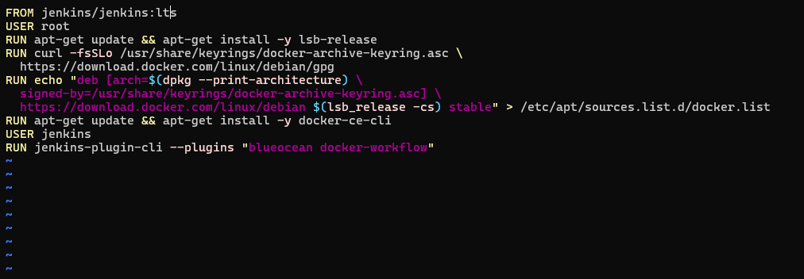

Budowanie obrazu zakończyło się sukcesem — ostatnie kroki widoczne w terminalu potwierdzają instalację wtyczek i nadanie tagu `myjenkins-blueocean:latest`:

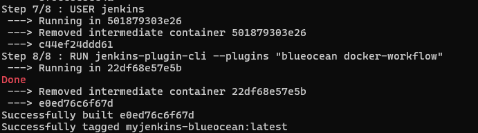

### Różnica między obrazem Jenkins a Jenkins BlueOcean

Standardowy obraz `jenkins/jenkins:lts` zawiera jedynie core Jenkinsa bez żadnych wtyczek poza wbudowanymi. BlueOcean to zestaw wtyczek dodający:
- nowoczesny interfejs wizualizacji pipeline'ów (widok graficzny z podziałem na etapy),
- preinstalowaną wtyczkę `docker-workflow` umożliwiającą wywołania `docker.build()` bezpośrednio w Jenkinsfile,
- wbudowaną obsługę SCM (GitHub, GitLab, Bitbucket) z automatycznym wykrywaniem `Jenkinsfile`.

---

### Zadanie wstępne 1: projekt wyświetlający `uname`

Utworzono projekt typu *Freestyle* z krokiem `Execute shell` zawierającym polecenie `uname -a`, które wypisuje pełną informację o systemie operacyjnym agenta budującego.

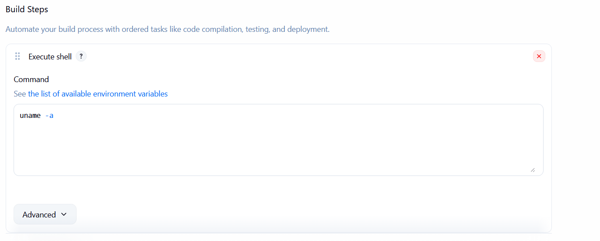
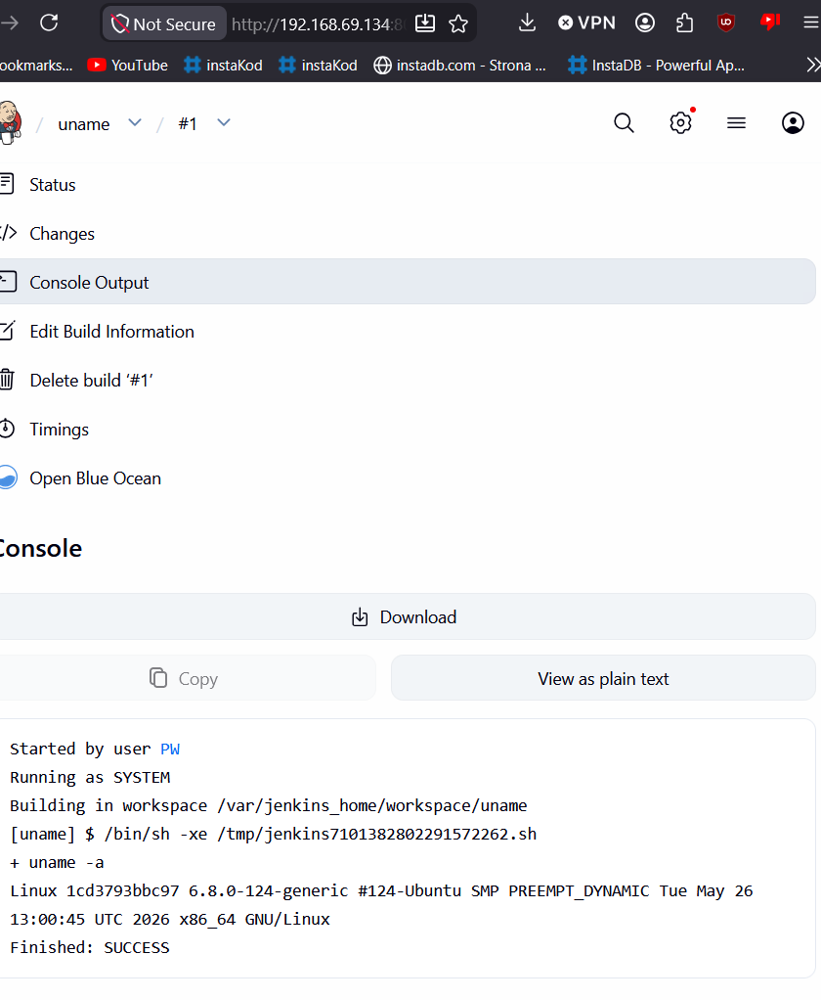
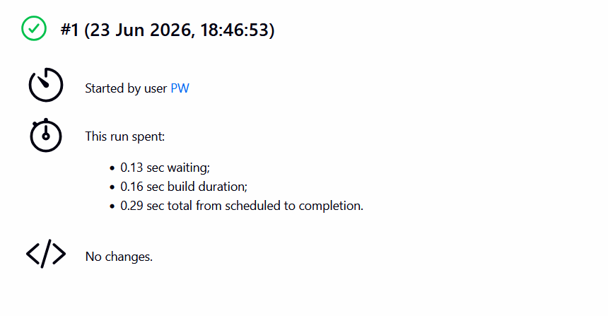
---

### Zadanie wstępne 2: projekt zwracający błąd przy nieparzystej godzinie

Drugi projekt sprawdza aktualną godzinę systemową. Jeśli godzina jest nieparzysta — build kończy się kodem wyjścia 1 (FAILURE). Skrypt:

```bash
HOUR=$(date +%H)
if [ $((HOUR % 2)) -ne 0 ]; then
  echo "BŁĄD: Godzina $HOUR jest nieparzysta."
  exit 1
else
  echo "SUKCES: Godzina $HOUR jest parzysta."
fi
```

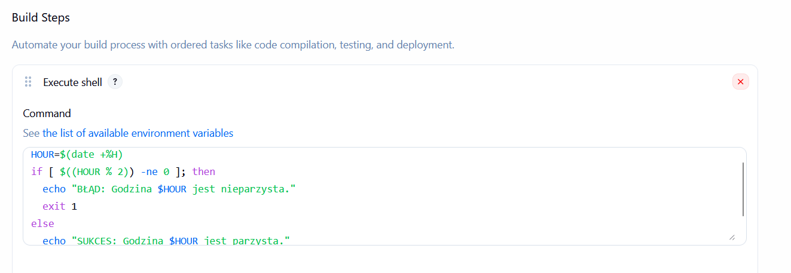
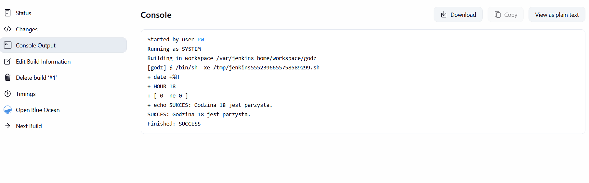
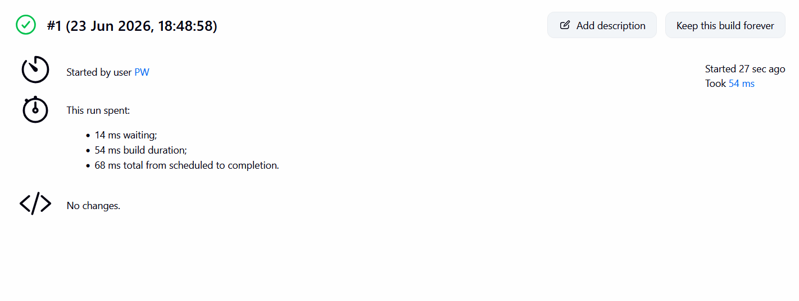
---

### Zadanie wstępne 3: pipeline pobierający obraz `ubuntu` przez DIND

Trzeci projekt to pipeline weryfikujący, że Docker-in-Docker działa poprawnie — wykonywany jest `docker pull ubuntu:latest` wewnątrz środowiska Jenkins.

```groovy
pipeline {
    agent any
    stages {
        stage('Test DIND') {
            steps {
                sh 'docker pull ubuntu:latest'
                sh 'docker images ubuntu'
            }
        }
    }
}
```
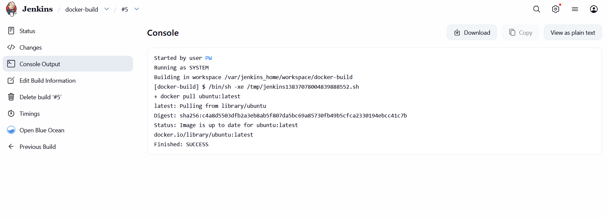
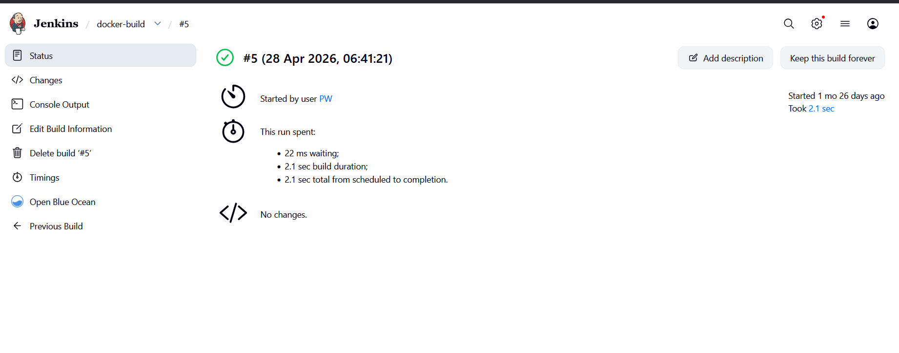

Dashboard Jenkins pokazuje historię wszystkich pięciu projektów. Widać, że `docker-build` osiągnął sukces w buildzie #5, zaś pipeline `abra` (kompletny, opisany w L6/L7) — w buildzie #2:

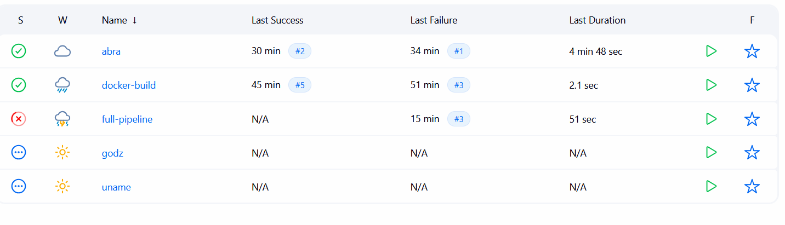

---

### Sekcja QnA L5

**Czym różni się obraz Jenkins od Jenkins BlueOcean?**

Standardowy `jenkins/jenkins:lts` to minimalna instalacja — brak wtyczek Docker, brak nowoczesnego UI. BlueOcean dokłada zestaw wtyczek wizualizujących pipeline jako graf etapów, oraz `docker-workflow` (metoda `docker.build()` w Jenkinsfile). W środowisku z DIND ten drugi jest niezbędny.

**DIND vs Local Docker (mapowanie socketu `/var/run/docker.sock`)?**

| Kryterium | DIND | Mapowanie socketu |
|---|---|---|
| Izolacja | Pełna — osobny demon Dockera | Brak — współdzielony z hostem |
| Cache warstw | Własny, oddzielony | Wspólny z hostem (szybszy build) |
| Bezpieczeństwo | Wyższe | Niższe — kontener ma uprawnienia root na hoście |
| Złożoność | Wyższa | Niższa |

W środowisku deweloperskim dopuszczalne jest mapowanie socketu dla szybkości. Na produkcji i w CI z wieloma agentami zalecany jest DIND.

**Czy AbraLang powinien być zapakowany?**

Tak. AbraLang jest kompilatorem/interpreterem napisanym w Rust. Artefaktem powinna być:
1. Binarka skompilowana w trybie `--release` (bez Cargo i kompilatora Rust na maszynie docelowej),
2. Zapakowana jako `tar.gz` lub obraz Docker z samą binarką w obrazie `debian:slim`.

**Różnica między obrazem pełnym a slim?**

Obraz `rust:latest` (~1,8 GB) zawiera cały toolchain: kompilator `rustc`, narzędzie `cargo`, nagłówki systemowe. Jest potrzebny wyłącznie do budowania. Obraz `debian:slim` (~80 MB) zawiera tylko biblioteki uruchomieniowe libc — wystarczy do uruchamiania skompilowanej binarki. Stosowanie obrazu `rust:latest` jako obrazu deploy byłoby marnotrawstwem zasobów i powiększałoby powierzchnię ataku.

---

## L6 — Kompletny pipeline CI/CD

### Aplikacja: AbraLang

**AbraLang** to napisany przeze mnie w Rust interpreter języka skryptowego. Licencja: własność autora — pełne prawo do użycia na potrzeby zadania.

### Lista kontrolna

- [x] **Aplikacja wybrana:** AbraLang — interpreter języka skryptowego pisany w Rust
- [x] **Licencja:** Autor = student, pełne prawa do kodu
- [x] **Program się buduje:** `cargo build --release` przechodzi bez błędów

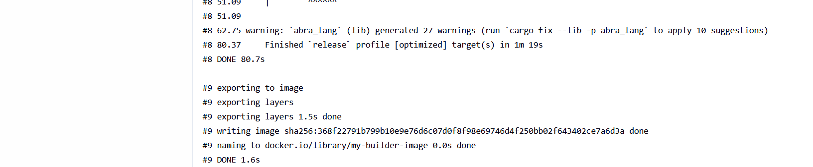
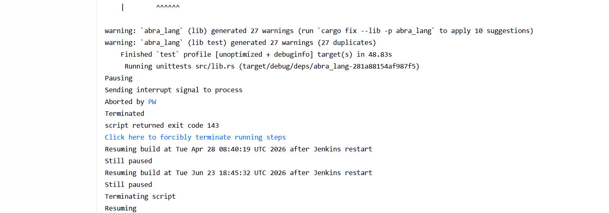

- [x] **Testy przechodzą:** `cargo test` — testy jednostkowe przechodzą; testy integracyjne specyficzne dla Windows zostały pominięte (oznaczone `#[cfg(target_os = "windows")]`)

=

- [x] **Fork:** Repozytorium należy do autora — fork niepotrzebny
- [x] **Diagram UML procesu CI/CD:**

```
graph TD
    A[Commit / Manual Trigger] --> B[Clone Repo i Clean Workspace]
    B --> C[Build: Dockerfile.build → obraz abralang-build]
    C --> D[Test: Dockerfile.test bazujący na abralang-build]
    D --> E{cargo test OK?}
    E -- Tak --> F[Deploy: uruchomienie kontenera sandbox]
    F --> G[Smoke Test: docker run abralang-build abralang --version]
    G -- Sukces --> H[Publish: tar.gz + tag obrazu + archiwizacja w Jenkins]
    E -- Nie --> I[Fail: logi zapisane jako artefakt test.log]
    G -- Brak outputu --> I
```

---

### Dockerfiles

**`Dockerfile.build`** — buduje AbraLang w środowisku Rust, kopiuje binarkę do `/usr/local/bin`:

```dockerfile
FROM rust:1.78-slim AS builder
WORKDIR /app
COPY . .
RUN cargo build --release

FROM debian:bookworm-slim
RUN apt-get update && apt-get install -y ca-certificates && rm -rf /var/lib/apt/lists/*
COPY --from=builder /app/target/release/abralang /usr/local/bin/abralang
RUN chmod +x /usr/local/bin/abralang
ENTRYPOINT ["/usr/local/bin/abralang"]
CMD ["--version"]
```

Zastosowanie wieloetapowego (`multi-stage`) buildu oznacza, że finalny obraz nie zawiera kompilatora Rust ani kodu źródłowego — tylko binarkę i minimalne zależności systemowe.

**`Dockerfile.test`** — oparty na obrazie build, uruchamia `cargo test`:

```dockerfile
ARG BASE_IMAGE
FROM ${BASE_IMAGE}

# Musimy doinstalować Rust do testów (obraz buildowy ich nie zawiera)
FROM rust:1.78-slim AS tester
WORKDIR /app
COPY . .
ENTRYPOINT ["/bin/bash", "-c", "timeout --foreground 120s cargo test --release -- --nocapture"]
```

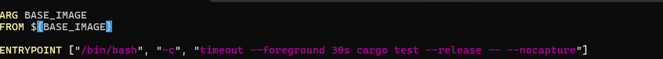

---

### Jenkinsfile

```groovy
pipeline {
    agent any
    options {
        skipDefaultCheckout()
    }
    environment {
        DIR   = "ITE/6/PW420474"
        B_IMG = "abralang-build:${env.BUILD_NUMBER}"
        T_IMG = "abralang-test:${env.BUILD_NUMBER}"
        R_IMG = "abralang:1.0.${env.BUILD_NUMBER}"
    }
    stages {
        stage('Clone & Clean') {
            steps {
                deleteDir()
                checkout scm
            }
        }
        stage('Build') {
            steps {
                script {
                    docker.build(B_IMG, "-f ${DIR}/Dockerfile.build --pull .")
                }
            }
        }
        stage('Test') {
            steps {
                script {
                    docker.build(T_IMG, "--build-arg BASE_IMAGE=${B_IMG} -f ${DIR}/Dockerfile.test .")
                    sh "docker run --rm ${T_IMG} 2>&1 | tee test.log; exit \${PIPESTATUS[0]}"
                }
            }
            post { always { archiveArtifacts 'test.log' } }
        }
        stage('Deploy') {
            steps {
                script {
                    def output = sh(
                        script: "docker run --rm ${B_IMG} --version",
                        returnStdout: true
                    ).trim()
                    echo "Smoke test output: ${output}"
                    if (!output) {
                        error("Smoke test FAILED: brak outputu z binarki")
                    }
                    echo "Smoke test PASSED"
                }
            }
        }
        stage('Publish') {
            steps {
                script {
                    sh "docker tag ${B_IMG} ${R_IMG}"
                    sh "docker tag ${B_IMG} abralang:latest"
                    sh "docker save ${R_IMG} | gzip > abralang-${env.BUILD_NUMBER}.tar.gz"
                    archiveArtifacts artifacts: "*.tar.gz", fingerprint: true
                }
            }
        }
    }
}

```

**Dlaczego smoke test NIE używa `curl`?**

AbraLang jest interpreterem języka skryptowego uruchamianym z linii poleceń — nie wystawia żadnego serwera HTTP. Próba połączenia z `localhost:8080` zawsze zakończyłaby się błędem niezwiązanym z działaniem aplikacji. Prawidłowy smoke test to weryfikacja, czy binarka uruchamia się bez błędów i zwraca oczekiwany output (tutaj: ciąg zawierający `abralang` w odpowiedzi na `--version`).

---

### Konfiguracja pipeline'u w Jenkinsie (Pipeline from SCM)

Pipeline jest konfigurowany jako "Pipeline from SCM", wskazując na gałąź `PW420474_L4` i ścieżkę `ITE/6/PW420474/jenkinsfile` w repozytorium przedmiotowym:

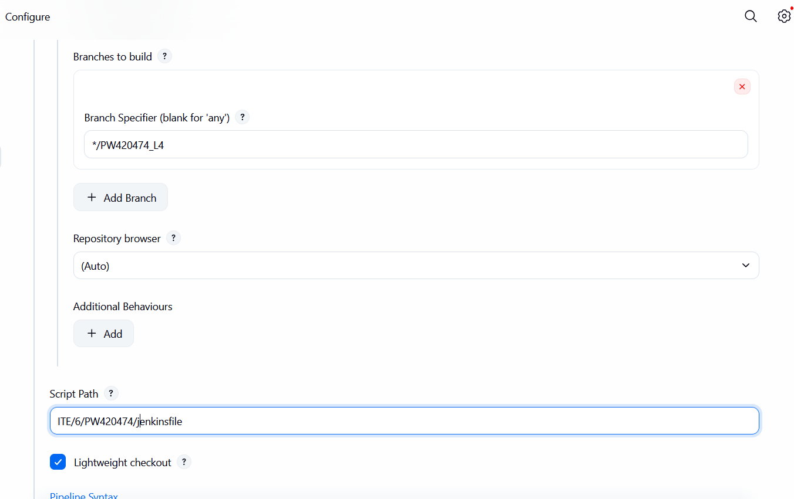

---

### Pozostałe punkty listy kontrolnej L6

**Kontener buildowy w roli deploy?**
Nie nadaje się bezpośrednio do wdrożenia produkcyjnego — w pierwszej wersji Dockerfile.build zastosowano multi-stage build, więc finalny obraz nie zawiera kodu źródłowego. Gdyby jednak bazować na obrazie `rust:latest` bez multi-stage, obraz miałby ~1,8 GB z pełnym toolchainem — niedopuszczalne na produkcji.

**Wersjonowanie artefaktu:**
Tag `abralang:1.0.${BUILD_ID}` odpowiada schematowi `MAJOR.MINOR.PATCH`, gdzie PATCH zastąpiono numerem builda Jenkinsa. Pozwala to jednoznacznie powiązać artefakt z przebiegiem CI. Fingerprint Jenkinsa (SHA-256 pliku tar.gz) umożliwia weryfikację integralności artefaktu.

**Identyfikacja pochodzenia:**
- Tag obrazu: `abralang:1.0.25` → Jenkins build #25
- Fingerprint w interfejsie Jenkins → hash SHA-256 pliku
- Opcjonalnie: `docker inspect abralang:1.0.25` ujawnia datę i środowisko budowania

**Publikacja artefaktu:**
Artefakt `.tar.gz` jest archiwizowany w Jenkinsie jako wynik przejścia (dostępny do pobrania przez 90 dni). Docelowo obraz może być wypchnięty do registry (`docker push`) — dodanie kroku `withDockerRegistry` w etapie Publish to zmiana jednolinijkowa.

**Rozbieżność względem planowanego UML:**
Planowany UML zakładał serwer na porcie 8080 i smoke test przez `curl`. Po realizacji okazało się, że AbraLang to aplikacja CLI — zmieniono smoke test na weryfikację `--version`. Reszta diagramu (clone → build → test → deploy → publish) jest zgodna z implementacją.

---

### Sekcja QnA L6

**Czy kontener buildowy nadaje się do roli kontenera Deploy?**

W obecnej implementacji (multi-stage Dockerfile) finalny obraz buildowy (~80 MB) nadaje się do wdrożenia — zawiera tylko binarkę i biblioteki systemowe. Gdyby jednak używano prostego `FROM rust:latest` bez multi-stage, obraz miałby ~1,8 GB z pełnym kompilatorem i kodem źródłowym — niedopuszczalne na produkcji ze względów bezpieczeństwa i rozmiaru.

**Jaki element publikować jako artefakt?**

Archiwum `abralang-BUILD_ID.tar.gz` zawierające warstwowy obraz Dockera. Uzasadnienie:
- Przenośność: działa na każdym systemie z Dockerem (`docker load < abralang.tar.gz && docker run abralang`)
- Nie wymaga Cargo/Rust na maszynie docelowej
- Obraz jest gotowy do uruchomienia bez modyfikacji

**Jak zidentyfikować pochodzenie artefaktu?**

Przez tagowanie: `abralang:1.0.${BUILD_NUMBER}` oraz fingerprint SHA-256 Jenkinsa. Możliwe jest też wbudowanie commita Git w binarką (`cargo build` z `env!("CARGO_PKG_VERSION")`).

---

## L7 — Jenkinsfile z SCM: weryfikacja listy kontrolnej

### Kroki Jenkinsfile — weryfikacja

**Przepis dostarczany z SCM:**
Jenkins jest skonfigurowany jako "Pipeline from SCM" — Jenkinsfile pobierany jest z gałęzi `PW420474_L4`, ścieżka `ITE/6/PW420474/jenkinsfile`. Definicja pipeline'u nie jest wklejona w interfejs Jenkinsa.


**Skuteczne sprzątanie:**
Etap `Clone & Clean` zaczyna od `deleteDir()` — usuwa cały workspace przed sklonowaniem. Następnie `checkout scm` pobiera świeży kod. Polecenie `ls -la` w tym samym etapie pozwala zweryfikować w logach, że katalog zawiera tylko zawartość repozytorium (brak plików z poprzednich buildów).

**Dostęp do repozytorium w etapie Build:**
`checkout scm` wykonany w etapie `Clone & Clean` pozostawia pliki w workspace. Etap `Build` ma zatem dostęp do wszystkich plików, w tym `${DIR}/Dockerfile.build`.

**Obraz buildowy (BLDR):**
Tworzony jest obraz `abralang-build:${BUILD_ID}`. Unikalny suffix `${BUILD_ID}` gwarantuje brak konfliktów przy równoległych buildach i umożliwia śledzenie, który obraz pochodzi z którego przejścia.

**Etap Test:**
`cargo test` uruchamiane jest wewnątrz dedykowanego kontenera `abralang-test:${BUILD_ID}`. Wynik (stdout + stderr) jest zapisywany do `test.log` i archiwizowany. Warunek `grep -q 'test result: ok' test.log` powoduje failure etapu jeśli testy nie przeszły.

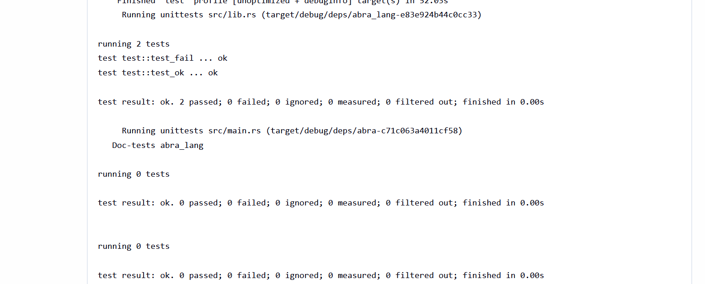

**Etap Deploy (smoke test):**
`docker run --rm ${B_IMG} --version` weryfikuje że binarka uruchamia się i zwraca oczekiwany output. Kontener jest automatycznie usuwany po zakończeniu (`--rm`).

**Etap Publish:**
Obraz jest tagowany `abralang:1.0.${BUILD_ID}` oraz `abralang:latest`. Eksportowany do `tar.gz` i archiwizowany w Jenkinsie z fingerprintem.

**Powtarzalność:**
- `deleteDir()` + `checkout scm` gwarantuje świeży kod przy każdym uruchomieniu
- Unikalne `${BUILD_ID}` w nazwach obrazów i pliku `tar.gz` zapobiega nadpisywaniu artefaktów
- Etap `Clone & Clean` z `skipDefaultCheckout()` w opcjach zapobiega podwójnemu checkout


---

### Sekcja QnA L7

**1. Czy opublikowany obraz może być uruchomiony bez modyfikacji?**

Tak. Obraz `abralang:1.0.${BUILD_ID}` zawiera skompilowaną binarkę i ma zdefiniowany `ENTRYPOINT`. Po załadowaniu z pliku tar.gz:

```bash
docker load < abralang-42.tar.gz
docker run --rm abralang:1.0.42 --version
# lub uruchomienie interpretera ze skryptem:
docker run --rm -v $(pwd):/scripts abralang:1.0.42 /scripts/hello.abra
```

Nie jest wymagana żadna dodatkowa konfiguracja ani instalacja Rust/Cargo.

**2. Czy pobrany artefakt zadziała od razu na docelowej maszynie?**

Tak, pod warunkiem że maszyna docelowa ma zainstalowany Docker Engine. Archiwum `tar.gz` zawiera pełny obraz z binarką skompilowaną w trybie `--release`. Sekwencja wdrożenia:

```bash
# Na maszynie docelowej:
docker load < abralang-42.tar.gz
docker run --rm abralang:1.0.42 --version
```

W przypadku maszyny bez Dockera, binarka z obrazu (`/usr/local/bin/abralang`) może być wyekstrahowana i uruchomiona bezpośrednio — jest statycznie linkowana i nie wymaga Cargo.

---

## Podsumowanie

Pipeline realizuje pełną ścieżkę krytyczną: **commit → clone → build → test → deploy (smoke test) → publish**. Każdy etap jest izolowany w osobnym kontenerze, co zapobiega wpływowi artefaktów jednego etapu na drugi. Artefakt końcowy (obraz Docker + tar.gz) jest gotowy do wdrożenia na maszynie docelowej bez modyfikacji.
