# Sprawozdanie zbiorcze L8–L12
Przemysław Wrona ITE 420474

---

## L8 — Ansible: automatyzacja wdrożeń

### Przygotowanie środowiska
* **Maszyna docelowa (1-2):** Uruchomiono drugą maszynę wirtualną (`ansible-target`) z minimalnym zestawem pakietów, użytkownikiem `ansible` i serwerem SSH. Optymalna konfiguracja to 4 CPU / 4 GB RAM / 10 GB dysku — przy mniejszych zasobach VM zawieszał się.
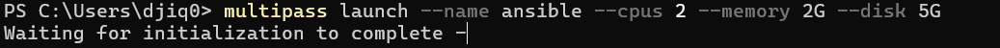 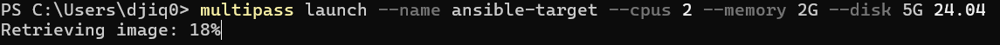

### Inwentaryzacja i łączność SSH
* **Konfiguracja DNS i kluczy (3-9):** Ustalono przewidywalne nazwy hostów przez `/etc/hosts`. Wymieniono klucze SSH między maszynami tak, by logowanie `ssh ansible@ansible-target` nie wymagało hasła. Utworzono `inventory.ini` z sekcjami `Orchestrators` i `Endpoints` oraz `ansible.cfg`.
  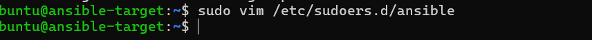 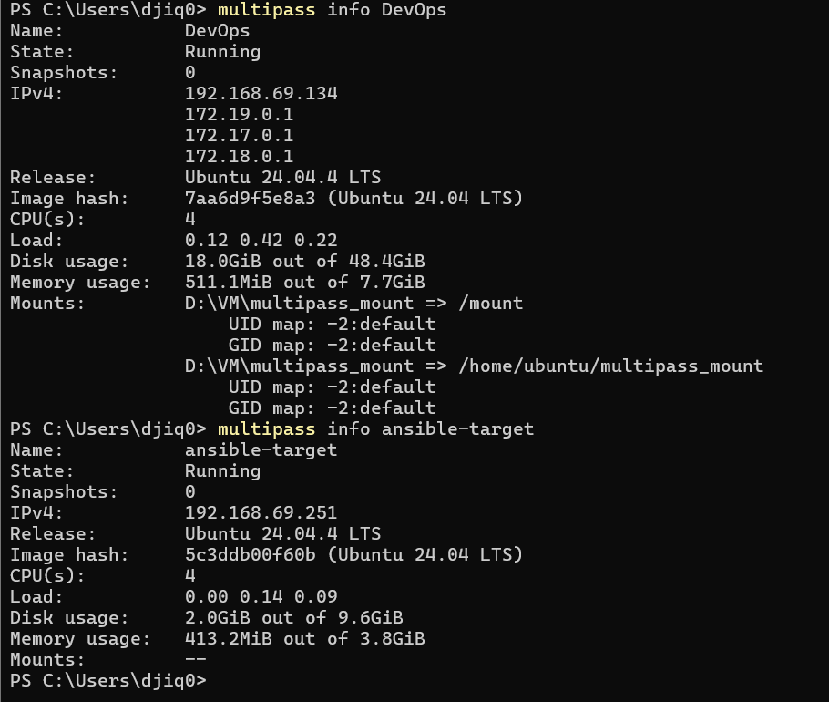  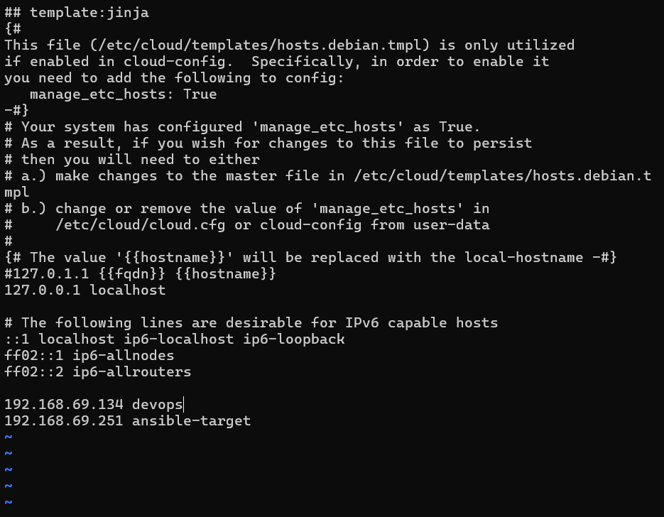 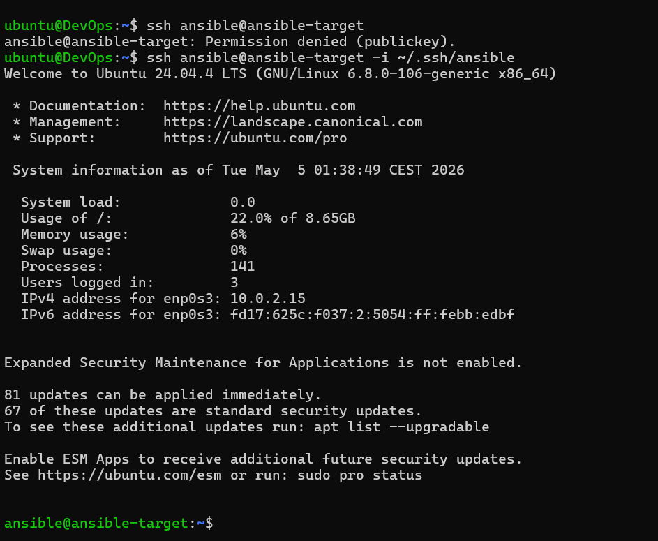

### Rola `abralang_deploy`
* **Pliki roli (10-17):** Zainicjalizowano rolę przez `ansible-galaxy role init abralang_deploy`. Wypełniono `tasks/main.yml`, `deploy.yml` i `cleanup.yml` — odpowiedzialne za instalację Dockera, transfer artefaktu, uruchomienie kontenera i sanity check.
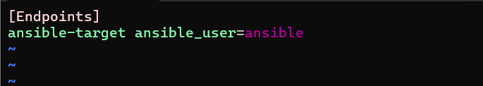 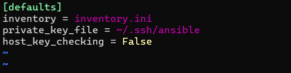 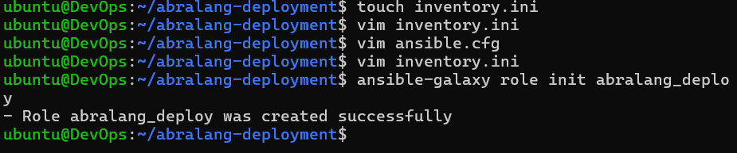 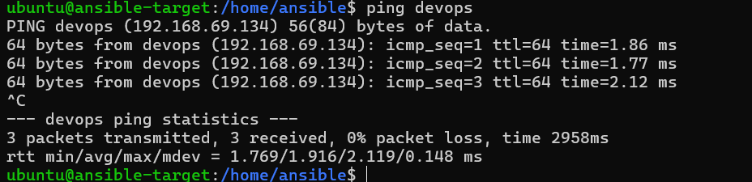  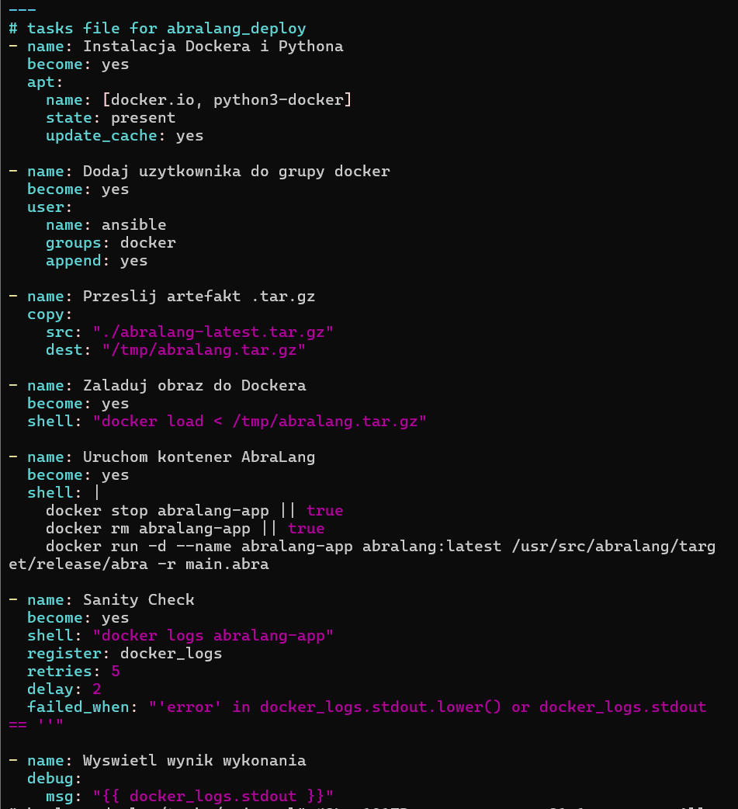  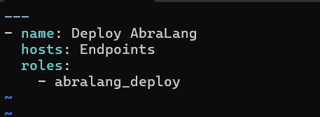

### Wykonanie playbooka
* **Wdrożenie i weryfikacja (18-21):** Playbook wykonał pełny cykl: instalacja Dockera i Pythona, przesłanie archiwum `.tar.gz`, załadowanie obrazu, uruchomienie kontenera AbraLang i sanity check zwracający kod wyjścia 0. `PLAY RECAP` potwierdził `failed=0`.
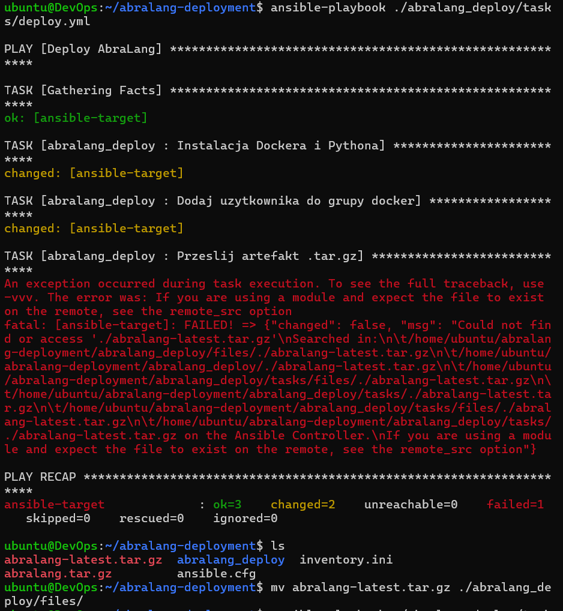 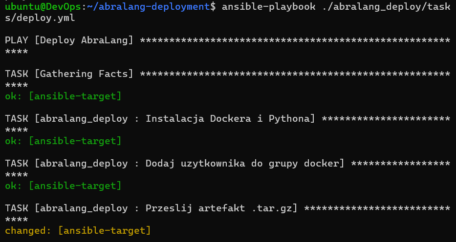 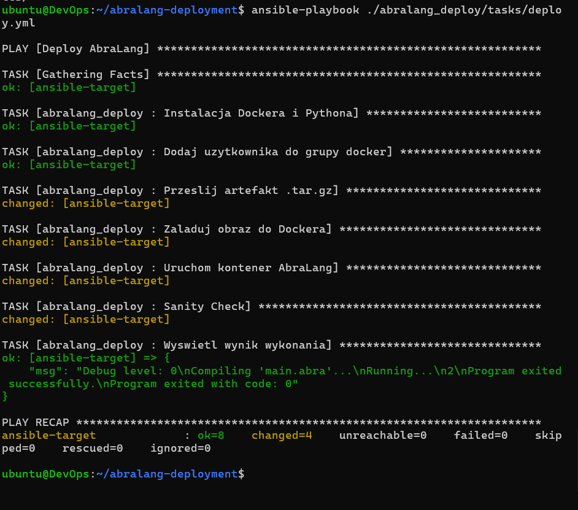 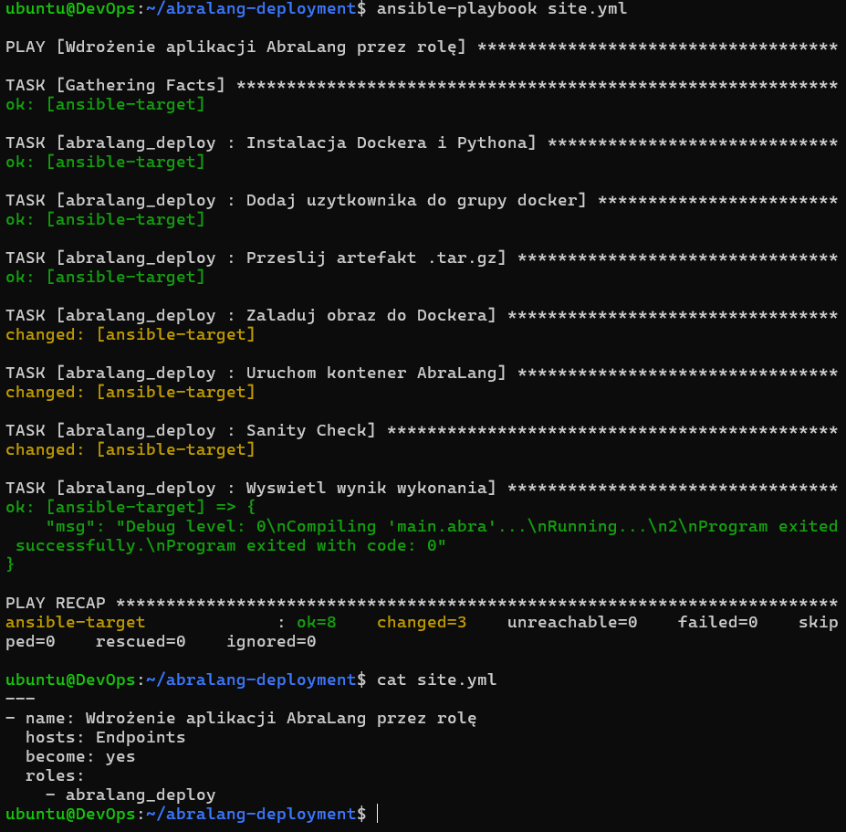

---

## L9 — Instalacja nienadzorowana: Kickstart / Anaconda

### Plik odpowiedzi `init.cfg`
* **Konfiguracja (init.cfg):** Plik Kickstart definiuje instalację Fedory 44 w trybie tekstowym z automatycznym restartem. Ustawiono język (`pl_PL`), strefę czasową (`Europe/Warsaw`), hostname `ite-server-PW420474`, partycjonowanie LVM na całym dysku (`clearpart --all`), repozytoria Fedory oraz Docker CE. Sekcja `%packages` instaluje `@core`, narzędzia (`curl`, `wget`, `git`) i pakiety Dockera. Sekcja `%post` włącza usługę Docker, tworzy skrypt `/usr/local/bin/build-app.sh` pobierający i budujący obraz aplikacji z repozytorium GitHub, a następnie uruchamia ją jako kontener na porcie 8080. Skrypt jest wywoływany przez jednostkę systemd `ite-setup.service` z zależnością `After=docker.service`.

### Instalacja nienadzorowana
* **GRUB i Anaconda (1-2):** W edytorze GRUB dodano argument `inst.ks=` wskazujący na plik `init.cfg` hostowany na GitHubie. Anaconda 44.30 wystartowała i przeprowadziła instalację w trybie nienadzorowanym.
 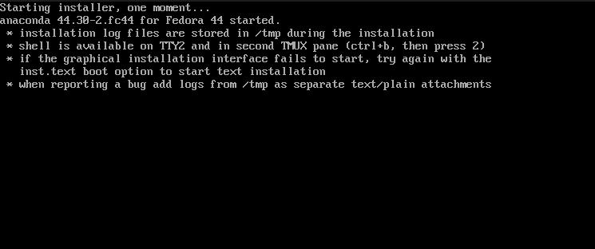

### Weryfikacja aplikacji
* **Uruchomiona aplikacja (3):** Po pierwszym rozruchu systemu jednostka `ite-setup.service` pobrała repozytorium, zbudowała obraz i uruchomiła kontener. Wywołanie `docker run -it ite-app ./target/release/abra` potwierdziło obecność i działanie aplikacji AbraLang wewnątrz kontenera (hostname `ite-server-PW420474`).

---

## L10 — Kubernetes (1): instalacja i pierwsze wdrożenie

### Instalacja minikube i klastra
* **Pobranie i uruchomienie (1-7):** Pobrano minikube, zainstalowano `kubectl`. Uruchomiono klaster (`minikube start`) i zweryfikowano status komponentów: Control Plane, kubelet, apiserver — wszystkie w stanie `Running`.
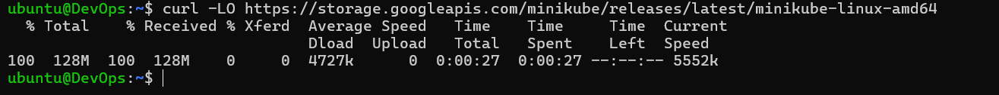     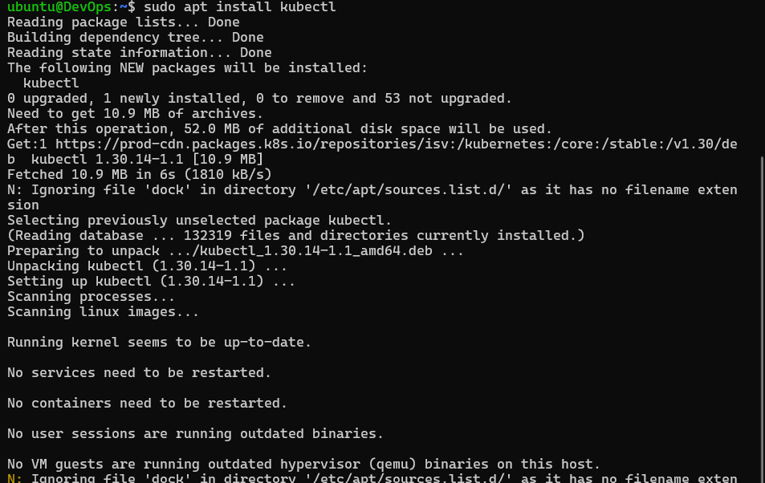 

### Uruchomienie kontenera i Dashboard
* **Pod i Dashboard (9-15):** Uruchomiono kontener Nginx z własną konfiguracją jako pod przez `minikube kubectl run`. Otwarto Dashboard, zweryfikowano stan poda. Wyprowadzono port przez `kubectl port-forward` i potwierdzono łączność HTTP z serwowaną treścią w przeglądarce.
 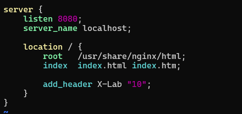  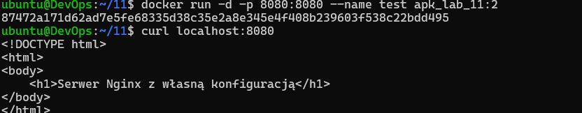   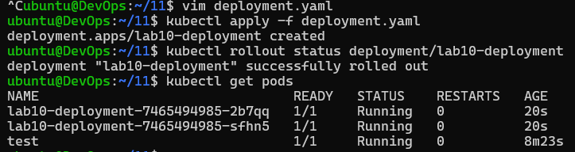

### Deployment jako plik YAML
* **Apply i serwis (16-20):** Zapisano deployment do pliku YAML, wzbogacono o 4 repliki, wdrożono przez `kubectl apply`. Zbadano stan przez `kubectl rollout status`. Wyeksponowano deployment jako serwis i przekierowano port.
  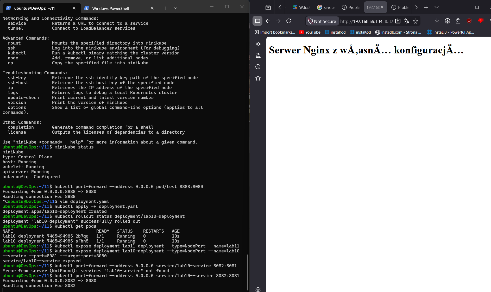 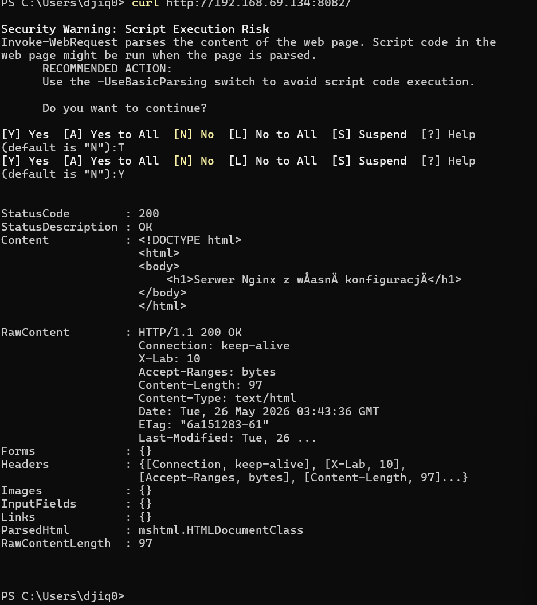 

---

## L11 — Kubernetes (2): zarządzanie wersjami i strategie wdrożeń

### Przygotowanie obrazów
* **Budowa i transfer (12-16):** Przygotowano wersję `v3` oraz celowo wadliwy obraz `err` oparty na `/bin/false`. Obrazy załadowano do lokalnego rejestru minikube.
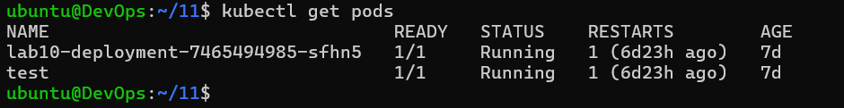 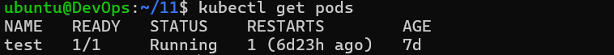   

### Skalowanie i cykl życia wdrożenia
* **Zarządzanie replikami (1-2, 17-24):** Deklaratywne skalowanie deploymentu (zakres 0–8 replik) poprzez modyfikację pola `replicas` w pliku YAML i ponowne `kubectl apply`.
   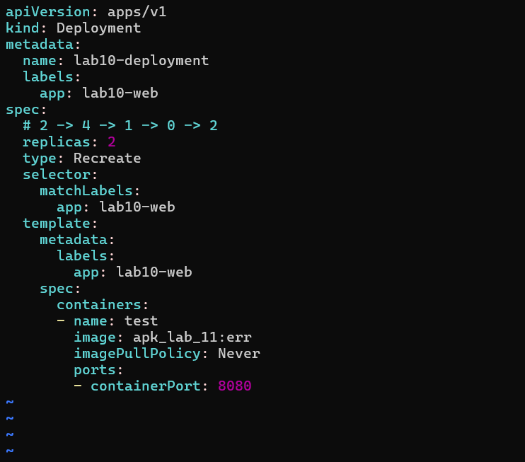  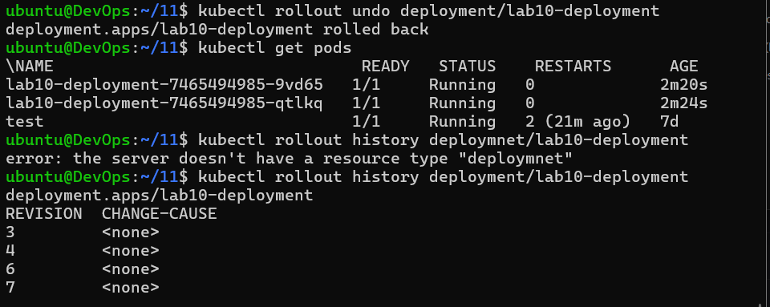  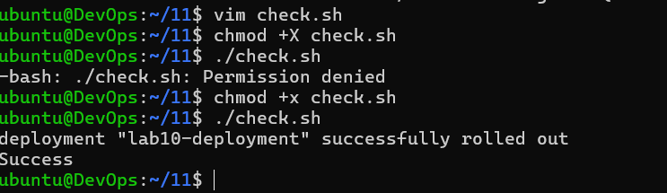 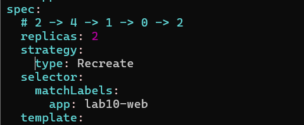 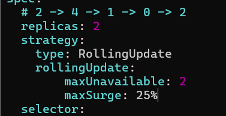

### Weryfikacja i obsługa błędów
* **Działanie usługi (3):** Potwierdzono poprawną serwację treści przez Nginx z własną konfiguracją.
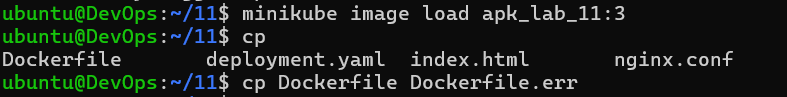
* **Obsługa awarii (4, 25, 5):** Symulacja błędu wdrożenia — obraz `err` skutkował statusem `CrashLoopBackOff`. Stabilną wersję przywrócono przez `rollout undo`.
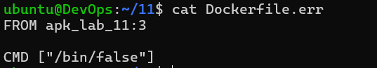 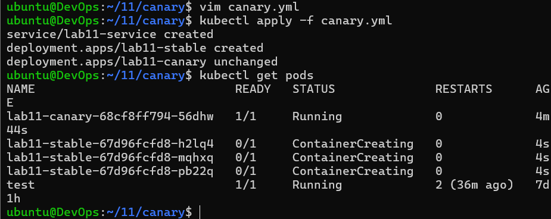 

### Automatyzacja i strategie
* **Healthcheck (6-7):** Skrypt bash weryfikujący status wdrożenia w oknie 60 sekund.
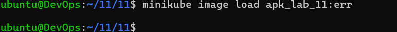 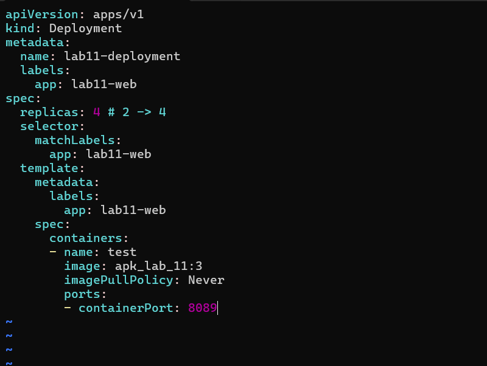
* **Strategie (8-11):** Zaimplementowano strategie `Recreate` oraz `RollingUpdate` z limitami dostępności, a następnie wdrożenie `Canary` z podziałem ruchu między wersje `stable` i `canary` za pomocą etykiet i serwisów.
   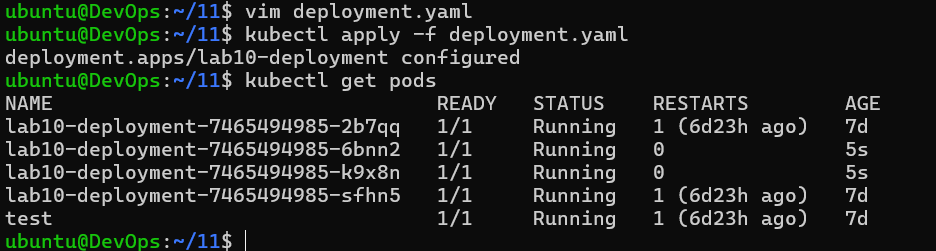

---

## L12 — Azure Container Instances: wdrożenie w chmurze

### Przygotowanie kontenera
* **Budowa obrazu (1-3):** Przygotowano obraz Docker oparty na `python:3.9-slim` serwujący prostą stronę HTML przez wbudowany serwer HTTP na porcie 8080. Obraz opublikowano na Docker Hub jako `pw000/lab12:1`.
 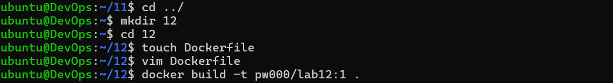 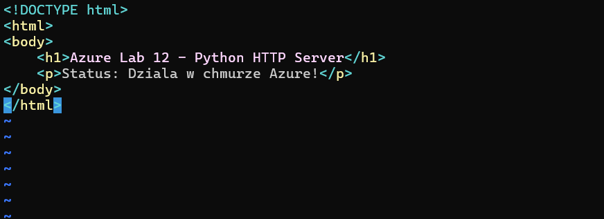

### Wdrożenie w Azure Container Instances
* **Resource group i kontener (4, 6):** Przez Azure Cloud Shell (PowerShell) utworzono resource group `RG_Lab12` w `westeurope`, a następnie wdrożono kontener `lab12-app` z publicznym IP i etykietą DNS `lab12-wrona`.
 

### Weryfikacja działania
* **Dostęp HTTP i logi (5, 7, 8, 9):** Kontener osiągalny po IP (`20.4.183.1:8080`) i przez FQDN (`lab12-wrona.westeurope.azurecontainer.io:8080`). Logi z `az container logs` potwierdziły odbiór żądań HTTP GET ze statusem 200.
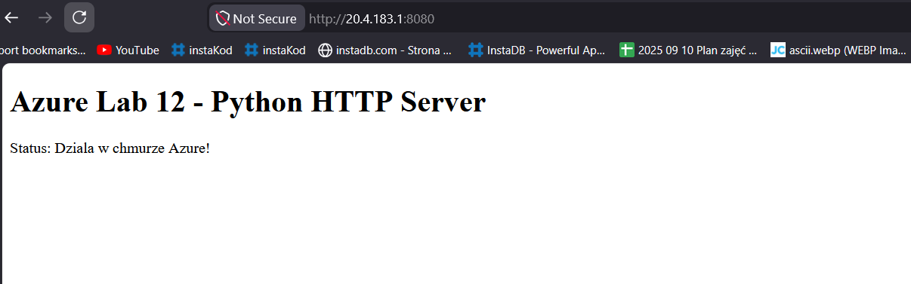   

### Sprzątanie zasobów
* **Usunięcie resource group (10):** Po zakończeniu ćwiczenia usunięto całą resource group `RG_Lab12` poleceniem `az group delete --yes --no-wait`, zwalniając wszystkie zasoby.

