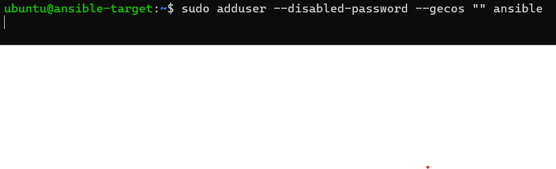
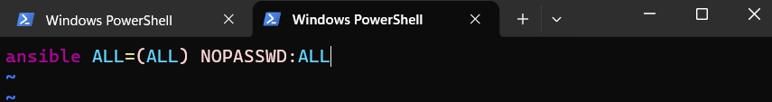
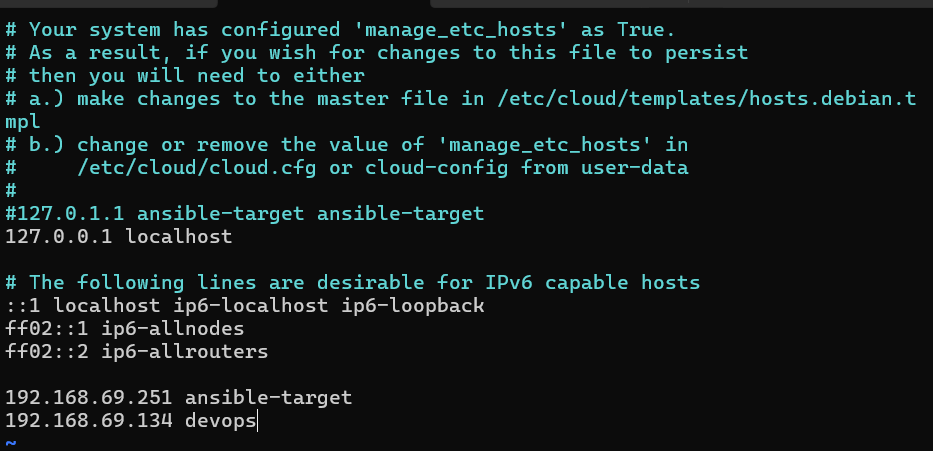
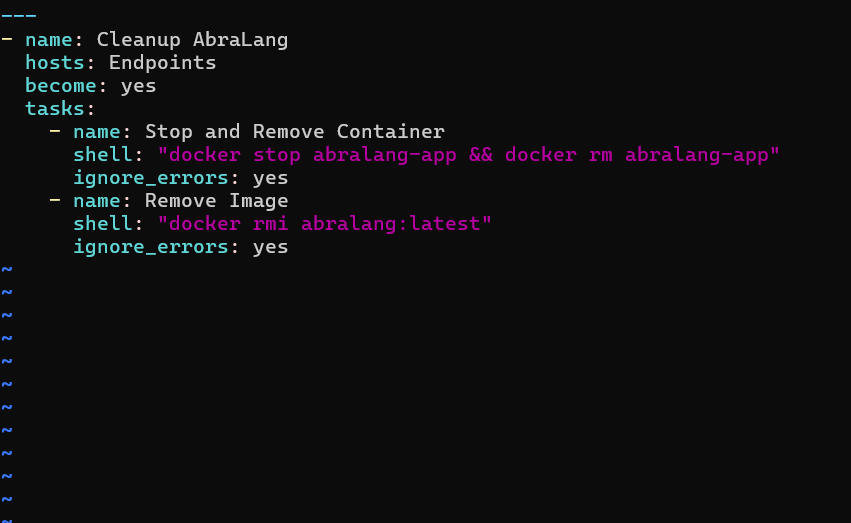
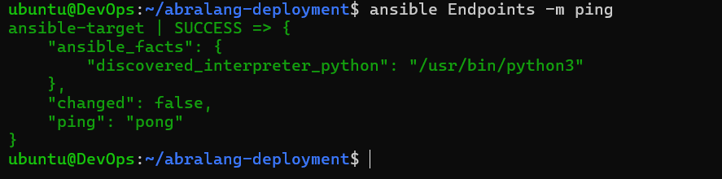

# Sprawozdanie 8
Przemysław Wrona ITE 420474

Celem tego ćwiczenia było nauczenie się automatyzacji deplymentów za pomocą ansible.

Zaczęto od stworzenia drugiej maszyny wirtualnej, z 4 cpu, 4gb, 10gb pamięci, (przy 1gb, 1 cpu, 5gb pamięci VM się zawieszał).

(Tutaj starszy obraz z wersji jak próbowałem mniejsze wymagania niż wyżej powiedziane, ale gdzieś zgubiłem zdjęcie, potem będzie to widać kiedy będę sprawdzał IPv4)

Na tej maszynie trzeba dodać nowego użytkownika 

Ustawiamy sudo.

Sprawdzamy IP naszych maszyn.

Tutaj możemy też zauważyć konfigurację systemu którą wcześniej wspomniałem.

Zmieniamy /etc/hosts oraz /etc/cloud/templates/hosts.debian.templ. Mógłbym się bawić inaczej ale tak będzie działać na pewno.

Zmieniamy się na usera "ansible" na naszej nowej maszynie

i dodajemy klucze z głównej maszyny do ~/.ssh/authorized_keys

Teraz nasz ansible ma możliwość się połączyć z nową maszyną.

Tworzymy folder do naszego ansible, w nim po koleji ansible.cfg, inventory.ini oraz wykonujemy polecenie ansible-galaxy roles init abralang_deploy, co tworzy naszą rolę odpowiedzialną za całe zachowanie.

Do inventory.ini:

Do ansible.cfg:

W tym stworzonym podfolderze "abralang_deploy" przechodzimy do tasks/ i edytujemy/tworzymy pliki main.yml, deploy.yml oraz cleanup.yml.

main.yml:

cleanup.yml

deploy.yml oraz site.yml:

Testujemy łączność (ping normalny oraz poprzez ansible)

Teraz testujemy ansible playbook 

I viola działa.

