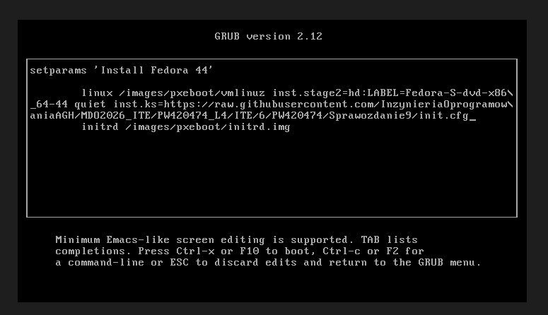
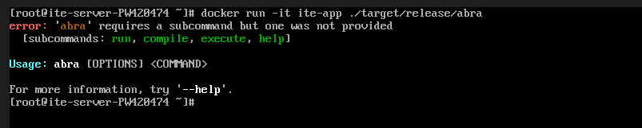

# Sprawozdanie L9
Przemysław Wrona ITE420474

Tutaj nie będzie wielu zdjęć, ponieważ pokazywanie na slajdach jak klikam w menu w virtualboxie można uważać za stratę czasu, więc pokazuję tutaj tylko process instalacji oraz konfirmację tego że jest aplikacja.

Plik z inicjalizacją jest tutaj w folderze więc go nie kopiuje drugi raz.

Aby go użył instalator to trzeba zmienić w grubie (tzn. dodać argument do komendy)

Po paru potknięciach się w przepisywaniu doszliśmy do tego momentu

Po przejściu instalatora loguje się i testuje czy jest apka. tutaj widzimy że jest.
