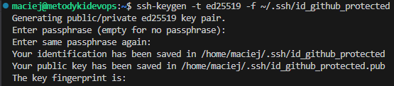
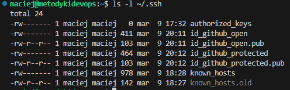
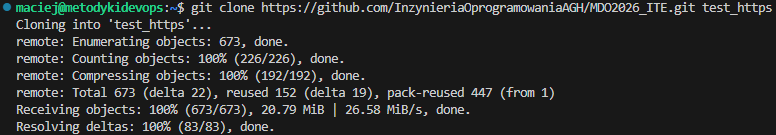
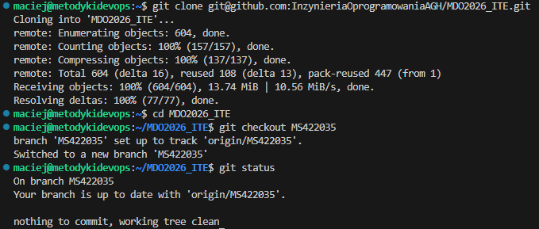
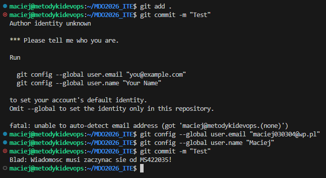
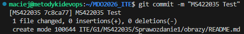

# Sprawozdanie 1 - Środowisko pracy DevOps
**Autor:** Maciej Szewczyk (MS422035)  
**Kierunek:** ITE  
**Grupa:** G6  

## 1. Konfiguracja środowiska i narzędzi IDE
Do realizacji zadania wykorzystałem maszynę wirtualną z systemem Ubuntu Server 24.04 działającą na Hyper-V. 

### Wykorzystanie Visual Studio Code Remote - SSH
Zgodnie z wymaganiami, skonfigurowałem dostęp do repozytorium oraz maszyny wirtualnej w edytorze **Visual Studio Code** przy użyciu rozszerzenia **Remote - SSH**. 
* **IDE:** Edycja plików odbywa się bezpośrednio na serwerze, co eliminuje potrzebę lokalnego kopiowania kodu.
* **Wymiana plików:** Panel Explorer w VS Code służy jako natychmiastowy menedżer plików (SFTP). Przesyłanie zrzutów ekranu i skryptów z systemu Windows na serwer odbywało się metodą "przeciągnij i upuść", co zapewnia natychmiastową synchronizację środowiska pracy.

## 2. Klucze SSH i GitHub
Wygenerowałem dwa klucze typu **ED25519** (zgodnie z wymogiem użycia standardu innego niż RSA). 
1.  `id_github_open` - bez hasła.

2.  `id_github_protected` - zabezpieczony hasłem (passphrase).


Klucz publiczny został dodany do profilu GitHub, co umożliwiło bezpieczną komunikację bez podawania hasła do konta przy każdej operacji.



## 3. Zarządzanie repozytorium (Git)

### Klonowanie i błędy autoryzacji
Początkowo proces klonowania przez SSH napotkał błąd `Permission denied (publickey)`. Wynikało to z użycia niestandardowych nazw plików kluczy. Problem skorygowałem poprzez uruchomienie `ssh-agent` i ręczne dodanie klucza komendą `ssh-add ~/.ssh/id_github_open`. Po tej operacji repozytorium zostało poprawnie sklonowane.

Podczas ostatecznego sprawdzania zgodności z instrukcją zauważyłem, że pierwszy "clone" został wykonany omyłkowo z pominięciem protokołu HTTPS. W celu pełnego spełnienia wymagań, proces klonowania został przeprowadzony ponownie przy użyciu protokołu HTTPS oraz Personal Access Token (PAT) zamiast tradycyjnego hasła, co udokumentowano na poniższym zrzucie:


### Praca na gałęziach
Przełączyłem się na dedykowaną gałąź o nazwie mojego indeksu: `MS422035`.


## 4. Implementacja Git Hooka (Zadanie techniczne)
Napisałem skrypt `commit-msg`, który weryfikuje, czy każda wiadomość commita zaczyna się od mojego numeru indeksu. Skrypt został umieszczony w katalogu `.git/hooks/` oraz jego kopia znajduje się w folderze sprawozdania jako `commit-msg.txt`.



**Kod skryptu:**
```bash
#!/bin/bash
msg=$(cat "$1")
if [[ ! "$msg" =~ ^MS422035 ]]; then
  echo "Blad: Wiadomosc musi zaczynac sie od MS422035!"
  exit 1
fi