# Sprawozdanie 1 - Maciej Gładysiak MG419945
---
## 1. Wykorzystane środowisko
Korzystam z systemu Linux na laptopie, na którym w Virtualboxie mam Ubuntu Server. **Wszystkie polecenia, które wykonuje podczas ćwiczenia, wykonuje przez SSH na ww. serwerze Ubuntu.**

## 2. Git

### Instalacja git, SSH
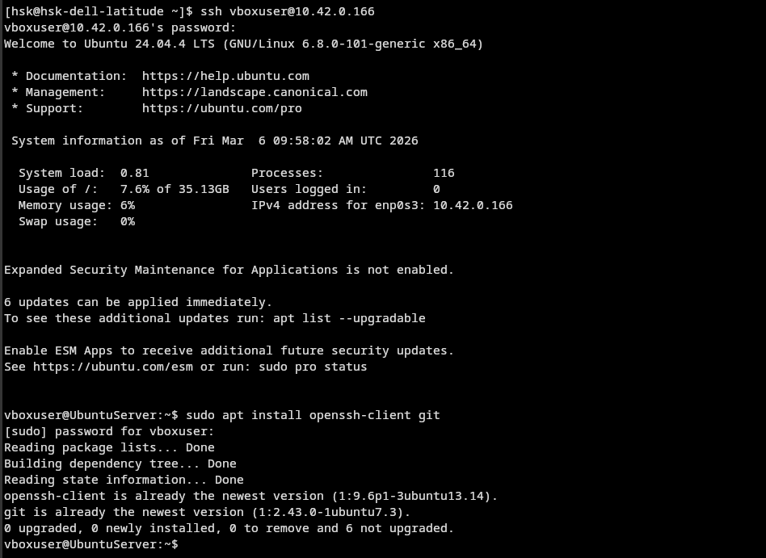

### Klonowanie repo poprzez PAT
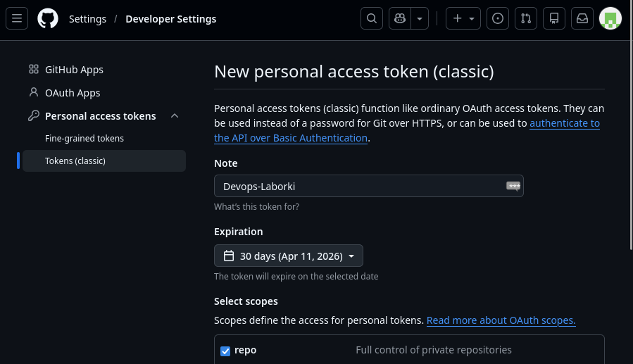
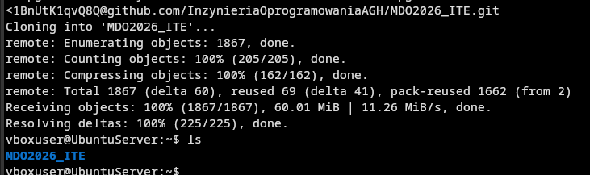

## 3. SSH
### Tworzenie kluczy SSH
Stworzonyłem dwa klucze SSH ED25519:
1. devops_nopass, bez hasła
2. devops_password - zabezpieczny hasłem
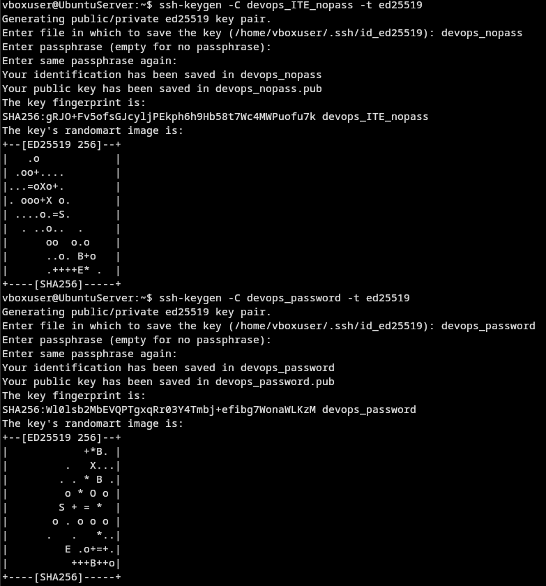

Skonfigurowałem klucz `devops_password` jako metodę dostępu na githuba:
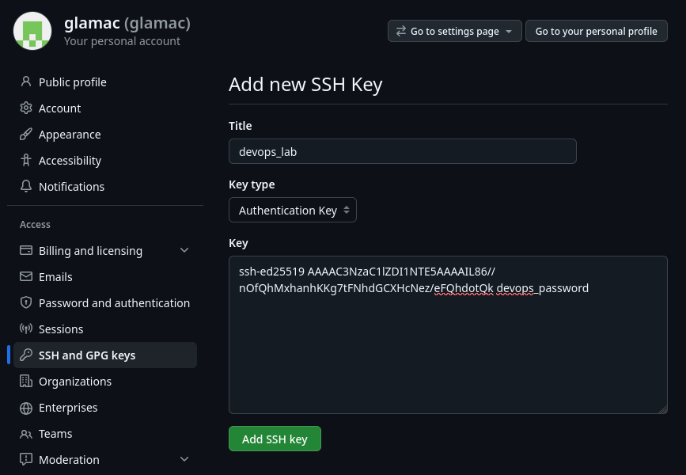

oraz następnie, po zmianie nazwy folderu repo sklonowanego poprzez PAT, zklonowałem repo ponownie z wykorzystaniem protokołu SSH, po dodaniu klucza przez `ssh-add`.
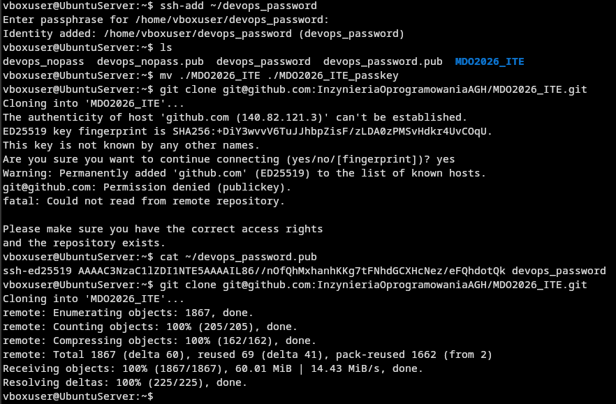

### Konfiguracja 2FA
Miałem już skonfigurowane uwierzytelnianie dwuskładnikowe na tym koncie Github i, z uwagi na to że nie czuje potrzeby dodawania nowych metod 2FA, ten krok pominąłem.
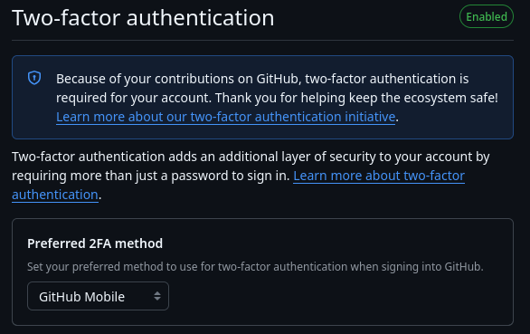

## 4. Narzędzia
### Konfiguracja dostępu do maszyny wirtualnej w edytorze IDE
Wybrałem do tego edytor `zed`, który wspiera taki manewr bez instalacji dodatkowych wtyczek.

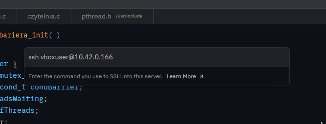
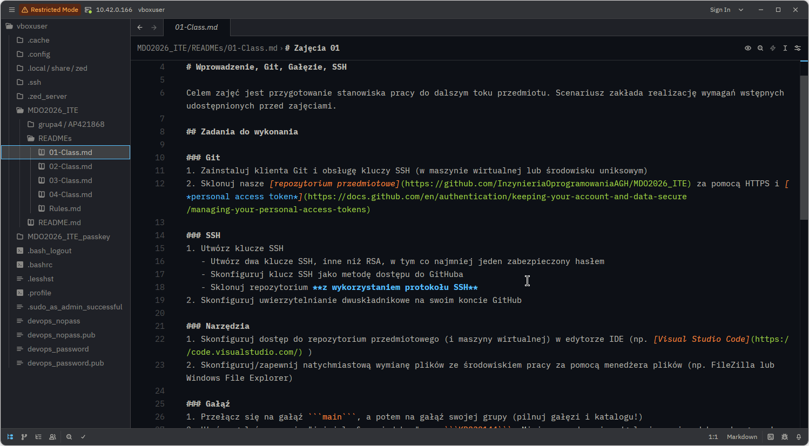

### Konfiguracja wymiany plików wykorzystując menadżer plików `FileZilla`
Pobrałem i skonfigurowałem serwer FTP `vsftpd` aby pozwalał na przesyłanie jak i pobieranie plików; w pliku `/etc/vsftpd.conf` ustawiłem opcje `write_enable=YES` oraz `anon_upload_enable=YES`. Nie jest to najbardziej bezpieczna metoda do transferu plików, ale wydaje mi się że na potrzeby laboratorium jest wystarczająca.

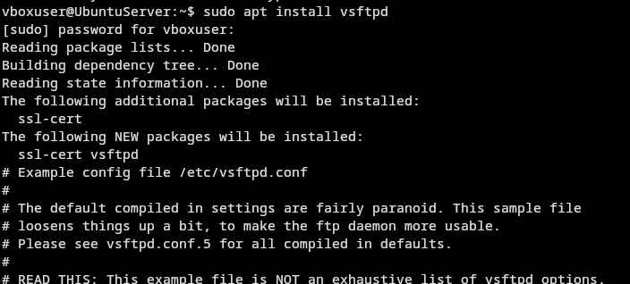

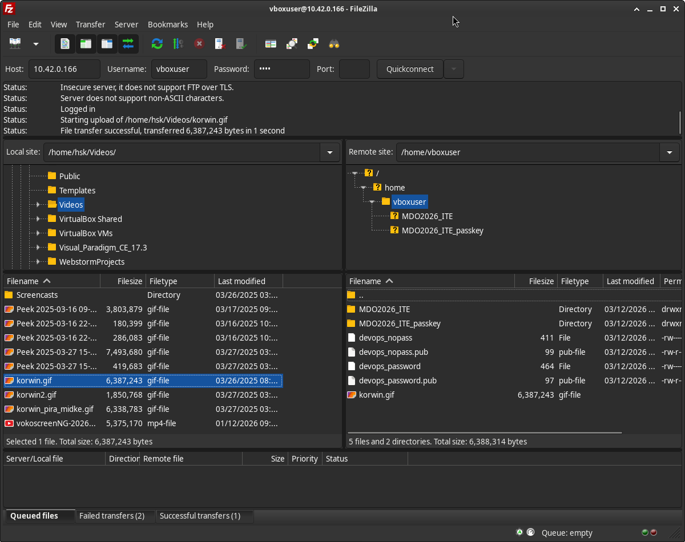

## Gałąź
### Przełączenie na `main`, potem na gałąź grupy `grupa2`; stworzenie własnego brancha
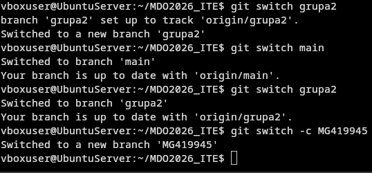

### Git hook
```bash
#!/bin/bash

if [[ ! $(cat $1) =~ ^"MG419945" ]]; then
	echo "Commit message nie zaczyna sie od wymaganej formulki."
	exit 1
fi

```

Tak wypełniony plik `commit-msg` skopiowałem do folderu `./git/hooks`, a następnie oznaczyłem jako plik wykonywalny poprzez `chmod +x`.


### Push na mój branch na repo

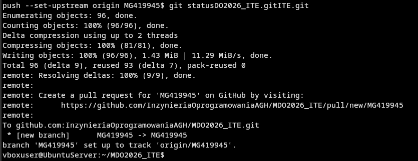
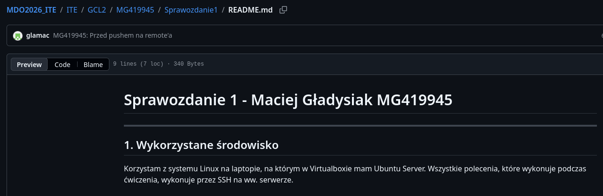

## Historia poleceń
```bash
	1  ls
    2  pwd
    3  sudo apt install openssh-client git
    4  git clone https://glamac:[wycięty personal access token]@github.com/InzynieriaOprogramowaniaAGH/MDO2026_ITE.git
    5* ls[A
    6  ssh-keygen -C devops_ITE_nopass -t ed25519
    7  ssh-keygen -C devops_password -t ed25519
    8  ls ~/.ssh
    9  ls ~/.ssh/authorized_keys 
   10  cd ~/.ssh/
   11  ls
   12  ls authorized_keys 
   13  cat authorized_keys 
   14  cd ~
   15  ls
   16  ssh-add ~/devops_password
   17  eval "$(ssh-agent -s)"
   18  ssh-agent -s
   19  systemctl status ssh
   20  systemctl status 
   21  top
   22  top 
   23  ssh-add ~/devops_password
   24  ls
   25  mv ./MDO2026_ITE ./MDO2026_ITE_passkey
   26  git clone git@github.com:InzynieriaOprogramowaniaAGH/MDO2026_ITE.git
   27  cat ~/devops_password.pub 
   28  git clone git@github.com:InzynieriaOprogramowaniaAGH/MDO2026_ITE.git
   29  clear
   30  sudo apt install vsftpd
   31  vim /etc/vsftpd.conf 
   32  sudo vim /etc/vsftpd.conf 
   33  sudo systemctl enable --now vsftpd
   34  systemctl status vsftpd
   35  sudo vim /etc/vsftpd.conf 
   36  sudo systemctl restart vsftpd.service 
   37  cd ~/MDO2026_ITE
   38  ls
   39  branch main
   40  git branch main
   41  git checkout main
   42  git checkout grupa2
   43  git branch
   44  git checkout main
   45  git branch -d grupa2
   46  git checkout grupa2 --no-guess
   47  git checkout grupa3 --no-guess
   48  git checkout origin grupa2 --no-guess
   49  git fetch
   50  git branch -v -a
   51  git branch -v -a | grep grupa
   52  git switch grupa2
   53  git switch main
   54  git switch grupa2
   55  git switch -c MG419945
   56  git fetch
   57  git pull origin/grupa2
   58  git pull origin grupa2
   59  ls 
   60  cat ./.git/hooks/commit-msg.sample 
   61  cat ./.git/hooks/prepare-commit-msg.sample 
   62  ls
   63  vim commit-msg
   64  ls
   65  git status
   66  git add ./commit-msg 
   67  git branch
   68  git commit -am "commit message test"
   69  git config --global user.name "glamac"
   70  git commit -am "commit message test"
   71  git status
   72  ls
   73  cp ./commit-msg ./.git/hooks/
   74  ls
   75  git status
   76  git commit -am "Test"
   77  git config
   78  vim ~/.gitconfig 
   79  git commit -am "Test"
   80  chmod +x ./.git/hooks/commit-msg
   81  git commit --amend -m "Test"
   82  git branch
   83  git commit --amend -m "MG419945: Git commit hook"
   84  git status
   85  ls
   86  mv commit-msg ITE/2/MG419945/Sprawozdanie1/
   87  git commit -am "MG419945: Start sprawka"
   88  git status
   89  git commit -am "MG419945: Przed pushem na remote'a"
   90  got add ITE
   91  git add ITE
   92  git commit -am "MG419945: Przed pushem na remote'a"
   93  git status
   94  git remote -v 
   95  git push 
   96  git push --set-upstream origin MG419945
   97  vim ~/.gitconfig 
   98  git change-commits
   99  ls
  100  vim quickfix.sh
  101  ls
  102  cd ~
  103  ls
  104  git log
  105  ls
  106  cd ~/MDO2026_ITE
  107  git log
  108  git push --set-upstream origin MG419945
  109  git remote -v
  110  # ???
  111  git status
  112  git remote add git@github.com:InzynieriaOprogramowaniaAGH/MDO2026_ITE.git
  113  git remote add origin git@github.com:InzynieriaOprogramowaniaAGH/MDO2026_ITE.git
  114  git fetch
  115  git status
  116  git log
  117  ls
  118  git push --set-upstream origin MG419945
  119  git status
  120  git add ITE/2/
  121  git status
  122  ls ITE
  123  ls ITE/2
  124  ls ITE/2/MG419945/
  125  ls ITE/2/MG419945/Sprawozdanie1/
  126  ls ITE/2/MG419945/Sprawozdanie1/screeny/
  127  rm ITE/2/
  128  rm -rf ITE/2/
  129  git status
  130  git commit -am "MG419945: Push mojego brancha
"
  131  git status
  132  git log
  133  ls
  134  git status
  135  git add ITE/GCL2/MG419945/Sprawozdanie1/screeny/git_push_my_branch.png 
  136  git status -am "MG419945: Po pushu na repo"
  137  git commit -am "MG419945: Po pushu na repo"
  138  git status
  139  git add ITE/GCL2/MG419945/Sprawozdanie1/screeny/push_worked.png 
  140  git commit -AM "MG419945: ostatni screen"
  141  git commit -am "MG419945: ostatni screen"
  142  git push origin
  143  git commit -am "MG419945: Formatowanie"
  144  git push origin
  145  history
  146  history > shell_history.txt
```
