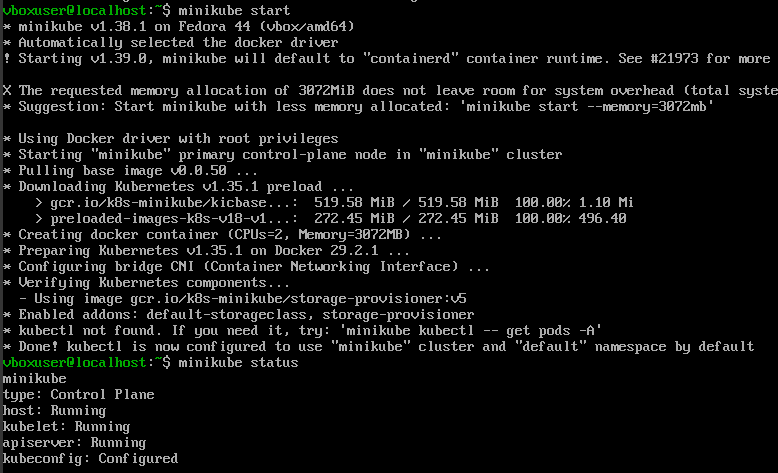
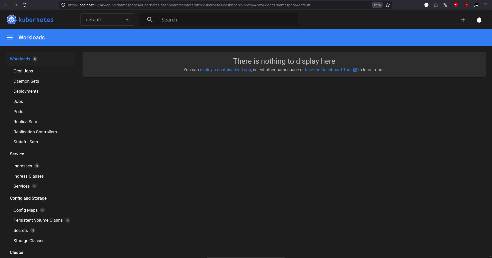
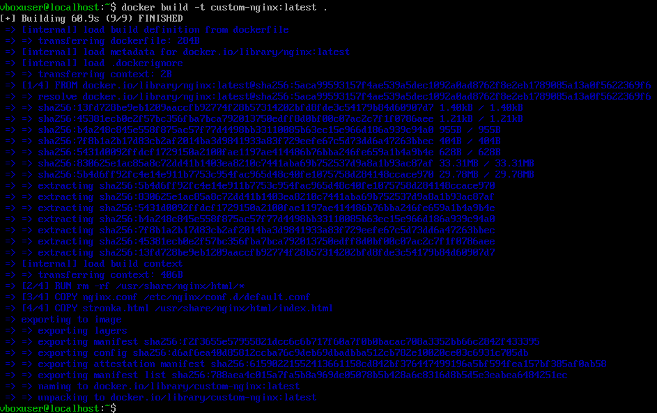
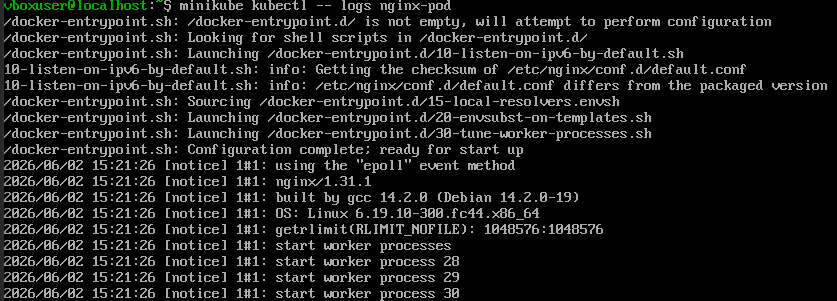
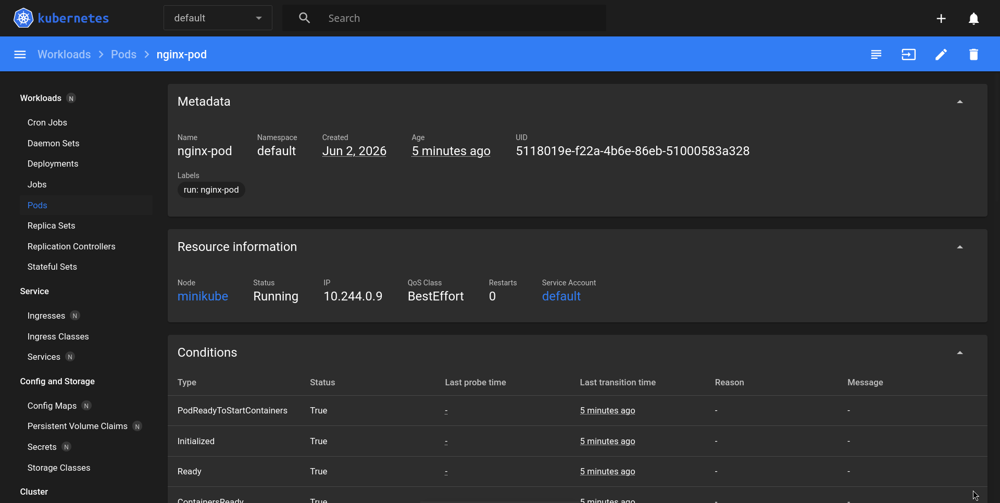
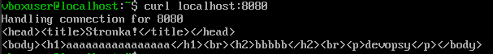
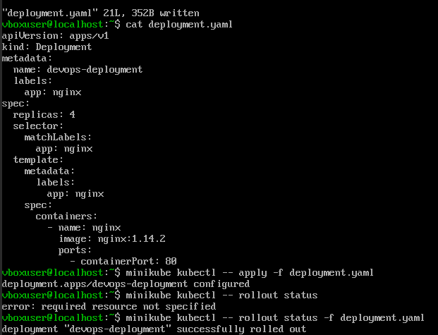
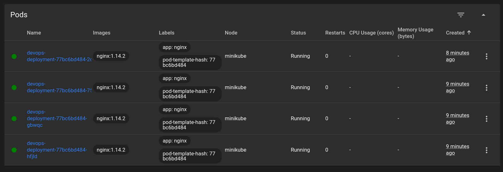
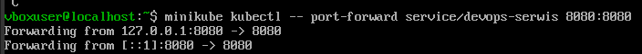

# Sprawozdanie 10 - Maciej Gładysiak MG419945
---
## 1. Wykorzystane środowisko
Korzystam z systemu Linux na laptopie, na którym w Virtualboxie mam Ubuntu Server. Polecenia wykonywane podczas ćwiczenia są przez SSH na serwerze Ubuntu Server (np. ustawienie serwera http aby fedora miała z czego pobierać pliki), jak i na maszynie oddzielnej wirtualnej systemu Fedora.

## 2. Instalacka klastra Kubernetes
Zaopatrzyłem się i zainstalowałem na serwerze Fedory z zajęc ostatnich minikube; jako `kubectl` używałem `minikube kubectl --`. 
Uruchomiłem kubernetes, odpaliłem dashboard i po lekkiej zabawie z `ssh` otworzyłem go w przeglądarce.



## 3. Analiza posiadanego kontenera
Aplikacja nie nadawała się do pracy w kontenerze. Wybrałem obraz-gotowiec (`nginx`), z własną konfiguracją:
- stronka.html:
```html
<head><title>Stronka!</title></head>
<body><h1>aaaaaaaaaaaaaaaa</h1><br><h2>bbbbb</h2><br><p>devopsy</p></body>
```
- nginx.conf:
```conf
server {
	listen 8080;
	server_name localhost;

	root /usr/share/nginx/html;
	index index.html;
}
```
- dockerfile:
```dockerfile
FROM nginx:latest
RUN rm -rf /usr/share/nginx/html/*
COPY nginx.conf /etc/nginx/conf.d/default.conf
COPY stronka.html /usr/share/nginx/html/index.html
CMD ["nginx", "-g", "daemon off;"]
```

## 4. Uruchamianie oprogramowania
Uruchomiłem pod'a z zbudowanym wcześniej w punkcie trzecim obrazem bazowanym na `nginx`, po czym sprawdziłem jego działanie.


Zrobiłem `port-forward` i sprawdziłem, przy użyciu `curl`, czy zwracana jest strona:

Kontener działa zatem poprawnie.

## 5. Przekucie wdrożenia w plik wdrożenia

Wdrożenie (tym razem samego `nginx`, jak sugeruje instrukcja) zapisałem jako plik yaml:
```yaml
apiVersion: apps/v1
kind: Deployment
metadata:
  name: nginx-deployment
  labels:
    app: nginx
spec:
  replicas: 4
  selector:
    matchLabels:
      app: nginx
  template:
    metadata:
      labels:
        app: nginx
    spec:
      containers:
      - name: nginx
        image: nginx:1.14.2
        ports:
        - containerPort: 80
```
i następnie uruchomiłem (`kubectl apply`), z czterema replikami:


Wdrożenie wyeksponowałem jako serwis:
```yaml
apiVersion: v1
kind: Service
metadata:
  name: devops-serwis
spec:
  selector:
    app: nginx
  ports:
    - protocol: TCP
      port: 8080
      targetPort: 8080
  type: NodePort
```
i przekierowałem, po `kubectl apply service.yaml`, port do serwisu:

