# Sprawozdanie 11 - Maciej Gładysiak MG419945
---
## 1. Wykorzystane środowisko
Korzystam z systemu Linux na laptopie, na którym w Virtualboxie mam Ubuntu Server. Polecenia wykonywane podczas ćwiczenia są przez SSH na serwerze Ubuntu Server (np. ustawienie serwera http aby fedora miała z czego pobierać pliki), jak i na maszynie oddzielnej wirtualnej systemu Fedora. Ale głównie na maszynie wirtualnej Fedora.

## 2. Przygotowanie nowego obrazu
Przygotowałem trzy wersje obrazu na podstawie httpd:
### 1. Wersja v1
index.html
```index.html
<head><title>devops</title></head>
<body><h1>Wersja 1</h1></body>
```
Dockerfile
```dockerfile
FROM httpd:alpine
COPY ./index.html /usr/local/apache2/htdocs
```
### 2. Wersja v2
index.html
```index.html
<head><title>devops</title></head>
<body><h1>Wersja 2</h1></body>
```
Dockerfile
```dockerfile
FROM httpd:alpine
COPY ./index.html /usr/local/apache2/htdocs
```
### 3. Wersja v3 - wadliwa
index.html
```index.html
<head><>devops</title
<body><h1>Wersja 3
```
Dockerfile
```dockerfile
FROM httpd:alpine
COPY ./index.html /usr/local/apache2/htdocs
RUN rm /usr/local/apache2/conf/httpd.conf
```
Uwaga: widoczna podczas niektórych screenach wersja "v4" jest *taka sama* jak "v3" tutaj; musiałem zrobić nową wersję, bo przez przypadek nie zepsułem obrazu za pierwszym podejściem.
## 3. Zmiany w deploymencie
Plik yaml z wdrożeniem z ostatnich labów modyfikowałem jak instrukcja wskazuje.
### 1. 8 replik
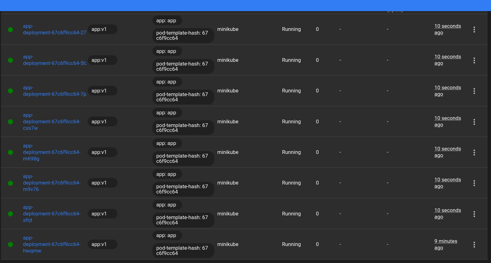
### 2. repliki do 1
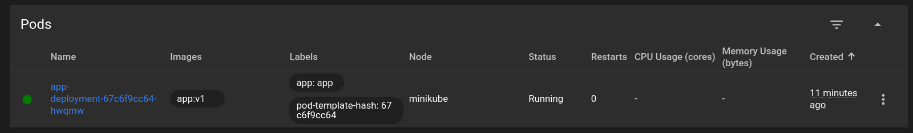
### 3. repliki do 0
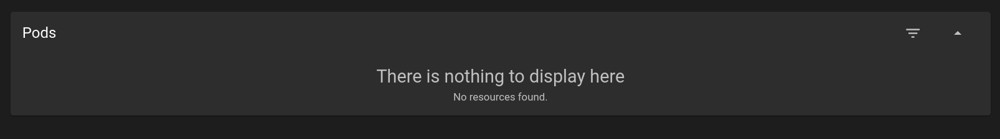
### 4. repliki w górę do 4
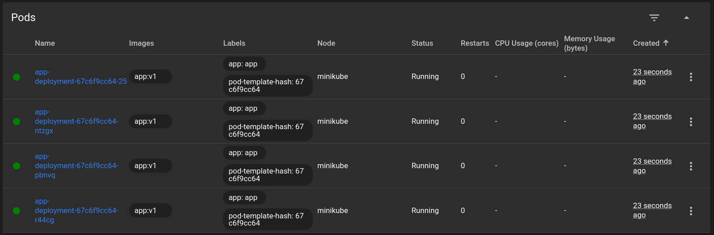
### 5. update do nowej wersji
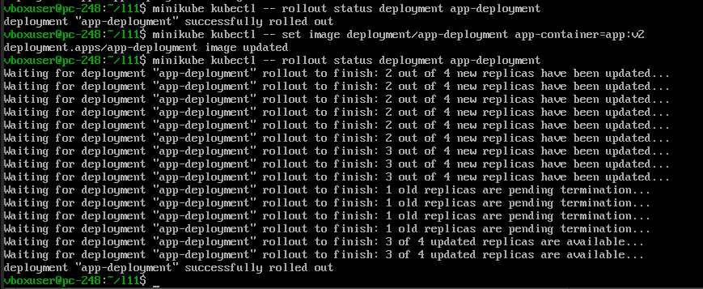
### 6. update do starej i (wadliwie) wadliwej
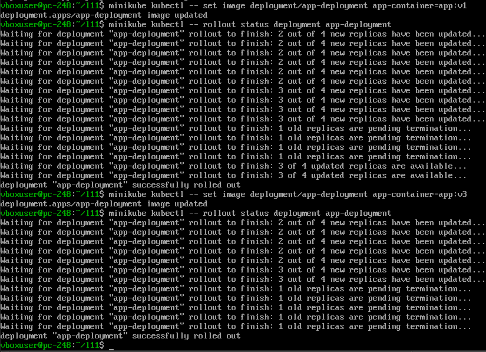
### 7. faktyczny wadliwy obraz ("v4")
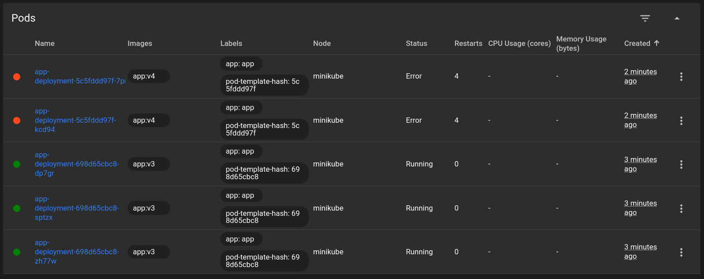
Jedna poprawna replika zniknęła; zostały 3 stare i 2 nowe wadliwe.
### 8. Przywracane przez `rollout history`, `rollout undo`
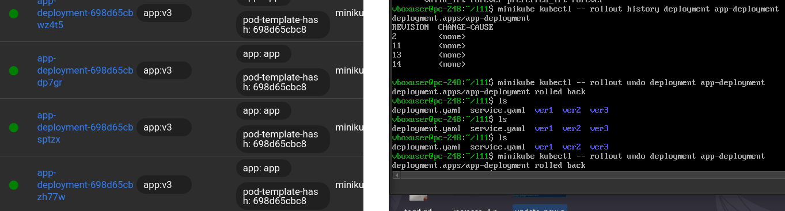

## 4. Kontrola wdrożenia
### 1. Historia wdrożenia, problemy
Odnosząc się do fragmentu ostatniego zrzutu ekranu:
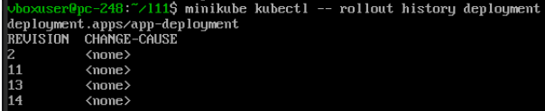
Widać co prawda numery `Revision`, które pokazują (akurat z uwagi na wadliwy "wadliwy kontener" wcześniej) cztery oddzielne wersje, aczkolwiek nie jestem w stanie z tego więcej odczytać w zakresie problemów.
### 2. Skrypt weryfikujący
verify.sh
```sh
#!/bin/bash

if minikube kubectl -- rollout status deployment app-deployment --timeout=60s; then
    echo "OK - t <= 60s"
    exit 0
else
    echo "Błąd - t > 60s"
    exit 1
fi
```
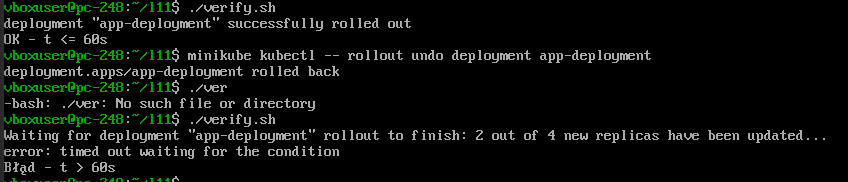

## 5. Strategie wdrożenia
### 1. Recreate:

depl-recreate.yaml
```yaml
apiVersion: apps/v1
kind: Deployment
metadata:
  name: app-recreate
spec:
  replicas: 4
  strategy:
      type: Recreate
  selector:
    matchLabels:
      app: app
  template:
    metadata:
      labels:
        app: app
    spec:
      containers:
      - name: app-container
        image: app:v1
        ports:
        - containerPort: 80
```
Po uruchomieniu i update:
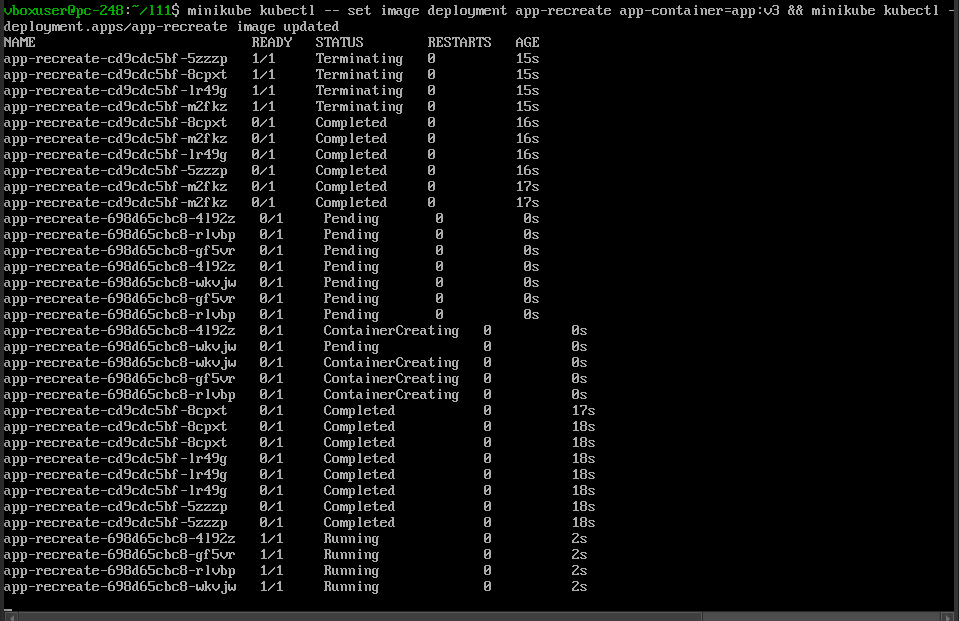

Niszczone są wszystkie repliki wersji v1, po czym są tworzone repliki wersji v2.
Jest pewien downtime, ale jest pewność że wszystkie repliki są na najnowszej wersji.

### 2. Rolling Update:

depl.rolling.yaml
```yaml
apiVersion: apps/v1
kind: Deployment
metadata:
  name: app-rolling
spec:
  replicas: 4
  strategy:
      type: RollingUpdate
      rollingUpdate:
        maxSurge: 2
        maxUnavailable: 2
  selector:
    matchLabels:
      app: app
  template:
    metadata:
      labels:
        app: app
    spec:
      containers:
      - name: app-container
        image: app:v1
        ports:
        - containerPort: 80
```

Po uruchomieniu i update:
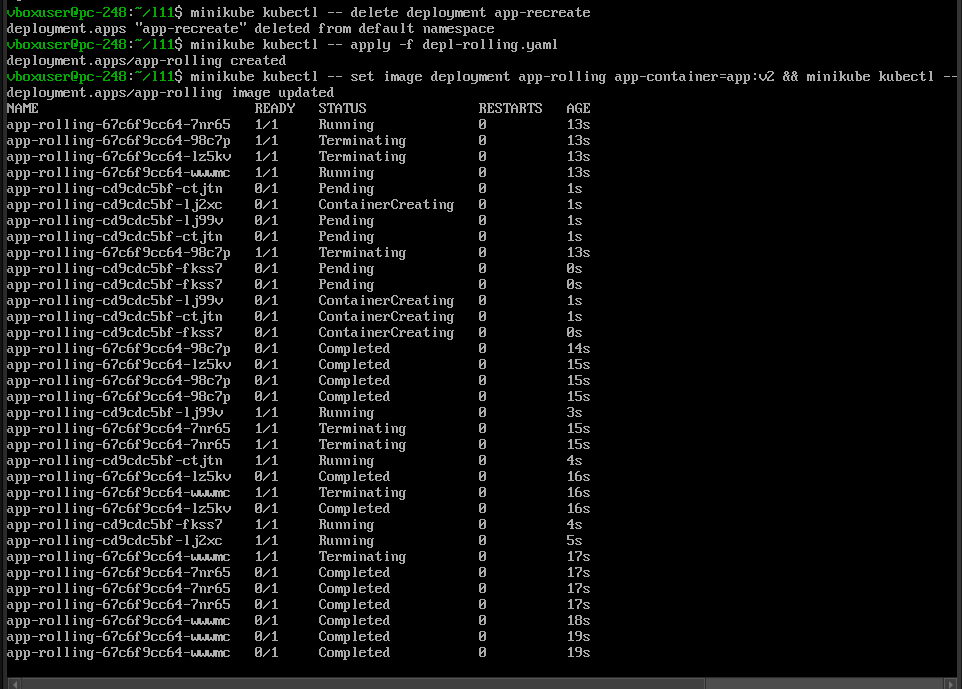

Niszczone są 2 repliki v1, tworzone są 2 repliki v2, po czym czynność się powtarza aż do momentu gdy 100% replik jest wersji v2.
Uptime nienaruszony, ale przez pewien czas aktywne są dwie wersje - v1 i v2 - replik.

### 3. Canary:

depl-canary.yaml
```yaml
apiVersion: apps/v1
kind: Deployment
metadata:
  name: app-canary
spec:
  replicas: 1
  selector:
    matchLabels:
      app: app-canary-test
      track: canary
  template:
    metadata:
      labels:
        app: app-canary-test
        track: canary
    spec:
      containers:
      - name: app-container
        image: app:v2
        ports:
        - containerPort: 80
```

depl-stable.yaml
```yaml
apiVersion: apps/v1
kind: Deployment
metadata:
  name: app-stable
spec:
  replicas: 3
  selector:
    matchLabels:
      app: app-canary-test
      track: stable
  template:
    metadata:
      labels:
        app: app-canary-test
        track: stable
    spec:
      containers:
      - name: app-container
        image: app:v1
        ports:
        - containerPort: 80
```

service-canary.yaml
```yaml
apiVersion: v1
kind: Service
metadata:
  name: app-canary-service
spec:
  type: NodePort
  selector:
    app: app-canary-test
  ports:
    - protocol: TCP
      port: 80
      targetPort: 80
      nodePort: 30002
```

Po uruchomieniu:
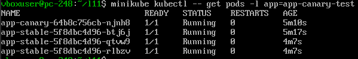
Trzy repliki stabilne, jedna replika kanarka.
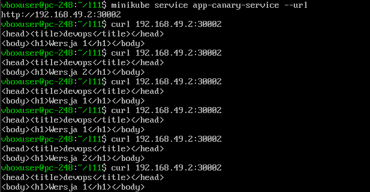
Odpowiedzi dostaje zarówno od kanarka v2 (ok. 1/4 odpowiedzi), jak i stabilnych replik v1 (3/4 odpowiedzi)
