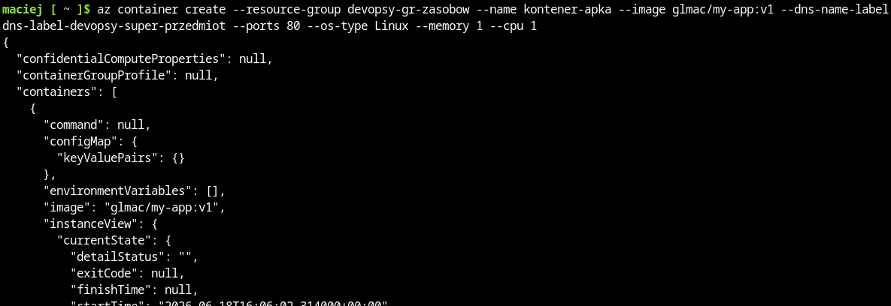
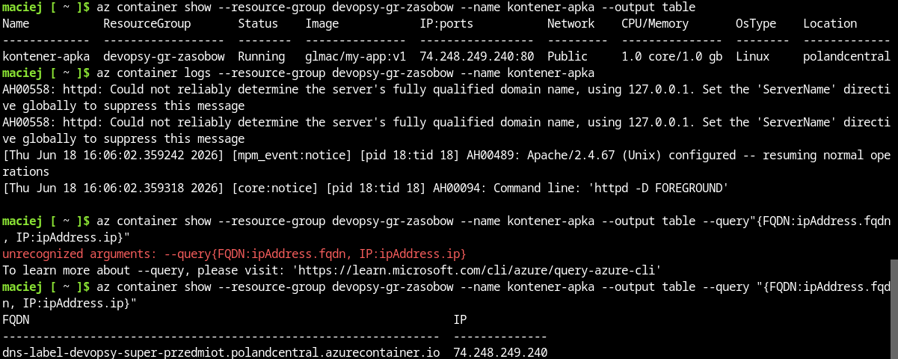

# Sprawozdanie 11 - Maciej Gładysiak MG419945
---
## 1. Wykorzystane środowisko
Korzystam z systemu Linux na laptopie, na którym w Virtualboxie mam Ubuntu Server. Polecenia wykonywane podczas ćwiczenia są przez SSH na serwerze Ubuntu Server (np. ustawienie serwera http aby fedora miała z czego pobierać pliki), jak i na maszynie oddzielnej wirtualnej systemu Fedora, oraz podczas tego laboratorium głównie w azure cloud shell.

## 2. Przygotowanie kontenera
Z uwagi na to, że aplikacja z mojego pipeline'a nie udostępnia żadnego interfejsu z którym można byłoby się połączyć przez przeglądarke, użyłem kontenera wersji pierwszej aplikacji z ostatnich laboratoriów.

Dockerfile

```dockerfile
FROM httpd:alpine
COPY ./index.html /usr/local/apache2/htdocs
```

index.html

```html
<head><title>devops</title></head>
<body><h1>Wersja 1</h1></body>
```


## 3. Zapoznanie z platformą
Zapoznałem się z podlinkowaną dokumentacją.

## 4. Zadanie do wykonania

Stworzyłem resource group:


oraz kontener z obrazem z dockerhuba:



Sprawdziłem logi, oraz adres IP kontenera.



a następnie połączyłem się z adresem w przeglądarce - efektem jest strona zdefiniowana 1:1 jak w kontenerze wersji pierwszej


Na koniec usunąłem użyty resource group.
