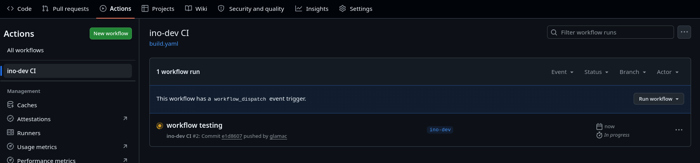
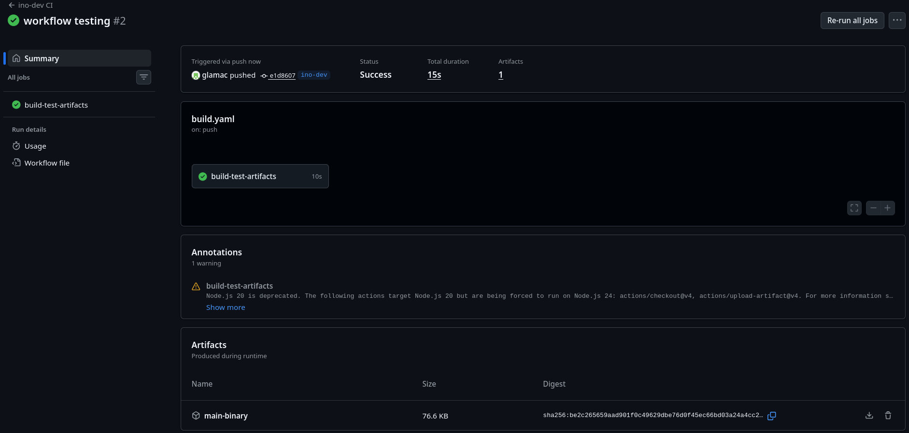
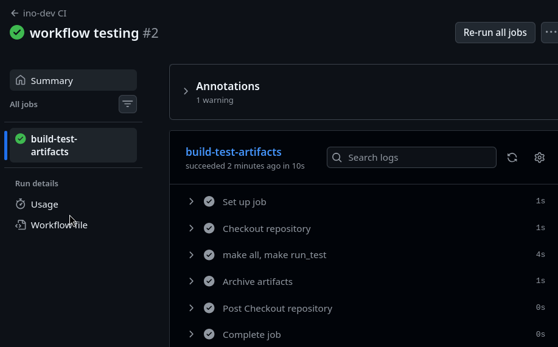
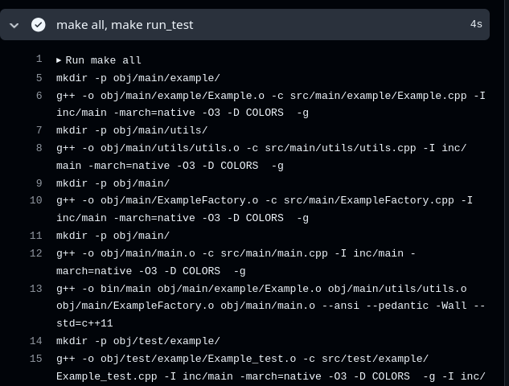

# Sprawozdanie 13 - Maciej Gładysiak MG419945
---
## 1. Wykorzystane środowisko
Korzystam z systemu Linux na laptopie, na którym w Virtualboxie mam Ubuntu Server. Polecenia wykonywane podczas ćwiczenia są przez SSH na serwerze Ubuntu Server (np. ustawienie serwera http aby fedora miała z czego pobierać pliki), jak i na maszynie oddzielnej wirtualnej systemu Fedora, oraz podczas tego laboratorium głównie w azure cloud shell.


## 2. Fork repo
3. Stworzyłem własny fork repozytorium [0nyr/cpp-project-template](https://github.com/0nyr/cpp-project-template); repozytorium wybrałem z uwagi na prostą kompilacje `make`. Na forku stworzyłem nowy branch `ino-dev`.

## 3. Github Actions

Projekt nie miał żadnych własnych github actions, więc mogłem od razu przystąpić do pisania własnej akcji. Na podstawie [tutorialu](https://docs.github.com/en/actions/tutorials/store-and-share-data) również uzupełniłem go o upload artefaktu.

*.github/workflows/build.yml*:

```yaml
name: ino-dev CI

on:
  push:
    branches: [ "ino-dev" ]
  workflow_dispatch:

jobs:
  build-test-artifacts:
    runs-on: ubuntu-latest
    steps:
      - name: Checkout repository
        uses: actions/checkout@v4

      - name: make all, make run_test
        run: |
          make all
          make run_test

      - name: Archive artifacts
        uses: actions/upload-artifact@v4
        with:
          name: main-binary
          path: |
            bin/main
```

Nie byłem do końca pewny, gdzie taki workflow "wrzucić", więc jest zarówno na branchu `main`, jak i `ino-dev`. Workflow ma również `workflow_dispatch` na potrzeby debugowania; zrobiłem literówkę w nazwie brancha w pliku `build.yaml`, którą zauważyłem dopiero po 20 minutach.

Następnie zrobiłem commit do branch `ino-dev`:


co spowodowało uruchomienie akcji na Githubie:



Klikając na `workflow-testing`:



widoczny jest, róœnież, artefakt.





Jak widać na zrzucie ekranu powyżej, kod jest faktycznie kompilowany.
