# Sprawozdanie 2 - Maciej Gładysiak MG419945
---
## 1. Wykorzystane środowisko
Korzystam z systemu Linux na laptopie, na którym w Virtualboxie mam Ubuntu Server. Polecenia wykonywane podczas ćwiczenia są zarówno przez SSH na serwerze, jak i w kontenerach Dockera.

## 2. Instalacja Dockera
Instalacja Dockera na ubuntu była lekko bardziej skomplikowana, niż się tego spodziewałem, ale dokumentacja dockera była wystarczająca by przez to przebrnąć.
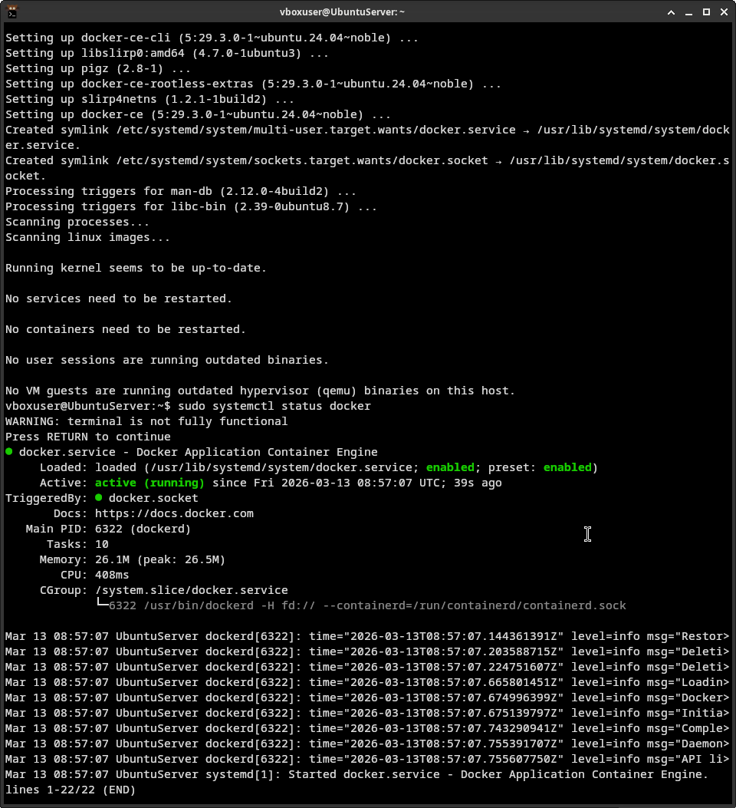

### Rejestracja w dockerhub
Skorzystałem z opcji rejestracji przy użyciu istniejącego konta na Githubie.
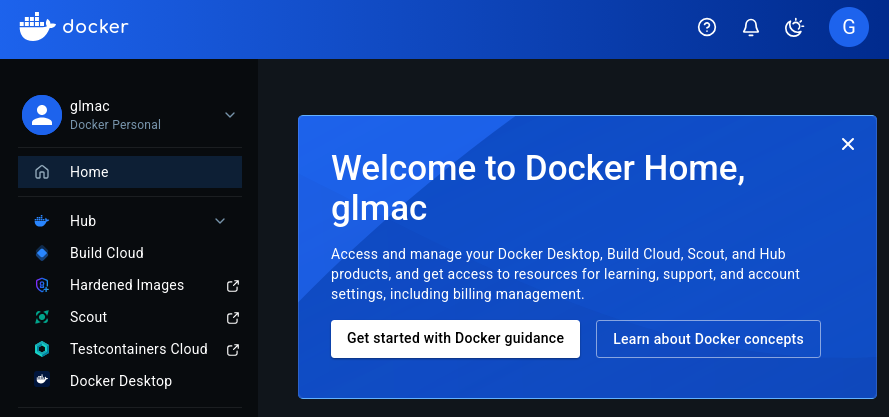

## 3. Zapoznanie się z obrazami `hello-world`, `busybox` oraz `ubuntu`
### `hello-world`:
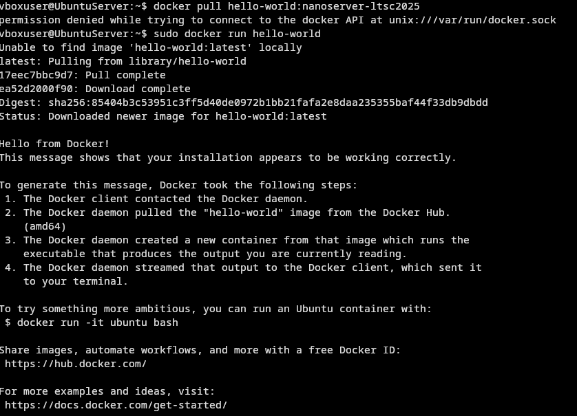

Inspekcja, kod wyjścia:

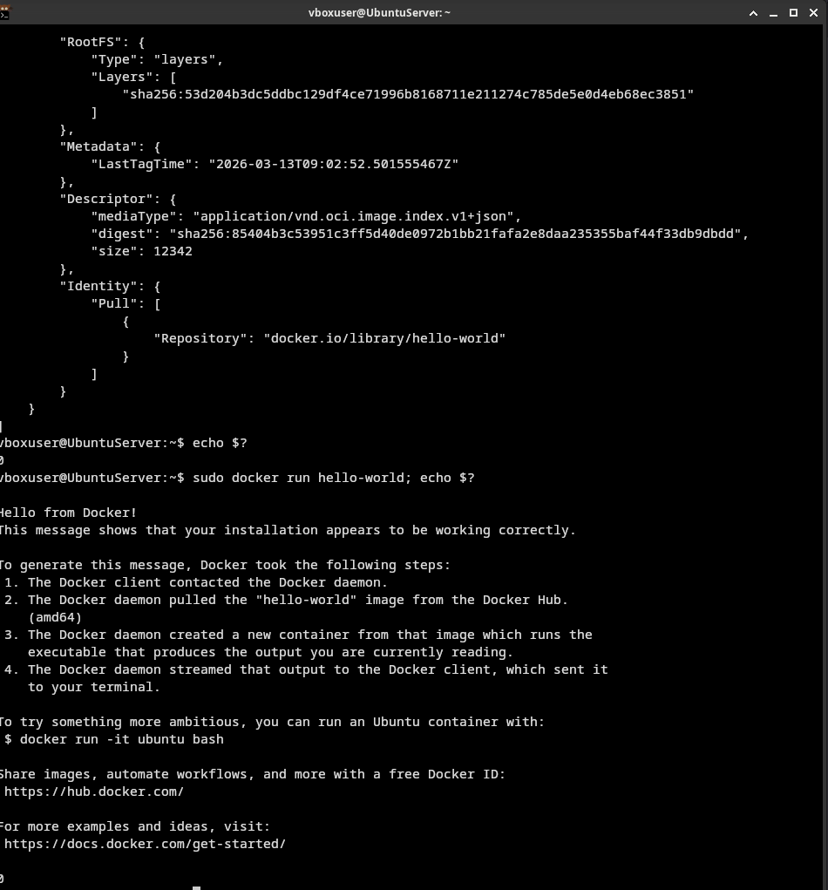
### `busybox`:
Zarówno `busybox` jak i `ubuntu` nie wypisywały nic w konsoli po uruchomieniu, więc przedstawie tylko inspekcje przy użyciu `docker inspect` oraz exit code widoczny w `docker container ls -a`:
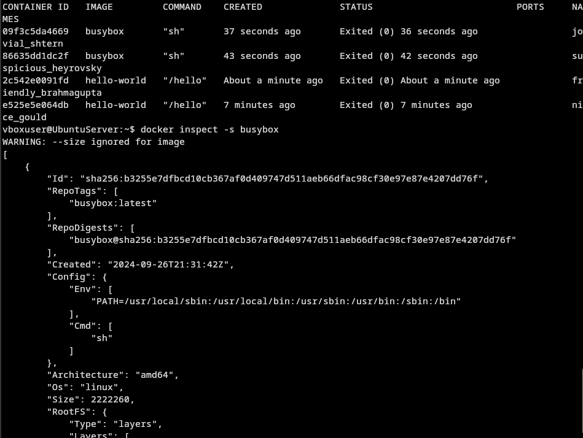

### `ubuntu`:
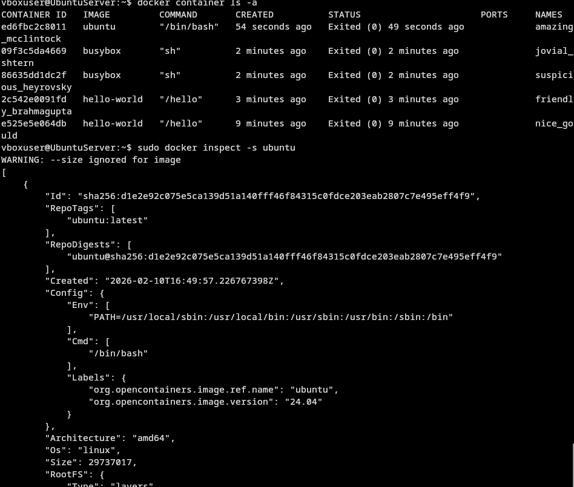

Z trzech inspektowanych kontenerów `hello-world` cechuje się najmniejszym rozmiarem, natomiast `ubuntu` - największym. Wszystkie kontenery zwróciły exit code `0`.

## 4. Uruchomienie busybox i podłączenie
Uruchomiłem kontener z busyboxem przy użyciu polecenia
```bash
sudo docker run --name "pkt4" -d -i -t busybox /bin/sh
```
Uruchamia to kontener w tle przy użyciu `-d`, `-i` (jeżeli dobrze rozumiem dokumentacje) zapobiega natychmiastowemu wyłączeniu się kontenera ze względu na brak danych wejściowych do terminala, `-t` prawdopodobnie pozwala na korzystanie z terminala.
Aby korzystać interaktywnie z kontenera użyłem polecenia `docker exec -it pkt4 sh`.
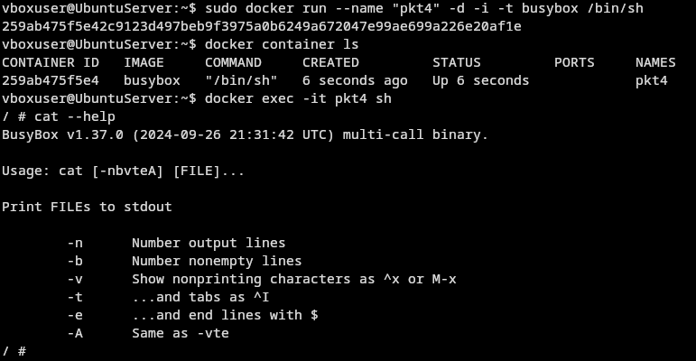

## 5. Uruchomienie Ubuntu i podłączenie
Docker run, docker exec analogicznie jak w punkcie wyżej.
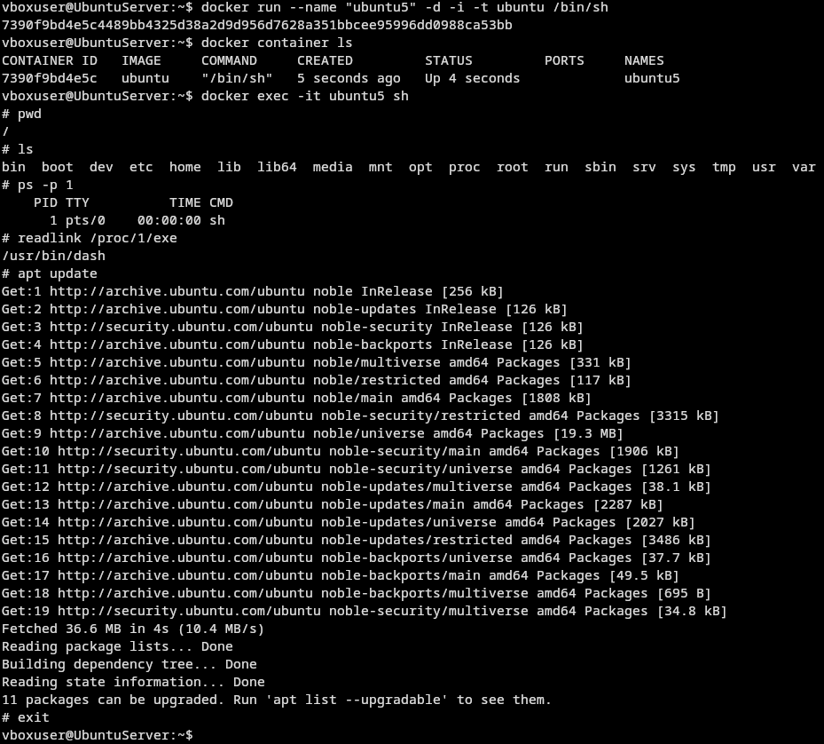

## 6. Budowa własnego dockerfile; uruchomienie kontenera
```dockerfile
FROM ubuntu:24.04

RUN apt-get -y update && apt-get install -y --no-install-recommends git ca-certificates 

WORKDIR /repo

RUN git clone https://github.com/InzynieriaOprogramowaniaAGH/MDO2026_ITE.git

CMD ["/bin/bash"]
```
Zbudowałem obraz na podstawie powyższego dockerfile. Dockerfile ma `git`-a; z uwagi na lekki problem z certyfikatami dodałem również `ca-certificates`.
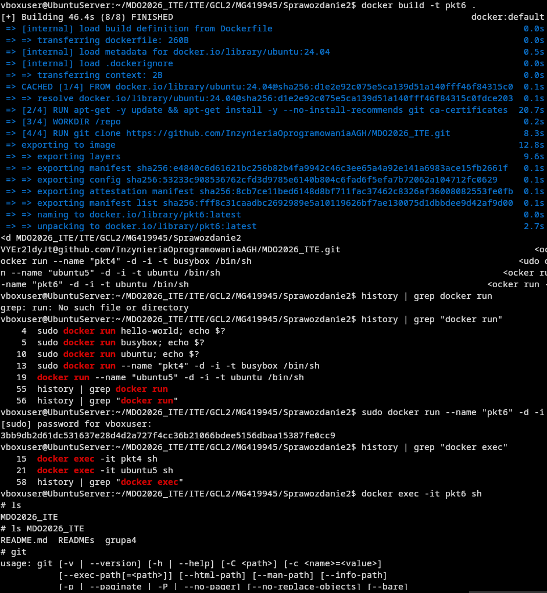

## 7. Uruchomione kontenery
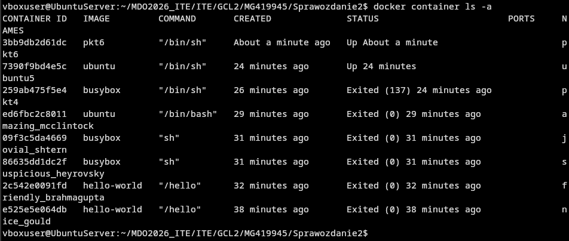

## 8. Czyszczenie obrazów 
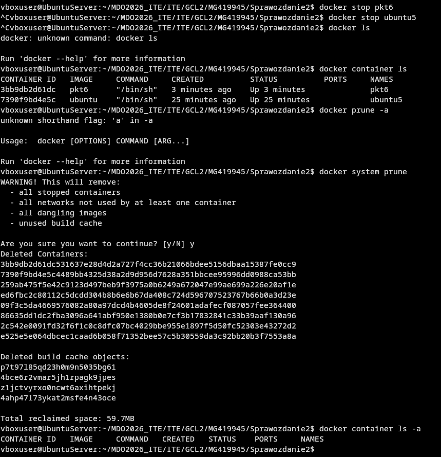
