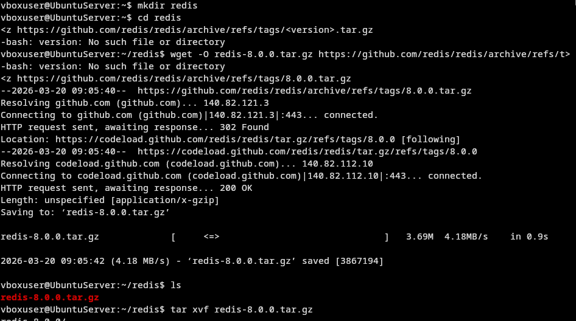
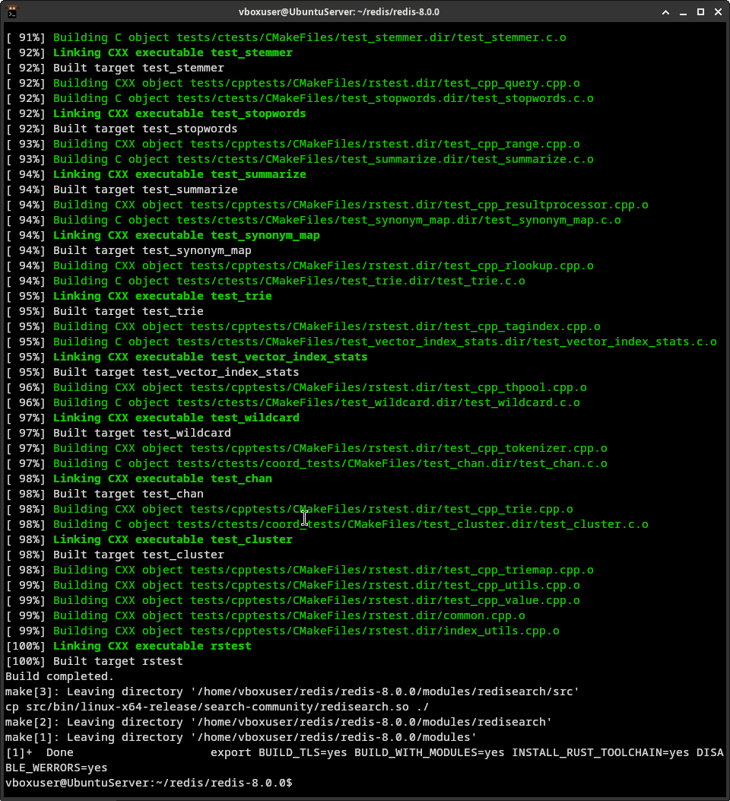
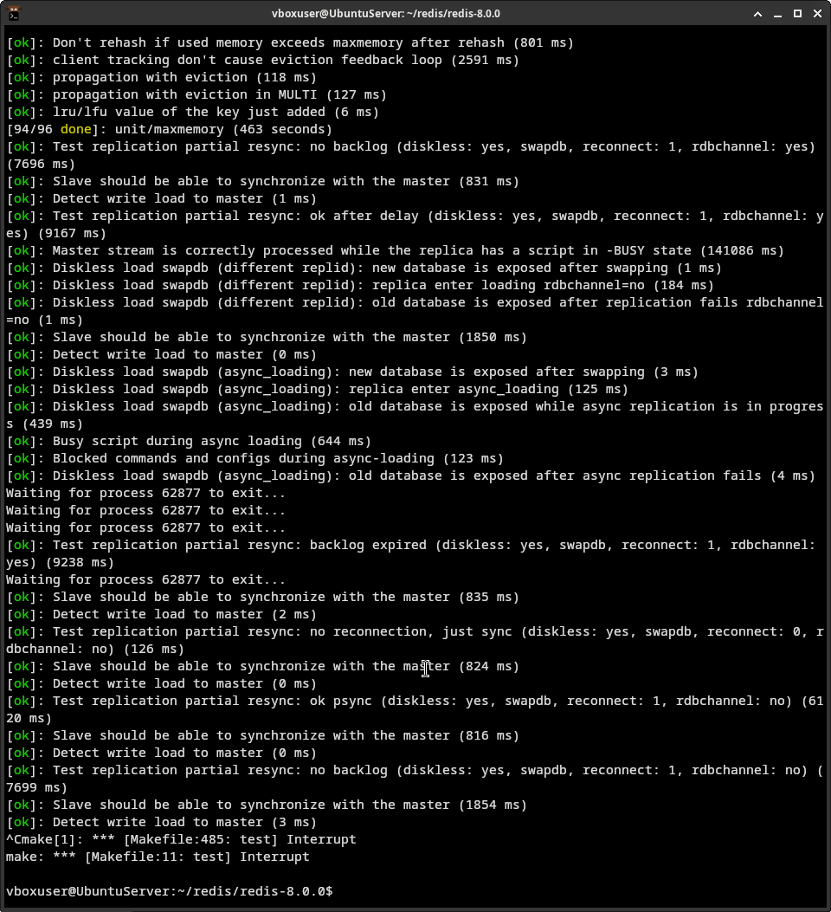
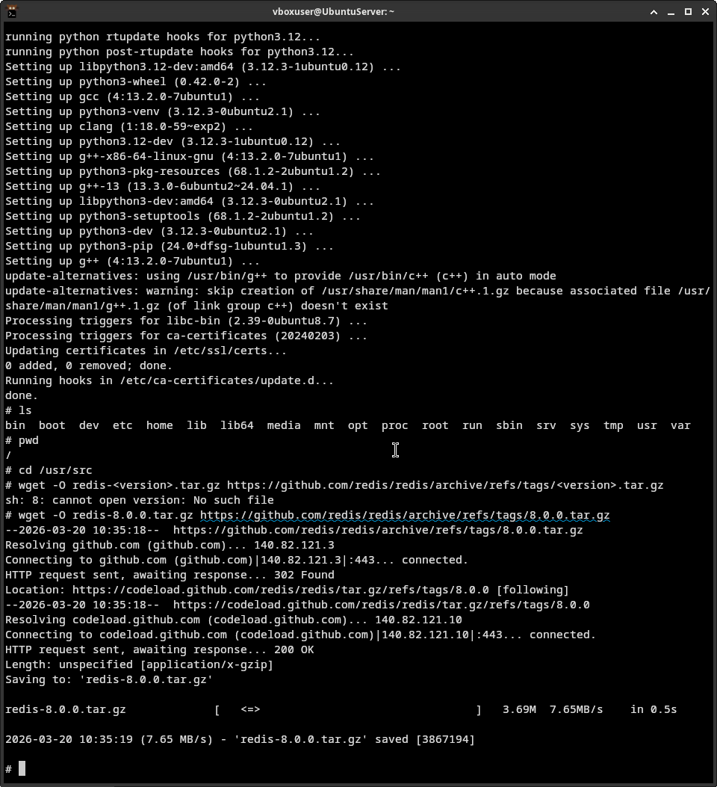
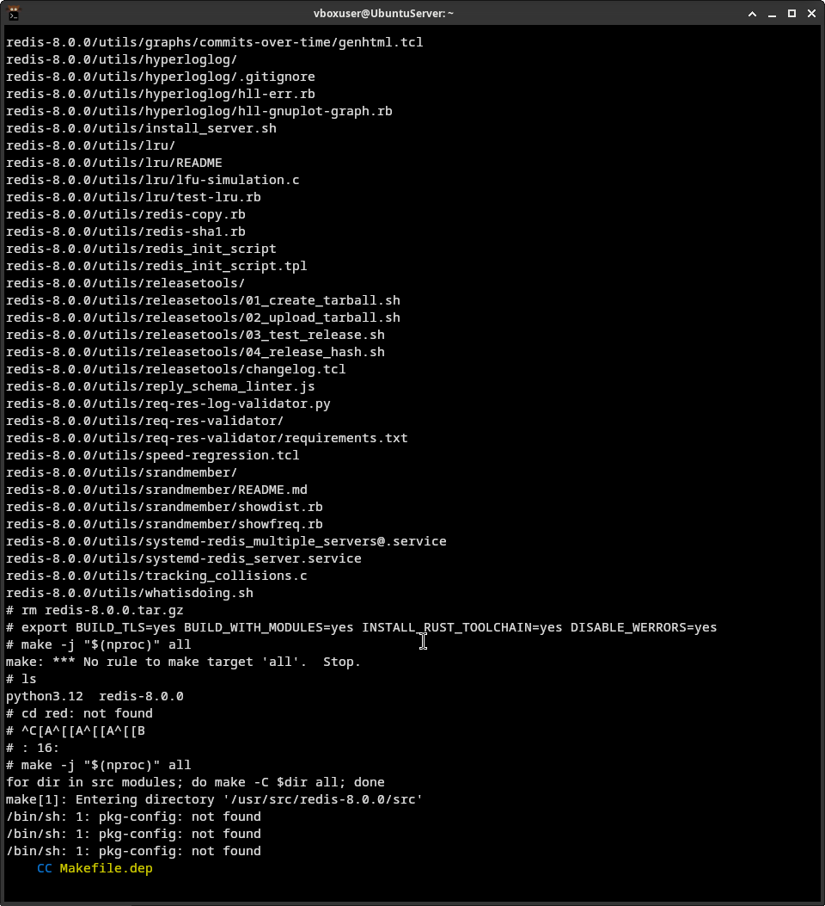
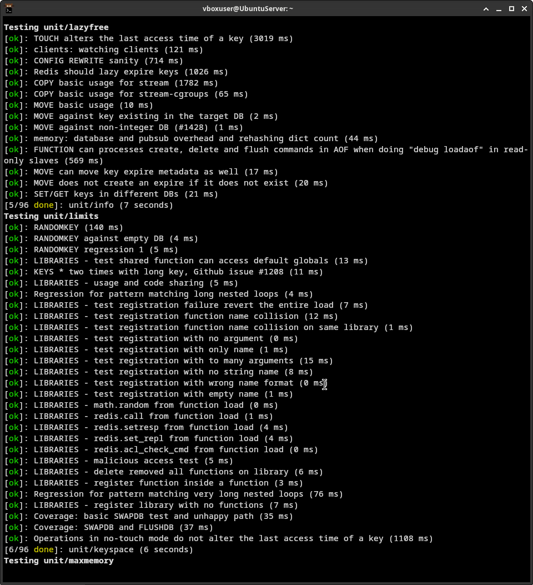
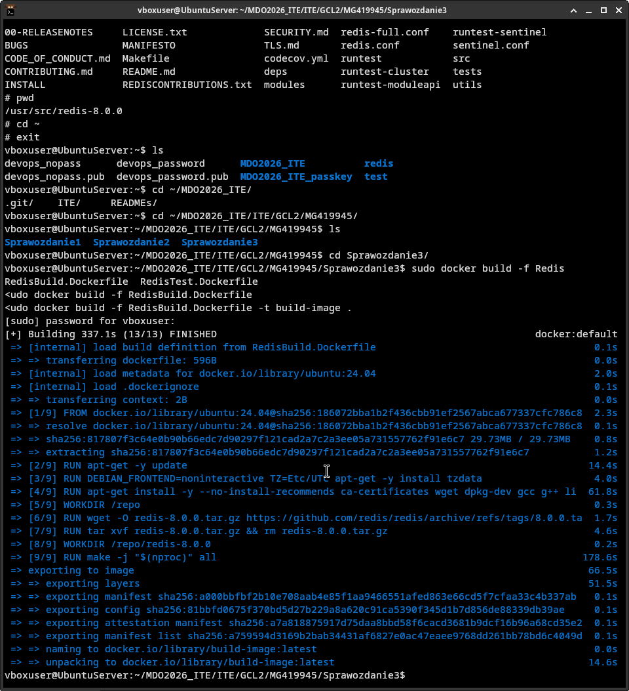
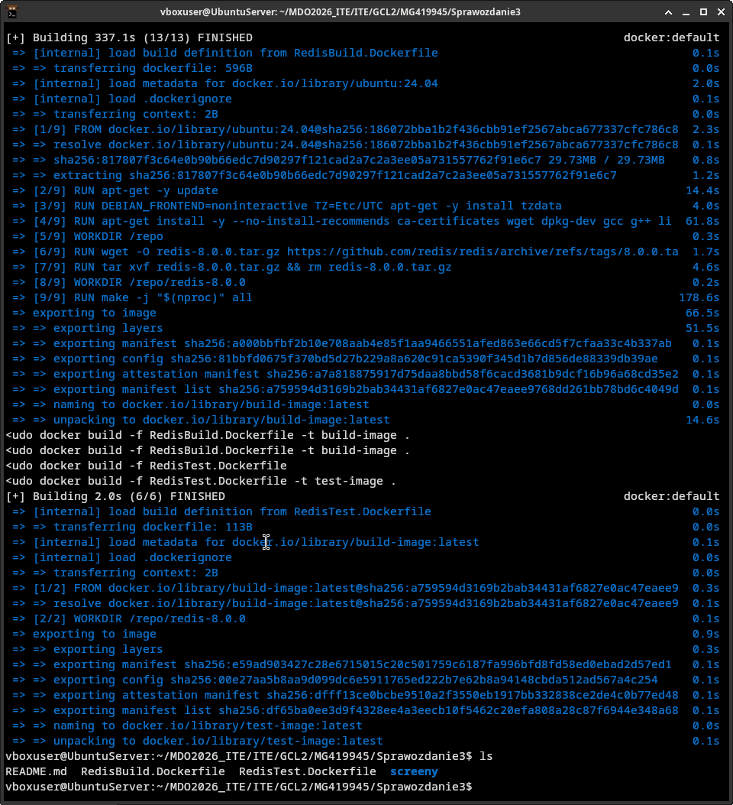
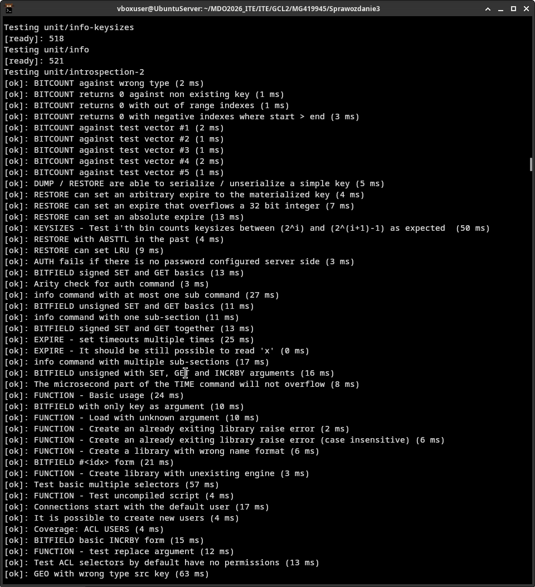

# Sprawozdanie 3 - Maciej Gładysiak MG419945
---
## 1. Wykorzystane środowisko
Korzystam z systemu Linux na laptopie, na którym w Virtualboxie mam Ubuntu Server. Polecenia wykonywane podczas ćwiczenia są zarówno przez SSH na serwerze, jak i w kontenerach Dockera.

## 2. Wybór oprogramowania
Jako repozytorium, którego kod będe klonować wybrałem [Redis](https://github.com/redis/redis).
Repozytorium zarówno dysponuje otwartą licencją, budowaniem przez `make`, jak i testami.
### Kompilacja, testy
Kierując się [instrukcją](https://github.com/redis/redis?tab=readme-ov-file#build-and-run-redis-with-all-data-structures---ubuntu-2404-noble) przeprowadziłem build programu i następnie uruchomiłem unit testy.




Testy w powyższym zrzucie ekranu przerwałem, z uwagi na limity czasowe.


## 3. Build w kontenerze
### Interaktywnie 
Do budowy wykorzystałem kontener z obrazem `ubuntu`.




### Z dockerfile

Obraz z buildem; `RedisBuild.Dockerfile`:
```Dockerfile
FROM ubuntu:24.04

RUN apt-get -y update
RUN DEBIAN_FRONTEND=noninteractive TZ=Etc/UTC apt-get -y install tzdata
RUN apt-get install -y --no-install-recommends ca-certificates wget dpkg-dev gcc g++ libc6-dev libssl-dev make tcl git cmake python3 python3-pip python3-venv python3-dev unzip rsync clang automake autoconf libtool

WORKDIR /repo
RUN wget -O redis-8.0.0.tar.gz https://github.com/redis/redis/archive/refs/tags/8.0.0.tar.gz
RUN tar xvf redis-8.0.0.tar.gz && rm redis-8.0.0.tar.gz

WORKDIR /repo/redis-8.0.0

RUN make -j "$(nproc)" all
```

Obraz z testami; `RedisTest.Dockerfile`
```Dockerfile
FROM build-image

WORKDIR /repo/redis-8.0.0

CMD ["make", "test"]
```

Budowa:
`sudo docker build -f RedisBuild.Dockerfile -t build-image .`
`sudo docker build -f RedisTest.Dockerfile -t test-image .`



