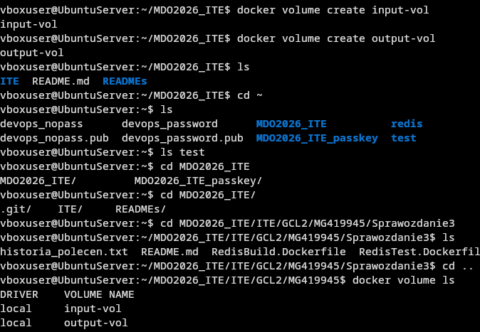
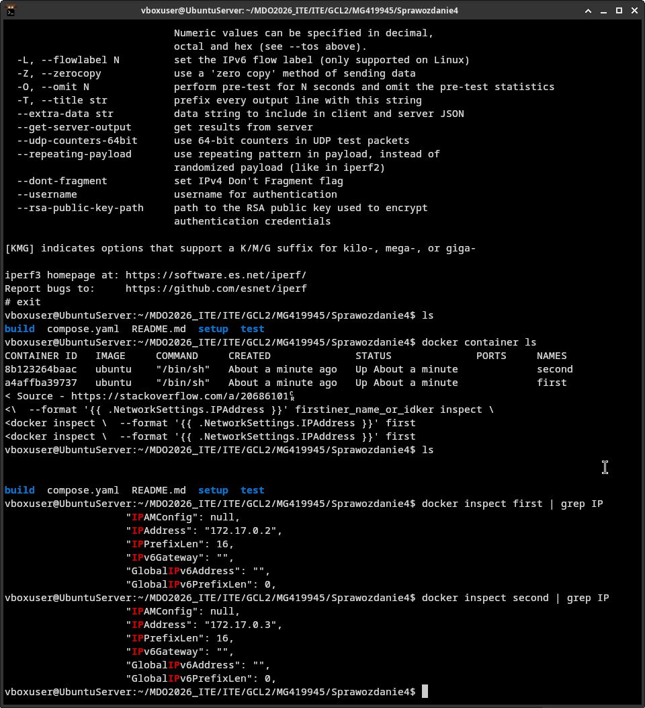
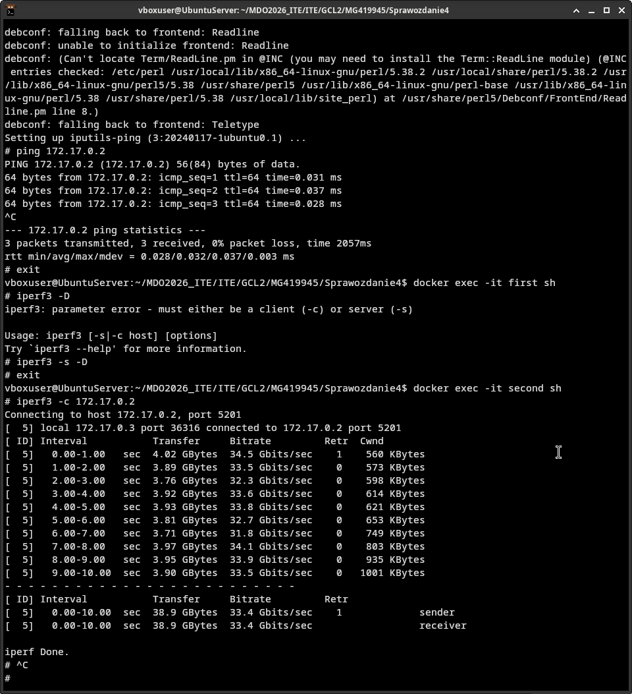
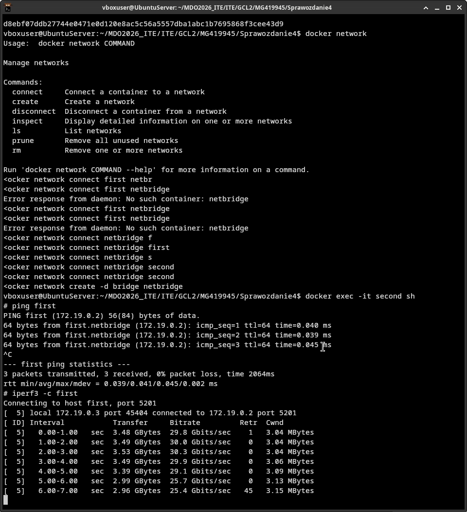
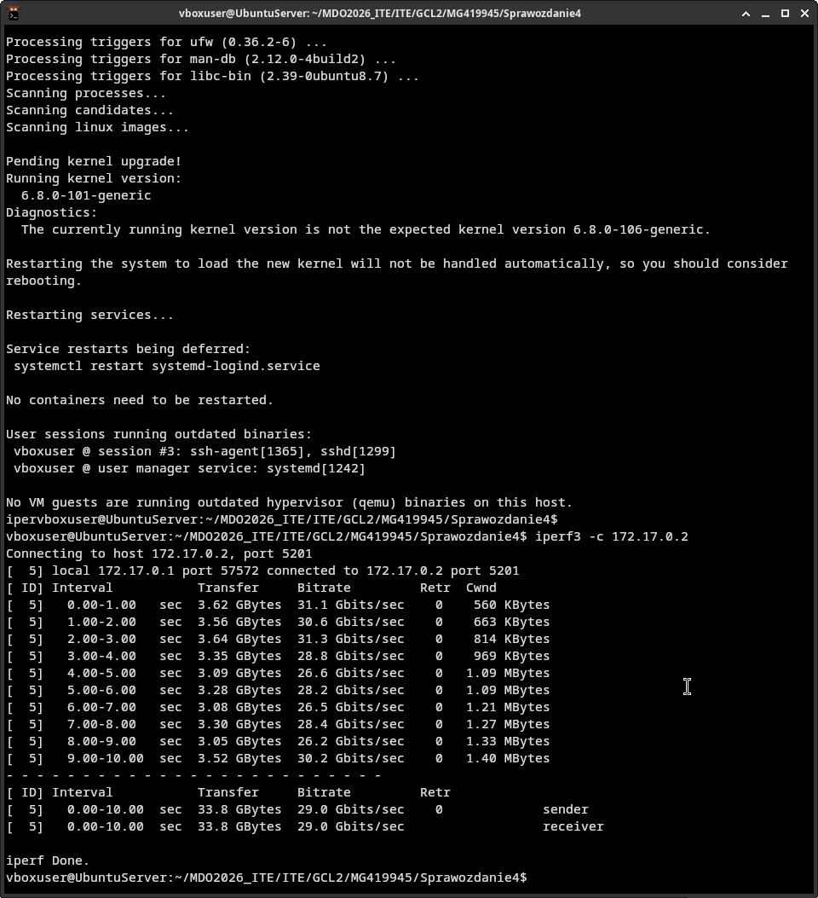
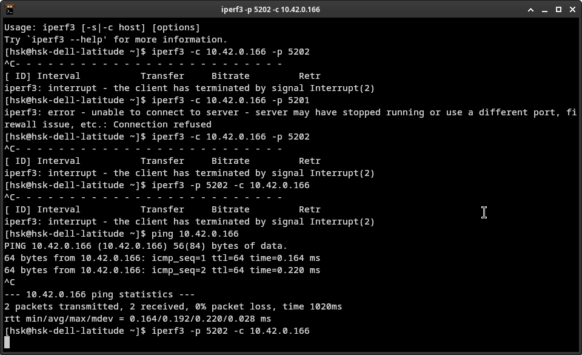
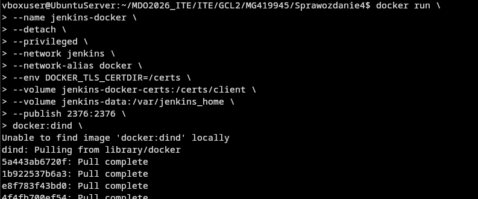
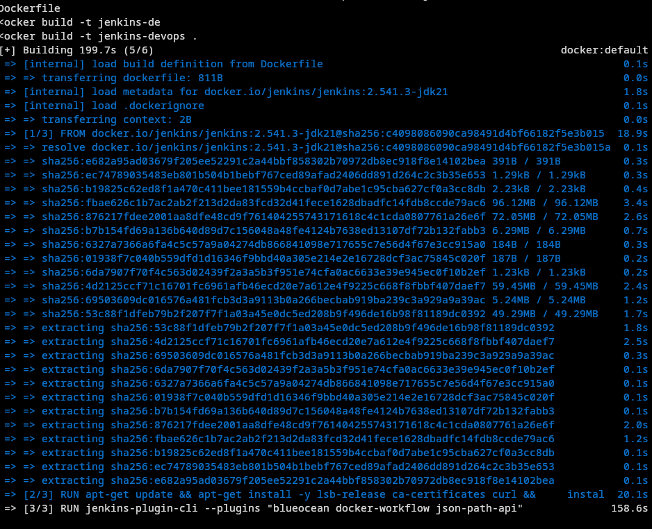
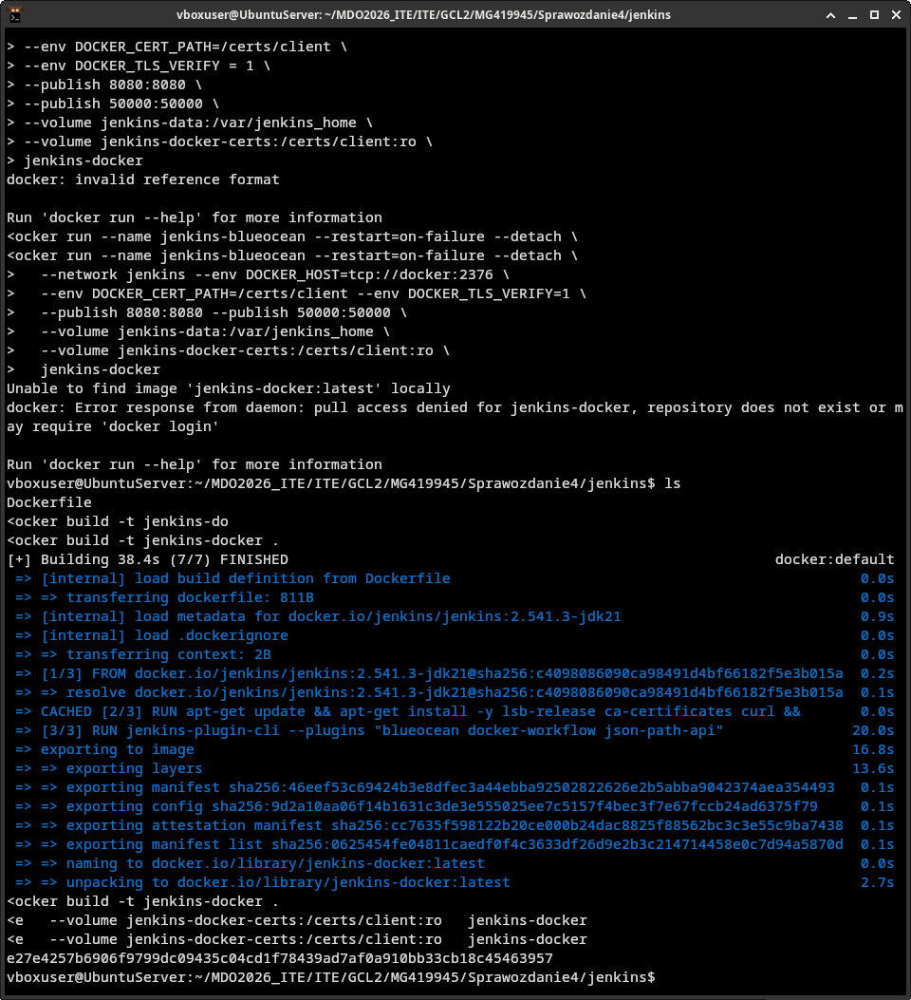
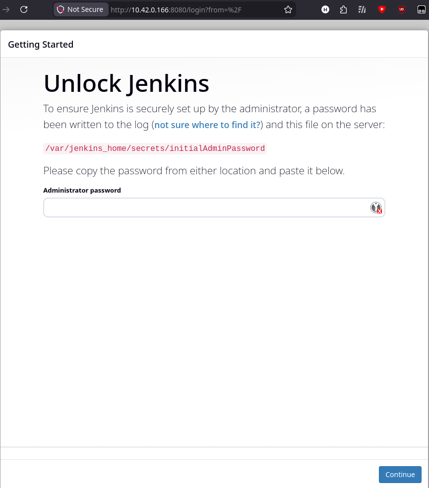

# Sprawozdanie 4 - Maciej Gładysiak MG419945
---
## 1. Wykorzystane środowisko
Korzystam z systemu Linux na laptopie, na którym w Virtualboxie mam Ubuntu Server. Polecenia wykonywane podczas ćwiczenia są zarówno przez SSH na serwerze.

# Zachowywanie stanu między kontenerami
Stworzyłem dwa wolumeny: `input-vol` oraz `output-vol`, które przechowują odpowiednio czysty kod źródłowy oraz kod źródłowy po kompilacji.



Aby repozytorium sklonować na wolumin wejściowy stworzyłem kontener pomocniczy z następującym Dockerfile:
```Dockerfile
FROM ubuntu:24.04

RUN apt-get -y update
RUN DEBIAN_FRONTEND=noninteractive TZ=Etc/UTC apt-get -y install tzdata
RUN apt-get install -y --no-install-recommends ca-certificates wget

WORKDIR /repo

CMD wget -O redis-8.0.0.tar.gz https://github.com/redis/redis/archive/refs/tags/8.0.0.tar.gz && tar xvf redis-8.0.0.tar.gz && rm redis-8.0.0.tar.gz
```
który pobiera kod na podpięty wolumin oraz rozpakowywuje pobrany `.tar.gz`. Wybrałem tą metodę ponieważ wydawała mi się zarówno najbardziej automatyczna jak i uniwersalna.


Musiałem zmienić dockerfile kontenera budującego w następujący sposób:
```Dockerfile
FROM ubuntu:24.04

RUN apt-get -y update
RUN DEBIAN_FRONTEND=noninteractive TZ=Etc/UTC apt-get -y install tzdata
RUN apt-get install -y --no-install-recommends ca-certificates wget dpkg-dev gcc g++ libc6-dev libssl-dev make tcl cmake python3 python3-pip python3-venv python3-dev unzip rsync clang automake autoconf libtool

WORKDIR /scripts
COPY buildscript.sh /scripts
RUN chmod +x buildscript.sh
WORKDIR /code
CMD cp /scripts/buildscript.sh /code && /code/buildscript.sh
```
Kontener teraz pobiera dependencies, jak poprzednio, natomiast nie klonuje sam kodu, tylko kopiuje go z podpiętego pod `/code` wolumina `input-vol` poprzez `buildscript.sh`:
```sh
#!/bin/bash

cp -rf /repo/redis-8.0.0/. /code
make -j "$(nproc)" all
cp -rf /code /output
```
Napisanie takiego prostego skryptu i kompilacja podczas pracy kontenera wydaje mi się jedynym sposobem, aby osiągnąć oczekiwany efekt.

Aby przyśpieszyć sobie pracę stworzyłem, pod proces budowy, `compose.yaml`:
```yaml
services:
    redis-build:
        build: build
        volumes:
            - input-vol:/repo
            - output-vol:/output

volumes:
    input-vol:
        external: true
    output-vol:
        external: true
```

Uruchomienie daje następujący efekt:

czyli kod jest budowany, a następnie zbudowany kod jest kopiowany na output.

Kroki są jak najbardziej wykonywalne przy pomocy `docker build` i pliku `Dockerfile` - docker compose jedynie to lekko ułatwia.

# Eksponowanie portu i łączność między kontenerami
Uruchomiłem dwa kontenery z ubuntu i interaktywnie zainstalowałem na nich i uruchomiłem na jednym z nich serwer iperf, następnie znalazłem adresy IP obu kontenerów


Zbadałem ruch pomiędzy kontenerem serwerem `first` i drugim kontenerem `second`:


Następnie stworzyłem network dockerowy i zrobiłem to samo, ale przez rozwiązywanie nazw:


oraz z hosta:


i próbowałem połączyć się spoza hosta, ale nie udało mi się to:


Największa przepustowość została osiągnięta pomiędzy kontenerami przez adres IP; na drugim miejscu jest komunikacja kontener <--> host, natomiast na trzecim komunikacja pomiędzy kontenerami wraz z rozwiązywaniem nazw - zakładam, że jest to skutkiem "overheadu" wynikającego z rozwiązywania nazw.

# Usługi w rozumieniu systemu, kontenera i klastra
Postawiłem kontener ubuntu i uruchomiłem na nim usługę SSHD.
Próbowałem połączyć się z kontenerem:
- Spoza hosta
- Z hosta
- Z samego siebie
aczkolwiek żadna opcja nie działała.

# Przygotowanie do uruchomienia serwera Jenkins
Uruchomiłem pomocnik DIND:


następnie zbudowałem następujący dockerfile (1:1 z dokumentacji):
```Dockerfile
FROM jenkins/jenkins:2.541.3-jdk21
USER root
RUN apt-get update && apt-get install -y lsb-release ca-certificates curl && \
    install -m 0755 -d /etc/apt/keyrings && \
    curl -fsSL https://download.docker.com/linux/debian/gpg -o /etc/apt/keyrings/docker.asc && \
    chmod a+r /etc/apt/keyrings/docker.asc && \
    echo "deb [arch=$(dpkg --print-architecture) signed-by=/etc/apt/keyrings/docker.asc] \
    https://download.docker.com/linux/debian $(. /etc/os-release && echo \"$VERSION_CODENAME\") stable" \
    | tee /etc/apt/sources.list.d/docker.list > /dev/null && \
    apt-get update && apt-get install -y docker-ce-cli && \
    apt-get clean && rm -rf /var/lib/apt/lists/*
USER jenkins
RUN jenkins-plugin-cli --plugins "blueocean docker-workflow json-path-api"
```

... i w tym momencie serwer ubuntu na mojej maszynie wirtualnej się zawiesił, skutkując *stratą historii poleceń do tego momentu*. 

Po ponownym uruchomieniu serwera zbudowałem kontener od nowa, i uruchomiłem go wraz z pomocnikiem DIND:





