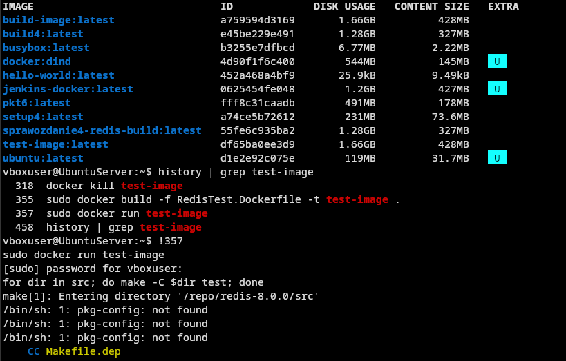
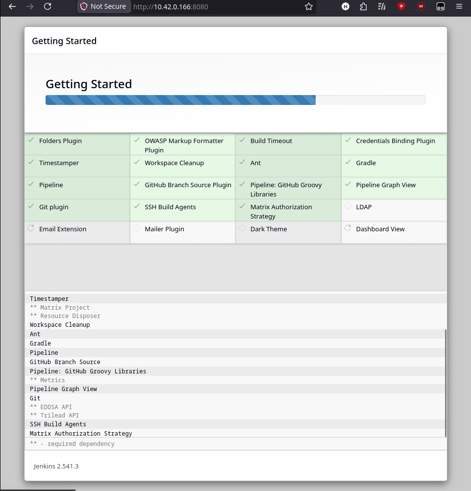
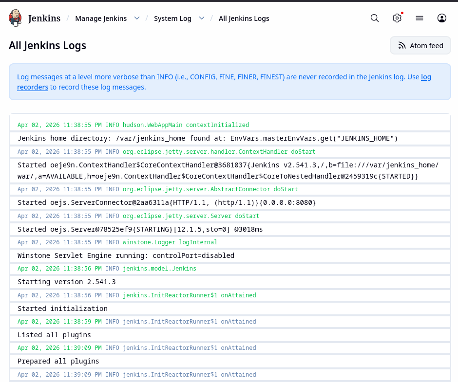
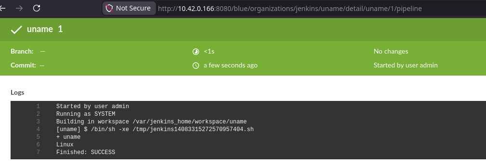
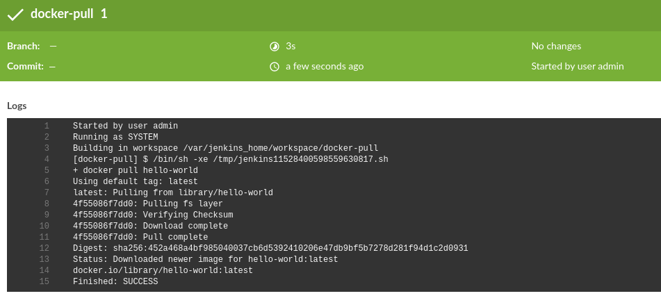
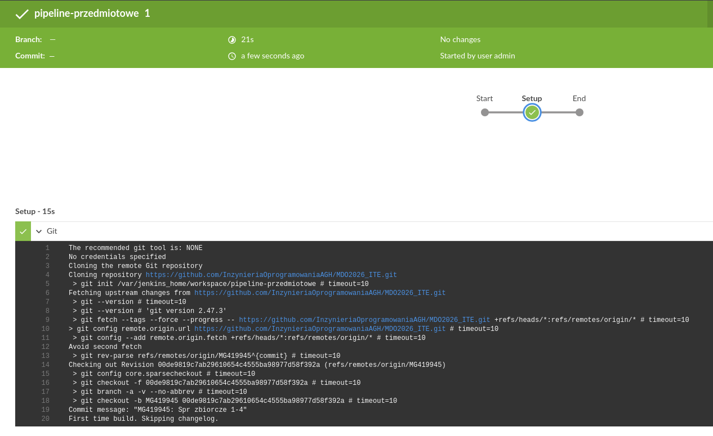

# Sprawozdanie 4 - Maciej Gładysiak MG419945
---
## 1. Wykorzystane środowisko
Korzystam z systemu Linux na laptopie, na którym w Virtualboxie mam Ubuntu Server. Polecenia wykonywane podczas ćwiczenia są przez SSH na serwerze, jak i przez Jenkins przy uruchomieniu projektu/pipeline'a.

## 2. Stworzenie instancji Jenkins
Na początku upewniłem się, że kontenery które stworzyłem na poprzednich zajęciach do budowania i testowania działają.

Obrazy obu kontenerów są obecne, a po uruchomieniu kontenera testowego ten zaczyna swoją pracę.
Następnie skonfigurowałem Jenkins uruchomiony już na poprzednich zajęciach - zalogowałem się, pobrałem pluginy.

Upewniłem się, że logi są zapisywane.


Blue Ocean to, z tego co rozumiem, nowy UI dla Jenkins który ma na celu łatwiejszą wizualizacje pipeline'ów.

## 3 Wstępne uruchomienie

Stworzyłem trzy projekty zgodnie z instrukcją:
1. Projekt, który wyświetla `uname`

Kod skryptu wywoływanego podczas budowy
```sh
uname
```

2. Projekt, który zwraca błąd dla nieparzystej godziny
Uruchomienie o godzinie 10-tej:

Uruchomienie podczas pisania sprawozdania, o godzinie 11-stej:

```sh
hour=$(date +%H)
hour=${hour#0}
[ $(($hour % 2)) -eq 1 ] && exit 1 || exit 0
```
3. Projekt, który pobiera obraz dockera (wybrałem `hello-world`)

```sh
docker pull hello-world
```

## 4 Obiekt typu Pipeline

Stworzyłem obiekt typu pipeline, a następnie - bezpośrednio w obiekcie - napisałem skrypt który klonuje repo przedmiotowe w jednym kroku, i go uruchomiłem. Następnie uzupełnilem skrypt w drugi krok - który buduje dockerfile `RedisBuild.Dockerfile` z mojej gałęzi z sprawozdania trzeciego.



```Groovy
def dockerfile = 'RedisBuild.Dockerfile'
node {
        stage('Setup') {
                git branch: 'MG419945', url: 'https://github.com/InzynieriaOprogramowaniaAGH/MDO2026_ITE.git'
        }
        stage('Build') {
                dir('ITE/GCL2/MG419945/Sprawozdanie3') {
                    docker.build("redis-build:${env.BUILD_ID}", "-f ${dockerfile} .")
                }
        }
}
```
