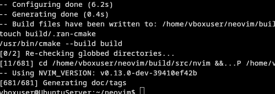
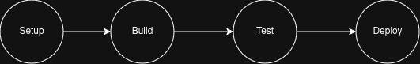
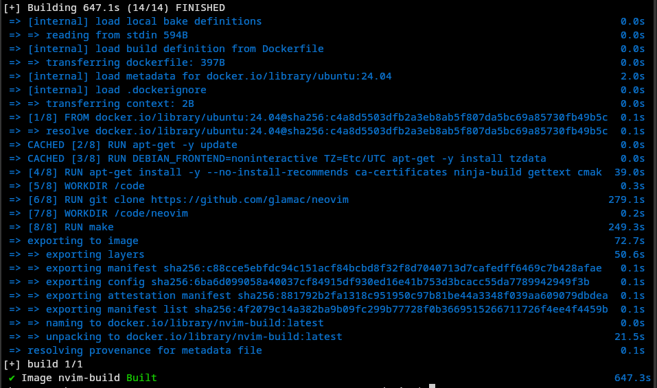

# Sprawozdanie 6 - Maciej Gładysiak MG419945
---
## 1. Wykorzystane środowisko
Korzystam z systemu Linux na laptopie, na którym w Virtualboxie mam Ubuntu Server. Polecenia wykonywane podczas ćwiczenia są przez SSH na serwerze, jak i przez Jenkins przy uruchomieniu projektu/pipeline'a.

## Pipeline: lista kontrolna
Scharakteryzuj plan na *pipeline* i przedstaw postęp prac. Czy mamy pomysł na każdy krok poniżej?

### Ścieżka krytyczna
Podstawowy zbiór czynności do wykonania w ramach zadania z pipelinem CI/CD. Ścieżką krytyczną jest:
- [ ] commit (lub tzw. *manual trigger* @ Jenkins)
- [ ] clone
- [ ] build
- [ ] test
- [ ] deploy
- [ ] publish

Poniższe czynności wykraczają ponad tę ścieżkę, ale zrealizowanie ich pozwala stworzyć pełny, udokumentowany, jednoznaczny i łatwy do utrzymania pipeline z niskim progiem wejścia dla nowych *maintainerów*.

### Pełna lista kontrolna
Zweryfikuj dotychczasową postać sprawozdania oraz planowane czynności względem ścieżki krytycznej oraz poniższej listy. Realizacja punktu wymaga opisania czynności,
wykazania skuteczności (np. zrzut ekranu), podania poleceń i uzasadnienia decyzji dot. implementacji.

- [x] Aplikacja została wybrana
Na potrzeby ostatnich zajęc wybrałem [https://github.com/redis/redis](redis), natomiast ze względu na dosyć długi czas kompilacji i testów postanowiłem zmienić wybór na [https://github.com/neovim/neovim](Neovim).
- [x] Licencja potwierdza możliwość swobodnego obrotu kodem na potrzeby zadania
Neovim jest dostępny pod licencją Apache-2.0.
- [x] Wybrany program buduje się

- [x] Przechodzą dołączone do niego testy
- [x] Zdecydowano, czy jest potrzebny fork własnej kopii repozytorium
Własny fork tutaj nie jest do końca konieczny, ale jest *bardzo* wygodny w pewnych aspektach, więc postanowiłem się [https://github.com/glamac/neovim](taki zrobić).
- [x] Stworzono diagram UML zawierający planowany pomysł na proces CI/CD

- [x] Wybrano kontener bazowy lub stworzono odpowiedni kontener wstepny (runtime dependencies)
`./build/Dockerfile`:
```Dockerfile
FROM ubuntu:24.04

RUN apt-get -y update
RUN DEBIAN_FRONTEND=noninteractive TZ=Etc/UTC apt-get -y install tzdata
RUN apt-get install -y --no-install-recommends ca-certificates ninja-build gettext cmake curl build-essential git

WORKDIR /code

RUN git clone https://github.com/glamac/neovim

WORKDIR /code/neovim

ENV CMAKE_BUILD_TYPE=RelWithDebInfo
RUN make

```
- [x] *Build* został wykonany wewnątrz kontenera

- [x] Testy zostały wykonane wewnątrz kontenera (kolejnego)

- [x] Kontener testowy jest oparty o kontener build
`./test/Dockerfile`:
```Dockerfile
FROM nvim-build

WORKDIR /code/neovim

CMD ["make", "unittest"]
```
- [ ] Logi z procesu są odkładane jako numerowany artefakt, niekoniecznie jawnie
- [x] Zdefiniowano kontener typu 'deploy' pełniący rolę kontenera, w którym zostanie uruchomiona aplikacja (niekoniecznie docelowo - może być tylko integracyjnie)
- [x] Uzasadniono czy kontener buildowy nadaje się do tej roli/opisano proces stworzenia nowego, specjalnie do tego przeznaczenia
`./deploy/Dockerfile`:
```Dockerfile
FROM nvim-build

WORKDIR /code/neovim/build

CMD ["./bin/nvim", "--version"]
```
- [x] Wersjonowany kontener 'deploy' ze zbudowaną aplikacją jest wdrażany na instancję Dockera

- [x] Następuje weryfikacja, że aplikacja pracuje poprawnie (*smoke test*) poprzez uruchomienie kontenera 'deploy'
- [x] Zdefiniowano, jaki element ma być publikowany jako artefakt
Jako artefakt będe publikował plik binarny `nvim`.
- [x] Uzasadniono wybór: kontener z programem, plik binarny, flatpak, archiwum tar.gz, pakiet RPM/DEB
Plik binarny jest najbardziej sensowną opcją z uwagi na charakterystyke programu - prosty w użyciu edytor tekstu.
- [x] Opisano proces wersjonowania artefaktu (można użyć *semantic versioning*)
do nazwy pliku dodaje się `-$BUILD_NUMBER`.
`sh 'cp ${WORKSPACE}/build/bin/nvim ${WORKSPACE}/nvim-${BUILD_NUMBER}'`
- [ ] Dostępność artefaktu: publikacja do Rejestru online, artefakt załączony jako rezultat builda w Jenkinsie
Punkt chwilowo niezrealizowany ze względu na awarię internetu w moim akademiku, która uniemożliwia budowę kontenera.
- [x] Przedstawiono sposób na zidentyfikowanie pochodzenia artefaktu
`archiveArtifacts artifacts: 'nvim-${BUILD_NUMBER}', fingerprint: true` powinno to umożliwić ze względu na fingerprinting; Jenkins oblicza checksum MD5 i zapisuje wynik w `$JENKINS_HOME/fingerprints`; porównanie umożliwiłoby poprawne zidentyfikowanie pochodzenia artefaktu
- [x] Pliki Dockerfile i Jenkinsfile dostępne w sprawozdaniu w kopiowalnej postaci oraz obok sprawozdania, jako osobne pliki
Jenkinsfile
```

def myDir='ITE/GCL2/MG419945/Sprawozdanie6'
node {
        // pobierz dockerfile z repo przedmiotowego
        stage('Setup') {
                git branch: 'MG419945', url: 'https://github.com/InzynieriaOprogramowaniaAGH/MDO2026_ITE.git'
        }
        // zbuduj kodzik, testuj kodzik
        stage('Build') {
                dir(myDir) {
                    def buildImage = docker.build(
                        "nvim-build", "./dockerfiles/build"
                        )
                }
        }
        stage('Test') {
                dir(myDir) {
                    def testImage = docker.build(
                        "nvim-test", "./dockerfiles/test"
                        )
                        // nie przechodzi jakieś 7 unit testóœ
                        // których nie mam pojęcia jak naprawić
                        // i nie działa ani w pipeline, ani poza
                    sh 'docker run nvim-test make unittest || true'
                }
        }
        stage('Deploy') {
            dir(myDir) {
                def deployImage = docker.build(
                    "nvim-deploy", "./dockerfiles/deploy")
                
                deployImage.inside {
                    sh '/tmp/test.sh'
                    sh 'cp ${WORKSPACE}/build/bin/nvim ${WORKSPACE}/nvim-${BUILD_NUMBER}'
                    archiveArtifacts artifacts: 'nvim-${BUILD_NUMBER}', fingerprint: true
                }
            }
        }
}
```
- [x] Zweryfikowano potencjalną rozbieżność między zaplanowanym UML a otrzymanym efektem
