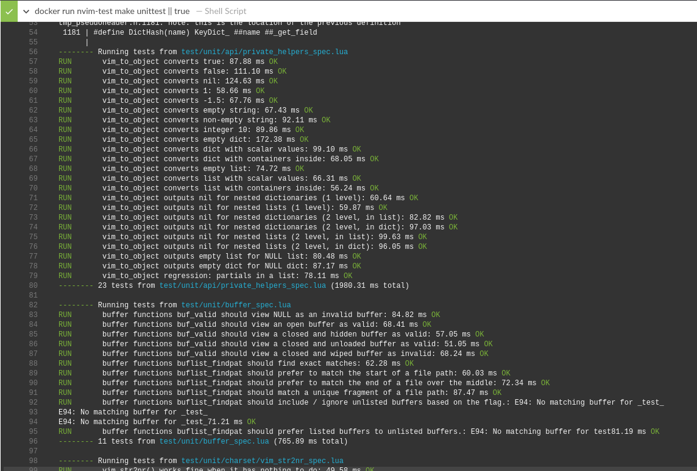
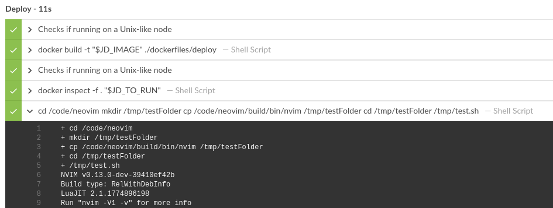

# Sprawozdanie 6 - Maciej Gładysiak MG419945
---
## 1. Wykorzystane środowisko
Korzystam z systemu Linux na laptopie, na którym w Virtualboxie mam Ubuntu Server. Polecenia wykonywane podczas ćwiczenia są przez SSH na serwerze, jak i przez Jenkins przy uruchomieniu projektu/pipeline'a.

### Kroki Jenkinsfile
Zweryfikuj, czy definicja pipeline'u obecna w repozytorium pokrywa ścieżkę krytyczną:

- [x] Przepis dostarczany z SCM, a nie wklejony w Jenkinsa lub sprawozdanie (co załatwia nam `clone` )

- [x] Posprzątaliśmy i wiemy, że odbyło się to skutecznie - mamy pewność, że pracujemy na najnowszym (a nie *cache'owanym* kodzie)

Aby być na 100% pewnym dodałem `--no-cache` do obrazu buildera; kod będzie kompilowany za każdym razem.
- [x] Etap `Build` dysponuje repozytorium i plikami `Dockerfile`
- [x] Etap `Build` tworzy obraz buildowy, np. `BLDR`
- [x] Etap `Build` (krok w tym etapie) lub oddzielny etap (o innej nazwie), przygotowuje artefakt - **jeżeli docelowy kontener ma być odmienny**, tj. nie wywodzimy `Deploy` z obrazu `BLDR`
Etap `Build` kompiluje program. Artefaktem jest plik binarny programu, który jest dalej testowany oraz dodawany do historii builda (w kroku Publish).
- [x] Etap `Test` przeprowadza testy

- [x] Etap `Deploy` przygotowuje **obraz lub artefakt** pod wdrożenie. W przypadku aplikacji pracującej jako kontener, powinien to być obraz z odpowiednim entrypointem. W przypadku buildu tworzącego artefakt niekoniecznie pracujący jako kontener (np. interaktywna aplikacja desktopowa), należy przesłać i uruchomić artefakt w środowisku docelowym.
- [x] Etap `Deploy` przeprowadza wdrożenie (start kontenera docelowego lub uruchomienie aplikacji na przeznaczonym do tego celu kontenerze sandboxowym)
Etap `Deploy` kopiuje plik binarny w inne miejsce, niż folder z output-em builda, a następnie przeprowadza smoke testy (w tym uruchomienie aplikacji)

- [x] Etap `Publish` wysyła obraz docelowy do Rejestru i/lub dodaje artefakt do historii builda

- [x] Ponowne uruchomienie naszego *pipeline'u* powinno zapewniać, że pracujemy na najnowszym (a nie *cache'owanym*) kodzie. Innymi słowy, *pipeline* musi zadziałać więcej niż jeden raz 😎

