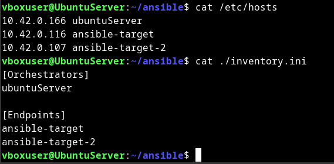
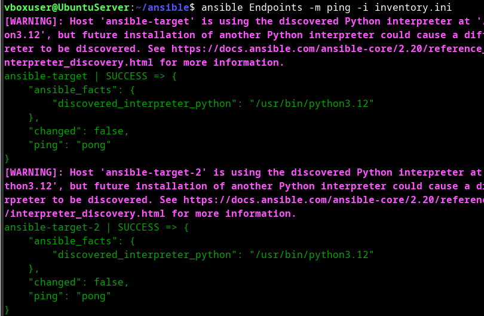
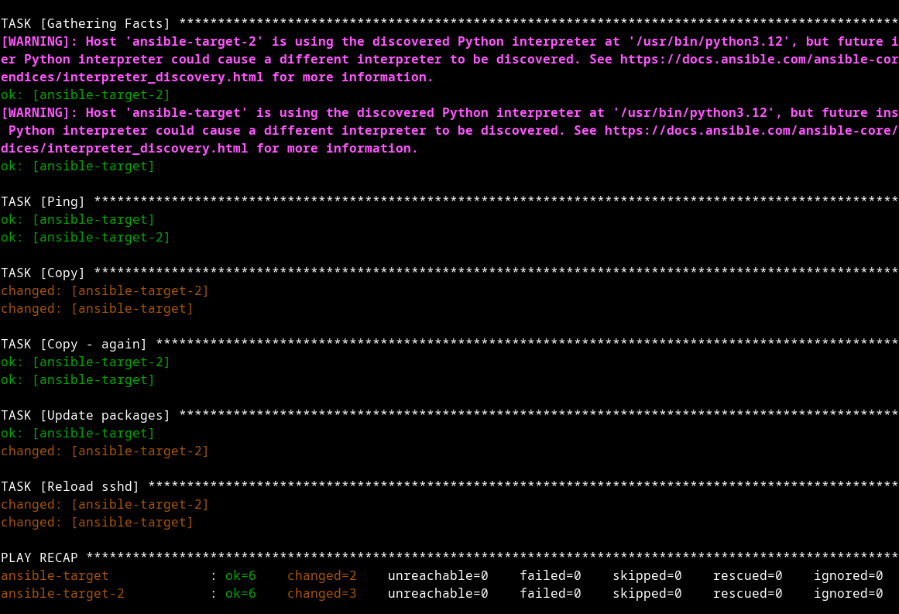
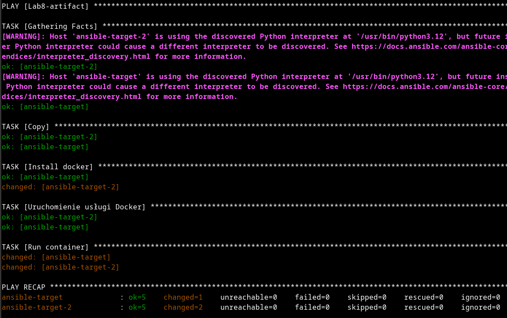

# Sprawozdanie 7 - Maciej Gładysiak MG419945
---
## 1. Wykorzystane środowisko
Korzystam z systemu Linux na laptopie, na którym w Virtualboxie mam Ubuntu Server. Polecenia wykonywane podczas ćwiczenia są przez SSH na serwerze Ubuntu Server, oraz na `ansible-target`/`ansible-target-2` przy użyciu ansible

## 2. Instalacja zarządcy Ansible

Postępując zgodnie z krokami z końca instrukcji 7 / początku instrukcji 8 stworzyłem maszynę `ansible-target`, zrobiłem migawkę, zklonowałem ją (`ansible-target-2`), pobrałem na Ubuntu Server ansible i wymieniłem klucze ssh

## 3. Inwentaryzacja

Użyłem `/etc/hosts`.

Stworzyłem plik inwentaryzacji
```
[Orchestrators]
ubuntuServer

[Endpoints]
ansible-target-2
ansible-target
```

i zrobiłem ping-a.

Łączność SSH jest możliwa i nie wymaga hasła.

## 4. Playbook

Stworzyłem playbook-a który wykonuje wszytkie polecenia z tego punktu, z jedną uwagą - na mojej maszynie serwis `rngd` nie istnieje, więc go nie restartuje.
```yaml
- name: Lab8
  hosts: Endpoints
  become_method: sudo
  become_user: root
  tasks:
    - name: Ping
      ansible.builtin.ping:

    - name: Copy
      ansible.builtin.copy:
        src: /home/vboxuser/ansible/inventory.ini
        dest: /home/ansible/inventory.ini
        force: true

    - name: Copy - again
      ansible.builtin.copy:
        src: /home/vboxuser/ansible/inventory.ini
        dest: /home/ansible/inventory.ini

    - name: Update packages
      ansible.builtin.apt:
        update_cache: yes
        upgrade: safe
      become: yes

    - name: Reload sshd
      ansible.builtin.systemd_service:
        name: sshd
        state: restarted
      become: yes

    # nie mam serwisu rngd
    # - name: Reload rngd
    #   ansible.builtin.systemd_service:
    #     name: rngd
    #     state: restarted
    #   become: yes
```
`ansible-playbook -i inventory.ini playbook8.yaml --become-pass-file ~/ansible/become.pass`

Co ciekawe ansible "nie krzyczy" na mnie za kopiowanie pliku który już istnieje.

## 5. Playbook i artefakt
Stworzyłem playbooka który kopiuje artefakt (plik wykonywalny `nvim-99` z jednych z ostatnich labów), uruchamia kontener (`ubuntu:latest` - nie tworzyłem nowego dockerfile) z dostępnym plikiem wykonywalnym i go uruchamia z opcją `-v`.

```yaml
- name: Lab8-artifact
  hosts: Endpoints
  become_method: sudo
  become_user: root
  tasks:

    - name: Copy
      ansible.builtin.copy:
        src: /home/vboxuser/ansible/nvim-99
        dest: /home/ansible/nvim-99
        mode: '0755'  # Make sure it's executable

    - name: Install docker
      ansible.builtin.apt:
        update_cache: yes
        name: docker.io
      become: yes

    - name: Uruchomienie usługi Docker
      ansible.builtin.systemd:
        name: docker
        state: started
        enabled: yes

    - name: Run container
      community.docker.docker_container:
        name: please-neovim-work
        image: ubuntu:latest
        working_dir: "/artifact"
        volumes:
          - "/home/ansible:/artifact"
        command: sh -c "chmod +x ./nvim-99 && ./nvim-99 -v"
        state: started
        detach: no
        cleanup: yes
      become: yes
```
`ansible-playbook -i inventory.ini playbook8.2.yaml --become-pass-file ~/ansible/become.pass`


Utworzyłem role, uzupełniłem `meta/main.yml`.
```yaml
#SPDX-License-Identifier: MIT-0
galaxy_info:
  author: mg
  description: lab8
  company: your company (optional)
# ...
```
