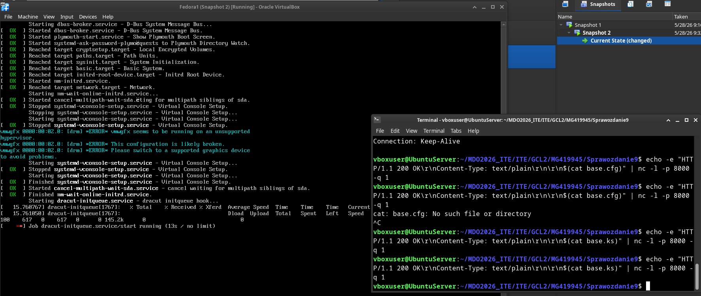
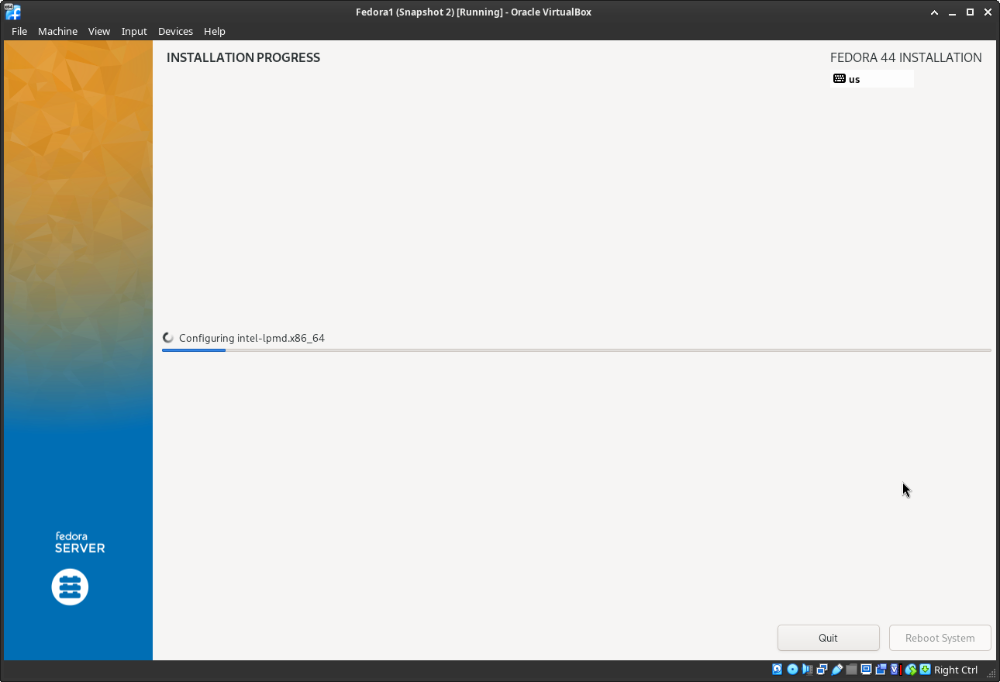
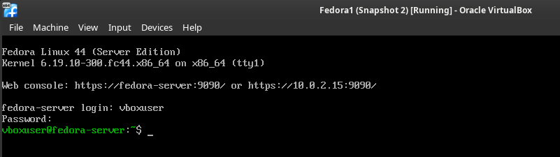
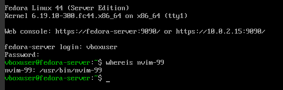
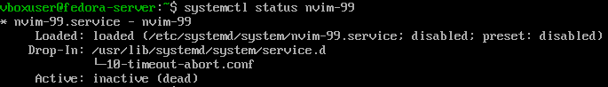
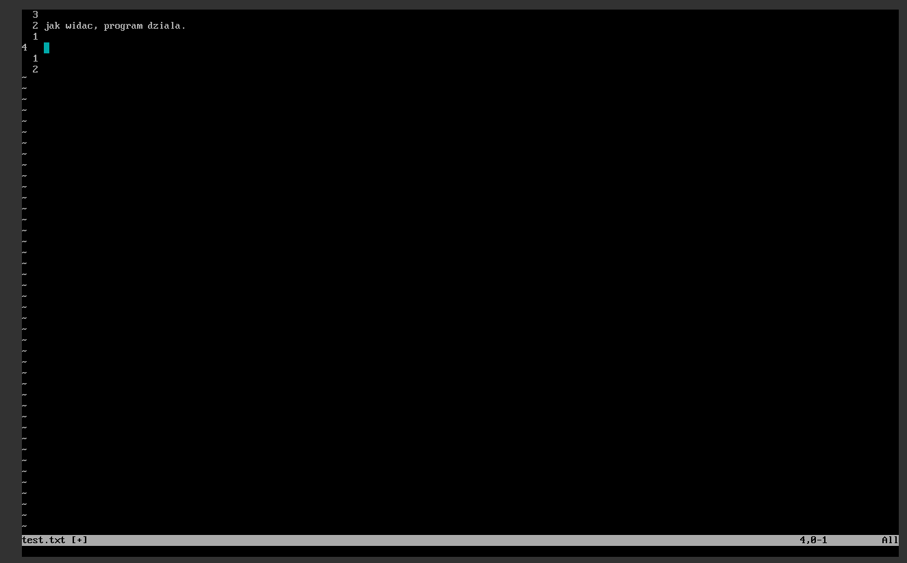

# Sprawozdanie 8 - Maciej Gładysiak MG419945
---
## 1. Wykorzystane środowisko
Korzystam z systemu Linux na laptopie, na którym w Virtualboxie mam Ubuntu Server. Polecenia wykonywane podczas ćwiczenia są przez SSH na serwerze Ubuntu Server (np. ustawienie serwera http aby fedora miała z czego pobierać pliki), jak i na maszynie oddzielnej wirtualnej systemu Fedora.

## 2. Instalacja Fedory, podstawowa konfiguracja pliku odpowiedzi

Zainstalowałem wariant Server ze strony Fedory, postawiłem i pobrałem plik `/root/anaconda-ks.cfg`, na podstawie którego napisałem konfiguracje `base.ks` która konfiguruje niezbędne do działania systemu rzeczy oraz pobiera podstawowe pakiety.

```ks
# Generated by Anaconda 44.30
# Keyboard layouts
keyboard --vckeymap=us --xlayouts='us'
# System language
lang en_GB.UTF-8

network --bootproto=dhcp --device=link --activate
network --hostname=fedora-server


rootpw --plaintext 1234
user --groups=wheel --name=vboxuser --plaintext --password=1234

zerombr
clearpart --all --initlabel
autopart

url --mirrorlist=https://mirrors.fedoraproject.org/mirrorlist?repo=fedora-44&arch=x86_64
repo --name=updates --mirrorlist=https://mirrors.fedoraproject.org/mirrorlist?repo=updates-released-f44&arch=x86_64

reboot

# System timezone
timezone Europe/Warsaw --utc

%packages
@^server-product-environment
dnf-plugins-core
curl

%end
```
Konfiguracja ta, między innymi, zawsze formatuje całość dysku oraz ustawia hostname na `fedora-server`.

Konfiguracje odpalam poprzez dodanie parametru `inst.ks=http://10.42.0.166:8000/base.ks`. Podczas uruchomienia pobierany jest plik `base.ks`:

który jest następnie automatycznie używany do instalacji:



## 3. Rozszerzenie pliku odpowiedzi o pobranie aplikacji stworzonej w pipeline oraz uruchomienie.
Rozszerzyłem plik następująco:
```
# Generated by Anaconda 44.30
# Keyboard layouts
keyboard --vckeymap=us --xlayouts='us'
# System language
lang en_GB.UTF-8

network --bootproto=dhcp --device=link --activate
network --hostname=fedora-server


rootpw --plaintext 1234
user --groups=wheel --name=vboxuser --plaintext --password=1234

zerombr
clearpart --all --initlabel
autopart

url --mirrorlist=https://mirrors.fedoraproject.org/mirrorlist?repo=fedora-44&arch=x86_64
repo --name=updates --mirrorlist=https://mirrors.fedoraproject.org/mirrorlist?repo=updates-released-f44&arch=x86_64

reboot

# System timezone
timezone Europe/Warsaw --utc

%packages
@^server-product-environment
dnf-plugins-core
curl

%end


%post --log=/root/kickstart-post.log

wget -O /bin/nvim-99 http://10.42.0.166:8000/nvim-99

chmod +x /bin/nvim-99

cat > /etc/systemd/system/nvim-99.service << EOF
[Unit]
Description=nvim-99
After=network.target

[Service]
Type=simple
ExecStart=/bin/nvim-99
Restart=on-failure
User=vboxuser

[Install]
WantedBy=multi-user.target
EOF

systemctl enable nvim99.service

%end
```

Działanie po instalacji jest następujące:
 1. Pobierany jest plik `nvim-99` - tworzony w pipeline na poprzednich laboratoriach - z serwera http (`http://10.42.0.166:8000/nvim-99`) do folderu `/bin`, aby można było go uruchomić.
 2. Plik jest ustawiany na plik wykonywalny
 3. Tworze serwis systemd aby automatycznie uruchomić oprogramowanie po uruchomieniu systemu
  - Uruchomienie oprogramowania automatycznie po uruchomieniu systemu nie ma sensu w tym przypadku biorąc pod uwagę jego charakterystyke jako edytor tekstu, jednak jest wymagane przez konspekt.




