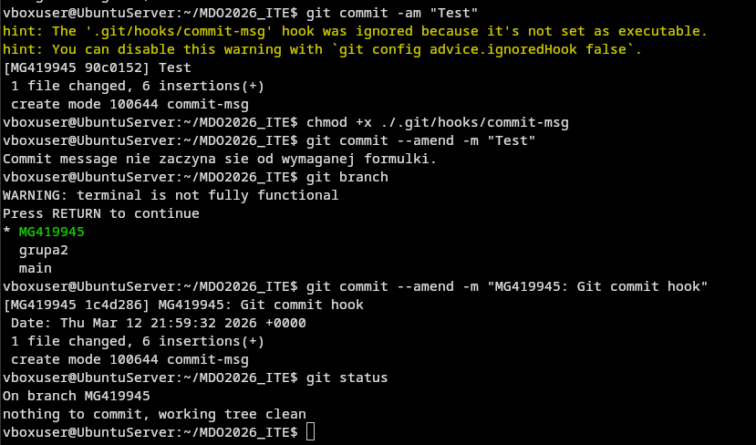
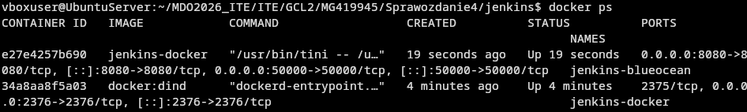

# Sprawozdanie Zbiorcze - Maciej Gładysiak MG419945
---
## Wykorzystane środowisko
Korzystam z systemu Linux na laptopie, na którym w Virtualboxie mam Ubuntu Server. Polecenia wykonywane podczas ćwiczenia są zarówno przez SSH na serwerze, jak i w kontenerach Dockera.

## Lab1 - Maszyna wirtualna, SSH, Git, FTP, git hook
Setup maszyny wirtualnej; instalacja git'a i SSH na serwerze Ubuntu; połączenie z maszyną wirtualną przez SSH; tworzenie i wykorzystanie kluczy SSH; konfiguracja serwera FTP i transfer plików; git hook
### Czynności wykonane podczas laboratorium
+ Konfiguracja maszyny wirtualnej UbuntuServer w programie VirtualBox
+ Klonowanie repo przy użyciu PAT
+ Stworzono klucze SSH na maszynie wirtualnej
   * `ssh-keygen -C devops_password -t ed25519`
+ Klonowanie repo przy użyciu protokołu SSH
   * `git clone git@github.com:InzynieriaOprogramowaniaAGH/MDO2026_ITE.git`
+ Transfer plików protokołem FTP przy użyciu programu `FileZilla`
+ Połączenie z maszyną wirtualną przez SSH edytorem kodu `Zed`
+ Stworzenie własnego branch'a
+ Stworzenie git hook'a
+ Pull request na branch grupy
### Kod git hook'a
```bash
#!/bin/bash

if [[ ! $(cat $1) =~ ^"MG419945" ]]; then
	echo "Commit message nie zaczyna sie od wymaganej formulki."
	exit 1
fi
```


## Lab2 - Docker, dockerhub, kontenery, dockerfile
Instalacja Dockera; Rejestracja w Dockerhub; zapoznanie się z wybranymi obrazami dockera; interaktywne połączenie z kontenerem; pisanie i budowa dockerfile;
### Czynności wykonane podczas laboratorium
+ Instalacja Dockera
+ Rejestracja w Dockerhub
+ Zapoznanie się z wybranymi obrazami
    * obraz `hello-world`
    * obraz `busybox`
    * obraz `ubuntu`
+ Uruchomienie ww. kontenerów, inspekcja kodu wyjścia
+ Uruchomienie `busybox` i `ubuntu`, podłączenie się pod nie
    * `sudo docker run --name "pkt4" -d -i -t busybox /bin/sh`
    * `docker exec -it pkt4 sh`
    * (ubuntu - analogicznie)
+ Napisanie własnego dockerfile
+ Budowa własnego dockerfile, uruchomienie zbudowanego kontenera
+ Sprawdzenie uruchomionych kontenerów i czyszczenie obrazów
### Dockerfile
```dockerfile
FROM ubuntu:24.04

RUN apt-get -y update && apt-get install -y --no-install-recommends git ca-certificates 

WORKDIR /repo

RUN git clone https://github.com/InzynieriaOprogramowaniaAGH/MDO2026_ITE.git

CMD ["/bin/bash"]
```
### Budowa dockerfile


## Lab3 - Budowa kodu w kontenerze i testowanie w kontenerze
Wybór oprogramowania do kompilacji i testowania; interaktywny build w kontenerze; testy w kontenerze; dockerfile do budowy i testowania oprogramowania
### Czynności wykonane podczas laboratorium
+ Wybrano open-source software do kompilacji z testami automatycznymi na potrzeby zadania
    * [Redis](https://github.com/redis/redis)
+ Kompilacja i testy programu poza kontenerem
+ Kompilacja i testy programu w kontenerze interaktywnie
+ Napisanie Dockerfile odpowiedzialnego za kompilacje programu
+ Napisanie Dockerfile odpowiedzialnego za test programu, bazując na ww. Dockerfile odpowiedzialnym za kompilacje programu
+ Budowa ww. plików Dockerfile
+ Uruchomienie kontenera z testami

### Pliki Dockerfile

Obraz z buildem; `RedisBuild.Dockerfile`:
```Dockerfile
FROM ubuntu:24.04

RUN apt-get -y update
RUN DEBIAN_FRONTEND=noninteractive TZ=Etc/UTC apt-get -y install tzdata
RUN apt-get install -y --no-install-recommends ca-certificates wget dpkg-dev gcc g++ libc6-dev libssl-dev make tcl git cmake python3 python3-pip python3-venv python3-dev unzip rsync clang automake autoconf libtool

WORKDIR /repo
RUN wget -O redis-8.0.0.tar.gz https://github.com/redis/redis/archive/refs/tags/8.0.0.tar.gz
RUN tar xvf redis-8.0.0.tar.gz && rm redis-8.0.0.tar.gz

WORKDIR /repo/redis-8.0.0

RUN make -j "$(nproc)" all
```

Obraz z testami; `RedisTest.Dockerfile`
```Dockerfile
FROM build-image

WORKDIR /repo/redis-8.0.0

CMD ["make", "test"]
```
### Budowa plików Dockerfile


## Lab4 - Jenkins
Woluminy; tworzenie sieci w dockerze (`network create`); Jenkins

### Czynności wykonane podczas laboratorium
+ Stworzenie dwóch wolumenów `input-vol` i `output-vol`
    * `docker volume create input-vol`
    * `docker volume create output-vol`
+ Napisanie pliku Dockerfile kontenera który służy do sklonowania repozytorium na wolumin wejściowy
+ Napisanie pliku Dockerfile kontenera który służy do budowania kodu z woluminu wejściowego na wolumin wyjściowy
    * Z uwagi na specyfike podłączania woluminów do kontenera wymagało to napisanie skryptu pomocniczego `buildscript.sh`.
+ Napisanie pliku `compose.yaml` który pozwala przyśpieszyć pracę z ww. kontenerami
+ Stworzenie dwóch kontenerów `first` oraz `second` oraz pobranie na obu oprogramowania `iperf3`
+ Uruchomienie serwera iperf na jednym z kontenerów
+ Stworzenie sieci dockerowej na potrzeby testów łączności między kontenerami
    * `docker network create -d bridge netbridge`
+ Analiza przepustowości łączności między kontenerami w różnych konfiguracjach
    * Między kontenerami, przez adres IP (największa przepustowość)
    * Między kontenerami, z rozwiązywaniem nazw (najmniejsza, jednakże nadal znaczna, przepustowość)
    * Komunikacja kontener <--> host
+ Uruchomienie kontenera - pomocnika DIND
+ Skopiowanie z dokumentacji Jenkins pliku Dockerfile
+ Budowa skopiowanego pliku Dockerfile, uruchomienie kontenera Jenkins
### Pliki Dockerfile, `buildscript.sh`, `compose.yaml`

#### Dockerfile służący do pobrania kodu:
```Dockerfile
FROM ubuntu:24.04

RUN apt-get -y update
RUN DEBIAN_FRONTEND=noninteractive TZ=Etc/UTC apt-get -y install tzdata
RUN apt-get install -y --no-install-recommends ca-certificates wget

WORKDIR /repo

CMD wget -O redis-8.0.0.tar.gz https://github.com/redis/redis/archive/refs/tags/8.0.0.tar.gz && tar xvf redis-8.0.0.tar.gz && rm redis-8.0.0.tar.gz
```

#### Dockerfile do budowania, `buildscript.sh`

```Dockerfile
FROM ubuntu:24.04

RUN apt-get -y update
RUN DEBIAN_FRONTEND=noninteractive TZ=Etc/UTC apt-get -y install tzdata
RUN apt-get install -y --no-install-recommends ca-certificates wget dpkg-dev gcc g++ libc6-dev libssl-dev make tcl cmake python3 python3-pip python3-venv python3-dev unzip rsync clang automake autoconf libtool

WORKDIR /scripts
COPY buildscript.sh /scripts
RUN chmod +x buildscript.sh
WORKDIR /code
CMD cp /scripts/buildscript.sh /code && /code/buildscript.sh
```
buildscript.sh:
```sh
#!/bin/bash

cp -rf /repo/redis-8.0.0/. /code
make -j "$(nproc)" all
cp -rf /code /output
```
#### `compose.yaml`
```yaml
services:
    redis-build:
        build: build
        volumes:
            - input-vol:/repo
            - output-vol:/output

volumes:
    input-vol:
        external: true
    output-vol:
        external: true
```

### Jenkins
#### Dockerfile skopiowany z dokumentacji
```Dockerfile
FROM jenkins/jenkins:2.541.3-jdk21
USER root
RUN apt-get update && apt-get install -y lsb-release ca-certificates curl && \
    install -m 0755 -d /etc/apt/keyrings && \
    curl -fsSL https://download.docker.com/linux/debian/gpg -o /etc/apt/keyrings/docker.asc && \
    chmod a+r /etc/apt/keyrings/docker.asc && \
    echo "deb [arch=$(dpkg --print-architecture) signed-by=/etc/apt/keyrings/docker.asc] \
    https://download.docker.com/linux/debian $(. /etc/os-release && echo \"$VERSION_CODENAME\") stable" \
    | tee /etc/apt/sources.list.d/docker.list > /dev/null && \
    apt-get update && apt-get install -y docker-ce-cli && \
    apt-get clean && rm -rf /var/lib/apt/lists/*
USER jenkins
RUN jenkins-plugin-cli --plugins "blueocean docker-workflow json-path-api"
```
#### Uruchomienie kontenera, jenkins wizard



