# Sprawozdanie Zbiorcze - Maciej Gładysiak MG419945

## Wykorzystane środowisko
Korzystam z systemu Linux na laptopie, na którym w Virtualboxie mam Ubuntu Server. Polecenia wykonywane podczas ćwiczeń są przez SSH na serwerze, jak i przez Jenkins przy uruchomieniu projektu/pipeline'ów.

---

## Lab5 - Jenkins: podstawy, projekty, pipeline
Konfiguracja Jenkinsa, tworzenie projektów, pipeline w Jenkins.

### Czynności wykonane podczas laboratorium
- Uruchomienie i konfiguracja Jenkinsa (logowanie, instalacja pluginów, w tym Blue Ocean)
- Stworzenie trzech projektów:
  1. Wyświetlanie `uname`
  2. Zwracanie błędu dla nieparzystej godziny
  3. Pobieranie obrazu Dockera (wybrałem `hello-world`)
- Stworzenie obiektu typu Pipeline
- Napisanie skryptu do pipeline klonującego repozytorium przedmiotowe i budującego kontener z plikiem `RedisBuild.Dockerfile`
- Uruchomienie pipeline’a i weryfikacja działania

### Kod projektów
#### uname
```sh
uname
```

#### godzina nieparzysta
```sh
hour=$(date +%H)
hour=${hour#0}
[ $(($hour % 2)) -eq 1 ] && exit 1 || exit 0
```

#### docker pull
```sh
docker pull hello-world
```

### Jenkinsfile
```groovy
def dockerfile = 'RedisBuild.Dockerfile'
node {
        stage('Setup') {
                git branch: 'MG419945', url: 'https://github.com/InzynieriaOprogramowaniaAGH/MDO2026_ITE.git'
        }
        stage('Build') {
                dir('ITE/GCL2/MG419945/Sprawozdanie3') {
                    docker.build("redis-build:${env.BUILD_ID}", "-f ${dockerfile} .")
                }
        }
}
```

### Screeny


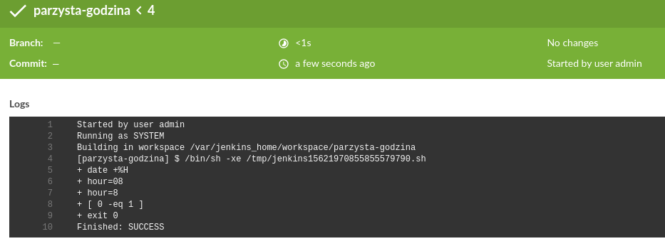
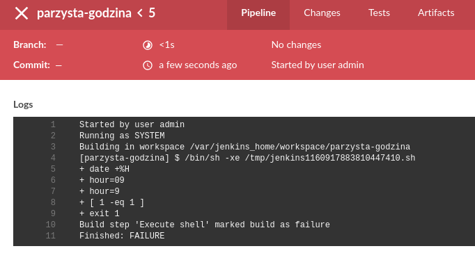

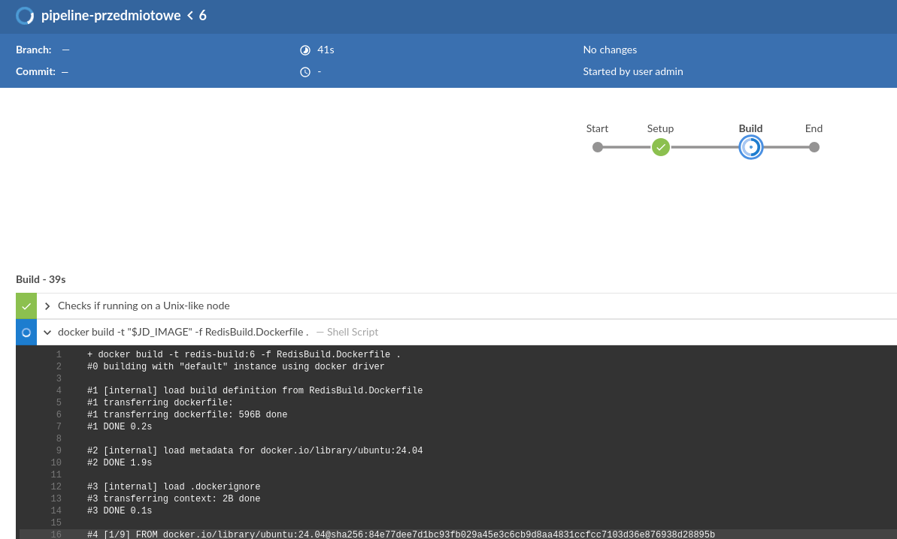
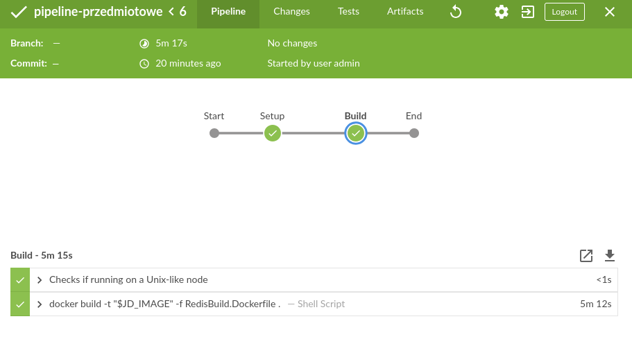

---

## Lab6 - Pipeline: budowa, testy, deploy
Praca z pipeline; rozbudowa o setup, build, testy, deploy.

### Czynności wykonane podczas laboratorium
- Wybór aplikacji: [Neovim](https://github.com/neovim/neovim) (licencja Apache-2.0)
- Stworzenie [forka](https://github.com/glamac/neovim) dla wygody
- Weryfikacja, że program się buduje
- Stworzenie diagramu UML procesu CI/CD
- Przygotowanie kontenera bazowego (build) i testowego
- Uruchomienie builda i testów wewnątrz kontenerów
- Stworzenie kontenera deploy z smoke testem
- Wdrożenie kontenera deploy i weryfikacja działania
- Zdefiniowanie artefaktu (plik binarny `nvim` z numerem builda)
- Zapisanie artefaktu jako rezultat build'a w Jenkinsie
- Fingerprinting artefaktu w Jenkins
- Dostarczenie plików `Dockerfile` i `Jenkinsfile` w sprawozdaniu

### Pliki Dockerfile

#### `build/Dockerfile`
```Dockerfile
FROM ubuntu:24.04

RUN apt-get -y update
RUN DEBIAN_FRONTEND=noninteractive TZ=Etc/UTC apt-get -y install tzdata
RUN apt-get install -y --no-install-recommends ca-certificates ninja-build gettext cmake curl build-essential git

RUN useradd -ms /bin/bash jenkins

WORKDIR /code
RUN chown -R jenkins:jenkins /code
RUN chmod 755 /code
USER jenkins
RUN git clone https://github.com/glamac/neovim

WORKDIR /code/neovim

ENV CMAKE_BUILD_TYPE=RelWithDebInfo
RUN make
```

#### `test/Dockerfile`
```Dockerfile
FROM nvim-build

WORKDIR /code/neovim
USER jenkins

CMD ["make", "functionaltest"]
```

#### `deploy/Dockerfile`
```Dockerfile
FROM nvim-build

WORKDIR /code/neovim/

RUN echo '#!/bin/bash\n\
if [ ! -f ./build/bin/nvim ]; then\n\
    exit 1\n\
fi\n\
./build/bin/nvim --version\n\
    ' >> /tmp/test.sh
RUN chmod +x /tmp/test.sh
CMD ["/tmp/test.sh"]
```

### Jenkinsfile
```groovy
def myDir='ITE/GCL2/MG419945/Sprawozdanie6'
node {
        // pobierz dockerfile z repo przedmiotowego
        stage('Setup') {
                git branch: 'MG419945', url: 'https://github.com/InzynieriaOprogramowaniaAGH/MDO2026_ITE.git'
        }
        // zbuduj kodzik, testuj kodzik
        stage('Build') {
                dir(myDir) {
                    def buildImage = docker.build(
                        "nvim-build", "./dockerfiles/build"
                        )
                }
        }
        stage('Test') {
                dir(myDir) {
                    def testImage = docker.build(
                        "nvim-test", "./dockerfiles/test"
                        )
                        // nie przechodzi jakieś 7 unit testóœ
                        // których nie mam pojęcia jak naprawić
                        // i nie działa ani w pipeline, ani poza
                    // sh 'docker run nvim-test make unittest || true'
                }
        }
        stage('Deploy') {
            dir(myDir) {
                def deployImage = docker.build(
                    "nvim-deploy", "./dockerfiles/deploy")

                deployImage.inside('-u root') {
                sh '''
                    cd /code/neovim
                    /tmp/test.sh
                    cp /code/neovim/build/bin/nvim ${WORKSPACE}/ITE/GCL2/MG419945/Sprawozdanie6/nvim-${BUILD_NUMBER}
                '''
                archiveArtifacts artifacts: 'nvim-*', fingerprinting: true
                }
            }
        }
}
```

### Screeny


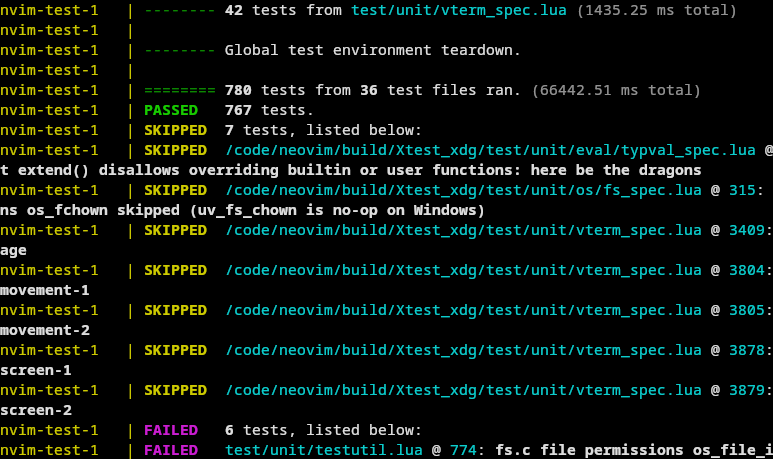
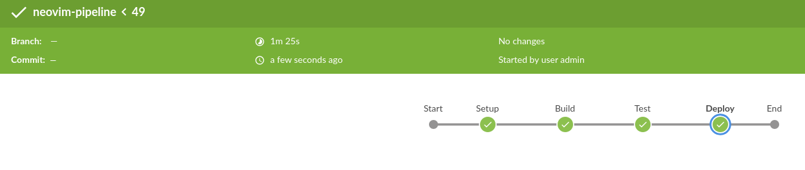
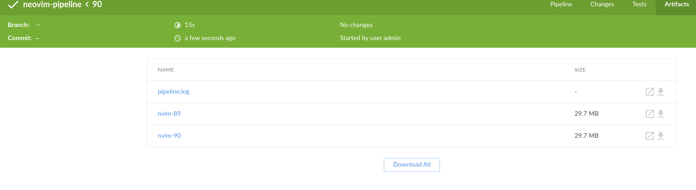

---

## Lab7 - Pipeline ciąg dalszy; 
Dopracowanie pipeline’u, pobieranie definicji z repozytorium, zapewnienie czystości builda, finalna weryfikacja.

### Czynności wykonane podczas laboratorium
- Przepis pipeline’u przeniesiony do repozytorium (SCM), nie wklejany w Jenkinsa
- Dodanie `--no-cache` do obrazu buildera, aby kod był kompilowany za każdym razem
- Weryfikacja, że etap `Build` dysponuje odpowiednimi zasobami, tworzy obraz buildowy.
- Weryfikacja działania etapu `Test` (przeprowadza testy)
- Weryfikacja działania etapu `Deploy` (kopiuje output build'a w odpowiednie miejsce; przeprowadza smoke test-y)
- Uruchomienie pipeline’u wielokrotnie, potwierdzenie działania

### Screeny
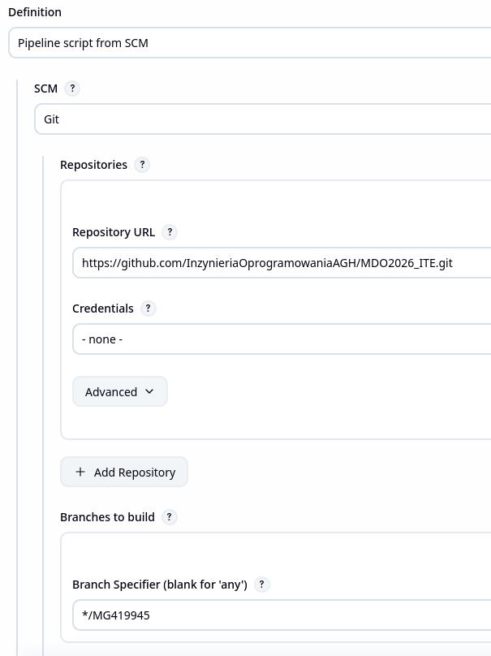
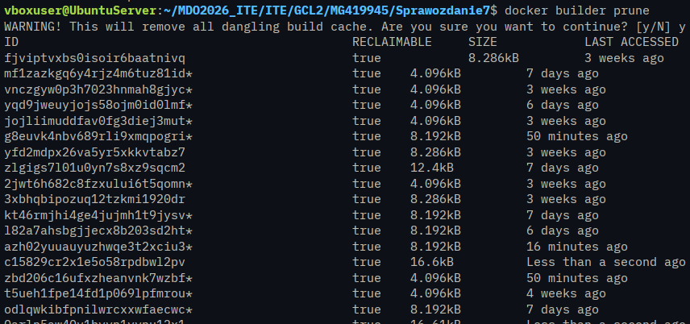


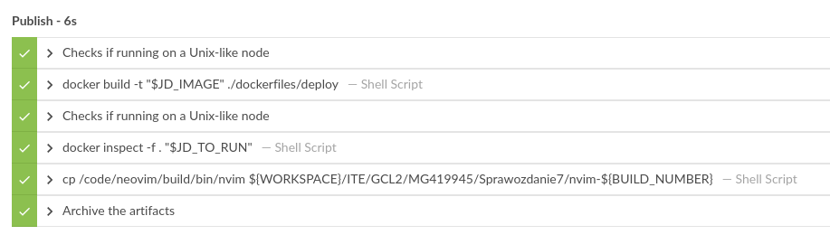
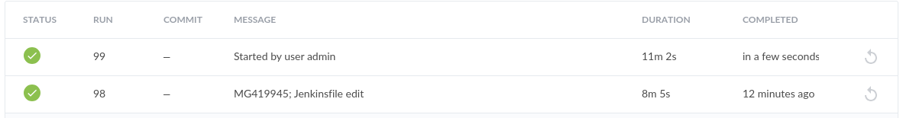
