# Sprawozdanie Zbiorcze - Maciej Gładysiak MG419945

## Wykorzystane środowisko
Korzystam z systemu Linux na laptopie, na którym w Virtualboxie mam Ubuntu Server. Polecenia wykonywane podczas ćwiczeń są przez SSH na serwerze Ubuntu Server, na maszynach wirtualnych (ansible-target, Fedora Server) oraz w środowisku Azure Cloud Shell.

---

## Lab8 - Ansible: inwentaryzacja, playbooki
Konfiguracja Ansible, tworzenie inwentaryzacji, pisanie playbooków oraz tworzenie ról.

### Czynności wykonane podczas laboratorium
- Instalacja Ansible na serwerze Ubuntu
- Wymiana kluczy SSH pomiędzy maszynami (serwer ubuntu, ansible-target oraz ansible-target-2)
- Stworzenie pliku inwentaryzacji 
  - Użycie `/etc/hosts` aby nie wpisywać IP, tylko hostname
- Weryfikacja połączenia za pomocą `ansible -m ping`
- Stworzenie playbooka wykonującego:
  - Ping do hostów endpoints
  - Kopiowanie pliku (dwukrotnie - pierwszy raz z `force: true`, drugi raz bez)
  - Aktualizacja pakietów przez `apt`
  - Restart usługi `sshd`
- Stworzenie drugiego playbooka do uruchomienia artefaktu:
  - Kopiowanie pliku wykonywalnego `nvim-99`
  - Instalacja Dockera
  - Uruchomienie kontenera z zamontowanym wolumenem
- Utworzenie roli Ansible z uzupełnionym `meta/main.yml`

### Pliki konfiguracyjne

#### `inventory.ini`
```
[Orchestrators]
ubuntuServer

[Endpoints]
ansible-target-2
ansible-target
```

#### `playbook8.yaml`
```yaml
- name: Lab8
  hosts: Endpoints
  become_method: sudo
  become_user: root
  tasks:
    - name: Ping
      ansible.builtin.ping:

    - name: Copy
      ansible.builtin.copy:
        src: /home/vboxuser/ansible/inventory.ini
        dest: /home/ansible/inventory.ini
        force: true

    - name: Copy - again
      ansible.builtin.copy:
        src: /home/vboxuser/ansible/inventory.ini
        dest: /home/ansible/inventory.ini

    - name: Update packages
      ansible.builtin.apt:
        update_cache: yes
        upgrade: safe
      become: yes

    - name: Reload sshd
      ansible.builtin.systemd_service:
        name: sshd
        state: restarted
      become: yes

    # nie mam serwisu rngd
    # - name: Reload rngd
    #   ansible.builtin.systemd_service:
    #     name: rngd
    #     state: restarted
    #   become: yes
```

#### `playbook8.2.yaml` (artefakt)
```yaml
- name: Lab8-artifact
  hosts: Endpoints
  become_method: sudo
  become_user: root
  tasks:

    - name: Copy
      ansible.builtin.copy:
        src: /home/vboxuser/ansible/nvim-99
        dest: /home/ansible/nvim-99
        mode: '0755'  # Make sure it's executable

    - name: Install docker
      ansible.builtin.apt:
        update_cache: yes
        name: docker.io
      become: yes

    - name: Uruchomienie usługi Docker
      ansible.builtin.systemd:
        name: docker
        state: started
        enabled: yes

    - name: Run container
      community.docker.docker_container:
        name: please-neovim-work
        image: ubuntu:latest
        working_dir: "/artifact"
        volumes:
          - "/home/ansible:/artifact"
        command: sh -c "chmod +x ./nvim-99 && ./nvim-99 -v"
        state: started
        detach: no
        cleanup: yes
      become: yes
```

#### `roles/lab8/meta/main.yml`
```yaml
#SPDX-License-Identifier: MIT-0
galaxy_info:
  author: mg
  description: lab8
  company: your company (optional)
# ...
```


### Screeny
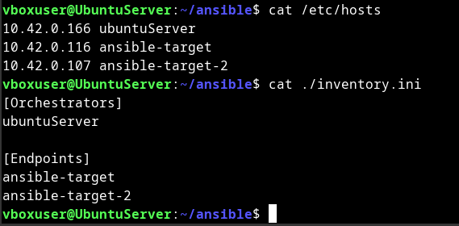
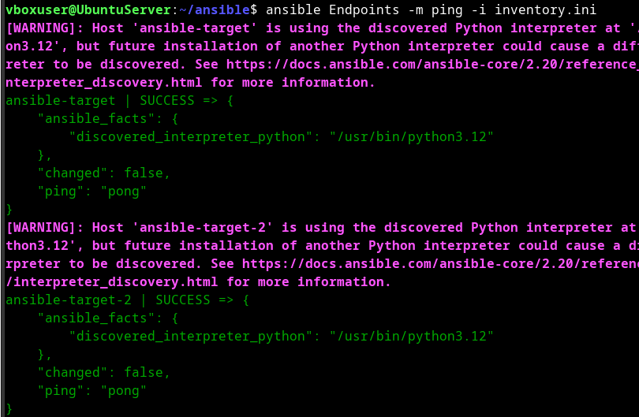
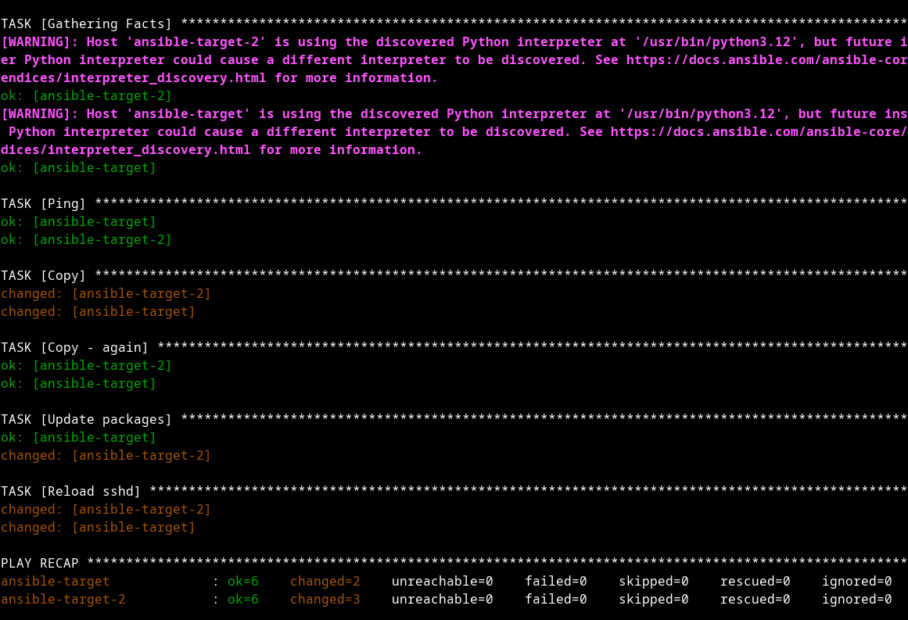
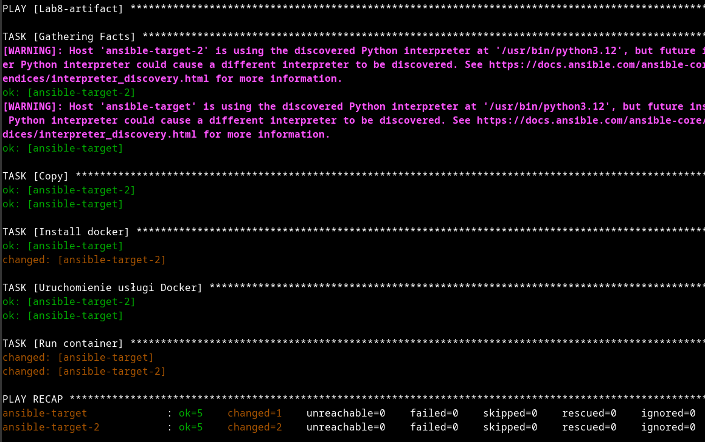

---

## Lab9 - Wdrożenie nienadzorowane: automatyzacja instalacji Fedory
Przygotowanie pliku do automatycznej instalacji Fedora Server z pobraną aplikacją.

### Czynności wykonane podczas laboratorium
- Instalacja Fedora Server w VirtualBox
- Pobranie pliku `/root/anaconda-ks.cfg` z zainstalowanego systemu
- Stworzenie własnego pliku `base.ks` z podstawową konfiguracją
- Uruchomienie serwera HTTP do hostowania plików aby udostępnić stworzony wcześniej plik `base.ks` 
- Rozszerzenie pliku o pobranie i uruchomienie aplikacji `nvim-99`
- Stworzenie serwisu systemd do automatycznego uruchamiania aplikacji po starcie systemu

### Pliki konfiguracyjne

#### `base.ks` (podstawowy)
```ks
# Generated by Anaconda 44.30
# Keyboard layouts
keyboard --vckeymap=us --xlayouts='us'
# System language
lang en_GB.UTF-8

network --bootproto=dhcp --device=link --activate
network --hostname=fedora-server


rootpw --plaintext 1234
user --groups=wheel --name=vboxuser --plaintext --password=1234

zerombr
clearpart --all --initlabel
autopart

url --mirrorlist=https://mirrors.fedoraproject.org/mirrorlist?repo=fedora-44&arch=x86_64
repo --name=updates --mirrorlist=https://mirrors.fedoraproject.org/mirrorlist?repo=updates-released-f44&arch=x86_64

reboot

# System timezone
timezone Europe/Warsaw --utc

%packages
@^server-product-environment
dnf-plugins-core
curl

%end
```

#### `part2.ks` (`base.ks` rozszerzony o pobranie aplikacji i serwis systemd)
```
# Generated by Anaconda 44.30
# Keyboard layouts
keyboard --vckeymap=us --xlayouts='us'
# System language
lang en_GB.UTF-8

network --bootproto=dhcp --device=link --activate
network --hostname=fedora-server


rootpw --plaintext 1234
user --groups=wheel --name=vboxuser --plaintext --password=1234

zerombr
clearpart --all --initlabel
autopart

url --mirrorlist=https://mirrors.fedoraproject.org/mirrorlist?repo=fedora-44&arch=x86_64
repo --name=updates --mirrorlist=https://mirrors.fedoraproject.org/mirrorlist?repo=updates-released-f44&arch=x86_64

reboot

# System timezone
timezone Europe/Warsaw --utc

%packages
@^server-product-environment
dnf-plugins-core
curl

%end


%post --log=/root/kickstart-post.log

wget -O /bin/nvim-99 http://10.42.0.166:8000/nvim-99

chmod +x /bin/nvim-99

cat > /etc/systemd/system/nvim-99.service << EOF
[Unit]
Description=nvim-99
After=network.target

[Service]
Type=simple
ExecStart=/bin/nvim-99
Restart=on-failure
User=vboxuser

[Install]
WantedBy=multi-user.target
EOF

systemctl enable nvim99.service

%end
```

### Screeny
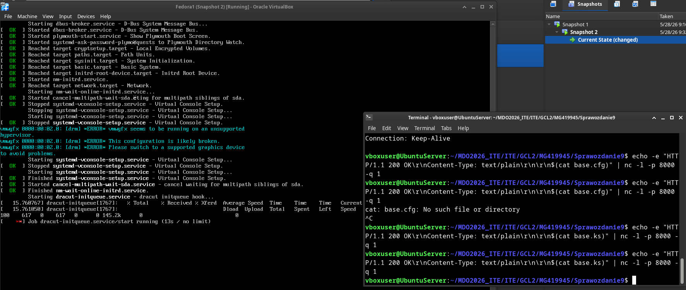
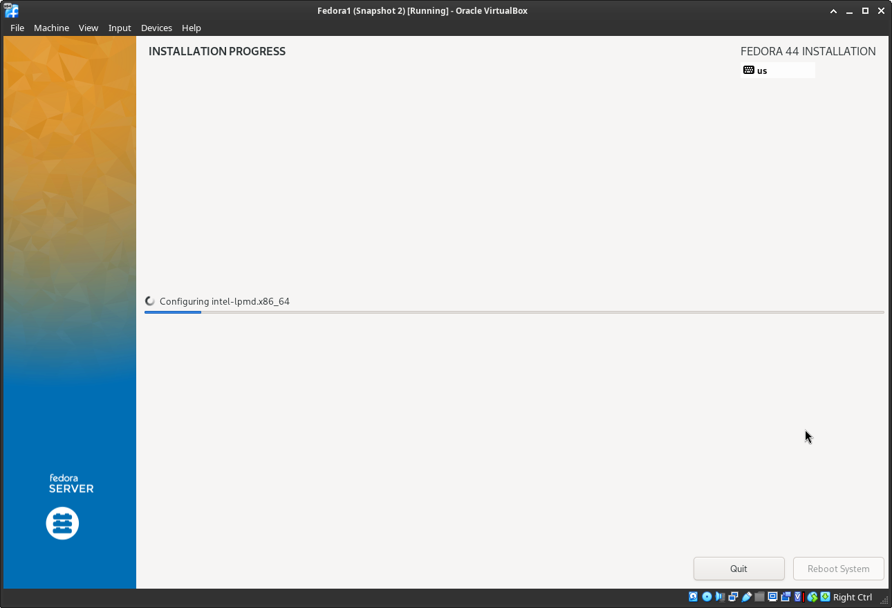
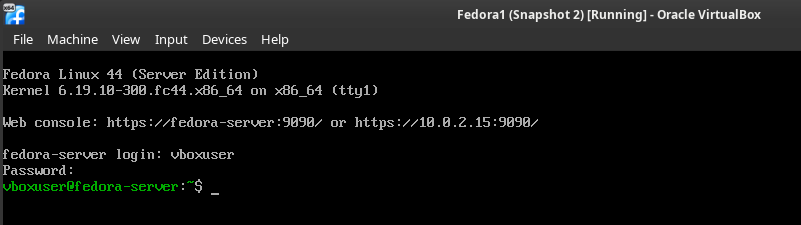
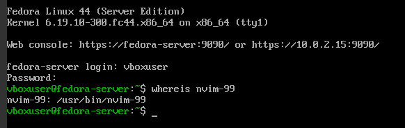
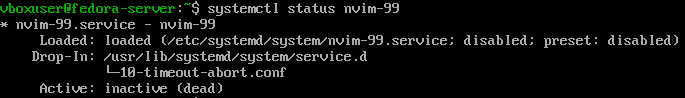
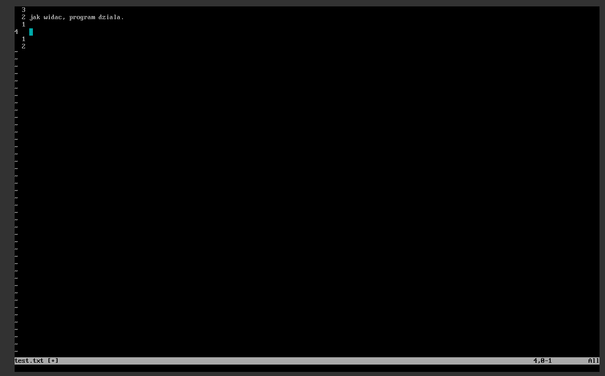

---

## Lab10 - Kubernetes: instalacja, wdrożenie, serwisy
Instalacja Kubernetes, uruchamianie, tworzenie wdrożeń i serwisów.

### Czynności wykonane podczas laboratorium
- Instalacja minikube na Fedorze
- Stworzenie własnego obrazu Nginx z przykładową stroną
- Zbudowanie kontenera i uruchomienie jako Pod
- Uruchomienie dashboardu
- Weryfikacja działania poprzez `curl`
- Stworzenie pliku wdrożenia (Deployment) z 4 replikami
- Stworzenie pliku serwisu (Service) pod plik wdrożenia
- Aplikacja (`kubectl apply`) wdrożenia, serwisu
- Przekierowanie portów 

### Pliki konfiguracyjne

#### `nginx.conf`
```conf
server {
	listen 8080;
	server_name localhost;

	root /usr/share/nginx/html;
	index index.html;
}
```

#### `stronka.html`
```html
<head><title>Stronka!</title></head>
<body><h1>aaaaaaaaaaaaaaaa</h1><br><h2>bbbbb</h2><br><p>devopsy</p></body>
```

#### `Dockerfile`
```dockerfile
FROM nginx:latest
RUN rm -rf /usr/share/nginx/html/*
COPY nginx.conf /etc/nginx/conf.d/default.conf
COPY stronka.html /usr/share/nginx/html/index.html
CMD ["nginx", "-g", "daemon off;"]
```

#### `deployment.yaml`
```yaml
apiVersion: apps/v1
kind: Deployment
metadata:
  name: nginx-deployment
  labels:
    app: nginx
spec:
  replicas: 4
  selector:
    matchLabels:
      app: nginx
  template:
    metadata:
      labels:
        app: nginx
    spec:
      containers:
      - name: nginx
        image: nginx:1.14.2
        ports:
        - containerPort: 80
```

#### `service.yaml`
```yaml
apiVersion: v1
kind: Service
metadata:
  name: devops-serwis
spec:
  selector:
    app: nginx
  ports:
    - protocol: TCP
      port: 8080
      targetPort: 8080
  type: NodePort
```

### Screeny
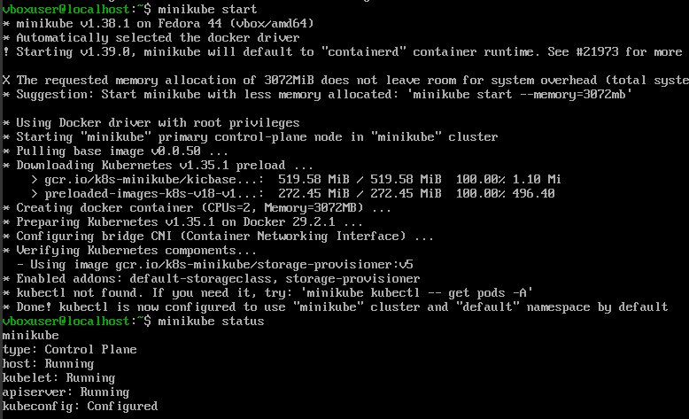
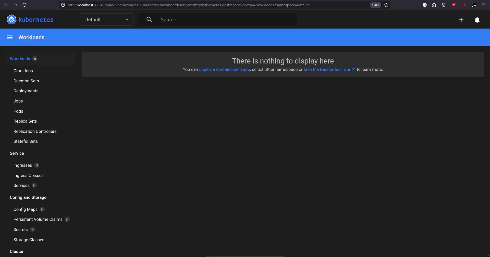
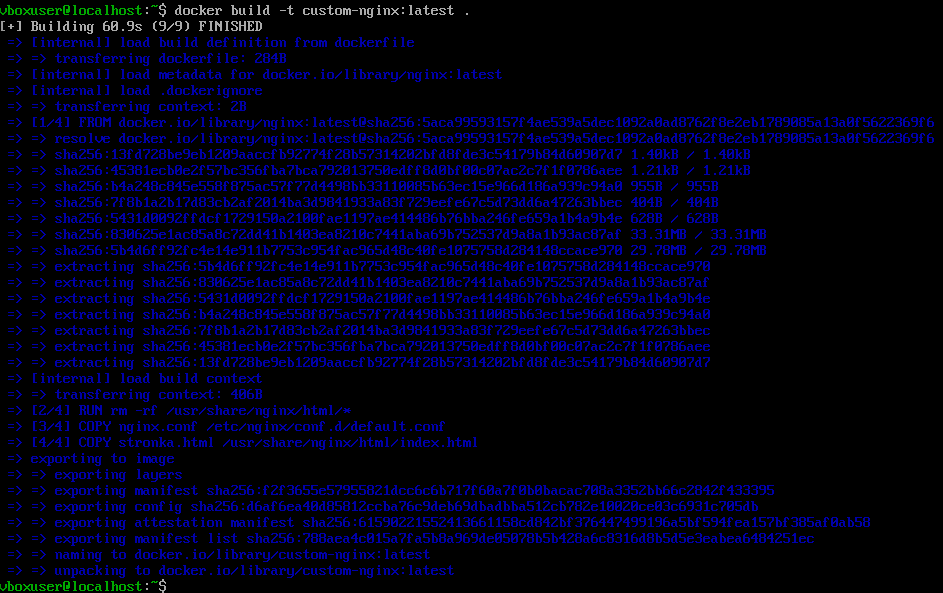
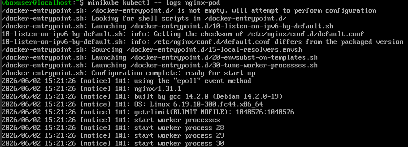
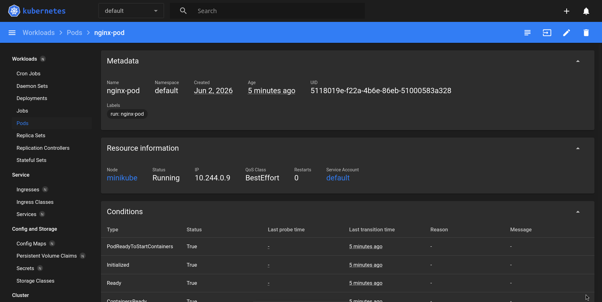
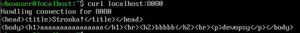
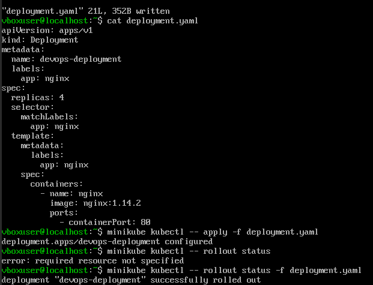
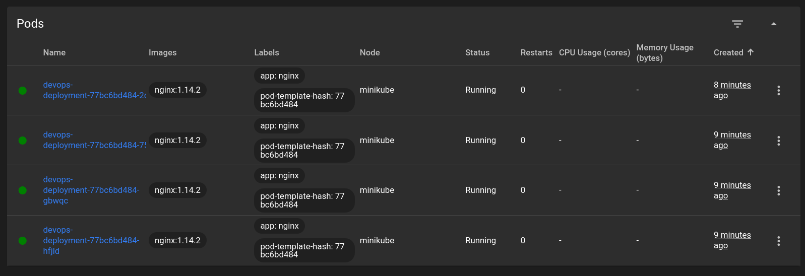
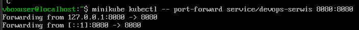

---

## Lab11 - Kubernetes: zarządzanie wdrożeniami, strategie
Zarządzanie wdrożeniami w Kubernetes, strategie wdrożeniowe.

### Czynności wykonane podczas laboratorium
- Przygotowanie 3 wersji obrazu HTTPD (v1, v2, v3 - wadliwy)
- Modyfikacja liczby replik (8 -> 1 -> 0 -> 4) wdrożenia z lab10
- Aktualizacja wdrożenia do nowej wersji 
- Aktualizacja do wersji wadliwej, zaobserwowanie błędów w dashboardzie
- Przywracanie wersji za pomocą `rollout history` i `rollout undo`
- Utworzenie skryptu weryfikującego wdrożenia `verify.sh`
- Zastosowanie trzech strategii wdrożeniowych:
  1. **Recreate** - wszystkie repliki niszczone, tworzone nowe
  2. **RollingUpdate** - stopniowa wymiana replik
  3. **Canary** - jedna replika nowej wersji obok stabilnych

### Pliki konfiguracyjne

#### Dockerfile obrazów na podstawie httpd v1 oraz v2
```dockerfile
FROM httpd:alpine
COPY ./index.html /usr/local/apache2/htdocs
```

#### Dockerfile obrazu na podstawiehttpd v3
```dockerfile
FROM httpd:alpine
COPY ./index.html /usr/local/apache2/htdocs
RUN rm /usr/local/apache2/conf/httpd.conf
```

#### Pliki `index.html` wersji v1, v2 oraz v3

```index.html
<head><title>devops</title></head>
<body><h1>Wersja 1</h1></body>
```

```index.html
<head><title>devops</title></head>
<body><h1>Wersja 2</h1></body>
```

```index.html
<head><>devops</title
<body><h1>Wersja 3
```

#### `verify.sh`
```bash
#!/bin/bash

if minikube kubectl -- rollout status deployment app-deployment --timeout=60s; then
    echo "OK - t <= 60s"
    exit 0
else
    echo "Błąd - t > 60s"
    exit 1
fi
```

#### `depl-recreate.yaml`
```yaml
apiVersion: apps/v1
kind: Deployment
metadata:
  name: app-recreate
spec:
  replicas: 4
  strategy:
      type: Recreate
  selector:
    matchLabels:
      app: app
  template:
    metadata:
      labels:
        app: app
    spec:
      containers:
      - name: app-container
        image: app:v1
        ports:
        - containerPort: 80
```

#### `depl-rolling.yaml`
```yaml
apiVersion: apps/v1
kind: Deployment
metadata:
  name: app-rolling
spec:
  replicas: 4
  strategy:
      type: RollingUpdate
      rollingUpdate:
        maxSurge: 2
        maxUnavailable: 2
  selector:
    matchLabels:
      app: app
  template:
    metadata:
      labels:
        app: app
    spec:
      containers:
      - name: app-container
        image: app:v1
        ports:
        - containerPort: 80
```

#### `depl-canary.yaml`
```yaml
apiVersion: apps/v1
kind: Deployment
metadata:
  name: app-canary
spec:
  replicas: 1
  selector:
    matchLabels:
      app: app-canary-test
      track: canary
  template:
    metadata:
      labels:
        app: app-canary-test
        track: canary
    spec:
      containers:
      - name: app-container
        image: app:v2
        ports:
        - containerPort: 80
```

#### `depl-stable.yaml`
```yaml
apiVersion: apps/v1
kind: Deployment
metadata:
  name: app-stable
spec:
  replicas: 3
  selector:
    matchLabels:
      app: app-canary-test
      track: stable
  template:
    metadata:
      labels:
        app: app-canary-test
        track: stable
    spec:
      containers:
      - name: app-container
        image: app:v1
        ports:
        - containerPort: 80
```

#### `service-canary.yaml`
```yaml
apiVersion: v1
kind: Service
metadata:
  name: app-canary-service
spec:
  type: NodePort
  selector:
    app: app-canary-test
  ports:
    - protocol: TCP
      port: 80
      targetPort: 80
      nodePort: 30002
```

### Screeny
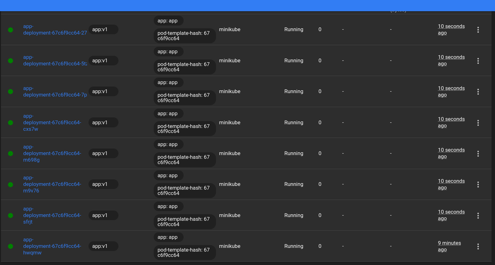
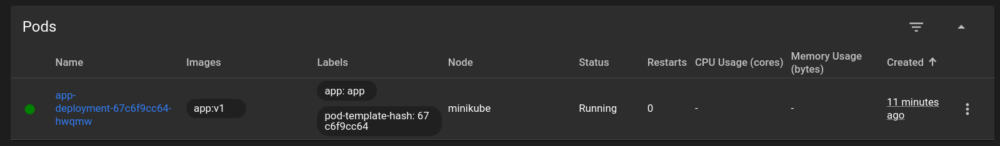
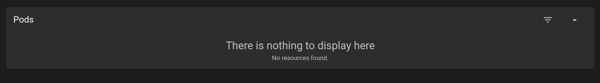
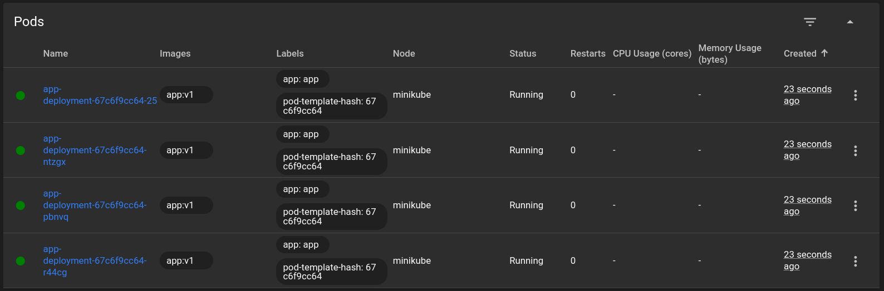
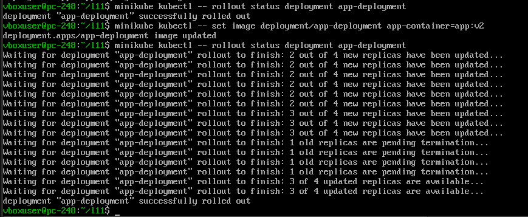
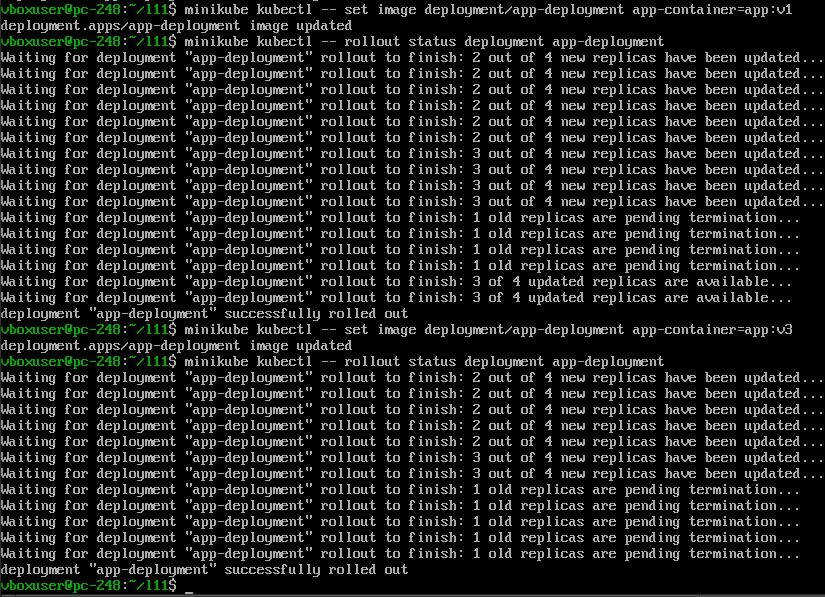
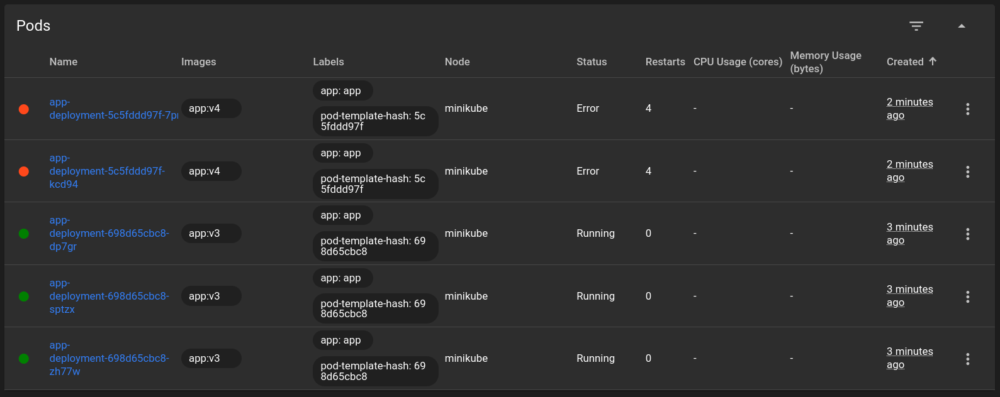
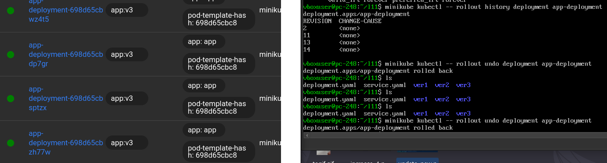
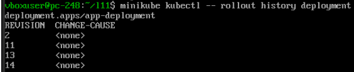
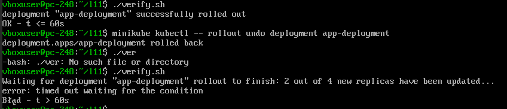
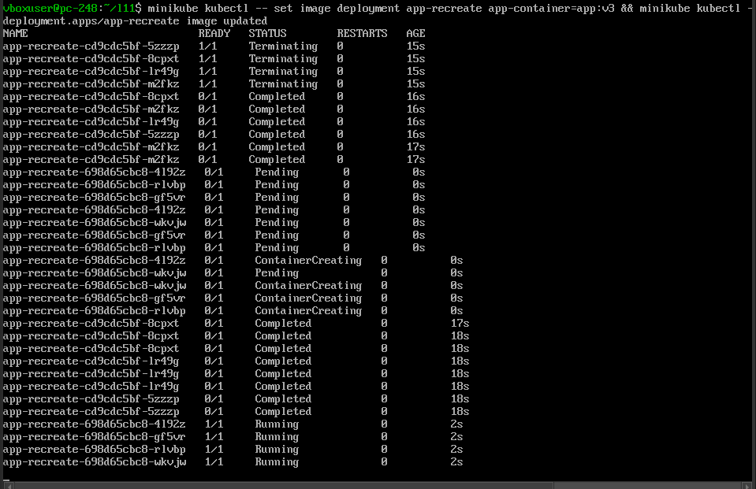
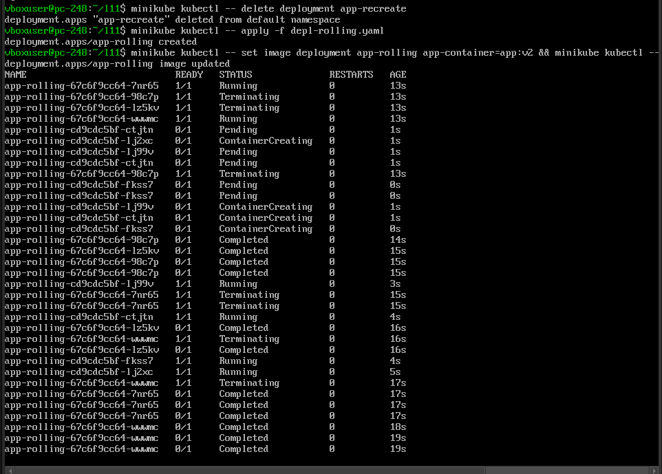
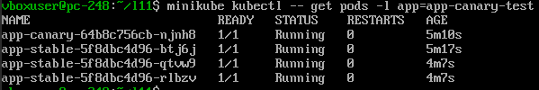
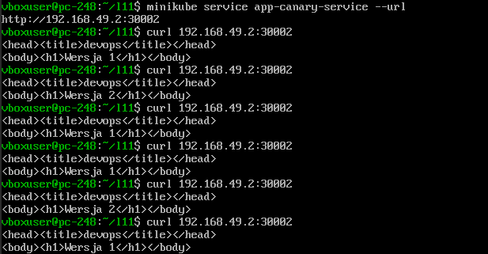

---

## Lab12 - Azure: deployment w chmurze
Uruchomienie kontenera z dockerhuba w chmurze Azure.

### Czynności wykonane podczas laboratorium
- Wypchnięcie obrazu z lab11 ("v1") na Docker Hub
- Zapoznanie się z dokumentacją Azure Container Instances
- Utworzenie Resource Group na Azure
- Stworzenie kontenera z obrazem z Docker Hub
- Sprawdzenie logów kontenera
- Połączenie się z kontenerem przez przeglądarkę
- Usunięcie stworzonego Resource Group

### Pliki konfiguracyjne

#### `Dockerfile`
```dockerfile
FROM httpd:alpine
COPY ./index.html /usr/local/apache2/htdocs
```

#### `index.html`
```html
<head><title>devops</title></head>
<body><h1>Wersja 1</h1></body>
```

### Screeny
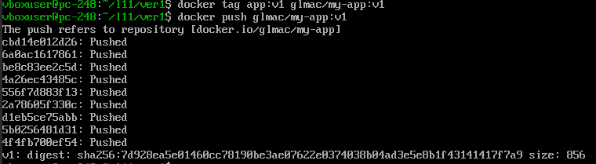
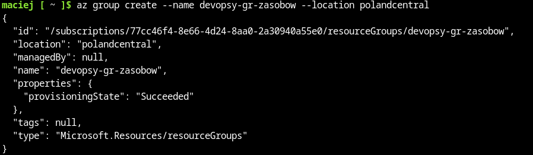


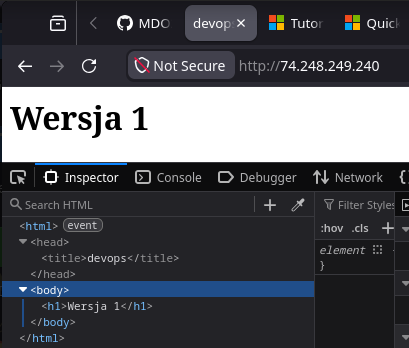
