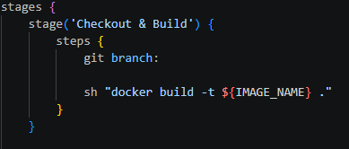
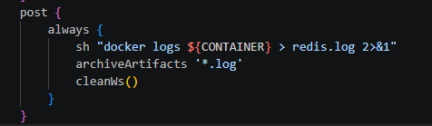
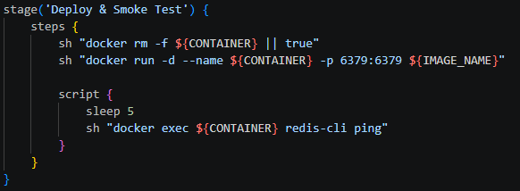
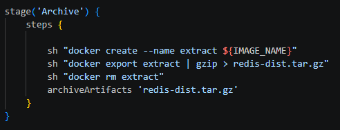

## Jenkinsfile: lista kontrolna
- Zweryfikuj, czy definicja pipeline'u obecna w repozytorium pokrywa ścieżkę krytyczną:
- [x] Przepis dostarczany z SCM, a nie wklejony w Jenkinsa (co załatwia nam clone)

- [x] Posprzątaliśmy i wiemy, że odbyło się to skutecznie

cleanWs() - czyszczenie przestrzeni roboczej
 - [x] Etap Build dysponuje repozytorium i plikami Dockerfile
 sh docker build -t ${IMAGE_NAME} ma dostęp do kodu i pliku Dockerfile
 - Etap Build tworzy obraz buildowy, np. BLDR
 ```dockerfile
FROM gcc:11 AS builder
RUN apt-get update && apt-get install -y tcl
WORKDIR /app
COPY . .
RUN make -j$(nproc) && make test


FROM ubuntu:22.04
RUN apt-get update && apt-get install -y libssl3 && rm -rf /var/lib/apt/lists/*
COPY --from=builder /app/src/redis-server /usr/local/bin/
COPY --from=builder /app/src/redis-cli /usr/local/bin/
COPY --from=builder /app/redis.conf /usr/local/etc/redis/redis.conf
EXPOSE 6379
CMD ["redis-server", "/usr/local/etc/redis/redis.conf"]
```
Dockerfile  kompiluje kod w  gcc:11 - następnie kopiuje same artefakty
 - [x] Etap Deploy przygotowuje obraz lub artefakt pod wdrożenie
 
  - [x] Etap Publish wysyła obraz docelowy do Rejestru i/lub dodaje artefakt do historii builda
  
  - [x] Ponowne uruchomienie naszego pipeline'u zadziała więcej niż jeden raz
  sprzątanie kontenerów przed uruchomieniem (docker rm -f ), użycie unikalnych tagów (${env.BUILD_ID}), czyszczenie workspaceu (cleanWs())
  # Czy opublikowany obraz może być uruchomiony bez modyfikacji?
  Tak obraz zbudowany na ubuntu posiada wymagane biblioteki (libssl3)
  # Czy dołączony do przejścia artefakt zadziała od razu na docelowej maszynie?
  docker export i spakowany system plików (redis-dist.tar.gz) może zostać zaimportowany w środowisku z użyciem docker import