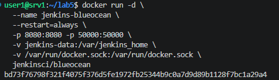
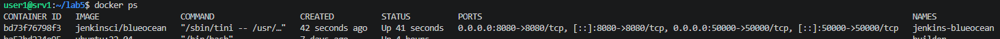
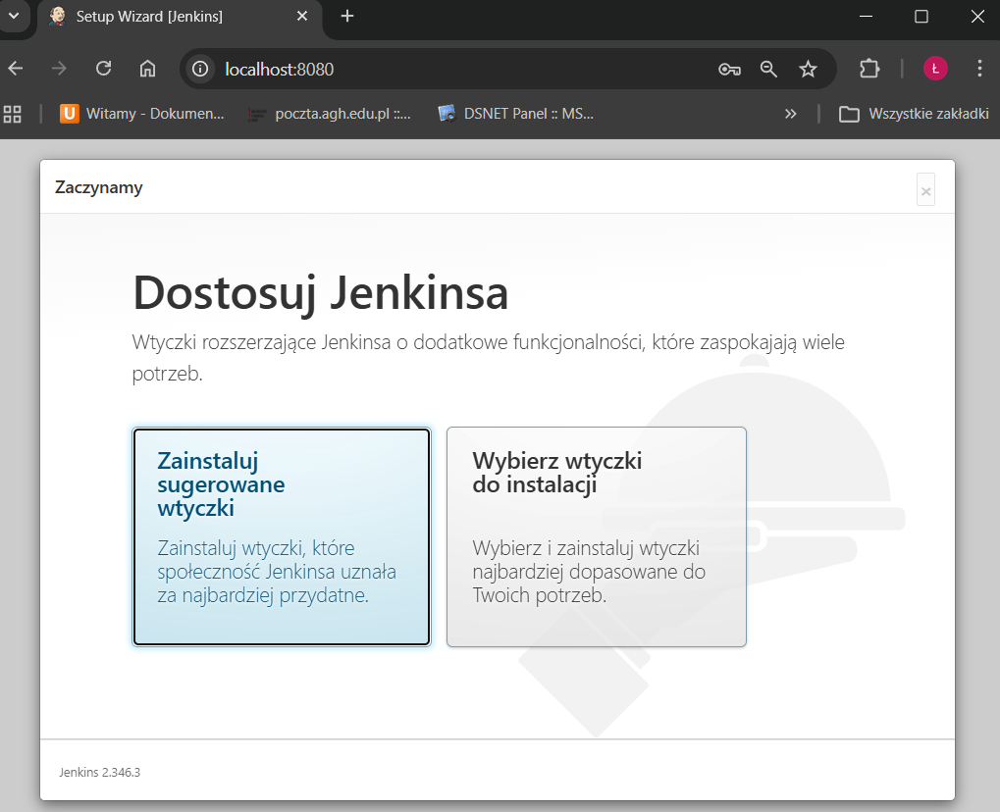
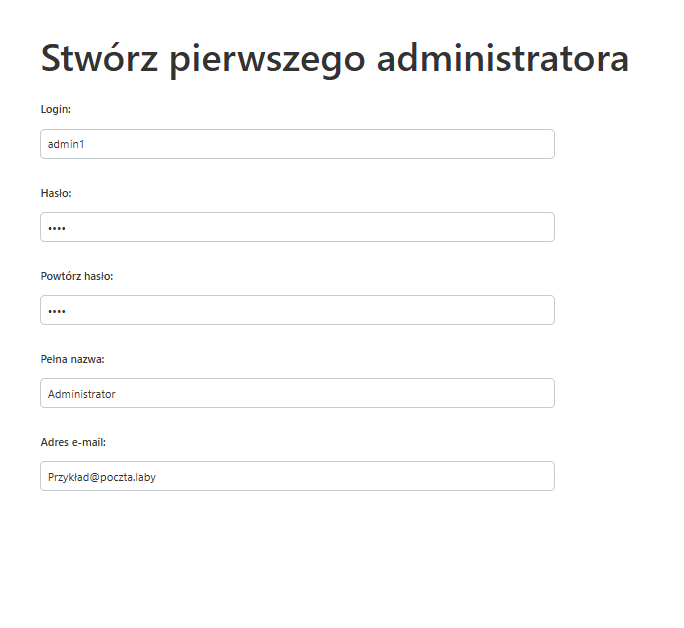
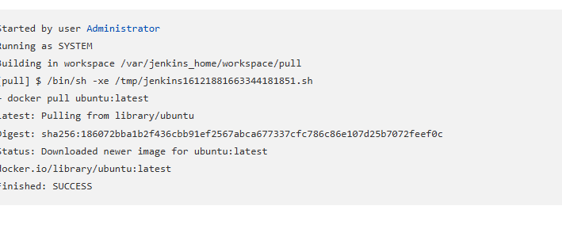
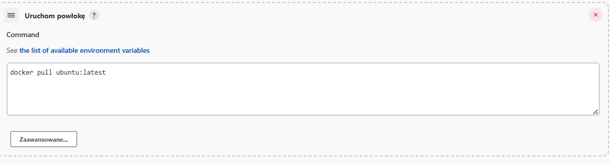
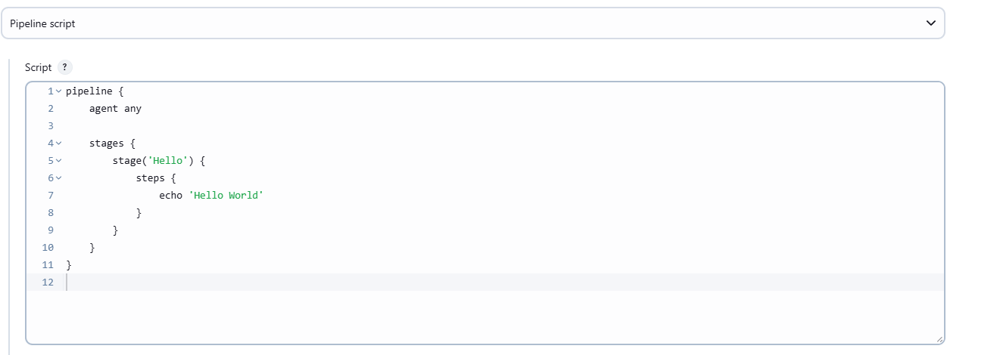

# Sprawozdanie zbiorcze 5 - 7

# Wstęp

Sprawozdanie zbiorcze z laboratoriów 5-7 obejmuje uruchomienie i konfigurację środowiska Jenkins, budowę pipelineu CI/CD z etapami build, test, deploy, publish oraz przeniesienie definicji pipelineu do repozytorium. Laboratoria obejmują praktyczne umiejętności automatyzacji procesów DevOps z wykorzystaniem kontenerów Docker i narzędzi CI/CD.

# Lab5 – Jenkins, BlueOcean, Pipeline

Laboratorium 5 skupiało się na uruchomieniu instancji Jenkins (BlueOcean) w kontenerze oraz pierwszej konfiguracji środowiska CI/CD.

Wykonane kroki:

1. **Weryfikacja działania kontenerów budujących i testujących** – sprawdzenie, czy środowiska z poprzednich laboratoriów są gotowe do pracy.


2. **Przygotowanie obrazu Jenkins BlueOcean** – uruchomienie kontenera z interfejsem webowym, uproszczonym pod kątem wizualizacji pipelineów.


Jenkins BlueOcean jest prostszy niż docker in docker, został przystosowany do pracy z UI/UX i umożliwia łatwą wizualizację.


3. **Konfiguracja Jenkinsa** – logowanie, ustawienie hasła administratora, wybór i instalacja wtyczek.



4. **Pierwszy projekt w Jenkinsie** – utworzenie zadania, które wykonuje polecenie `uname -a` oraz pobranie obrazu kontenera `ubuntu` przez `docker pull`.





5. **Tworzenie prostego pipeline'u** – uruchomienie pipeline'u z etapem wyświetlającym "Hello World".



**Wnioski:**
Jenkins BlueOcean upraszcza zarządzanie pipelinenami i pozwala na szybkie wdrożenie środowiska CI/CD. Konfiguracja początkowa obejmuje  aspekty bezpieczeństwa i instalację niezbędnych rozszerzeń.

# Lab6 – Pipeline: build, test, deploy, publish

Laboratorium 6 polegało na rozbudowie pipelineu o kolejne etapy oraz automatyzacji procesu budowania, testowania i wdrażania aplikacji w kontenerach.

Wykonane kroki:

1. **Stworzenie deklaratywnego pipelineu** – zdefiniowanie etapów: Checkout & Build, Deploy & Smoke Test, Archive.
2. **Budowanie obrazu Dockera** – automatyczne budowanie obrazu z kodu źródłowego i Dockerfile.
3. **Testowanie i wdrożenie** – uruchomienie kontenera, wykonanie testu "smoke test", czyszczenie środowiska po zakończeniu.
4. **Archiwizacja artefaktów** – eksport systemu plików kontenera do archiwum, archiwizacja logów i czyszczenie workspaceu.


```groovy
pipeline {
	agent any
	environment {
		IMAGE_NAME = "redis-custom:${env.BUILD_ID}"
		CONTAINER = "redis-deploy"
	}
	stages {
		stage('Checkout & Build') {
			steps {
				git branch:
				sh "docker build -t ${IMAGE_NAME} ."
			}
		}
		stage('Deploy & Smoke Test') {
			steps {
				sh "docker rm -f ${CONTAINER} || true"
				sh "docker run -d --name ${CONTAINER} -p 6379:6379 ${IMAGE_NAME}"
				script {
					sleep 5
					sh "docker exec ${CONTAINER} redis-cli ping"
				}
			}
		}
		stage('Archive') {
			steps {
				sh "docker create --name extract ${IMAGE_NAME}"
				sh "docker export extract | gzip > redis-dist.tar.gz"
				sh "docker rm extract"
				archiveArtifacts 'redis-dist.tar.gz'
			}
		}
	}
	post {
		always {
			sh "docker logs ${CONTAINER} > redis.log 2>&1"
			archiveArtifacts '*.log'
			cleanWs()
		}
	}
}
```

**Wnioski:**
Pipeline deklaratywny pozwala na pełną automatyzację procesu CI/CD, a archiwizacja artefaktów i logów zapewnia powtarzalność i możliwość audytu.

# Lab7 – Jenkinsfile w repozytorium, automatyzacja, archiwizacja

Laboratorium 7 koncentrowało się na przeniesieniu definicji pipelineu do repozytorium oraz spełnieniu checklisty dobrych praktyk DevOps.

Wykonane kroki:

1. **Jenkinsfile w repozytorium (SCM)** – pipeline jest pobierany z repozytorium, co zapewnia wersjonowanie i łatwość utrzymania.
2. **Czyszczenie środowiska** – automatyczne usuwanie starych kontenerów, workspaceu i logów.
3. **Budowanie i testowanie w kontenerach** – build i testy odbywają się w odizolowanych środowiskach, z użyciem unikalnych tagów dla obrazów.
4. **Archiwizacja i publikacja artefaktów** – eksport systemu plików, archiwizacja oraz możliwość importu na innym środowisku.
5. **Spełnienie checklisty** – pipeline pokrywa ścieżkę krytyczną: clone, build, test, deploy, publish.

**Wnioski:**
Przeniesienie Jenkinsfile do repozytorium oraz automatyzacja czyszczenia i archiwizacji zwiększają powtarzalność i bezpieczeństwo procesu CI/CD. Pipeline jest łatwy do utrzymania i rozwoju.

# Wnioski ogólne

Laboratoria 5-7 miały na celu wdrożenie zaawansowanych technik DevOps: automatyzacji buildów, testów, wdrożeń i archiwizacji artefaktów w środowisku kontenerowym. Jenkins i Docker umożliwiają powtarzalność i przenośność procesu.

