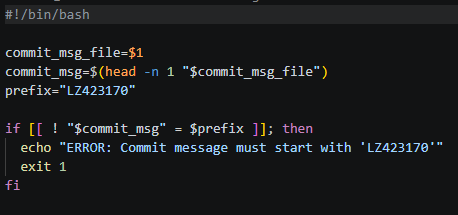
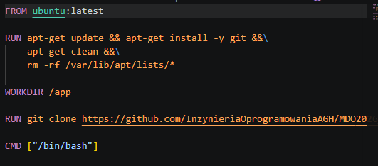
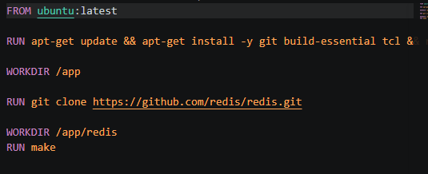
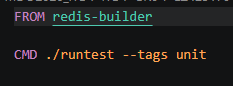
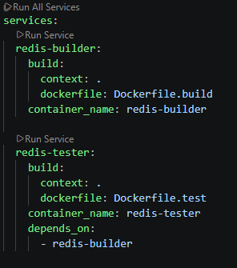

# Sprawozdanie zbiorcze 1 - 4

# Wstęp

Sprawozdanie zbiorcze z laboratoriów 1-4 obejmuje przygotowanie środowiska pracy z wykorzystaniem Git i SSH, wprowadzenie do konteneryzacji z Dockerem, budowanie oprogramowania w powtarzalnych środowiskach CI oraz zaawansowane techniki konteneryzacji, w tym woluminy, sieci i uruchomienie Jenkins.

# Lab1 - Wprowadzenie, Git, Gałęzie, SSH

Laboratorium 1 zawierało zadania związane z przygotowaniem środowiska pracy. 
Wykonane kroki-

1. **Instalacja klienta Git i obsługa kluczy SSH**- 

2. **Sklonowanie repozytorium** - na wcześniej przygotowaną maszynę wirtualną.

3. **Konfiguracja kluczy SSH** - utworzenie i konfiguracja kluczy ssh do komunikacji.

4. **Praca z gałęziami** - utworzenie własnej gałęzi do przesyłania sprawozdań.

5. **Git hook** - napisanie git hooka (commit-msg), jego celem jest sprawdzenie czy commit message zaczyna się od inicjałów i numeru indeksu. Pozwala to na prezentację działania hooków i ułatwia analizę commitów w historii.

# Lab2 - Git, Docker

Drugie zajęcia zawierały zadania związane z zestawieniem różnic między kontenerem a maszyna wirtualną.
Kontener - współdzieli jądro systemu, daje możliwość szybkiego uruchomienia wymaganych programów.

Wykonane kroki-

1. **Instalacja Dockera w systemie linuksowym**

2. **Zapoznanie się z obrazami** - instalacia i uruchomienie obrazów takich jak hello-world, busybox i ubuntu.

3. **Stworzenie własnego Dockerfile** - napisanie własnego Dockerfile opartego na na ubuntu. Jego zadaniem była instalacja git i sklonowanie repozytorium. 

4. **Zarządzanie kontenerami** - prezentacja PID i listy procesów

5. **Czyszczenie obrazów**

 **Wnioski** 
    Porces Devops pozwala na izolację środowiska, zależności nie są instalowane bezpośrednio w systemie operacyjnym. Tworzenie włsnego pliku Dockerfile pozwala na automatyzację tworzenia odpowiedniego środowiska.  

# Lab3 -  Dockerfiles, kontener jako definicja etapu

Laboratorium 3 zawierało zadania związane z budowaniem oprogramowania w środowisku CI, Dzięki temu cały proces pozostaje przenośny.

Wykonane kroki-

1. **Wybór oprogramowania** - Redis (Remote Dictionary Server) zawiera Makefile i testy jednostkowe.

2. **Uruchomienie testów** - wykonanie testów jednostkowych za pomocą ./runtest --tags unit.

3. **Izolacja i powtarzalność** - utworzenie Dockerfile.build do kompilacji oprogramowania i Dockerfile.test na podstawie pierwszego do uruchamienia testów.

4. **Docker Compose** - utworzenie docker-compose do zarządzania kontenerami i  usługami builder i tester.

**Wnioski**
    Konteneryzacja umożliwia izolację środowiska i testów.   Dockerfiles pozwalają na optymalizuję obrazów poprzez usuwanie zbędnych narzędzi po kompilacji. Docker Compose ułatwia zarządzanie kontenerami.

# Lab4 - Dodatkowa terminologia w konteneryzacji, instancja Jenkins

Laboratorium 4 -  zadania związane z dodatkową terminologią w konteneryzacji i uruchomieniem Jenkins w środowisku skonteneryzowanym.

Jenkins - serwer do wdrażania procesó ciągłej integracji i dostarczania. Pozwala na automatyczne testowanie i wdrażanie oprogramowania.

Wykonane kroki-

1. **Zachowywanie stanu między kontenerami** - przygotowanie woluminów- wejście i wyjście, podłączonych do kontenera bazowego. Sklonowanie repozytorium na wolumin wejściowy z lokalnego katalogu ( Git niedostępny w kontenerze), uruchomienie builda.

2. **Eksponowanie portu i łączność między kontenerami** - uruchomionie serwera iperf w jednym kontenerze, nastepnie połaczenie się z drugiego i badanie ruchu. Połączenie się spoza kontenera (z hosta) i badanie ruchu.

3. **Usługi w kontenerze** -  usługę SSH w kontenerze ubuntu.

4. **Przygotowanie instancji Jenkins** -  Przeprowadzonie instalacji  Jenkins, przedstawienie działającego kontenera i ekran logowania.

**Wnioski** 
Woluminy umożliwiają trwałe zachowanie stanu między uruchomieniami kontenerów. Sieci mostkowe ułatwiają komunikację między kontenerami. Jenkins w kontenerze izolje środowisko CI/CD.

# Wnioski ogólne

Laboratoria 1-4 wprowadziły podstawy pracy z systemami kontroli wersji (Git, SSH), konteneryzacji (Docker) oraz ciągłej integracji (Jenkins). 

Kluczowe zagadnienia obejmują znaczenie izolacji środowisk, automatyzacji buildów i testów, zarządzania stanem poprzez woluminy i sieci między kontenerami. Docker umożliwia przenośność i powtarzalność procesów, Jenkins automatyzuje pipeline'y CI/CD. Te narzędzia są podstawą dla nowoczesnego rozwoju oprogramowania, zapewniają efektywność i niezawodność.

# Wykaz komend

## Git
- `git clone <url>`- klonuje repozytorium z URL.
- `git branch <nazwa>`- tworzy nową gałąź.
- `git checkout <nazwa>`- przełącza na daną gałąź.
- `git commit -m "wiadomość"`- tworzy commit z wiadomością.
- `git push origin <gałąź>`- wysyła zmiany repozytorium.
- `git pull`- pobiera zmiany z zdalnego repozytorium + scalanie.

## SSH - klucze
- `ssh-keygen -t rsa -b 4096 -C "email@example.com"`- generuje parę kluczy SSH RSA.
- `ssh-add ~/.ssh/id_rsa`- dodaje klucz prywatny do agenta SSH.

## Git hooks
- `chmod +x .git/hooks/commit-msg`- nadanie uprawnienień hookowi commit-msg.
- Hook commit-msg - sprawdzanie formatu wiadomości commit.

## Konteneryzacja (Docker)
- `docker run <obraz>`- uruchamia kontener z danego obrazu.
- `docker ps`- wyświetla działające kontenery.
- `docker stop <id>`- zatrzymanie kontenera.
- `docker rm <id>`- usunięcie kontenera.
- `docker images`- wyświetla dostępne obrazy.
- `docker --rm <obraz>`- usuniięcie obrazu po zatrzymaniu

## Budowanie własnych obrazów (Dockerfile)
- `docker build -t <nazwa> .`- buduje obraz z Dockerfile
- `FROM` -  obraz bazowy.
- `WORKDIR`- odpowiednik `cd`.
- `COPY` i `ADD`- kopiowanie dysku do systemu obrazu.
- `RUN`- wykonuje komendy powłoki
- `ENV`- definicja zmiennych środowiskowyvh.
- `CMD`-  polecenie przy starcie kontenera. 

## Woluminy
- `docker volume create <nazwa>`- tworzy wolumin.
- `docker run -v <wolumin>-<ścieżka> <obraz>`- Uruchamia kontener z woluminem.
- `docker volume ls`- wpokazuje woluminy.
- `docker volume rm <nazwa>`- usuwanie woluminu.

