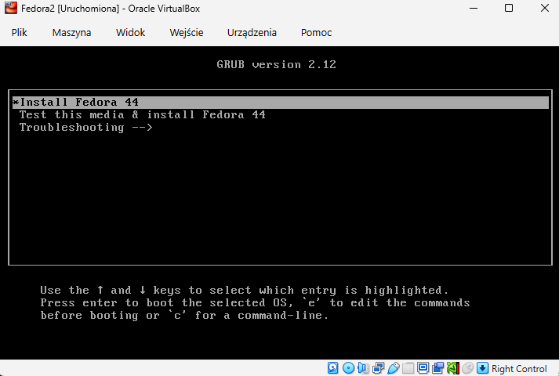
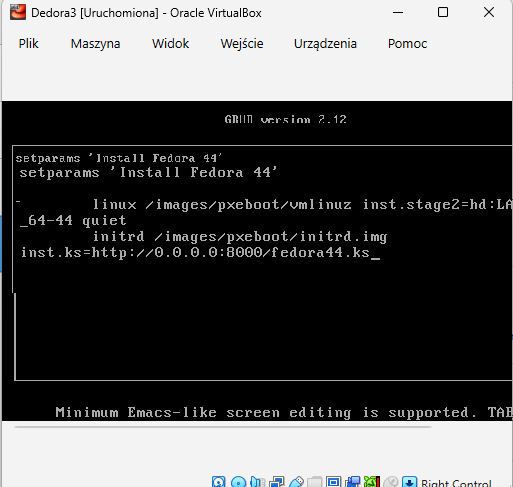
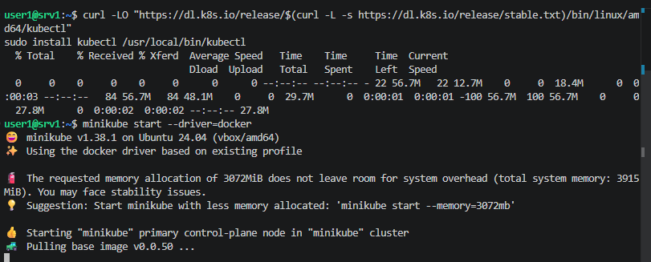
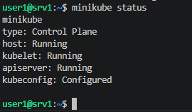
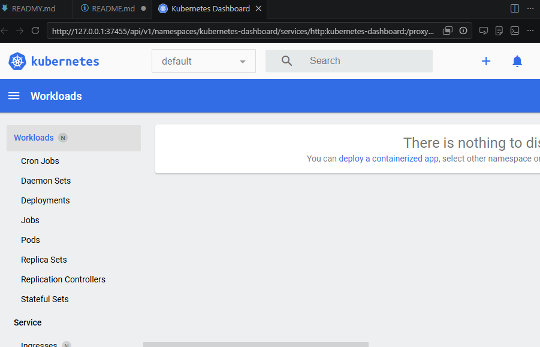
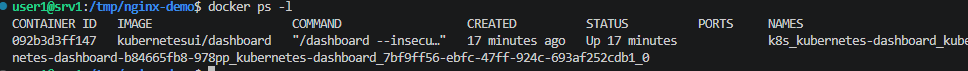
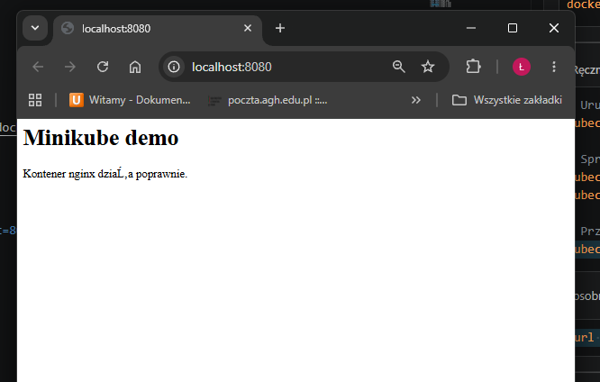

# Sprawozdanie Zbiorcze - Zajęcia 8-12

---

## Wstęp

Blok zajęć obejmował przygotowanie infrastruktury, testowanie strategii wdrażania, wdrożenie w środowisku chmury publicznej. Praktyczne ćwiczenia miały na celu  zbudowanie umiejętności pracy z narzędziami dedykowanymi dla zespołów DevOps.

### 1. **Ansible**

## Charakterystyka
Ansible to narzędzie do automatyzacji konfiguracji i zarządzania  systemów. Nie wymaga instalacji żadnych agentów na maszynach zarządzanych.

## Zastosowania
- Zdalne wykonywanie poleceń na wielu maszynach jednocześnie
- Zarządzanie usługami i procesami
- Wdrażanie aplikacji i artefaktów z pipeline
- Zarządzanie konfiguracją w odtwarzalny sposób


## 2. **Kickstart** 

## Charakterystyka
Kickstart to mechanizm automatyzacji instalacji systemów operacyjnych pozwala na bezobsługową instalację z użyciem pliku odpowiedzi z wszystkimi parametrami.





## Kluczowe elementy
- Plik odpowiedzi - deklaratywny opis konfiguracji systemu
- Dyrektywy - instrukcje instalatora:
- `url/repo` - źródła pakietów i repozytoria
- `clearpart` - czyszczenie dysków
- `packages` - lista pakietów do zainstalowania
- `%post` - skrypty wykonywane po instalacji
- Automatyczne uruchomienie - możliwość uruchomienia aplikacji zaraz po starcie systemu

## Zastosowania
- Przygotowanie maszyn wirtualnych z minimalnym nakładem pracy
- Instalacja kontenerów lub aplikacji w sekcji post
- Pobranie artefaktów z serwerów (Jenkins)
- Wstępna konfiguracja systemów dla infrastruktury jako kodu 


## 3. Kubernetes/Minikube

## Charakterystyka
Kubernetes to system zarządzania wdrażaniem i operowaniem aplikacji w kontenerach na klastrach. Minikube - jednowęzłowa implementacja nadająca się do testowania

## Kluczowe koncepty
- Pod - najmniejsza jednostka wdrażania, zawierajaca jeden lub więcej kontenerów
- Deployment - deklaracyjny opis pożądanego stanu replik podów
- Service - abstrakcja sieciowa umożliwiająca dostęp do podów
- Rollout - proces wdrożenia nowej wersji aplikacji
- YAML manifesty - deklaratywne opisy zasobów





*

## Strategie wdrażania
1. Recreate - wysłanie starych instancji, uruchomienie nowych (wymagana przestój)
2. **Rolling Update** - stopniowa wymiana instancji
   - `maxUnavailable` - maksymalna liczba niedostępnych podów
   - `maxSurge` - maksymalna liczba dodatkowych podów ponad żądaną replikę
3. **Canary Deployment** - wdrażanie nowej wersji na małym procencie ruchu w celu testowania

## Operacje
```bash
kubectl apply -f deployment.yaml      # aktualizacja
kubectl rollout status deployment/xxx  # stan
kubectl rollout history deployment/xxx # historia zmian
kubectl rollout undo deployment/xxx     # cofnięcie wersji
kubectl port-forward pod/xxx PORT:PORT  # przekierowanie portu
```










## Zastosowania
- Zarządzanie aplikacjami w środowiskach produkcyjnych
- Automatyczne skalowanie na podstawie obciążenia
- Zarządzanie czasem bezpiecznym (zero-downtime deployments)
- Monitoring i restarty aplikacji w przypadku awarii

---

## 4. Microsoft Azure 

## Charakterystyka
Azure Container Instances - usługa kontenerów w chmurze publicznej Microsoft Azure, oferuje szybkie uruchamianie kontenerów bez konieczności zarządzania maszyną wirtualną lub klastrem.

## Elementy
- Resource Group - logiczna grupa zasobów Azure
- Container Image - obraz kontenerowy z Docker Hub
- Zarządzany stos - automatyczna obsługa zasobów
- Proste skalowanie - możliwość szybkiego wdrożenia wielu instancji

## Proces wdrożenia
1. Przygotowanie kontenera (budowa i publikacja na Docker Hub)
2. Utworzenie resource group w Azure
3. Wdrożenie kontenera
4. Monitorowanie logów 
5. Dostęp do usługi HTTP poprzez publiczny adres IP


## Zalety
- Szybkość - uruchomienie kontenera w minutach
- Prostota - brak konfiguracji klastra
- Skalowanie - natywne skalowanie w ramach chmury
- Integracja - łatwa integracja z innymi usługami Azure


## Wnioski

## 1. Automatyzacja
Automatyzacja zmniejsza błędy manualne, przyspiesza procesy i umożliwia zarządzanie złożonymi infrastrukturami. Opisanie stanu docelowego  prowadzi do bardziej niezawodnych systemów.

## 2. Infrastruktura
Łańcuch od instalacji  - pełna implementacja podejścia IaC - zarówno infrastruktura (maszyny), konfiguracja (Ansible) i orkiestracja (Kubernetes) mogą być wersjonowane i poddawane kontroli zmian w systemach kontroli wersji.

## 3. Wymaganiai Praktyczne i Sprzętowe
Praca z Kubernetes i Ansiblem ujawnia wymagania zarządzania systemami - wymagają one solidnego zrozumienia sieci, bezpieczeństwa i architektur rozproszonych. 

## 4. Bezpieczeństwo i Koszty
Każda technologia posuada swoje wyzwania bezpieczeństwa (zarządzanie kluczami SSH w Ansible, dostęp do logów w Azure) i finansowe (kredyty Azure zużywane nawet na idle resources).


## Podsumowanie
Blok zajęć 8-12 to  wprowadzenie do ekosystemu narzędzi deDevOps. Kurs przedstawił praktyczną wiedzę niezbędną w nowoczesnej inżynierii oprogramowania.
