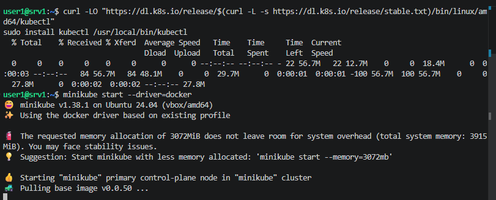
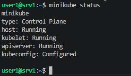
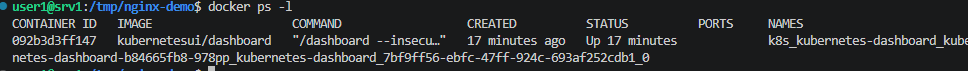
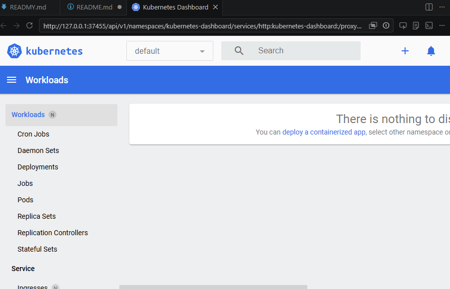
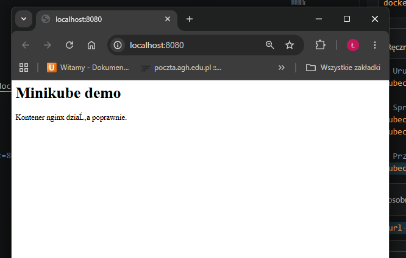
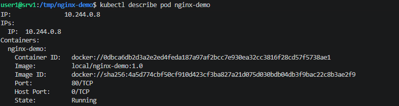
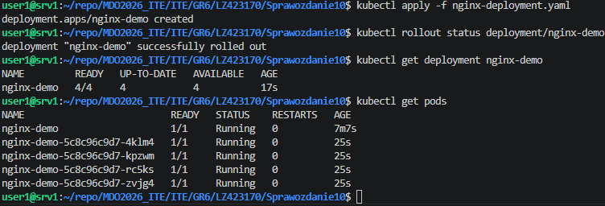
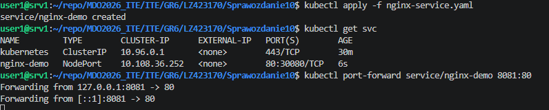
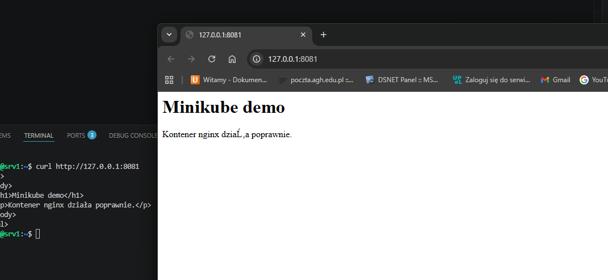

# Sprawozdanie 10

```bash
# Instalacja narzędzi
minikube start --driver=docker

minikube status
kubectl cluster-info
kubectl get nodes

minikube dashboard
```







## 3. Manualne uruchomienie aplikacji

```bash

kubectl run nginx-demo --image=local/nginx-demo:1.0 --port=80 --labels app=nginx-demo

kubectl get pods
kubectl describe pod nginx-demo


kubectl port-forward pod/nginx-demo 8080:80
```




```yaml
apiVersion: apps/v1
kind: Deployment
metadata:
  name: nginx-demo
spec:
  replicas: 4
  selector:
    matchLabels:
      app: nginx-demo
  template:
    metadata:
      labels:
        app: nginx-demo
    spec:
      containers:
      - name: nginx
        image: local/nginx-demo:1.0
        ports:
        - containerPort: 80
```




# 5. Ekspozycja aplikacji jako serwis

