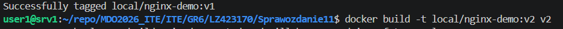
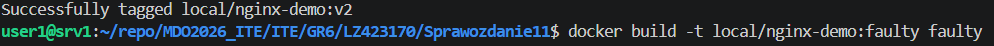
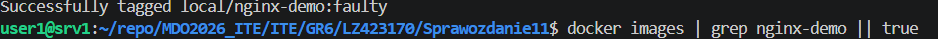
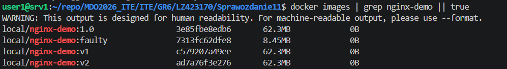
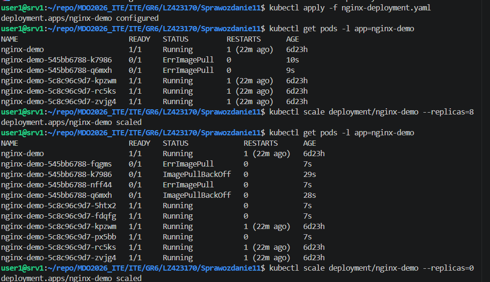
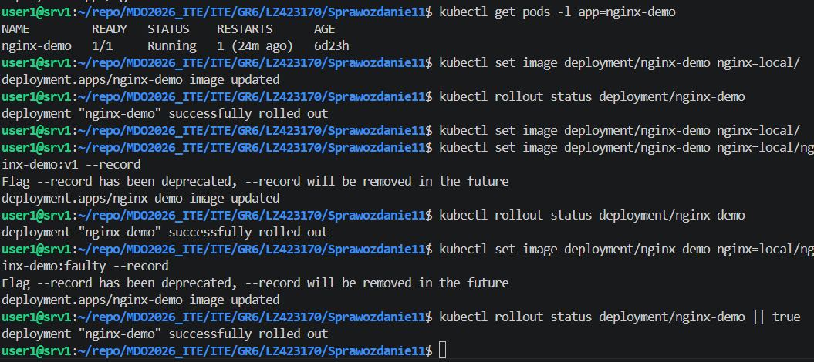
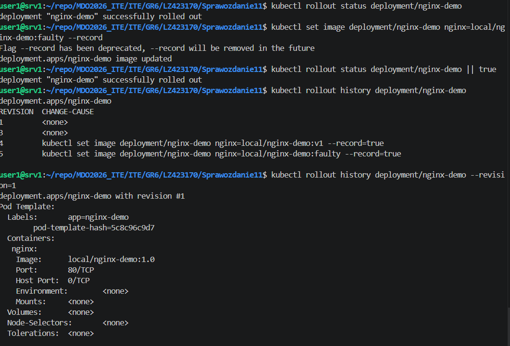
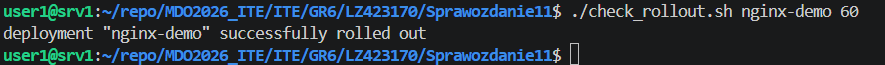
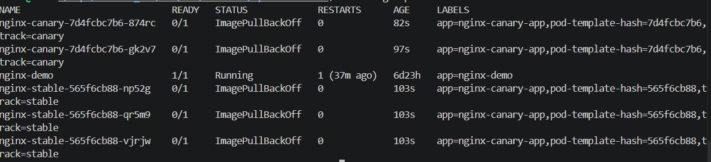

# Sprawozdanie 11

### 1. Przygotowanie obrazów (v1, v2, faulty)







### 2. Base Deployment YAML

Plik `nginx-deployment.yaml` (używany jako baza):

```yaml
apiVersion: apps/v1
kind: Deployment
metadata:
  name: nginx-demo
  labels:
    app: nginx-demo
spec:
  replicas: 4
  selector:
    matchLabels:
      app: nginx-demo
  template:
    metadata:
      labels:
        app: nginx-demo
    spec:
      containers:
      - name: nginx
        image: local/nginx-demo:v1
        ports:
        - containerPort: 80
        readinessProbe:
          httpGet:
            path: /
            port: 80
          initialDelaySeconds: 5
          periodSeconds: 5
```


```bash

kubectl apply -f nginx-deployment.yaml
kubectl get pods -l app=nginx-demo
```


### 3. Zmiany w deploymencie: skalowanie i aktualizacje obrazów





### 4. Wycofywanie zmian (rollback)



### 5. sprawdzenie czy rollout zakończył się w 60s

```bash
#!/bin/bash
DEPLOYMENT=${1:-nginx-demo}
TIMEOUT=${2:-60}
INTERVAL=2
elapsed=0

while [ $elapsed -lt $TIMEOUT ]; do
  kubectl rollout status deployment/$DEPLOYMENT --timeout=2s && exit 0
  sleep $INTERVAL
  elapsed=$((elapsed + INTERVAL))
done

echo "Rollout did not complete within ${TIMEOUT}s"
exit 1
```



### 6. Strategie wdrożeń — pliki YAML

6.1 Recreate

```yaml
apiVersion: apps/v1
kind: Deployment
metadata:
  name: nginx-recreate
spec:
  strategy:
    type: Recreate
  replicas: 3
  selector:
    matchLabels:
      app: nginx-recreate
  template:
    metadata:
      labels:
        app: nginx-recreate
    spec:
      containers:
      - name: nginx
        image: local/nginx-demo:v1
        ports:
        - containerPort: 80
```

6.2  maxUnavailable > 1  maxSurge > 20%

```yaml
apiVersion: apps/v1
kind: Deployment
metadata:
  name: nginx-rolling
spec:
  replicas: 5
  strategy:
    type: RollingUpdate
    rollingUpdate:
      maxUnavailable: 2
      maxSurge: 30%
  selector:
    matchLabels:
      app: nginx-rolling
  template:
    metadata:
      labels:
        app: nginx-rolling
    spec:
      containers:
      - name: nginx
        image: local/nginx-demo:v1
        ports:
        - containerPort: 80
```

6.3 Canary Deployment 

`nginx-stable.yaml`:

```yaml
apiVersion: apps/v1
kind: Deployment
metadata:
  name: nginx-stable
spec:
  replicas: 3
  selector:
    matchLabels:
      app: nginx-canary-app
      track: stable
  template:
    metadata:
      labels:
        app: nginx-canary-app
        track: stable
    spec:
      containers:
      - name: nginx
        image: local/nginx-demo:v1
        ports:
        - containerPort: 80
```

`nginx-canary.yaml`:

```yaml
apiVersion: apps/v1
kind: Deployment
metadata:
  name: nginx-canary
spec:
  replicas: 1
  selector:
    matchLabels:
      app: nginx-canary-app
      track: canary
  template:
    metadata:
      labels:
        app: nginx-canary-app
        track: canary
    spec:
      containers:
      - name: nginx
        image: local/nginx-demo:v2
        ports:
        - containerPort: 80
```

```yaml
apiVersion: v1
kind: Service
metadata:
  name: nginx-canary-svc
spec:
  selector:
    app: nginx-canary-app
  ports:
  - port: 80
    targetPort: 80
  type: ClusterIP
```

```bash
kubectl apply -f nginx-stable.yaml
kubectl apply -f nginx-canary.yaml
kubectl apply -f canary-service.yaml
```




