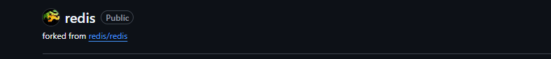
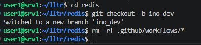
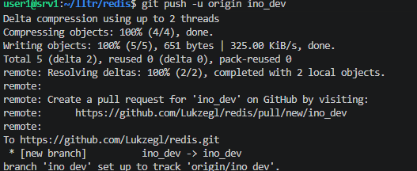
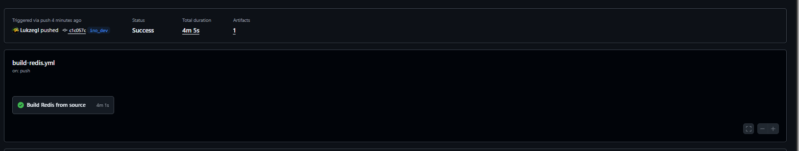

## 1 fork repozytorium

## push zmian

    name: Redis Build Pipeline

    on:
    push:
        branches:
        - ino_dev

    jobs:
    build:
        name: Build Redis from source
        runs-on: ubuntu-latest 

        steps:
        
        - name: Checkout code
            uses: actions/checkout@v4

        
        - name: Install dependencies
            run: sudo apt-get update && sudo apt-get install -y build-essential tcl

        - name: Build Redis
            run: make

        - name: Upload Artifact
            uses: actions/upload-artifact@v4
            with:
            name: redis-binaries
            path: |
                src/redis-server
                src/redis-cli
            retention-days: 5

## Build

https://github.com/Lukzegl/redis/actions
