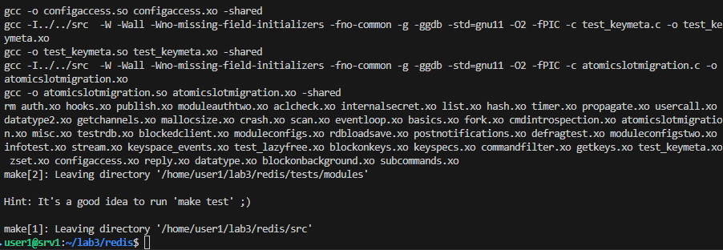
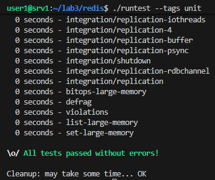
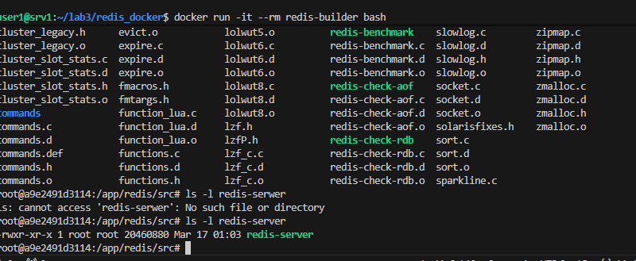
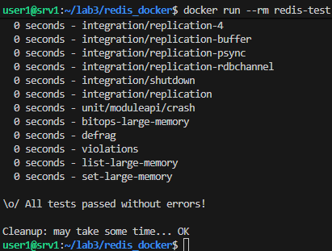
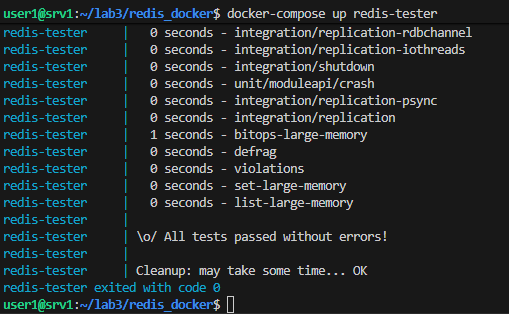
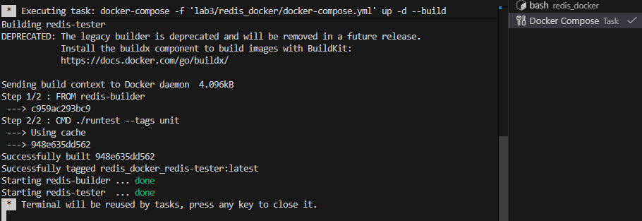

# Wybór oprogramowania na zajęcia - Redis - (Remote Dictionary Server)
https://github.com/redis/redis.git
1. Sklonuj niniejsze repozytorium, przeprowadź build programu (doinstaluj wymagane zależności)
    I. git clone https://github.com/redis/redis.git
    
2. Uruchom testy jednostkowe dołączone do projektu w repozytorium
    I. ./runtest --tags unit
    
# Izolacja i powtarzalność: build w kontenerze
1. Dockerfile.build

FROM ubuntu:latest

RUN apt-get update && apt-get install -y git build-essential tcl && rm -rf /var/lib/apt/lists/*

WORKDIR /app

RUN git clone https://github.com/redis/redis.git

WORKDIR /app/redis
RUN make

2. Dockerfile.test
FROM redis-builder

CMD ./runtest --tags unit

# Docker Compose

services:
  redis-builder:
    build:
      context: .
      dockerfile: Dockerfile.build
    container_name: redis-builder

  redis-tester:
    build:
      context: .
      dockerfile: Dockerfile.test
    container_name: redis-tester
    depends_on:
      - redis-builder

2. Pytania:
    1. Nie ponieważ obecny obraz zawiera zbędne narzędzia (git, kod źródłowy) - dlatego nie nadaje się do wdrożenia i publikacji. Sam obraz nadaje się jednak, po wprowadzeniu modyfikacji, do uruchomienia jako kontener. (Na dockerhub jest oficjalny obraz) 
    2. Przygotowanie finalnego artefaktu:
    Wieloetapowy build  - 1 etap - kompilacja, 2 etap - skopiowanie gotowej binarki
    3. Dystrybucja - można jako pakiet (rpm, deb)
    4. trzeci kontener - może odpowiadać za tworzenie pakietu
