# Przygotuj woluminy wejściowy i wyjściowy
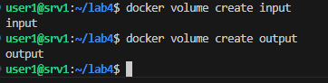
# Uruchom kontener, zainstaluj niezbędne wymagania wstępne
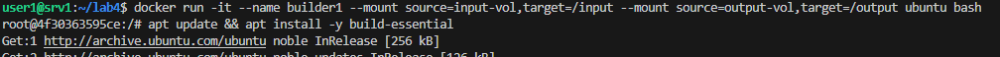
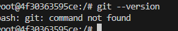
# Sklonuj repozytorium na wolumin wejściowy
1. Sklonowanie repozytorium na hoście
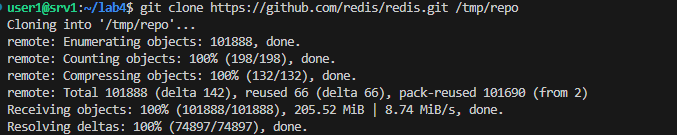
2. Skopiowanie zawartości do woluminu
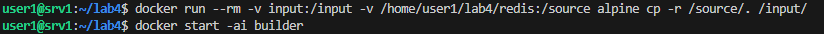
Metoda - Bind mount w lokalnym katalogu - w kontenerze nie ma zainstalowanego gita więc należy obejść ten problem
# Uruchom build w kontenerze (potrzebny jest dostęp do kodu)
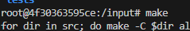
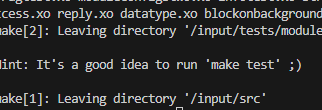
# Zapisz powstałe/zbudowane pliki na woluminie "wyjściowym"
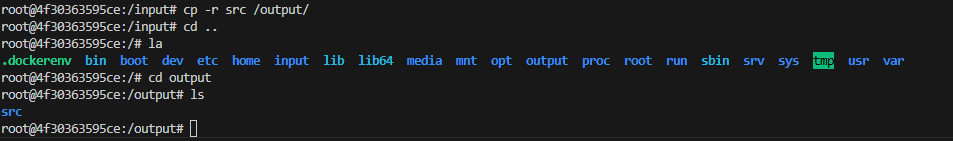
# Ponów operację, ale klonowanie na wolumin "wejściowy
1. 
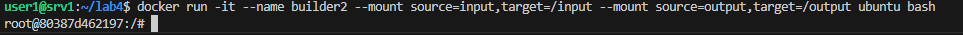
2. 
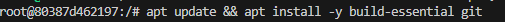
3. 
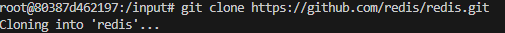
4. 
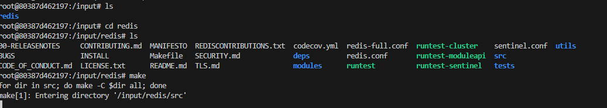
5. 
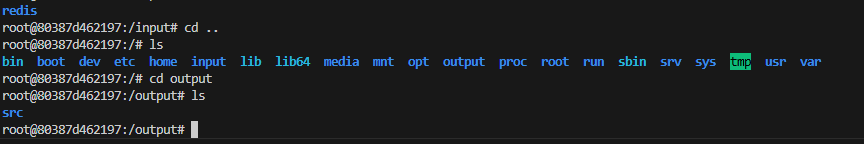
Te same operacje tylko z wykorzystaniem gita
Jest możliwość realizacji tych kroków za pomocą docker build i RUN --mount
FROM ubuntu
RUN apt update && apt install -y build-essential
RUN --mount=type=bind,source=/tmp,target=/repo cp -r /repo/* /input/

# Eksponowanie portu i łączność między kontenerami
# Uruchom wewnątrz kontenera serwer iperf
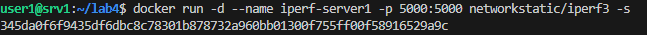
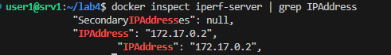 
# Połącz się z nim z drugiego kontenera, zbadaj ruch
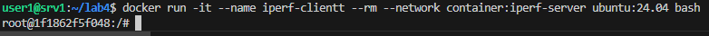
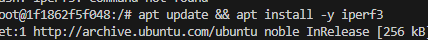
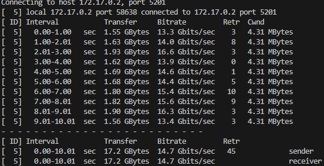
# Ponów ten krok, ale wykorzystaj własną dedykowaną sieć mostkową
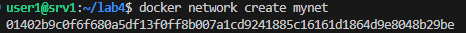
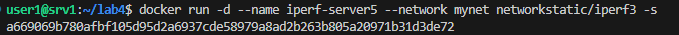
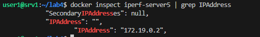
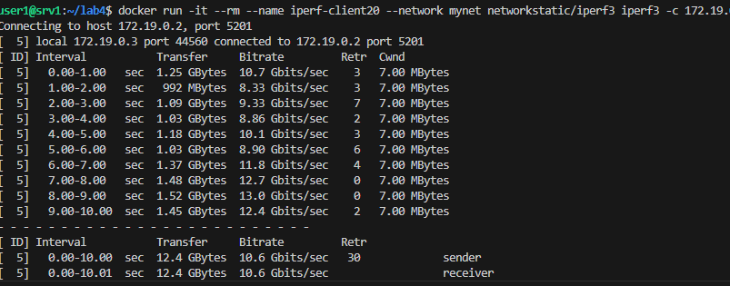
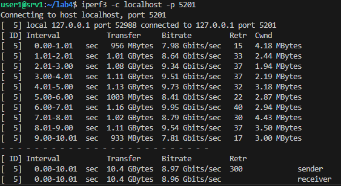
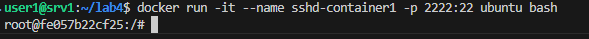
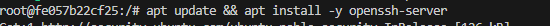
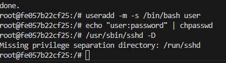
# Połącz się spoza kontenera
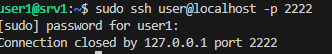
# Przeprowadź instalację skonteneryzowanej instancji Jenkinsa z pomocnikiem DIND
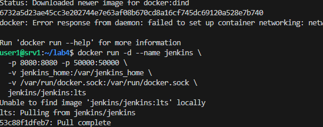
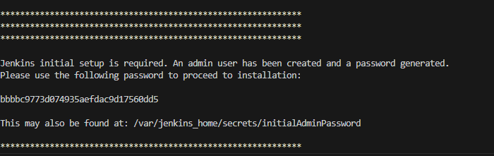
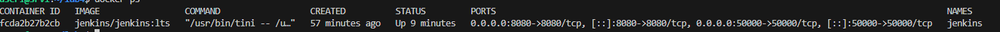
# Ekran logowania
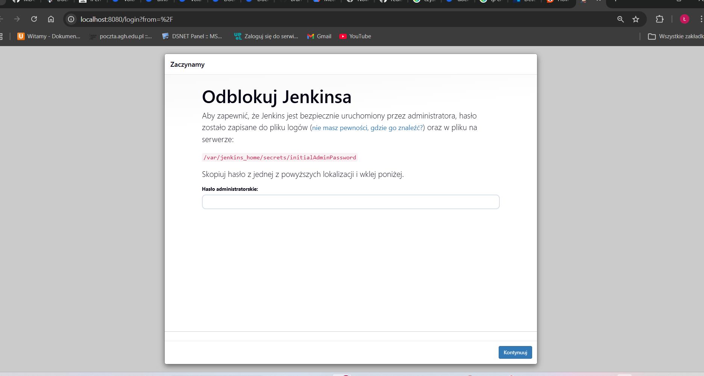
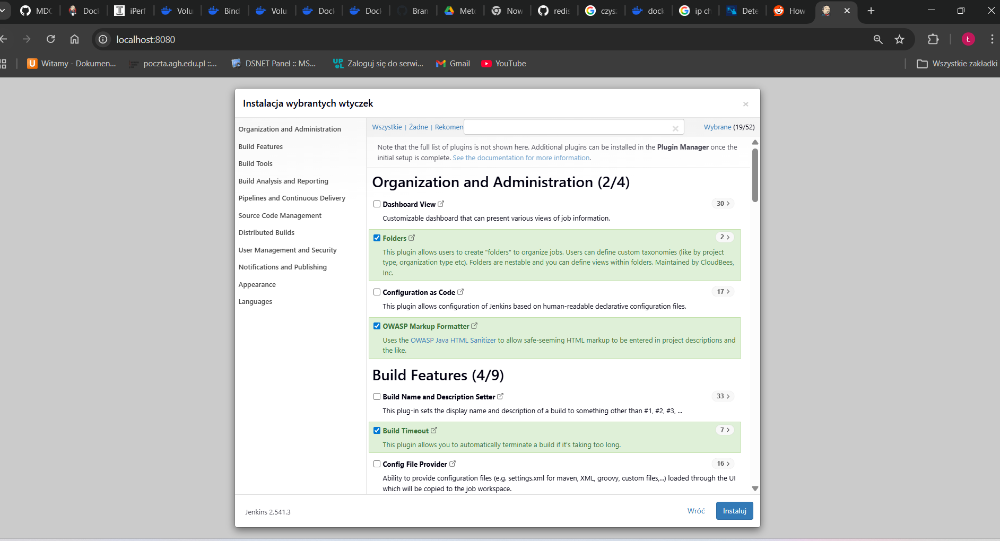