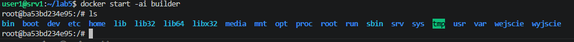
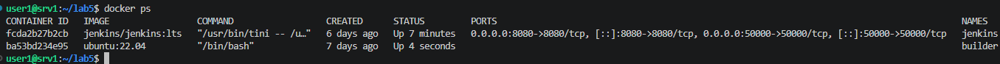
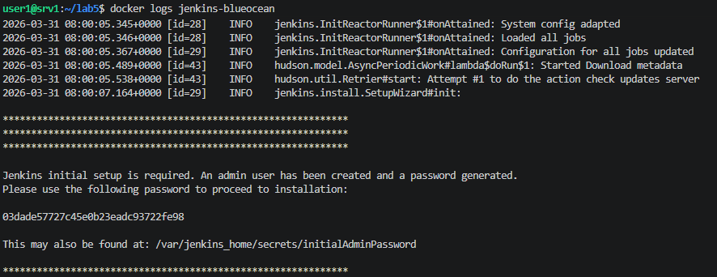
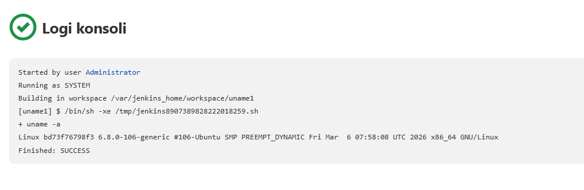
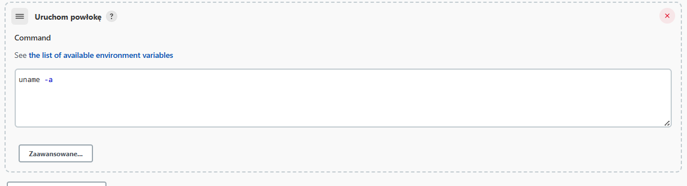
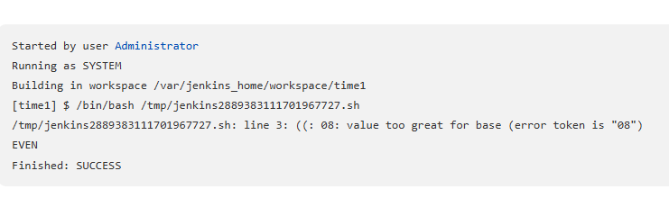
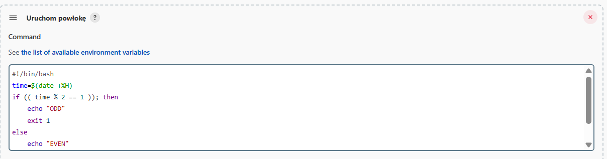
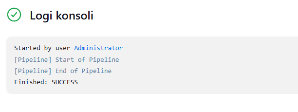

##  Upewnij się, że na pewno działają kontenery budujące i testujące, stworzone na poprzednich zajęciach

## Przygotuj obraz blueocean na podstawie obrazu Jenkinsa

Jenkins blueocean jest prostrzy niż docker in docker, został przystosowany do pracy z UI/UX, umożliwia łatfą wizualizację.

03dade57727c45e0b23eadc93722fe98
## Zaloguj się i skonfiguruj Jenkins

## Zadanie wstępne: uruchomienie

## Utwórz projekt, który zwraca błąd, gdy... godzina jest nieparzysta

## Pobierz w projekcie obraz kontenera ubuntu (stosując docker pull)

## Zadanie wstępne: obiekt typu pipeline
1. Hello world

