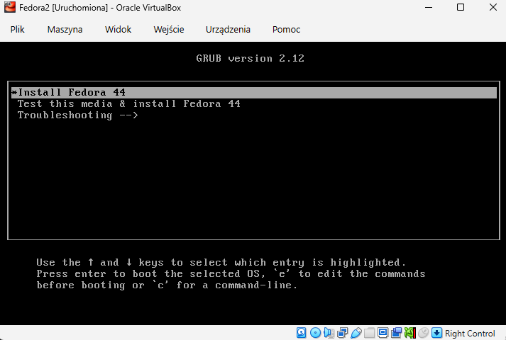
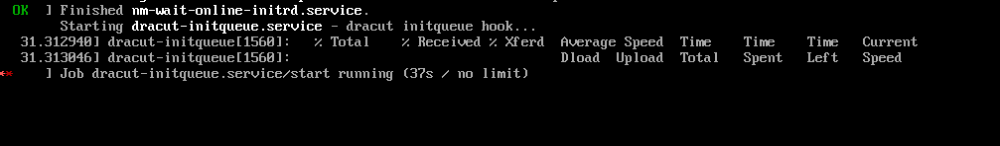
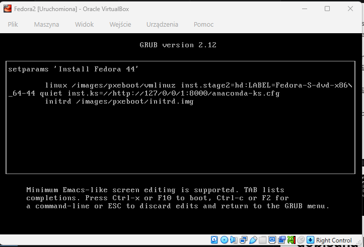
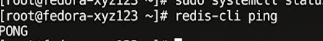

## Instalacja systemu fedora

plik anaconda-ks.cfg:

    # Generated by Anaconda 44.30
    # Keyboard layouts
    keyboard --vckeymap=pl --xlayouts='pl'
    # System language
    lang pl_PL.UTF-8

    %packages
    @^server-product-environment

    %end

    # System authorization information
    authselect enable-feature with-fingerprint

    # Run the Setup Agent on first boot
    firstboot --enable

    # Generated using Blivet version 3.13.2
    ignoredisk --only-use=sda
    autopart
    # Partition clearing information
    clearpart --none --initlabel

    # System timezone
    timezone Europe/Warsaw --utc

    # Root password
    rootpw --iscrypted --allow-ssh $y$j9T$HGi6tw.i6bDJSAcFQzN8BRIP$SfLvuDO2Y/qvBTGOEzNV.MaPvp3MCsjbZnQAf60Az97
    user --groups=wheel --name=user --gecos="User"

## Zmiany w pliku
    #Repozytoria Fedory 44 i Dockera
    url --mirrorlist=https://mirrors.fedoraproject.org/mirrorlist?repo=fedora-44&arch=x86_64
    repo --name=updates --mirrorlist=https://mirrors.fedoraproject.org/mirrorlist?repo=updates-released-f44&arch=x86_64
    repo --name=docker-ce --baseurl=https://download.docker.com/linux/fedora/44/x86_64/stable

    %post --log=/root/ks-post.log
    #Docker
    systemctl enable docker
    # Skrypt
    cat > /usr/local/bin/start-redis.sh <<'EOF'
    #!/bin/bash
    until docker info >/dev/null 2>&1; do sleep 1; done
    docker run -d --name redis-server --restart always -p 6379:6379 redis:alpine
    EOF
    chmod +x /usr/local/bin/start-redis.sh
    #systemd
    cat > /etc/systemd/system/redis-container.service <<'EOF'
    [Unit]
    After=docker.service
    Requires=docker.service
    [Service]
    ExecStart=/usr/local/bin/start-redis.sh
    Restart=on-failure
    [Install]
    WantedBy=multi-user.target
    EOF
    systemctl enable redis-container.service
    %end

    reboot

## Uruchomienie obrazu

