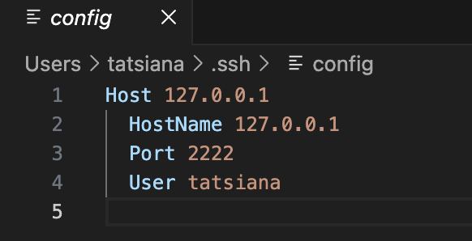
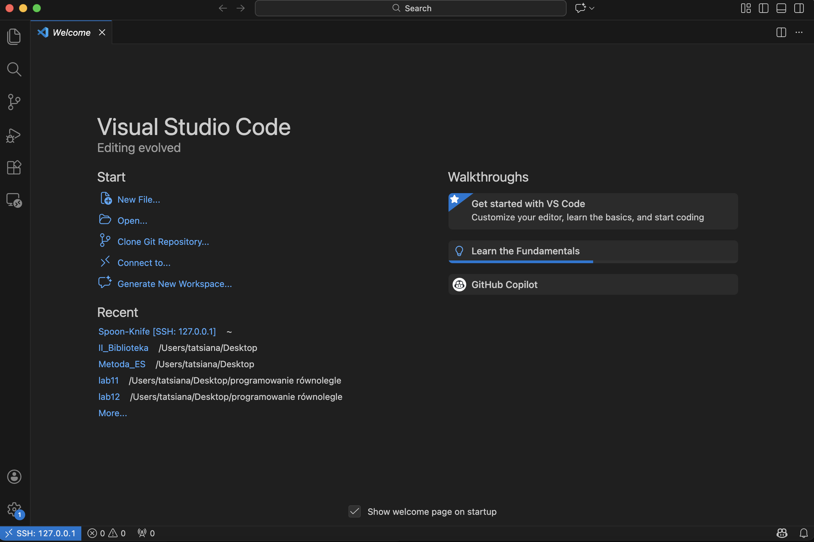
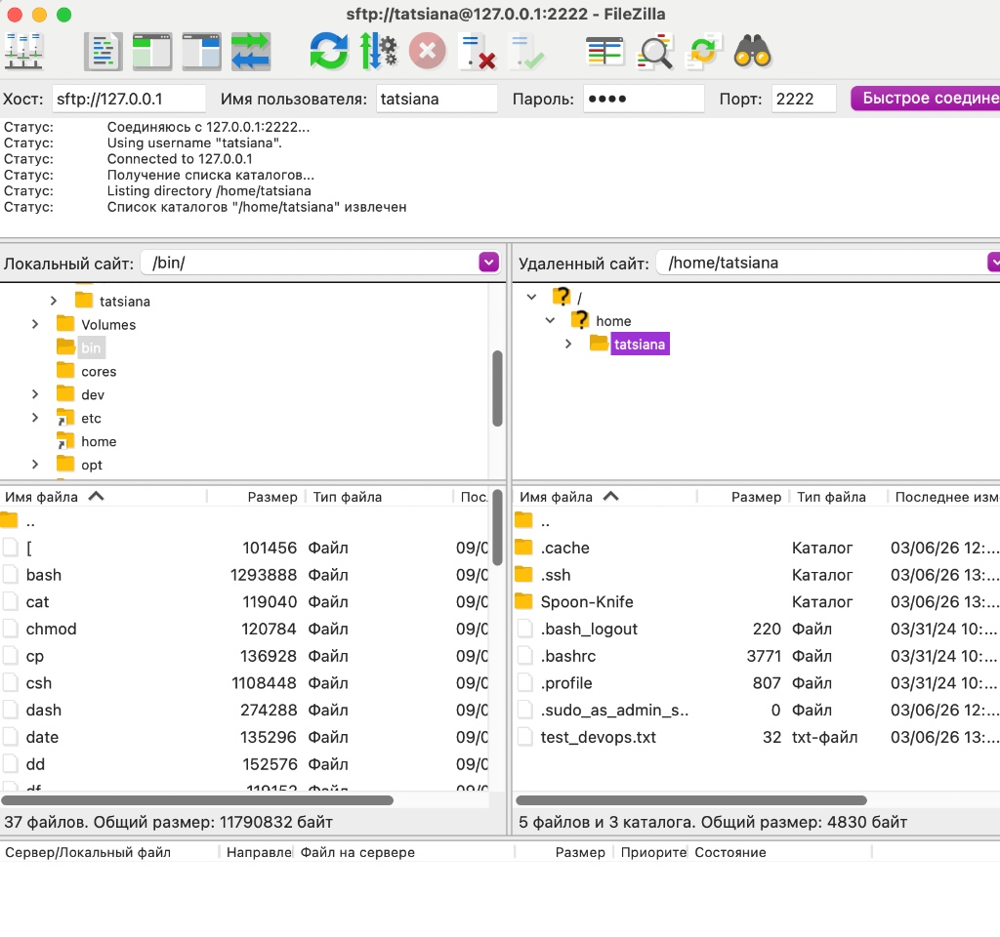
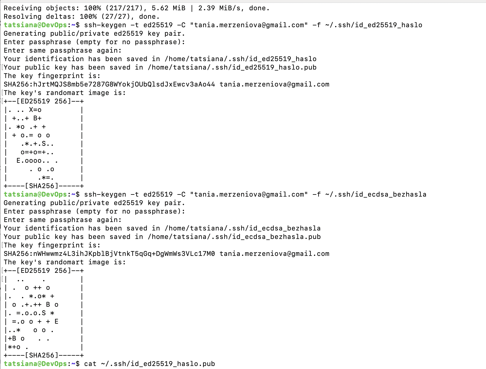
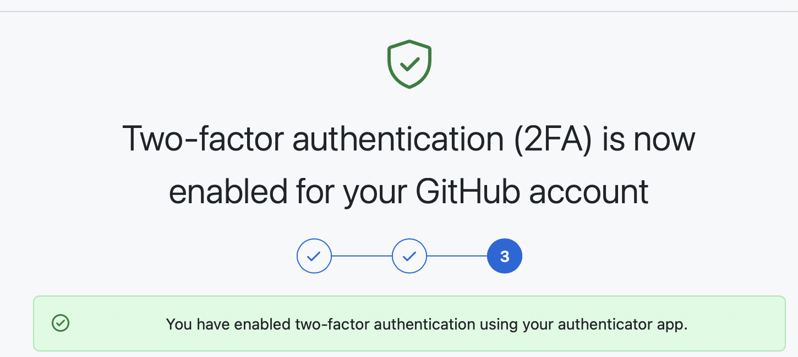
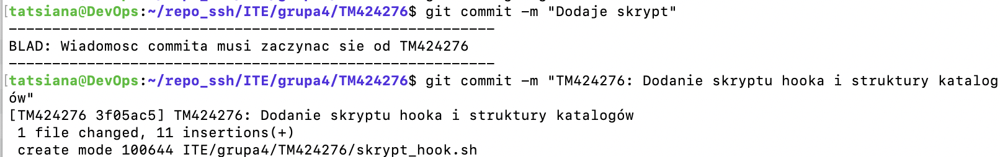

# Sprawozdanie z Ćwiczenia 1

**Imię, nazwisko i numer indeksu:** Tatsiana Merzianiova TM424276  
**Grupa:** 4  
**Środowisko uruchomieniowe:** * Host: macOS (Apple Silicon)  
* Maszyna Wirtualna: Ubuntu Server 24.04 ARM64 (VirtualBox)  


### 1. Zalogowanie do maszyny
Do wirtualnej maszyny zalogowano się poprzez protokół SSH używając wbudowanego terminala systemu macOS oraz polecenia `ssh -p 2222 tatsiana@127.0.0.1`. 
Skonfigurowano również narzędzia wspierające pracę zdalną:
* **FileZilla:** Zestawiono połączenie SFTP do wymiany plików ze środowiskiem pracy.
* **Visual Studio Code:** Zainstalowano wtyczkę `Remote - SSH` i dodano wpis w pliku konfiguracyjnym `~/.ssh/config` w celu automatyzacji łączenia się z maszyną.





### 2. Instalacja Git
Z poziomu terminala zaktualizowano repozytoria pakietów i zainstalowano system kontroli wersji Git komendami:
```bash
sudo apt update
sudo apt install git
```

### 3. Konfiguracja użytkownika Git
Przed rozpoczęciem pracy z repozytorium skonfigurowano globalne dane tożsamości użytkownika:
```bash
git config --global user.name "zni4ka"
git config --global user.email «tania».merziniova@gmail.com
```

### 4. Klonowanie przez HTTPS
Sklonowano repozytorium przedmiotowe po HTTPS. Zamiast standardowego hasła, na stronie wygenerowano i użyto klucza **Personal Access Token (PAT)**.
```bash
git clone [https://github.com/InzynieriaOprogramowaniaAGH/MDO2026_ITE.git](https://github.com/InzynieriaOprogramowaniaAGH/MDO2026_ITE.git)
```

### 5. Utworzenie kluczy SSH
Zgodnie z wymaganiami wygenerowano dwa klucze oparte na algorytmach innych niż RSA:
1. Klucz zabezpieczony hasłem (ED25519): `ssh-keygen -t ed25519 -C "email" -f ~/.ssh/id_ed25519_haslo`
2. Klucz bez hasła (ECDSA): `ssh-keygen -t ecdsa -b 521 -C "email" -f ~/.ssh/id_ecdsa_bezhasla`

Klucz publiczny został dodany do profilu GitHub, a samo konto zabezpieczono uwierzytelnianiem dwuskładnikowym (2FA).




### 6. Klonowanie repozytorium z użyciem SSH
Po zweryfikowaniu działania połączenia, pomyślnie pobrano repozytorium ponownie, tym razem wykorzystując protokół SSH:
```bash
git clone git@github.com:InzynieriaOprogramowaniaAGH/MDO2026_ITE.git
```

### 7. Utworzenie własnej gałęzi
Wewnątrz pobranego repozytorium przełączono się na gałąź dedykowaną grupie czwartej, a następnie utworzono z niej własną, oddzielną gałąź. Na nowej gałęzi stworzono wymaganą strukturę folderów.
```bash
git checkout grupa4
git checkout -b TM424276
mkdir -p ITE/grupa4/TM424276
```

### 8. Githook
Napisano skrypt bashowy pilnujący poprawności wiadomości wprowadzanych przy zatwierdzaniu zmian (commit). Plik ze skryptem umieszczono w ukrytym katalogu `.git/hooks/commit-msg` i nadano mu uprawnienia do wykonywania. 

**Kod skryptu:**
```bash
#!/bin/bash
MSG_FILE=$1
COMMIT_MSG=$(head -n 1 "$MSG_FILE")
PREFIX="TM424276"
if [[ ! $COMMIT_MSG =~ ^$PREFIX ]]; then
    echo "BLAD: Wiadomosc commita musi zaczynac sie od $PREFIX"
    exit 1
fi
```
**Weryfikacja:** Próba wykonania commita bez wymaganego prefiksu zablokowała operację i wyrzuciła błąd w terminalu. Zmiana formatu wiadomości na poprawny pozwoliła z sukcesem dodać rewizję.


