# Sprawozdanie z Ćwiczenia 2: Środowisko skonteneryzowane (Docker)

### 1. Instalacja Dockera
Zgodnie z zaleceniami, Docker został zainstalowany przy użyciu systemowego menedżera pakietów `apt` (z dystrybucyjnego repozytorium Ubuntu), unikając tym samym mechanizmu Snap. Po instalacji dodano użytkownika do grupy `docker`, aby umożliwić pracę bez uprawnień administratora.

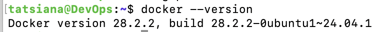

### 2. Logowanie do Docker Hub
Utworzono konto w serwisie Docker Hub. Następnie z poziomu terminala pomyślnie zalogowano się na konto (`zni4ka`) używając autoryzacji opartej na przeglądarce.

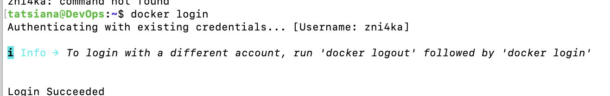

### 3. Zapoznanie z sugerowanymi obrazami
Pobrano i przeanalizowano wybrane obrazy kontenerów. 
* **Rozmiary obrazów:** Zaobserwowano znaczące różnice w wielkości obrazów. Minimalistyczny `busybox` zajmuje jedynie około 4 MB, standardowe systemy `ubuntu` i `fedora` odpowiednio ok. 101 MB i 193 MB, natomiast pełny serwer bazy danych `mariadb` ponad 362 MB.
* **Pierwsze uruchomienie i kod wyjścia:** Uruchomiono obraz testowy `hello-world`. Następnie sprawdzono kod wyjścia (exit code) komendą `echo $?`, który wyniósł `0`, co potwierdza bezbłędne wykonanie procesu kontenera.

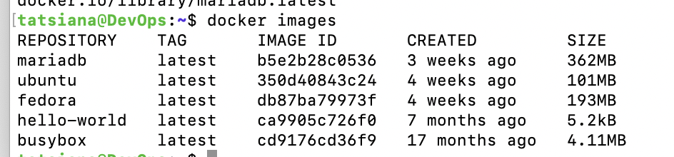
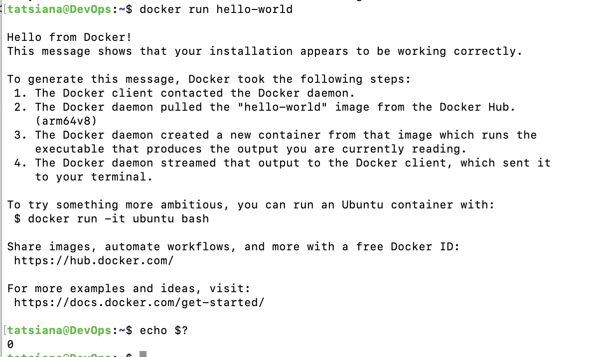

### 4. Praca interaktywna i izolacja procesów
* **BusyBox:** Uruchomiono kontener z obrazu `busybox` w trybie interaktywnym i zweryfikowano jego wersję oraz dostępne narzędzia.
* **Procesy i PID 1:** Uruchomiono kontener bazujący na systemie Ubuntu. Udowodniono, że wewnątrz odizolowanego środowiska kontenera powłoka `/bin/bash` otrzymuje identyfikator **PID 1** (zachowując się jak główny proces systemowy). Z kolei na hoście procesy te posiadają standardowe, wysokie numery PID przydzielone przez główny system operacyjny. Zaktualizowano pakiety wewnątrz Ubuntu za pomocą `apt update && apt upgrade -y`.
* **Izolacja dystrybucji:** Aby zademonstrować głęboką izolację, na jednym hoście uruchomiono dwa kontenery z różnymi systemami operacyjnymi: Ubuntu oraz Fedora. Poprzez polecenie `cat /etc/os-release` udowodniono, że funkcjonują one jako całkowicie odrębne byty.

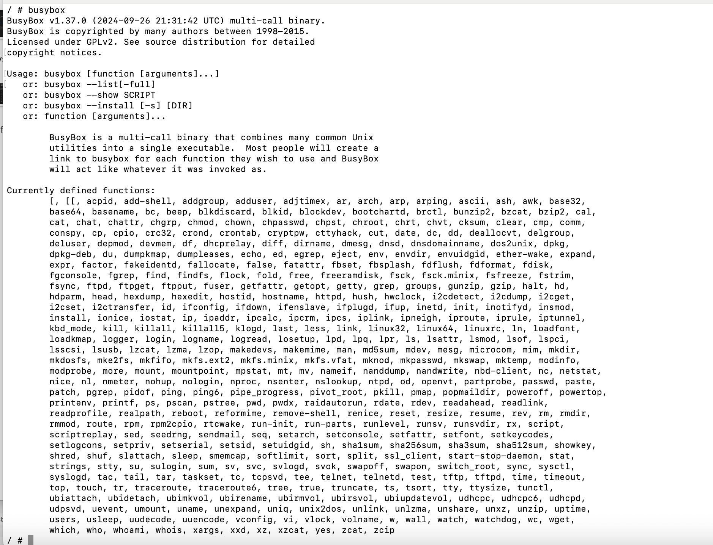
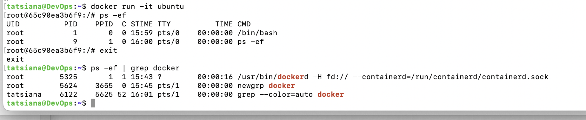
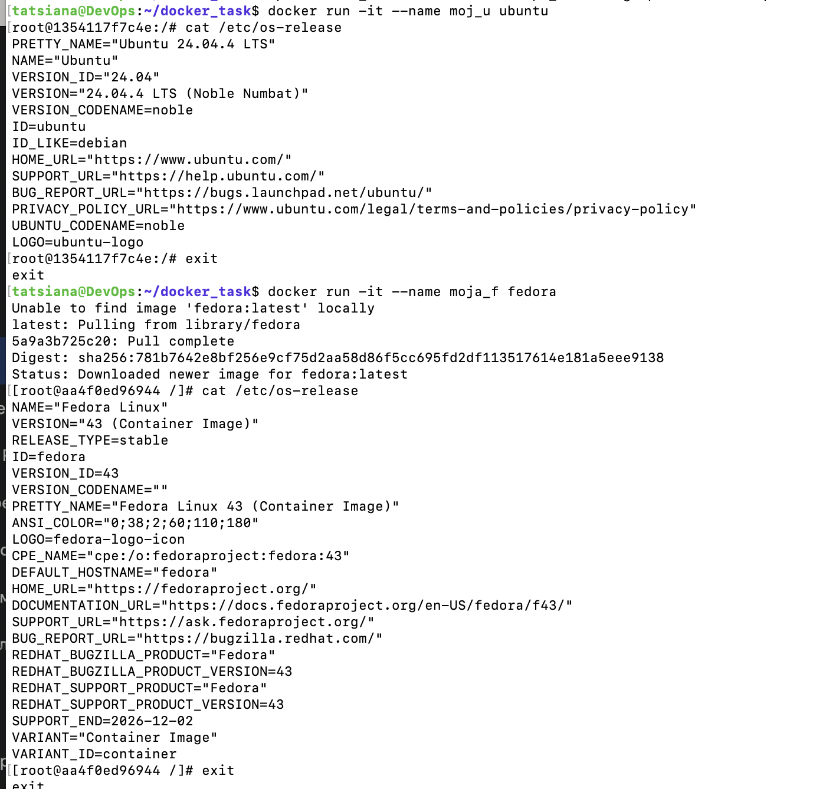

### 5. Własny obraz (Dockerfile)
Napisano własny plik `Dockerfile`, oparty o obraz `ubuntu:latest`. W pliku zawarto instrukcje automatycznej instalacji programu Git oraz sklonowania przedmiotowego repozytorium na obraz kontenera. Obraz został pomyślnie zbudowany, a następnie zweryfikowany w trybie interaktywnym (potwierdzono obecność folderu z repozytorium komendą `ls`). Utworzony plik dołączono do niniejszego sprawozdania.

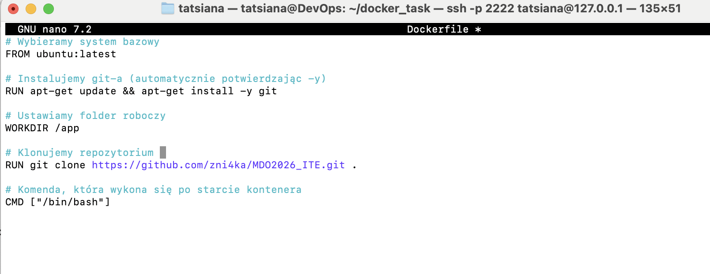
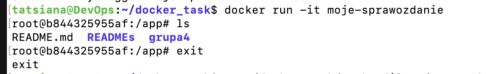

### 6. Sprzątanie środowiska
Na koniec pracy wyczyszczono środowisko. Wyświetlono listę wszystkich zatrzymanych kontenerów, a następnie usunięto je (`docker container prune`) oraz usunięto z dysku lokalnego nieużywane już obrazy bazowe (`docker image prune -a`).

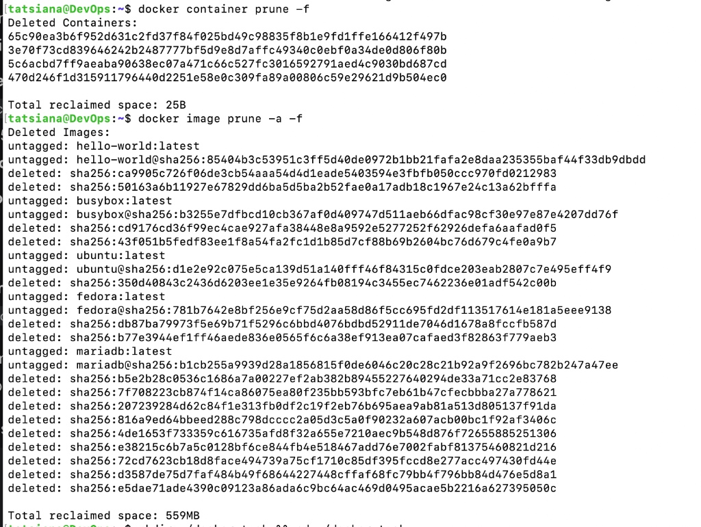
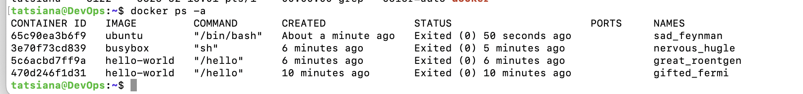