# Sprawozdanie 1 

Autor: **Jan Pawelec**

## Konfiguracja połączenia SSH
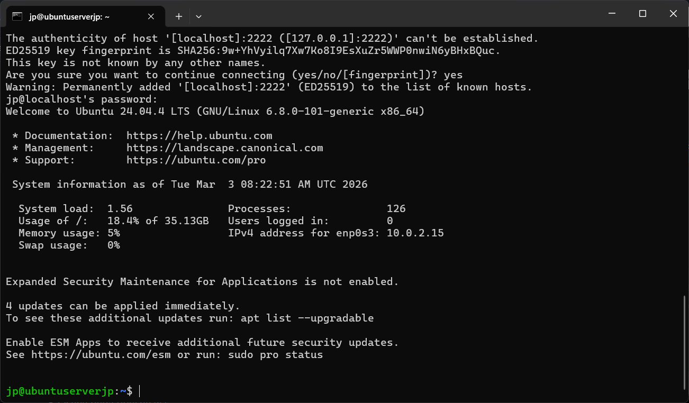

## Instalacja Git na maszynie
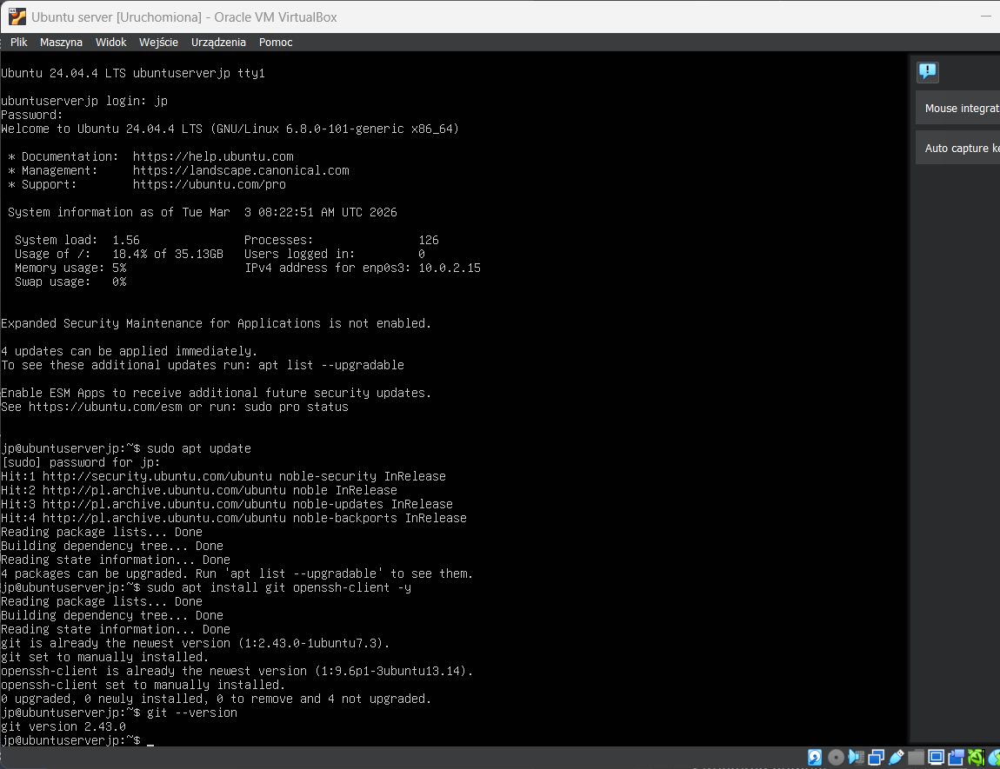

## Klonowanie repozytorium

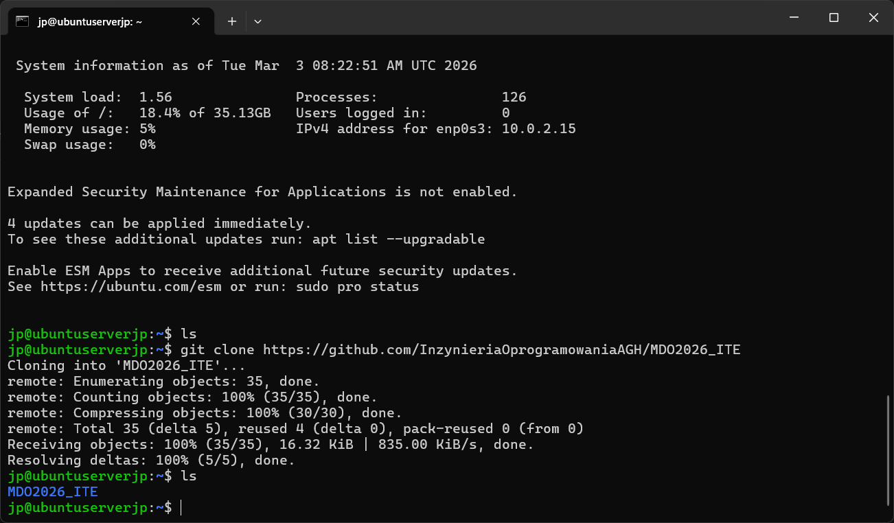

## Generowanie klucza bez hasła

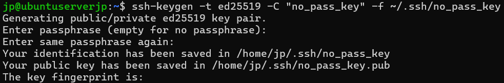

## Generowanie klucza z hasłem

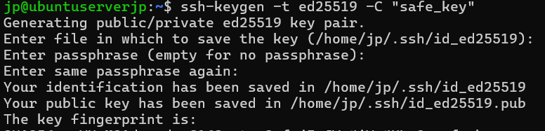

## Dodanie klucza do Git

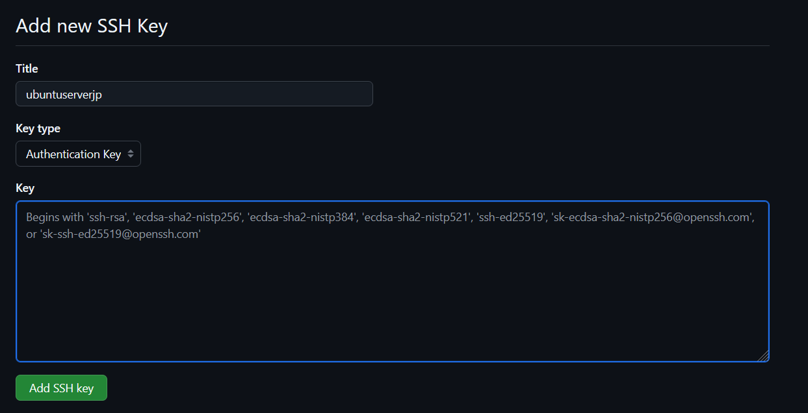

## Test połączenia z repozytorium

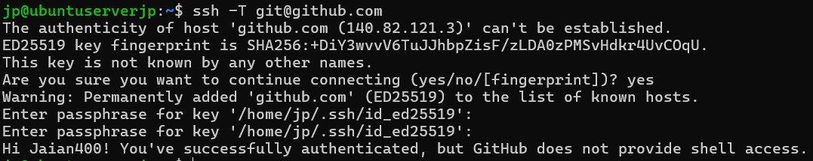

## Test klonowania repozytorium przez SSH

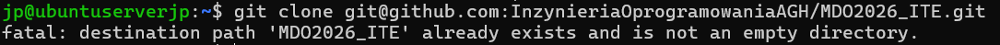

## Weryfikacja dwuetapowego uwierzytelniania

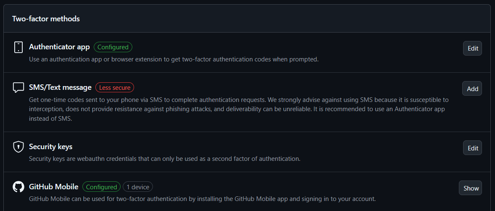

## Dostęp za pomocą Filezilla

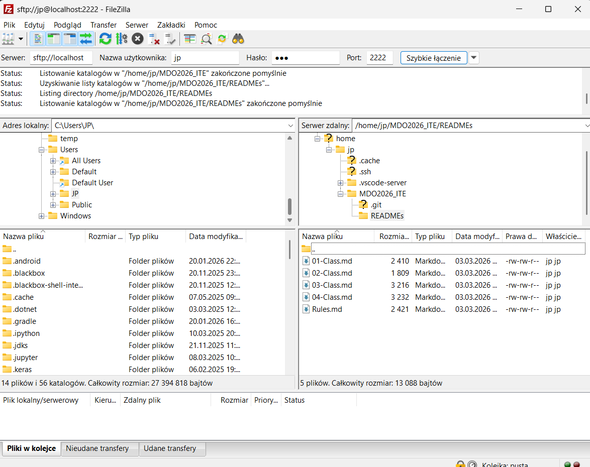

## Dostęp po SSH za pomocą VS CODE

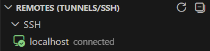

## Stworzony nowy branch

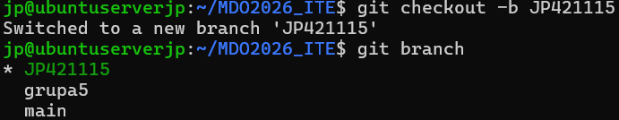

## Utworzenie podfolderu

## Implementacja Git Hook

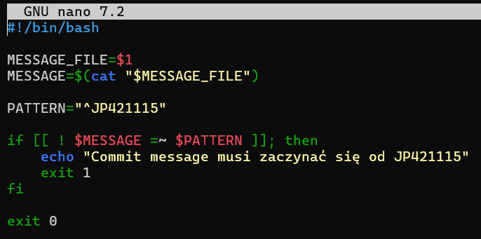

## Status dodanych treści

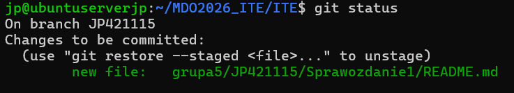

