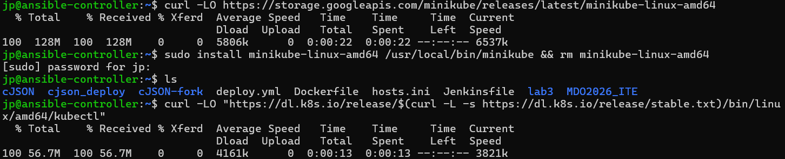
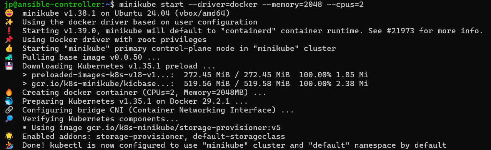
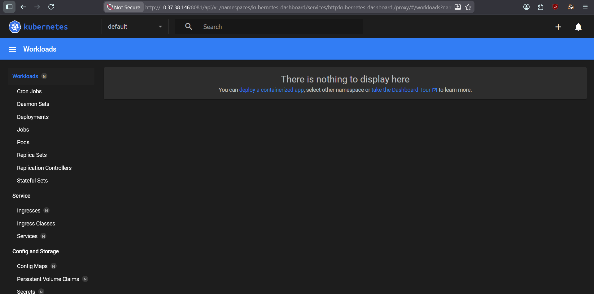
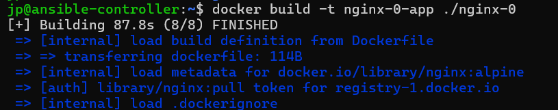
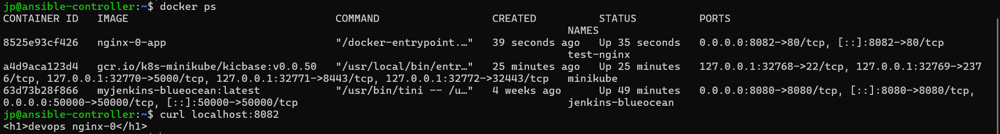
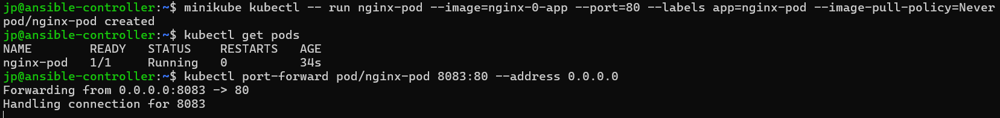
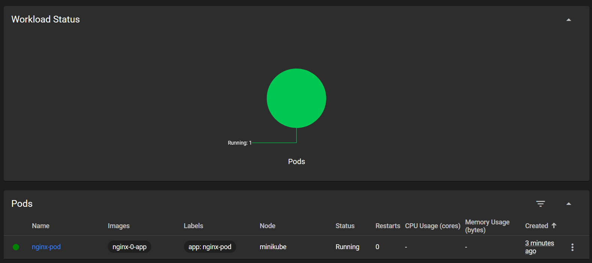
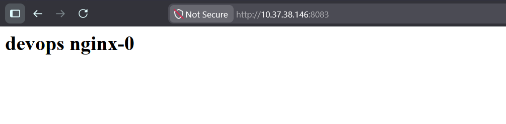
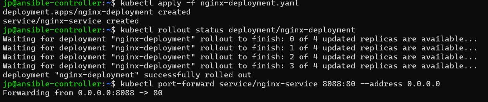
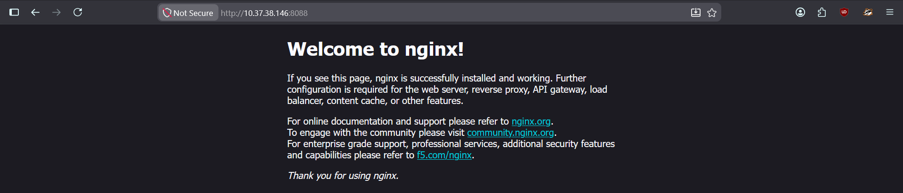

# Sprawozdanie 10
Autor: Jan Pawelec

---

# Instalacja klastra Kubernetes
Zainstalowano pakiety `minikube` i `kubectl`.

Uruchomiono klaster na minimalnej ilości zasobów, zgodnie z tym co przedstawia dokumentacja. Radzi ona także posiadać 20GB przestrzeni dyskowej, co jest zachowane, gdyż przy tworzeniu maszyny zadbano o to. 

Uruchomiono dashboard. Klasycznym poleceniem z dokumentacji nir uzyskano pozytywnych rezultatów, więc zastosowano `kubectl proxy --port=8081 --address='0.0.0.0' --accept-hosts='^.*'`.

---

# Analiza posiadanego kontenera
Wcześniej wybrana aplikacja (biblioteka cJSON) nie spełnia nowopostawionych warunków. Z tego powodu, w tym laboratorium będzie prowadzony deplot `nginx`. Stworzono prostego html obrazującego działanie z nagłówkiem `devops nginx-0`. Napisano Dockerfile (załączony). Nastęnie zbudowano obraz.

Sprawdzono poprawność działania Dockera.

Następnie zapisano rezultat do `.tar` i wczytano do minikube poleceniem `minikube image load`.

---

# Uruchamianie oprogramowania
Załadowany obraz uruchomiono w podzie. Dodano `--image-pull-policy=Never`, gdyż w innym przypadku k8s nie szuka w lokalnych obrazach tylko w swej bazie.

Sprawdzono także poprawność działania w dashboard.

Uruchomiono eksponowaną przez pod stronę, która włączyła się poprawnie.

---

# Przekucie wdrożenia manualnego w plik wdrożenia (wprowadzenie)
Sporządzono plik `.yaml` (załączony). Sprawdzono status za pomocą `rollout`.

Potwierdzono działanie wyeksponowanej usługi.
