# Sprawozdanie 11
Autor: Jan Pawelec

---

# Przygotowanie nowego obrazu
Jako pierwszą wersję wzięto build z poprzedniego laboratorium `nginx-0`. Skopiowano go i zmieniono w docelowym html nagłówek tak, że powstała wersja `nginx-1`. Do tego napisano zepsutą wersję `nginx-bad`, w której Dockerfile'u istnieje komenda odnosząca się do nieisntiejącego folderu. Wszelkie pliki załączono.

Obrazy zbudowano poleceniem `docker build -t nginx:v0 ./nginx-0` (i analogiczne inne wersje), a następnie załadowania na minikube poleceniem `minikube image load nginx:v0`. Zgodnie z poleceniem, zepsuty obraz jeszcze nie uległ uszkodzeniu. Komenda `CMD` dopiero podczas uruchomienia spowoduje awarię.
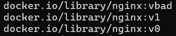

---

# Zmiany w deploymencie
Skopiowano plik .yaml z poprzedniego laboratorium. Ustawiono odpowiednie obrazy, zmieniono liczbę replik na 4. Następnie na 8, a potem na 1. Widoczne na poniższym zrzucie ekranu jest działanie narzędzia. Uruchamianie nowych 4 podów trwa w trakcie wyświetlania. W przypadki zmniejszenia widoczna jest operacja `Terminate` na nadmiarowych.
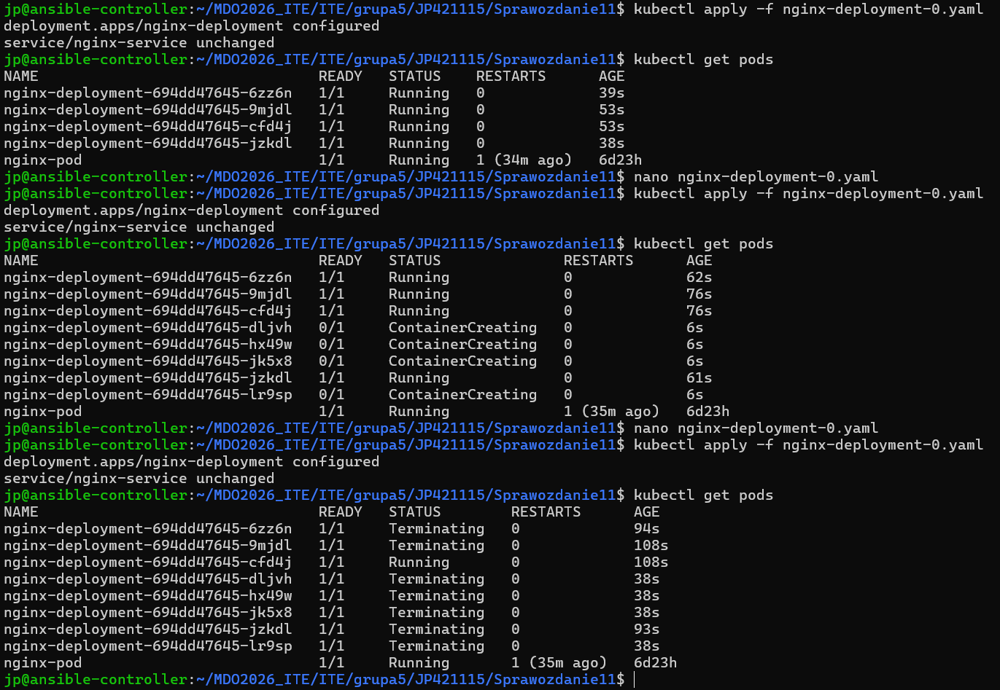

Po zmianie liczby replik na 0, działa tylko bazowy pod.
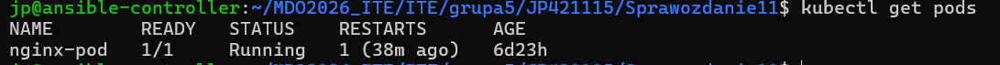

Ponownie przeskalowano do 4. Uruchomiono na drugiej wersji obrazu (błąd z encodingiem zaskakujący).
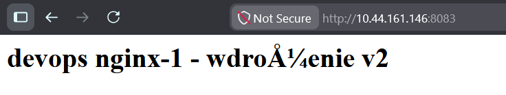

Następnie uruchomiono na starej wersji z poprzedniego laboratorium.
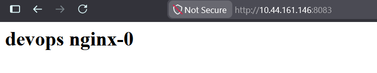

Następnie spróbowano uruchomić wersję zepsutą. Kubernetes po wywaleniu błędu nie kontynuwoał działań, więc stare pody dalej funkcjonują, co sprawia, że ostateczna aplikacja pozostała funkcjonalna.
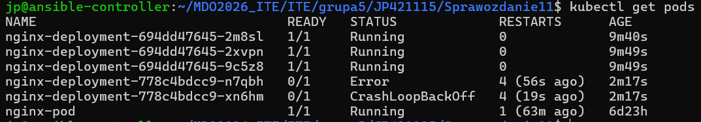

Na koniec sprawdzono historię i przeprowadzono przywrócenie do poprzedniej wersji. Błąd wynika z polecenia `imagePullPolicy: Never`. Obraz został usunięty (zastąpiony nowym), więc przy cofnięciu się do wersji nie przeprowadził pull.
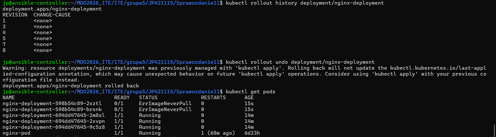

---

# Kontrola wdrożenia
W przykładowym jednym wdrożeniu widoczne jest zaprogramowane polecenie, mające na celu nieprawidłowe zakończenie operacji.
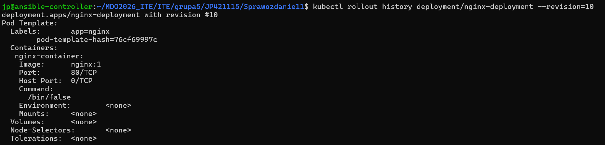

Napisano skrypt `check-deployment.sh`, który kontroluje wdrożenie co 5 sekund. Wpierw przetestowano działający build.
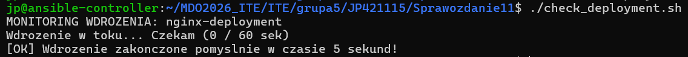

Następnie sprawdzono na nieprawidłowym.
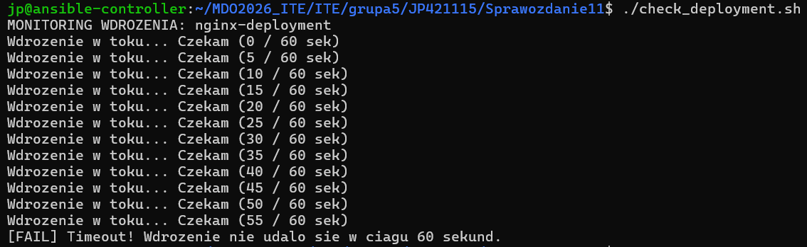

---

# Strategie wdrożenia
Utworzono nowy `strategy-recreate.yaml`, gdzie dodano stosowną linijkę. W ten sposób silnik nie korzysta ze starych podów tylko tworzy nowe.
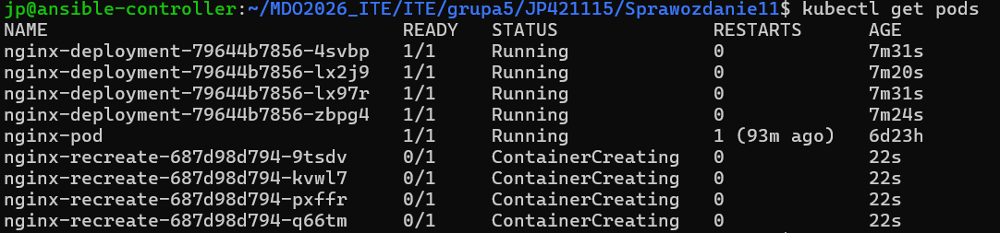

Przy `strategy-rolling.yaml` bez zmiany wersji nic się nie dzieje, gdyż program nie wykrywa zmian.
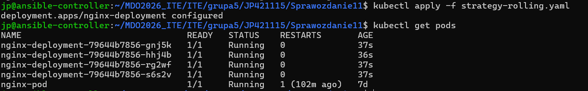

Z kolei po zmianie wersji na poprzednią, widoczna jest zmiana podów.
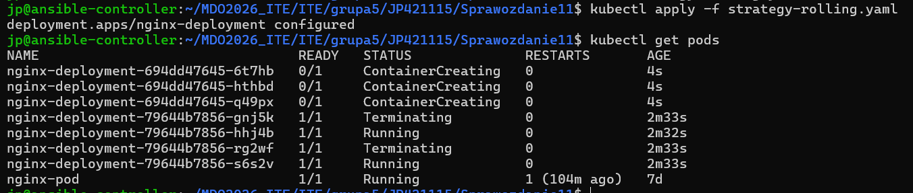

Na koniec napisano `strategy-canary.yaml`. Polega on na mieszaniu buildów. Widoczny efekt jest na liście podów. Statystycznie rzecz biorąc, co czwarte wejście powoduje ujrzenie innej wersji.
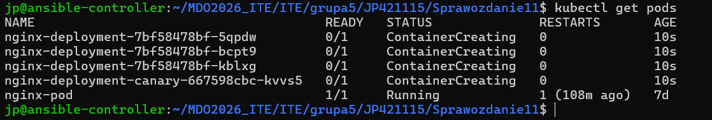