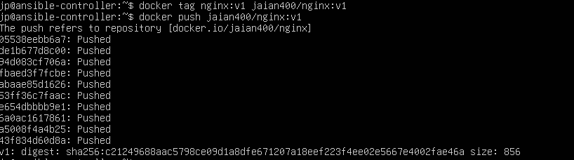
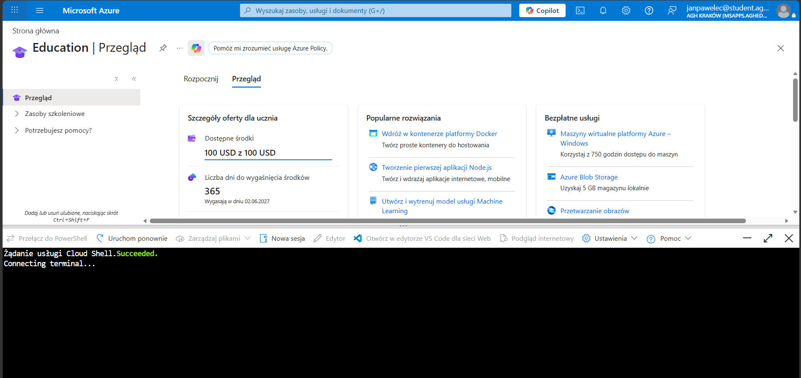
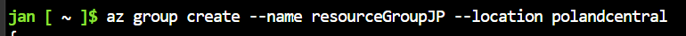
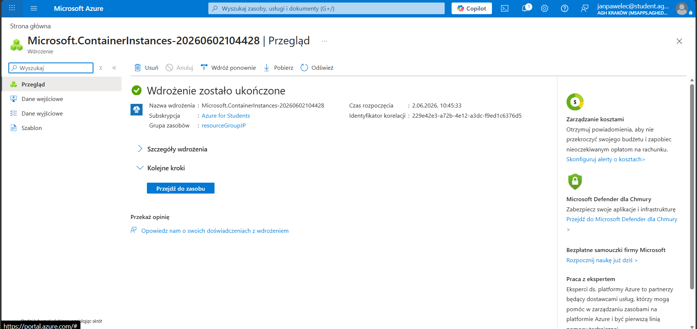
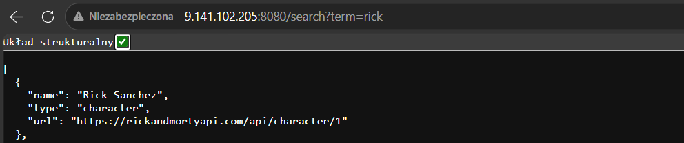
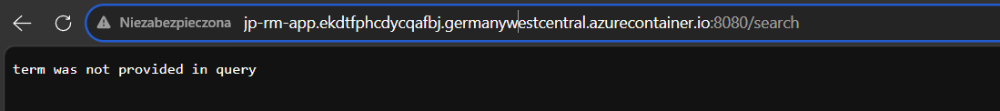
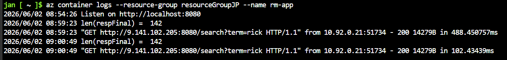

# Sprawozdanie 12
Autor: Jan Pawelec

---

# Przygotowanie kontenera
Skorzystano z aplikacji nginx, wcześniej stworzonej. Wypchano ją na docker hub.


---

# Zapoznanie z platformą
Zarejestrowano się na platformie i połączono z powłoką.


---

# Zadanie do wykonania
Utworzono Resource group poleceniem.


UWAGA! Polska na region to zły wybór, gdyż konta studenckie nie mają dostępu do tych zasobów. Zamiast tego zastosowano `eastus`.
UWAGA! Zmieniono repo, gdyż Azure blokuje nginx.

Zdecydowano się na własne repo z adresu: https://github.com/Jaian400/Recruitment-task-SW. (prosty serwer w folderze /ZADANIE_2)
Następnie utworzono kontener na podstawie wcześniej wypchanego obrazu.

Podjęto wiele prób w CLI, jednak błędu z regionem i niedopuszczeniem do zasobów nie udało się zlikwidować. Podjęto próbę w interfejsie graficznym. 

Po jakimś czasie znaleziono listę dostępnych regionów, nie były one oczywiste: ["austriaeast","spaincentral","centralindia","francecentral","germanywestcentral"]. Wybrano "germanywestcentral".

Okazało się, że mimo sugestii prowadzącego, nie było żadnego problemu z dystrybuowaniem `nginx`, a jedynie problem z regionem, co było wyraźnie widoczne w logu błędu.

Polecenie:
```bash
az container create \
  --resource-group resourceGroupJP \
  --name rm-app \
  --image jaian400/rm-app \
  --dns-name-label jp-rm-app \
  --ports 80 \
  --ip-address Public \
  --cpu 1 \
  --memory 1
```

Utworzono z sukcesem kontenerem z autorskim oprogramowaniem.


Po adresie IP, aplikacja działa. 


Sprawdzono też czy po adresie działa.


Sprawdzono też logi.


Na koniec usunięto wszelkie ślady działalności.