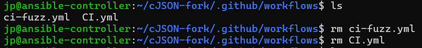
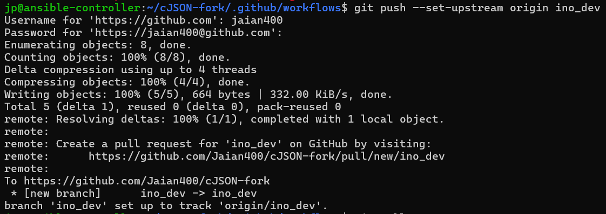
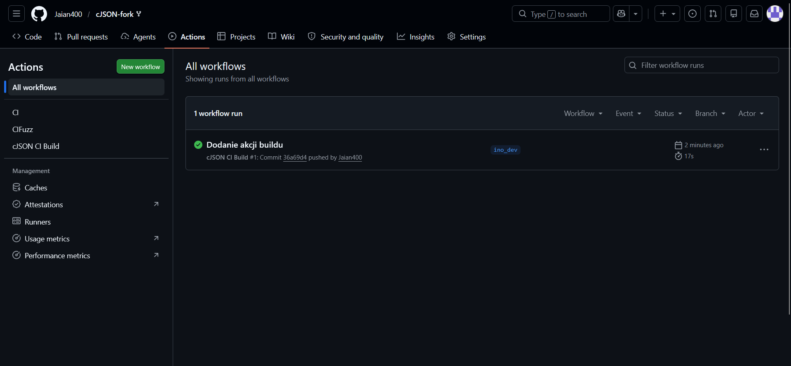
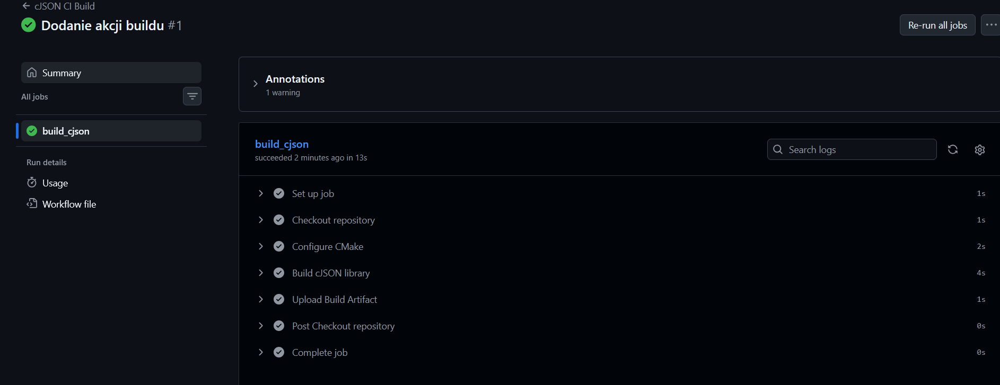
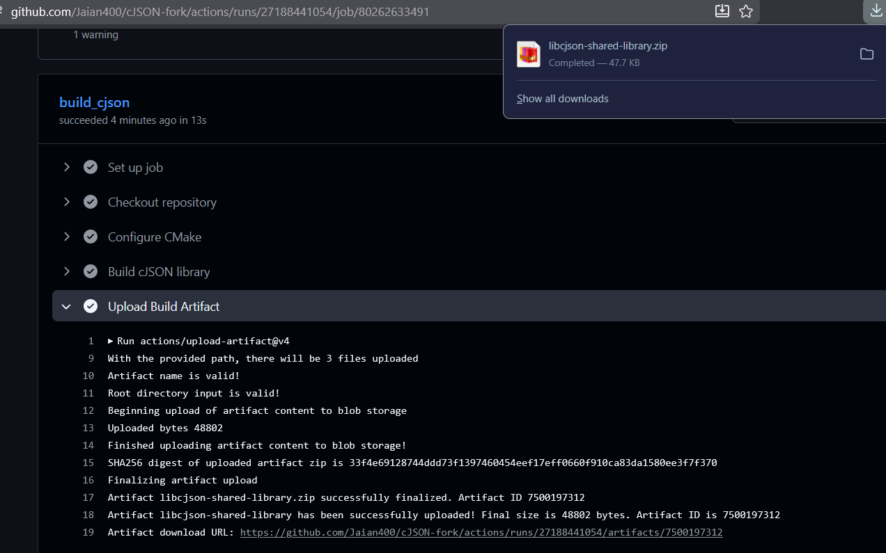

# Sprawozdanie 13
Autor: Jan Pawelec

---

# Github actions oraz fork repozytorium
Zapoznano się z koncepcją akcji na githubie. Cennik jest korzystny, gdyż dla publicznych repozytoriów usługa jest nielimitowana. Z kolei, przy użytku prywatnych darmowy plan jest dosyć hojny. 

W poprzednich laboratoriach korzystano z [forka](https://github.com/Jaian400/cJSON-fork) `cJSON`, więc zdecydowano kontynuować te praktykę. Repozytorium jest dostępne pod linkiem. Usunięto dotychczasowe `workflows`.


# Akcja build
Stworzono akcję, która w reakcji na commit na branch `ino_dev` wykonuje proces zbudowania projektu. Jej skrypt prezentuje się następująco.

```yaml
name: cJSON CI Build

on:
  push:
    branches:
      - ino_dev

jobs:
  build_cjson:
    runs-on: ubuntu-latest

    steps:
      - name: Checkout repository
        uses: actions/checkout@v4

      - name: Configure CMake
        run: |
          mkdir build
          cd build
          cmake ..

      - name: Build cJSON library
        run: |
          cd build
          make

      - name: Upload Build Artifact
        uses: actions/upload-artifact@v4
        with:
          name: libcjson-shared-library
          path: build/libcjson.so*
```

Następnie zpushowano zmiany z brancha `ino_dev`.


Sprawdzono na stronie github poprawność rozwiązania.


Akcja wykonała się w kilka sekund bez zarzutu. Zaletą takowej jest oparcie całkowicie na chmurze GitHuba, efektywnie oszczędzając pracy i miejsca na dysku lokalnej maszynie.


Biblioteka jest dostępna do pobrania.
