# Sprawozdanie 2

Autor: Jan Pawelec

---

## Instalacja Dockera
Wpierw pobrano curlem oficjalne repo.
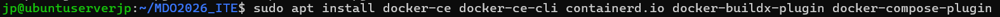

## Róznorodne obrazy
Pobrano pełną listę obrazów. Poniżej pobrano przykładowy obraz. Uruchomiono i sprawdzono rozmiar.
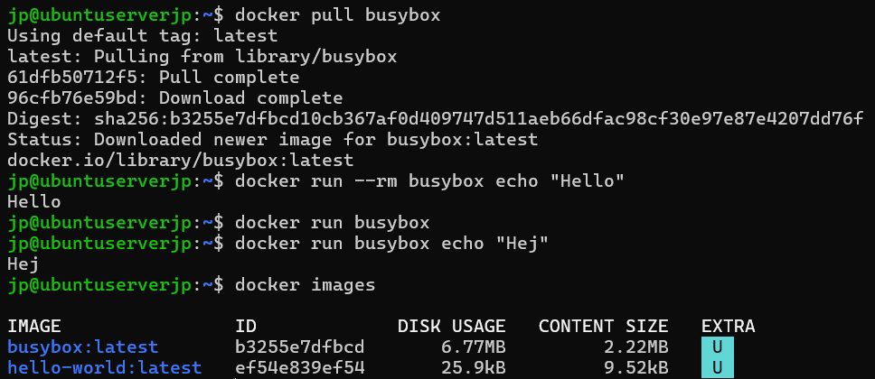
Sprawdzono też Microsoftowy aspnet.
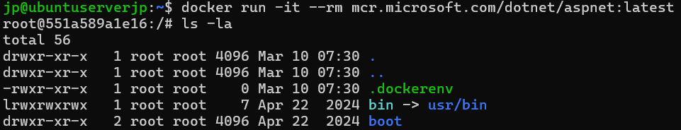
Siegnięto do znanego z baz danych mariadb.
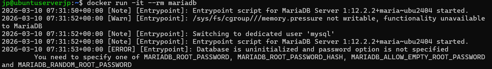
Pełna lista obrazów i ich rozmiarów prezentuje sie następująco.
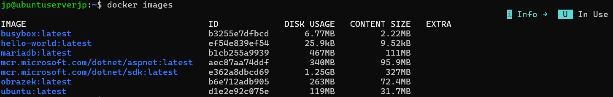
Następnie spojrzano na kod wyjścia.
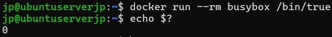
Sprawdzono także wersję.
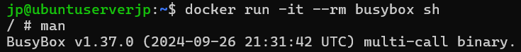

## System w kontenerze
Pobrano i uruchomiono obraz Ubuntu, pobrano PID1.
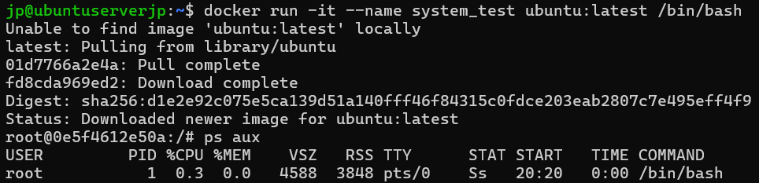
Sprawdzono procesy Dockera w hoście.
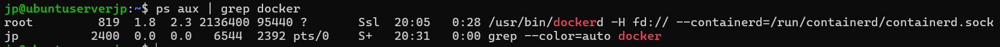
Przeprowadzono update na obrazie.
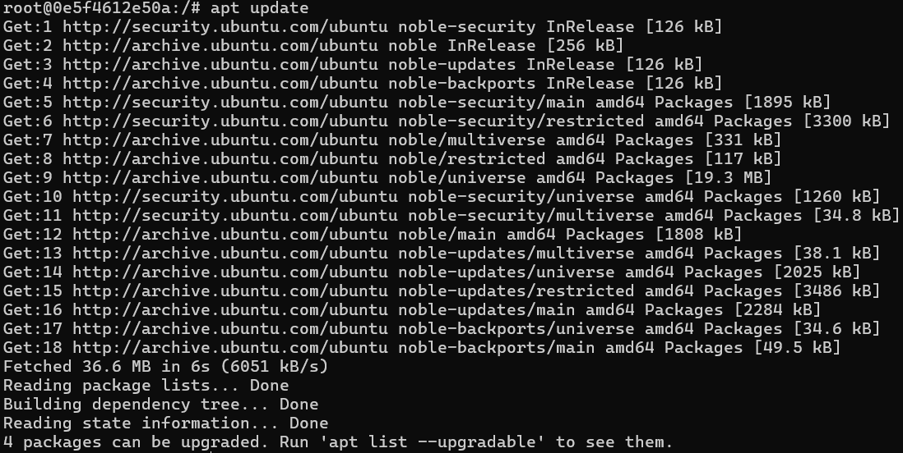

## Dockerfile
Treść Dockerfile jest załączona w folderze. Dokonano build i następnie uruchomiono skrypt. Można zobaczyć aktywny obraz z pobranym repo.
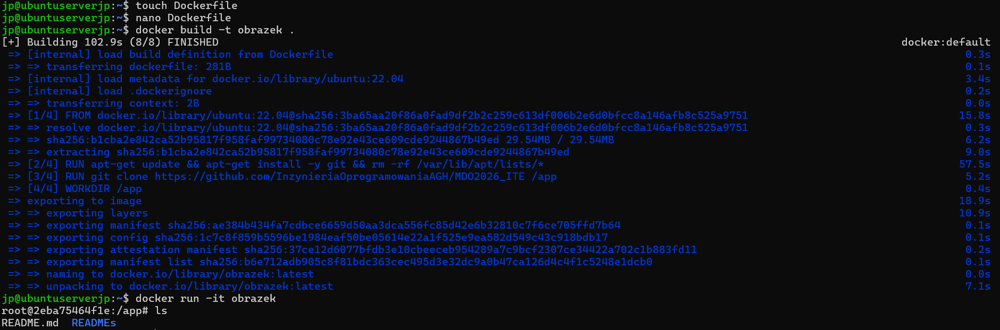

## Obrazy - ostatni rozdział
Sprawdzono listę uruchomionych obrazów.
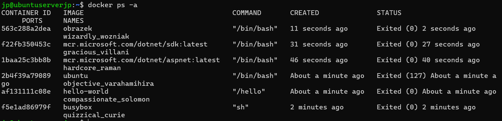
Następnie przeprowadzono czyszczenie całej listy.
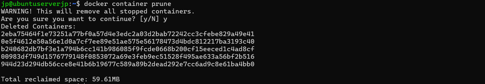