# Sprawozdanie 3

Autor: Jan Pawelec

## Proste operacje
Wybrano cJSON - otwartoźródłowe repo spod linku: [cJSON](https://github.com/DaveGamble/cJSON)

### Klonowanie repozytorium

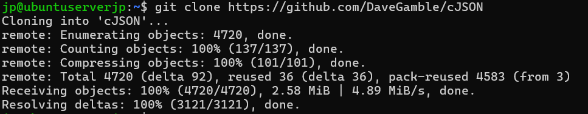

### Build programu

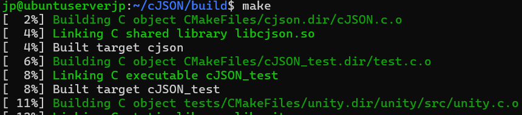

### Test programu

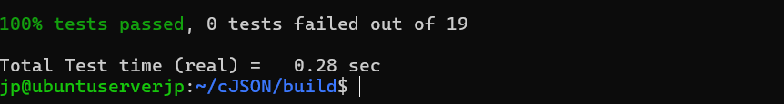

## Kontener
Poniższe opreacje pracy z programem wykonano na kontenerze.

### Uruchomienie kontenera

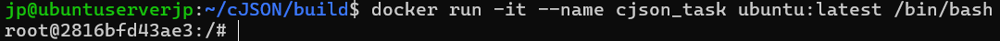

### Build na kontenerze

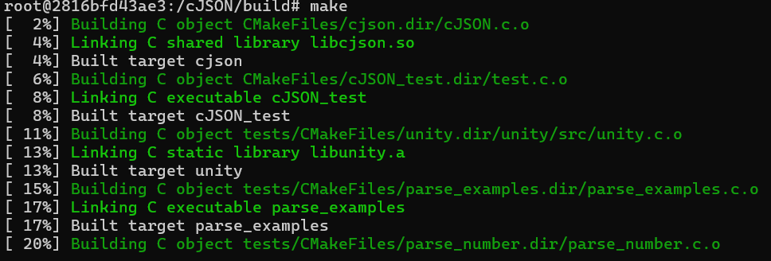

### Uruchomienie testu na kontenenerze

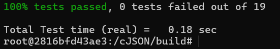

## Dockerfile
Skompresowano operacje z powyższego rozdziału do Dockerfile. W folderze znajdują się kody źródłowe obu programów.

### Obraz do budowania

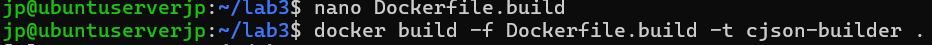

### Obraz do testów

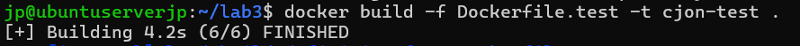

### Uruchomienie testów

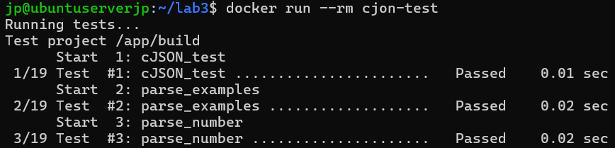

## Docker compose
Na koniec zamknięto proces w kompozycję. 

### Kod 

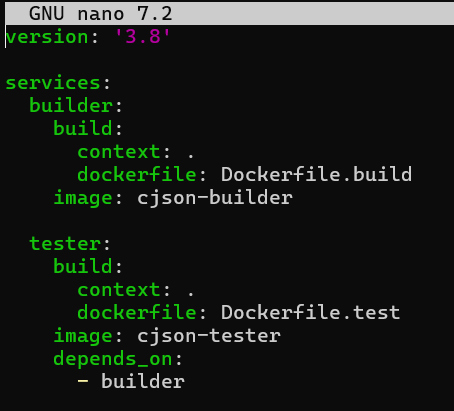

### Uruchomienie testów przez compose

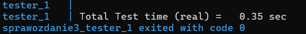

## Dyskusja

1) Rzeczony program jest w zasadzie biblioteką. Budowanie go w kontenerze jest wysoce rozsądne, jednak nie ma sensu go wdrażać. Gdyby jakieś API korzystało z jego funkcjonalności, wtedy jak najbardziej możnaby wdrażać i publikować jako kontener.
2) Absolutną koniecznością jest oczyszczenie artefaktu po buildzie, stąd popularność multi-stage build, gdzie z pierwszej części wyciągana jest tylko gotowa binarka.
3) Dedykowana ścieżka to świetne rozwiązanie, gdyż pozwala rozdzielić build od publikacji. W drugiej fazie można zadecydować o formacie dystrybucji, nie zanieczyszczając repo źródłowego.
4) W przypadku cJSON dystrybucja jako pakiet to najlepszy kierunek.
5) Powyższy format można zapewnić np. tworząc trzeci kontnener, w którym dojdzie do spakowania. Operacja mogłaby się kończyć pakowaniem do .zip, .deb etc.