# Sprawozdanie 4

Autor: Jan Pawelec

---

# Zachowywanie stanu między kontenerami

## Tworzenie woluminów
Woluminy pozwalają na zapis danych z kontenerów.

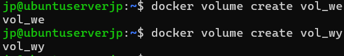

## Klonowanie repozytorium na wolumin wejściowy
Użyty został kontnener pomocniczy. Takowy klonuje kod, wysyła go do woluminu i następnie sam się usuwa. Dzięki temu Git nie jest obecny poza tymczasowym kontenerem i nie zaśmieca właściwego rozwiązania.

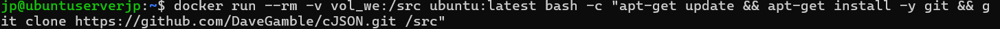

## Uruchomienie buildu w kontenerze
Uruchomiono build w tymczasowym kontenerze. Pliki zapisano na folderze /dest w kontenerze wyjściowym.

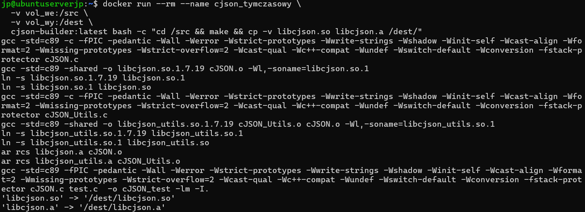

## Ręczne klonowanie wewnątrz kontenera

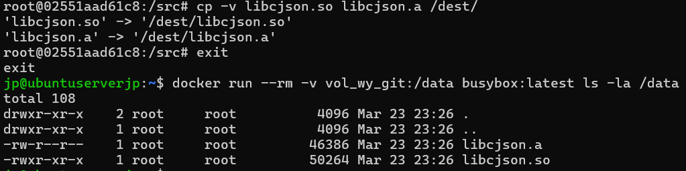

Za pomocą Dockerfile możnaby powyższe działanie uzyskane w kilku komendach streścić. Efekt ten sam, a proces spisany w formie pliku. 

--- 

# Eksponowanie portu i łączność między kontenerami

## Iperf

### Serwer iperf
Wyeksponowano kontener jako serwer iperfa. Następnie sprawdzono jego adres IP.

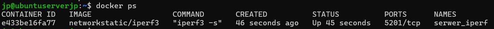

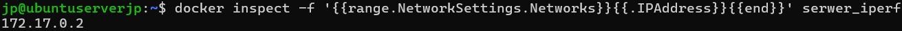

### Serwer kliencki
Uruchomiono kliencki obraz Ubuntu. 

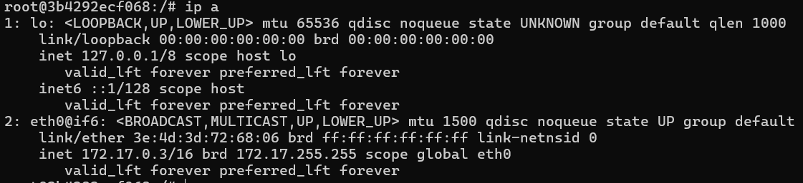

Rozpoczęto test iperf. Uzyskano pokaźne wyniki. Szybkość połączenia na poziomie gigabajtowym.

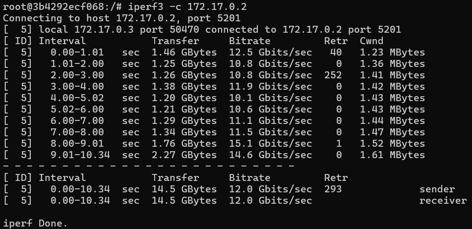

## Network Create

### Tworzenie sieci
Utworzono sieć mostkową.

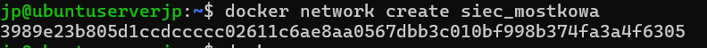

### Test połączenia z kontenera
Testowano połączenie między kontenerami, ponownie uzyskując przepływ bardzo szybki.

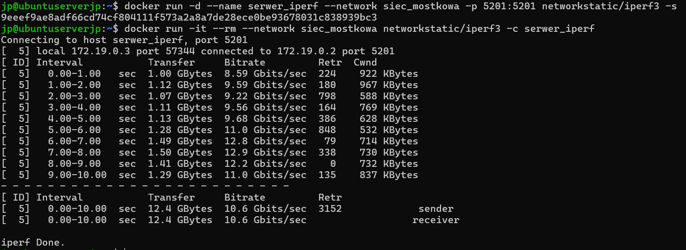

### Test połączenia z serwera
Test z serwera także dał podobne wyniki. Transfer następował w ramach jednej fizycznej maszyny.

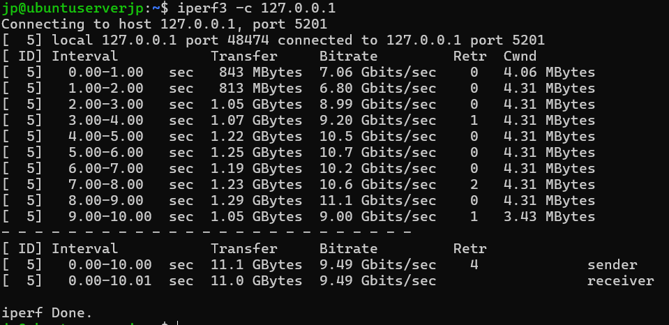

Log umieszczono w pliku log_iperf.txt.

---

# Usługi w rozumieniu systemu, kontenera i klastra
Uruchomiono obraz z serwerem ssh.

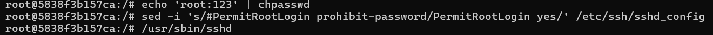

Następnie połączono się po ssh.

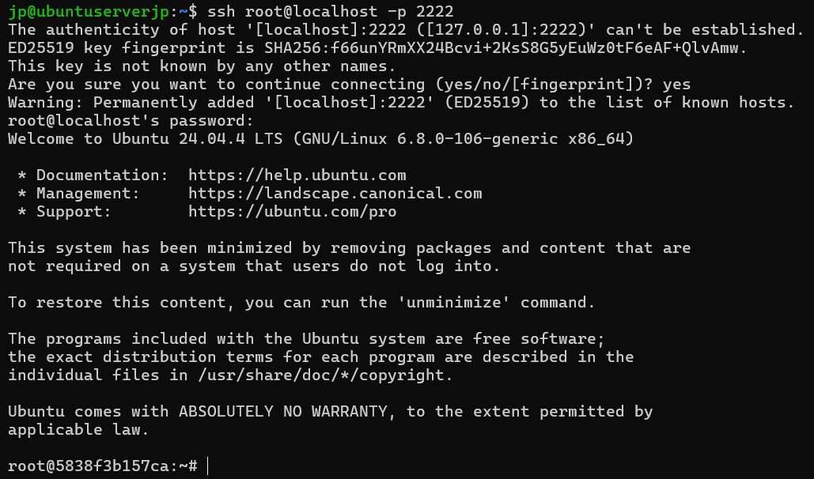

Komunikacja ssh to bezpieczny sposób na wymianę danych i pracę na serwerze, jednak w przypadku kontnera istnieją inne narzędzie zaprojektowane specyficznie dla tej technologii. Zdecydowanie łatwiej jest odpalić docker exec -it container bash.

---

# Przygotowanie do uruchomienia serwera Jenkins
Zestawiono sieć pomocniczą. Uruchomiono serwer DinD (Docker in Docker).

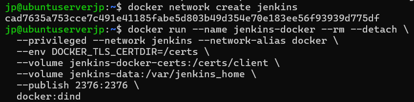

Uruchomiono serwer jenkins.

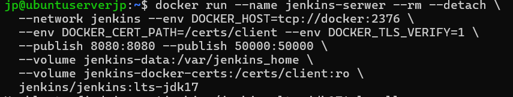

Oba kontenery działają poprawnie.

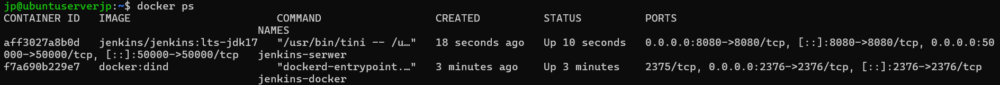

Uruchomiono przeglądarke i zalogowano się wyłuskanym kluczem do usługi jenkins.

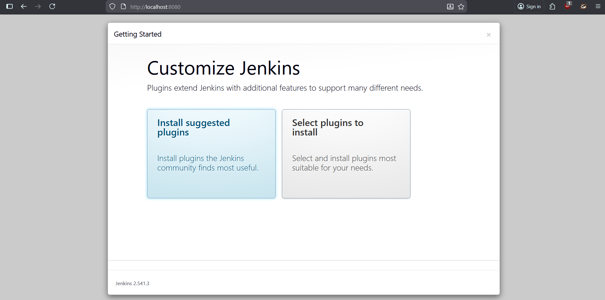