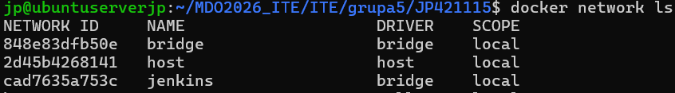
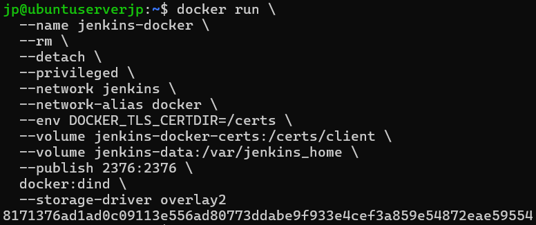
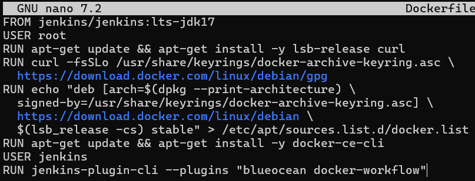
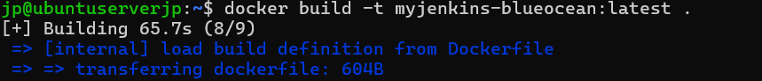
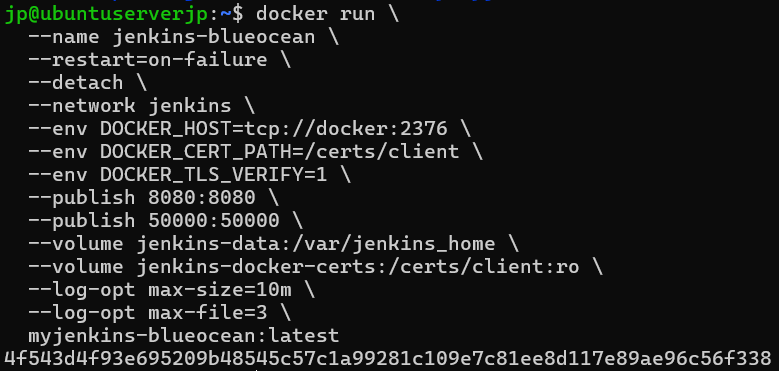
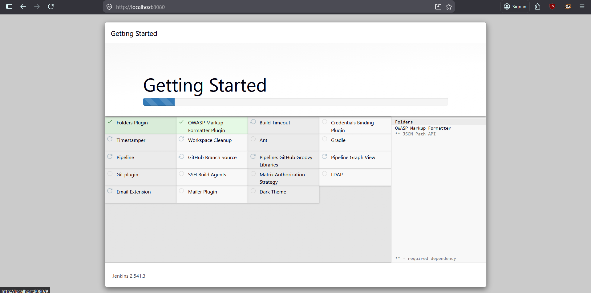
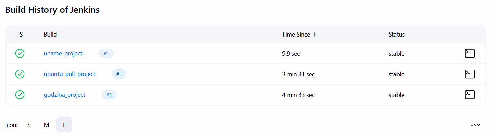
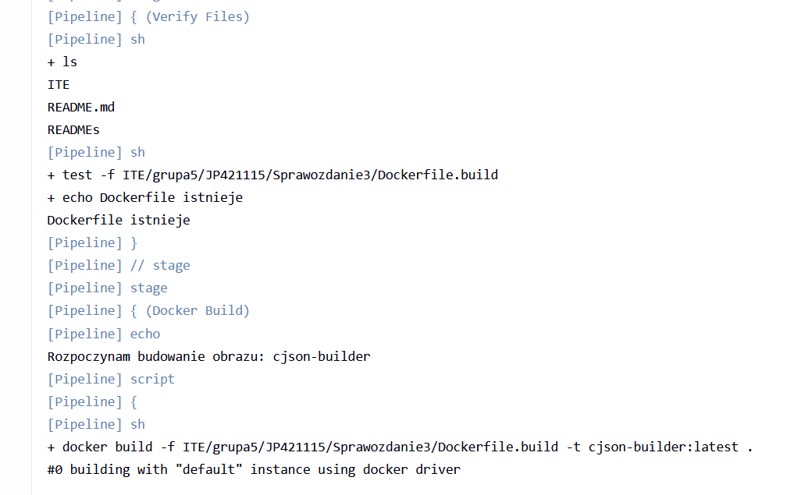
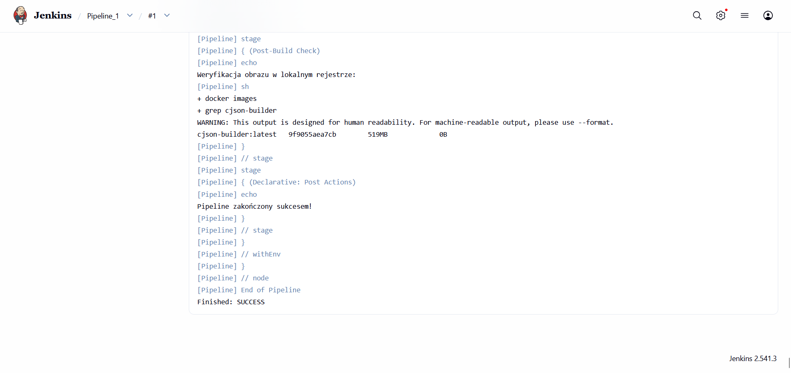
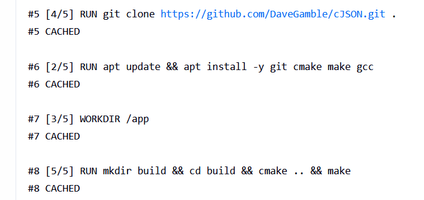

# Sprawozdanie 5
Autor: Jan Pawelec

# Pipeline, Jenkins, izolacja etapów

## Przygotowanie
Skorzystano z wcześniej utworzonej sieci.



Utworzono jenkins za pomocą DinD.



Przygotowano obraz blueocean za pomocą Dockerfile.



Przeprowadzono build obrazu.



Uruchomiono blueocean z wszelkimi zabezpieczeniami logów.



Na stronie Jenkins pobrano pakiety, po czym przeprowadzono restart w celu przygotowania do dalszych działań.



## Zadanie wstępne: uruchomienie
Utworzono po kolei Jenkinsowe projekty, w których dodano krok związany z powłoką.

Skrypt 1: `uname -a`

Skrypt 2:
```bash
HOUR=$(date +%H)
echo "Aktualna godzina: $HOUR"
if [ $((HOUR % 2)) -ne 0 ]; then
  echo "BŁĄD: Godzina $HOUR jest nieparzysta!"
  exit 1
fi
echo "Godzina parzysta - wszystko OK."
```

Skrypt 3: `docker pull ubuntu`

Następnie uruchomiono projekty.


## Zadanie wstępne: obiekt typu pipeline
Utworzono nowy `pipeline`. Napisano kompletny wieloetapowy skrypt, wykonujący wszystkie założenia.

```bash
pipeline {
    agent any

    environment {
        REPO_URL = 'https://github.com/InzynieriaOprogramowaniaAGH/MDO2026_ITE.git'
        BRANCH_NAME = 'JP421115'
        DOCKERFILE_PATH = 'ITE/grupa5/JP421115/Sprawozdanie3/Dockerfile.build'
        IMAGE_NAME = 'cjson-builder'
    }

    stages {
        stage('Cleanup') {
            steps {
                echo "cleanWs"
                cleanWs()
            }
        }

        stage('Clone & Checkout') {
            steps {
                echo "Repo z branch: ${BRANCH_NAME}"
                git branch: "${BRANCH_NAME}", url: "${REPO_URL}"
            }
        }

        stage('Verify Files') {
            steps {
                sh 'ls'
                sh "test -f ${DOCKERFILE_PATH} && echo 'Dockerfile istnieje' || (echo 'BŁĄD: Nie znaleziono pliku pod ${DOCKERFILE_PATH}'; exit 1)"
            }
        }

        stage('Docker Build') {
            steps {
                echo "Rozpoczynam budowanie obrazu: ${IMAGE_NAME}"
                script {
                    sh "docker build -f ${DOCKERFILE_PATH} -t ${IMAGE_NAME}:latest ."
                }
            }
        }

        stage('Post-Build Check') {
            steps {
                echo "Weryfikacja obrazu w lokalnym rejestrze:"
                sh "docker images | grep ${IMAGE_NAME}"
            }
        }
    }

    post {
        success {
            echo "Pipeline zakończony sukcesem"
        }
        failure {
            echo "Pipeline failure"
        }
    }
}
```

Fragment pracy z konsoli w trakcie (widoczne jest zastosowanie zakodowanych wcześniej komend):


Pipeline zakończył się sukcesem.


Drugie uruchomienie zakończyło się znacznie szybciej, gdyż Jenkins pozozstawił w cache część plików. Docker sprawdza czy w wolumenie `jenkins-docker`, służącego przy `DinD`, istnieją pliki wywoływane identycznymi komendami. 
