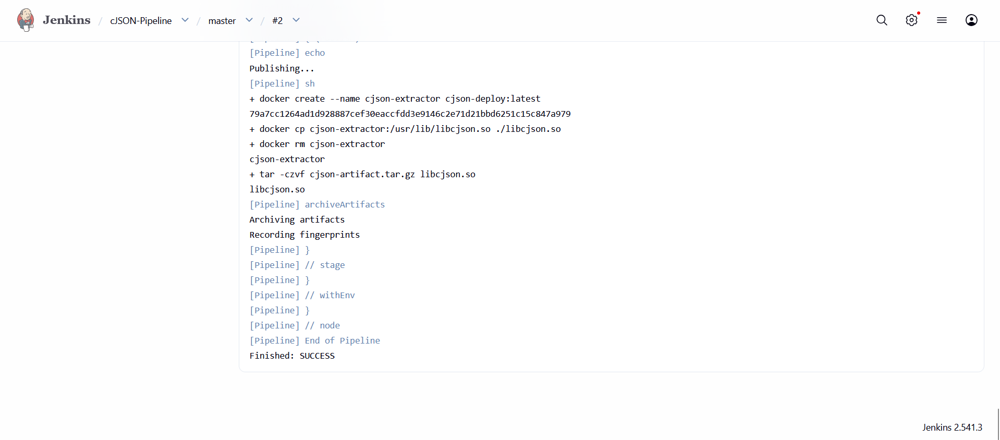
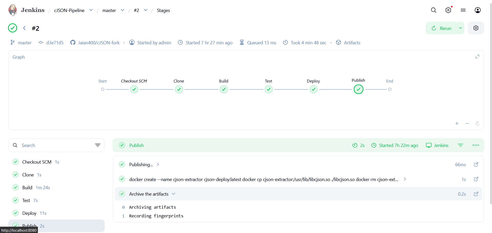
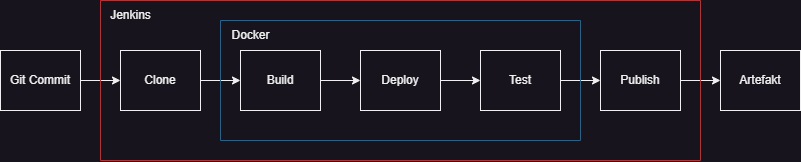

# Sprawozdanie 6
Autor: Jan Pawelec

# Ścieżka krytyczna
W tej części wykonano wyłączenie kroki ścieżki krytycznej. Utworzono fork biblioteki `cJSON`. Sklonowano na maszynę repozytorium, by rozpocząć pracę. Napisano `Dockerfile`, zgodny z wymaganiami, składający się z 3 etapów: build, test, deploy.
```bash
# BUILD
FROM alpine:latest AS builder
RUN apk add --no-cache gcc make musl-dev
WORKDIR /app
COPY . .
RUN make all

# TEST 
FROM builder AS tester
RUN make test

# DEPLOY 
FROM alpine:latest AS deploy
WORKDIR /app
COPY --from=builder /app/libcjson.so /usr/lib/
CMD ["ls", "-l", "/usr/lib/libcjson.so"]
```

Następnie, utworzono `Jenkinsfile`, by przygotować kompleksowy `pipeline`.
```bash
pipeline {
    agent any

    stages {
        stage('Clone') {
            steps {
                checkout scm
            }
        }

        stage('Build') {
            steps {
                echo "Building..."
                sh 'docker build --target builder -t cjson-builder:latest .'
            }
        }

        stage('Test') {
            steps {
                echo "Testing..."
                sh 'docker build --target tester -t cjson-tester:latest .'
            }
        }

        stage('Deploy') {
            steps {
                echo "Deploying..."
                sh 'docker build --target deploy -t cjson-deploy:latest .'
                sh 'docker run --rm cjson-deploy:latest'
            }
        }

        stage('Publish') {
            steps {
                echo "Publishing..."
                sh '''
                docker create --name cjson-extractor cjson-deploy:latest
                docker cp cjson-extractor:/usr/lib/libcjson.so ./libcjson.so
                docker rm cjson-extractor
                tar -czvf cjson-artifact.tar.gz libcjson.so
                '''
                archiveArtifacts artifacts: 'cjson-artifact.tar.gz', fingerprint: true
            }
        }
        
    }
}
```

Następnie, sprawdzono w panelu Jenkins poprawność procesu.


# Pełna lista kontrolna

1. Aplikacja została wybrana
    Wybrano `cJSON`. Posiada on zestaw testów i `make` niezbędny do zbudowania. Repozytorium: Licencja: https://github.com/DaveGamble/cJSON

2. Licencja potwierdza możliwość swobodnego obrotu kodem na potrzeby zadania
    Licencja MIT, jak najbardziej pozwala na kopiowanie i wprowadzanie dowolnych modyfikacji. Licencja: https://github.com/DaveGamble/cJSON?tab=MIT-1-ov-file.

3. Wybrany program buduje się oraz 4. Przechodzą dołączone do niego testy
    Całość skryptu wyżej wypisanego pipeline działa poprawnie. Widoczny na zrzucie ekranu panel potwierdza efekt.
    

5. Zdecydowano, czy jest potrzebny fork własnej kopii repozytorium
    Zasady kontrybucji nie pozwoliłyby na wrzucenie dwóch plików definujących proces CI/CD. Dokonano własnego fork: https://github.com/Jaian400/cJSON-fork.

6. Stworzono diagram UML zawierający planowany pomysł na proces CI/CD
    

7. Wybrano kontener bazowy lub stworzono odpowiedni kontener wstepny (runtime dependencies)
    Jako kontener bazowy wybrano lekki obraz alpine:latest. Za pomocą menedżera pakietów doinstalowano do niego pakiety niezbędne do kompilacji języka C: `gcc`, `make` oraz `musl-dev`.

8. Build został wykonany wewnątrz kontenera
    Tak, proces kompilacji został odizolowany. W pliku Dockerfile zdefiniowano etap `builder`, w którym po skopiowaniu kodu źródłowego wykonywane jest polecenie `make all` wewnątrz kontenera.

9. Testy zostały wykonane wewnątrz kontenera (kolejnego)
    Tak, proces weryfikacji odbywa się w kolejnym etapie Dockera (etap `tester`), w którym wywoływane jest polecenie `make test`.

10. Kontener testowy jest oparty o kontener build
    Cytując `FROM builder AS tester`.

11. Logi z procesu są odkładane jako numerowany artefakt, niekoniecznie jawnie
    Tak.
    

12. Zdefiniowano kontener typu 'deploy' pełniący rolę kontenera, w którym zostanie uruchomiona aplikacja (niekoniecznie docelowo - może być tylko integracyjnie)
    `Jenkinsfile` posiada sekcje 'deploy'. Tworzy ona docelowy obraz na bazie czystego Alpine Linux, do którego kopiowana jest wyłącznie gotowa biblioteka libcjson.so.

13. Uzasadniono czy kontener buildowy nadaje się do tej roli/opisano proces stworzenia nowego, specjalnie do tego przeznaczenia
    Jeżeli 'tej' oznacza powyższy 'deploy', to kontener `build absolutnie nie nadaje się do tego. Zawiera on narzędzia programistyczne (GCC, Make), co drastycznie zwiększa jego rozmiar oraz powierzchnię potencjalnego ataku.

14. Wersjonowany kontener 'deploy' ze zbudowaną aplikacją jest wdrażany na instancję Dockera
    W etapie `deploy` pipeline'u, kontener jest budowany komendą `docker build --target deploy -t cjson-deploy:latest .`.

15. Następuje weryfikacja, że aplikacja pracuje poprawnie (smoke test) poprzez uruchomienie kontenera 'deploy'
    Kontener wdrożeniowy jest uruchamiany parametrem `docker run --rm cjson-deploy:latest`. Komenda `ls -l /usr/lib/libcjson.so` z Dockerfile sprawdza, czy biblioteka faktycznie istnieje w docelowym miejscu, a po weryfikacji kontener jest automatycznie usuwany.

16. Zdefiniowano, jaki element ma być publikowany jako artefakt
    Jako artefakt publikowane jest archiwum `tar.gz` zawierające skompilowaną bibliotekę dynamiczną `libcjson.so`.

17. Uzasadniono wybór: kontener z programem, plik binarny, flatpak, archiwum tar.gz, pakiet RPM/DEB
    Wybrano archiwum `.tar.gz`, ponieważ jest to uniwersalny standard dystrybucji bibliotek C.

18. Opisano proces wersjonowania artefaktu (można użyć semantic versioning)
    Zastosowano dynamiczne wersjonowanie w stylu Semantic Versioning, oparte o numer wykonania w Jenkinsie. Nazwa pliku generowana jest według wzoru: `cjson-1.0.${BUILD_NUMBER}.tar.gz`.

19. Dostępność artefaktu: publikacja do Rejestru online, artefakt załączony jako rezultat builda w Jenkinsie
    Zastosowano polecenie `archiveArtifacts` w Jenkinsfile. Artefakt jest jawnie dołączony jako rezultat konkretnego builda w interfejsie graficznym Jenkinsa, skąd można go bezpośrednio pobrać.

20. Przedstawiono sposób na zidentyfikowanie pochodzenia artefaktu
    Identyfikowalność zapewniono poprzez użycie flagi `fingerprint: true` w Jenkinsie.

21. Pliki Dockerfile i Jenkinsfile dostępne w sprawozdaniu w kopiowalnej postaci oraz obok sprawozdania, jako osobne pliki
    Skrypty są umieszczone w niniejszym piśmie. Jeśli zaszłaby potrzeba popatrzeć na nie przez pryzmat repozytorium, dostęp można uzyskać poprzez link z forkiem: https://github.com/Jaian400/cJSON-fork.

22. Zweryfikowano potencjalną rozbieżność między zaplanowanym UML a otrzymanym efektem
    Nie dostrzeżono rozbieżności.