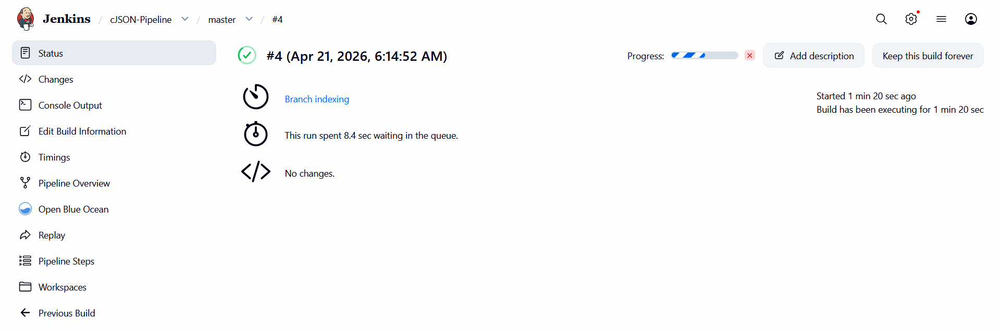
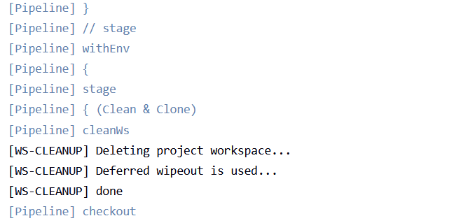
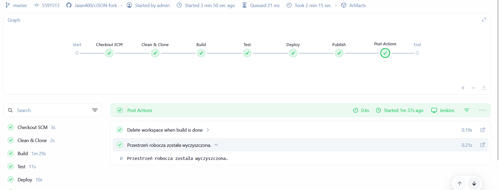
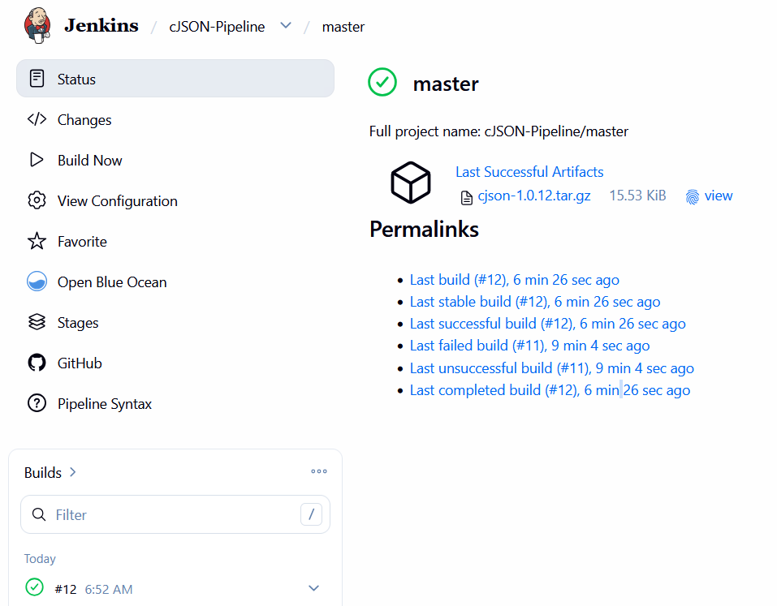

# Sprawozdanie 7
Autor: Jan Pawelec

---

# Edycja Pipeline
Wprowadzono zmiany do Jenkinsfile z poprzedniego laboratorium. 

```sh
pipeline {
    agent any

    stages {
        stage('Clean & Clone') {
            steps {
                cleanWs() 
                checkout scm
            }
        }

        stage('Build') {
            steps {
                echo "Building..."
                sh 'docker build --no-cache --target builder -t cjson-builder:latest .'
            }
        }

        stage('Test') {
            steps {
                echo "Testing..."
                sh 'docker build --target tester -t cjson-tester:latest .'
            }
        }

        stage('Deploy') {
            steps {
                echo "Deploying..."
                sh 'docker build --target deploy -t cjson-deploy:latest .'
                sh 'docker run --rm cjson-deploy:latest'
            }
        }

        stage('Publish') {
            steps {
                echo "Publishing version 1.0.${env.BUILD_NUMBER}..."
                sh """
                docker create --name cjson-extractor cjson-deploy:latest
                docker cp cjson-extractor:/usr/lib/libcjson.so ./libcjson.so
                docker rm cjson-extractor
                tar -czvf cjson-1.0.${env.BUILD_NUMBER}.tar.gz libcjson.so
                """
                archiveArtifacts artifacts: "cjson-1.0.${env.BUILD_NUMBER}.tar.gz", fingerprint: true
            }
        }
    }
    
    post {
        always {
            cleanWs()
            echo "Przestrzeń robocza została wyczyszczona."
        }
    }
}
```

Zaraz po commicie rozpoczął się build.


---

# Kroki Jenkinsfile
Weryfikacja kroków z listy

1. Przepis dostarczany z SCM, a nie wklejony w Jenkinsa lub sprawozdanie (co załatwia nam clone )
    >  Zrealizowano to poprzez konfigurację zadania typu Multibranch Pipeline w Jenkinsie. Wbudowany krok `checkout scm` pobiera tę konfigurację automatycznie.

2. Posprzątaliśmy i wiemy, że odbyło się to skutecznie - mamy pewność, że pracujemy na najnowszym (a nie cache'owanym kodzie)
    > Aby zagwarantować pracę na najnowszym kodzie, dodano krok `cleanWs()` na samym początku (przed wykonaniem `clone`) oraz w sekcji `post { always { ... } }`. Dodatkowo w poleceniu budującym Dockera użyto flagi  `--no-cache`, co wymusza pełną kompilację od zera, omijając pamięć podręczną Dockera.
    

3. Etap Build dysponuje repozytorium i plikami Dockerfile
    > Tak, wykonanie polecenia checkout scm sprawia, że pliki źródłowe cJSON oraz sam Dockerfile są dostępne w przestrzeni roboczej Jenkinsa w momencie rozpoczęcia etapu Build.

4. Etap Build tworzy obraz buildowy, np. BLDR
    > Tak. Zrealizowano to poleceniem `docker build --target builder -t cjson-builder:latest .`, co tworzy obraz bazowy na podstawie pierwszego etapu z Multi-stage Dockerfile.
    

5. Etap Build (krok w tym etapie) lub oddzielny etap (o innej nazwie), przygotowuje artefakt - jeżeli docelowy kontener ma być odmienny, tj. nie wywodzimy Deploy z obrazu BLDR
    > Artefakt, w postaci skompilowanej biblioteki `.so`, jest przygotowywany automatycznie jako pochodna kompilacji w kontenerze builder. Sam fizyczny plik tar.gz przygotowujemy później na etapie Publikacji.

6. Etap Test przeprowadza testy
    > Zrealizowano. Wywołanie `docker build --target tester ...` uruchamia drugi etap Multi-stage builda, który dziedziczy po builderze i wykonuje wbudowane w kod polecenie make test.

7. Etap Deploy przygotowuje obraz lub artefakt pod wdrożenie. W przypadku aplikacji pracującej jako kontener, powinien to być obraz z odpowiednim entrypointem. W przypadku buildu tworzącego artefakt niekoniecznie pracujący jako kontener (np. interaktywna aplikacja desktopowa), należy przesłać i uruchomić artefakt w środowisku docelowym.
    > Zrealizowano. Docelowy kontener jest przygotowywany za pomocą celu `--target deploy`. Posiada on predefiniowany CMD, który symuluje uruchomienie biblioteki.

8. Etap Deploy przeprowadza wdrożenie (start kontenera docelowego lub uruchomienie aplikacji na przeznaczonym do tego celu kontenerze sandboxowym)
    > Tak, zrealizowano to za pomocą polecenia `docker run --rm cjson-deploy:latest`. Jest to wdrożenie na sandboxie pełniące rolę Smoke Testu.

9. Etap Publish wysyła obraz docelowy do Rejestru i/lub dodaje artefakt do historii builda
    > Wybrano archiwizację artefaktu. Dyrektywa `archiveArtifacts` dodaje fizyczny plik `.tar.gz` ze skompilowaną biblioteką do historii wykonania Pipeline'u w interfejsie graficznym Jenkinsa, pozwalając na jej łatwe pobranie.
    

10. Ponowne uruchomienie naszego pipeline'u powinno zapewniać, że pracujemy na najnowszym (a nie cache'owanym) kodzie. Innymi słowy, pipeline musi zadziałać więcej niż jeden raz
    > Tak. Użycie wtyczki `cleanWs()` oraz zablokowanie pamięci podręcznej Dockera sprawiają, że niezależnie od tego, czy uruchamiamy pipeline pierwszy czy pięćdziesiąty raz, zachowuje się on w 100% deterministycznie i rozpoczyna pracę od czystej karty.

---

# Definition of Done
1. Czy opublikowany obraz może być pobrany z Rejestru i uruchomiony w Dockerze bez modyfikacji (acz potencjalnie z szeregiem wymaganych parametrów, jak obraz DIND)? Nie chcemy posyłać w świat czegoś, co działa tylko u nas!
    > Zbudowany obraz cjson-deploy jest w pełni przenośny. Został on zbudowany na bazie minimalnego, oficjalnego obrazu `alpine`, który nie zawiera żadnych lokalnych ścieżek, zmiennych środowiskowych ani zależności specyficznych.

2. Czy dołączony do jenkinsowego przejścia artefakt, gdy pobrany, ma szansę zadziałać od razu na maszynie o oczekiwanej konfiguracji docelowej?
    > Jako artefakt dostarczamy skompilowaną bibliotekę współdzieloną `libcjson.so`. Maszyną docelową w tym przypadku jest środowisko programistyczne dewelopera, który chce użyć tej biblioteki.