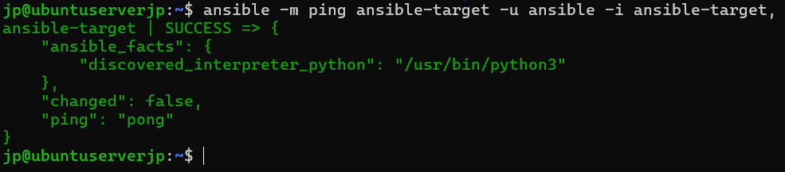
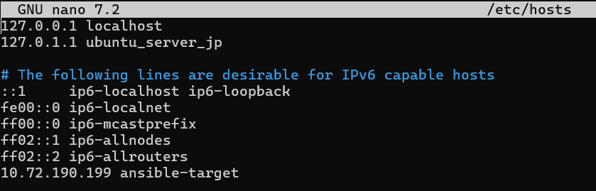
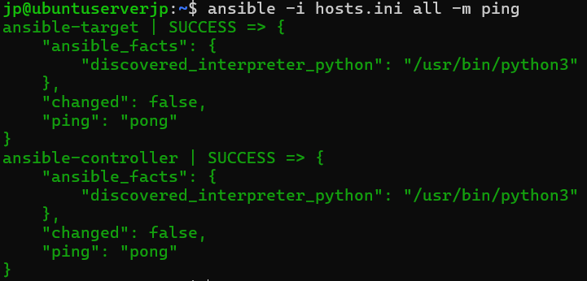
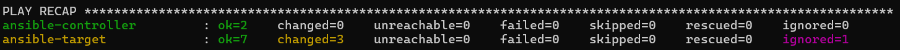
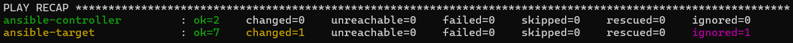
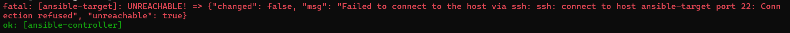
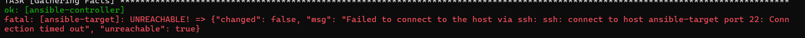
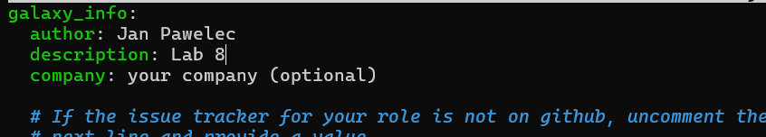
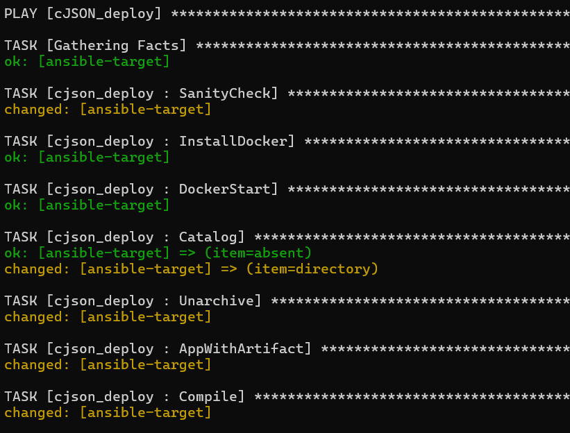
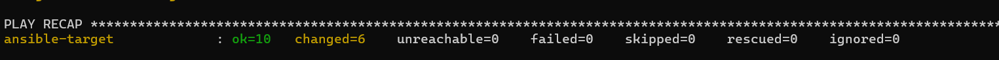

# Sprawozdanie 8
Autor: Jan Pawelec

---

# Instalacja zarządcy Ansible
Postawiono drugą maszynę o nazwie `ansible-target`. Wybrano Ubuntu server w wersji zminimalizowanej. Połączenie uzyskano za pomocą SSH. Utworzono migawkę.

Następnie połączono maszyny po SSH bez potrzeby podawania hasła.

Sprawdzono czy maszyna główna może komunikować się z `ansible-target`.

---

# Inwentaryzacja
Przypisano nazwy do adresów hostów na obu maszynach.

Utworzono plik `hosts.ini`, a następnie przetestowano łączność między maszynami.

---

# Zdalne wywoływanie procedur
Utworzono plik `playbook.yml`, w którym zdefiniowano wymagane procedury. 

Przeprowadzono pierwsze uruchomienie. Szereg poleceń wywołano za pomocą `ansible-playbook -i hosts.ini playbook.yml`. Widoczne jest na żółto `changed`, co oznacza że narzędzie dokonało zmian na docelowym hoście. Playbook wykonywał się dosyć długo. Finalnie po zakończeniu widoczny jest sukces z pominięciem pakietu `rngd`, który został pominięty. Nie był on wylistowany w wymaganiach `ansible-target`, więc ten go nie posiada, a co za tym idzie nie będzie aktualizowany. Ansible zachował się prawidłowo, ignorując tę przypadłość.

Następnie ponowiono zestaw operacji. Potrwał znacznie krócej. W tej iteracji nie dokonano zmian takich jak kopiowanie i aktualizacja pakietów, gdyż Ansible sprawdził przed wykonaniem czynności czy istnieje taka potrzeba. Jako że w poprzedniej próbie pobrano wszelkie pakiety, system wydrukował `ok` i jedynie zrestartował SSHD.

Wyłączono serwer SSH (wyłączając także `ssh.socket` za pomocą `sudo systemctl stop ssh.socket ssh.service`), ponownie wywołano playbook. Próba zakończyła się niepowodzeniem.

Odpięto kabel sieciowy (w ustawieniach maszyny), ponownie wywołano playbook. Pojawił się taki sam błąd jak w poprzedniej próbie.

---

# Zarządzanie stworzonym artefaktem
Stworzono role `cjosn_deploy` i przeredagowano `meta/main.yml`.

Umieszczono najnowszy artefakt w katalogu `files` (dodano do `.gitignore`). Stworzono pliki `tasks/main.yml` (definicja procesu) i `deploy.yml` (playbook). Uruchomiono listę procedur. Natrafiono na błędy I/O podczas operacji na systemie plików Dockera, co uniemożliwiało ukończenie poprawne kompilacji. Przeprowadzono wiele prób, testując różne opcje, co finalnie doprowadziło do dostarczenia poprawnie działającej wersji.

