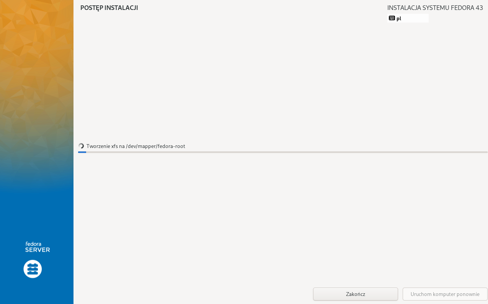
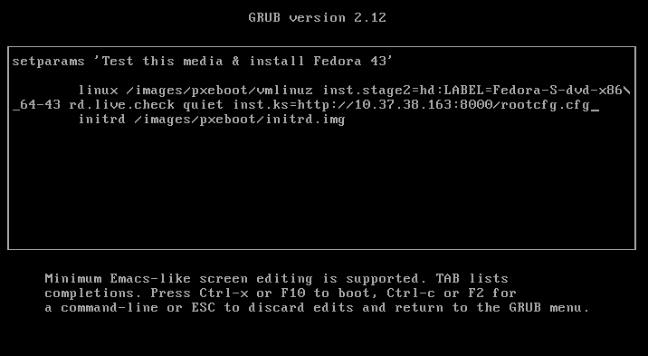
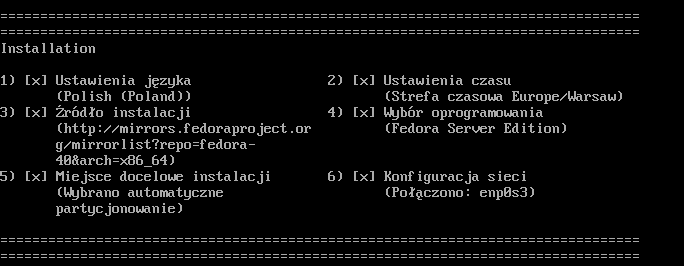
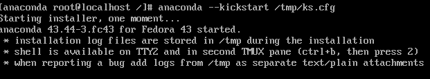
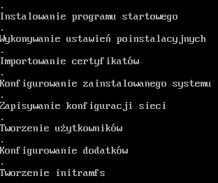
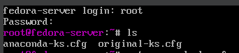
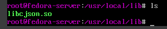

# Sprawozdanie 9
Autor: Jan Pawelec

---

# Instalacja systemu Fedora
Pobrano obraz Fedora w wersji 43 netinst. 

Pobrano zawartość pliku `/root/anaconda-ks.cfg`.

---

# Instalacja nienazdorowana
Przeredagowano wcześniej pobrany plik. Dodano odniesienia do potrzebnych repozytoriów oraz czyszczenie przestrzeni dyskowej. Za pomocą polecenia `python -m http.server 8000` utworzono serwer http do serwowania pliku konfiguracyjnego. W tej fazie utworzono nową maszynę na bazie wcześniej używanego obrazu, dodając w GRUBie odpowiednie odniesienie do konfiguracji.

Rozpoczęto instalację z wczytaną konfiguracją. Serwer http został odpytany i odpowiedział plikiem konfiguracyjnym.

Proces zakończył się niepowodzeniem, gdyż Fedora wczytała domyślny `kickstart`, więc bezpośrednio w konsoli `anaconda` dodano plik i odpalono `kickstart`.

Finalnie program poprawnie pobrał kickstart.

Po rebootcie można zalogować się do roota ustalonego w kickstarcie.

---

# Rozszerzenie pliku odpowiedzi
Dodano oszerną sekcję `%post`. Plik `rootcfg_post.cfg` zawiera pełną specyfikację, którą się posłużono. Pobrano skompilowany pakiet z tego samego postawionego wcześniej serwera. Odniesiono pozytywny rezultat. Rozpakowany artefat pomyślnie znalazł się w odpowiednim miejscu.

