# Zbiorcze sprawozdanie z laboratoriów 1-4

- **Imię:** Jakub
- **Nazwisko:** Stanula-Kaczka
- **Numer indeksu:** 421999
- **Grupa:** 5

---

## Spis treści

1. [System kontroli wersji (Git, SSH, Hooki)](#1-system-kontroli-wersji-git-ssh-hooki)
2. [Podstawy konteneryzacji (Docker)](#2-podstawy-konteneryzacji-docker)
3. [Powtarzalne środowiska budowania (Dockerfile, build, test)](#3-powtarzalne-środowiska-budowania-dockerfile-build-test)
4. [Zarządzanie stanem, sieci i wdrożenie Jenkinsa](#4-zarządzanie-stanem-sieci-i-wdrożenie-jenkinsa)

---

# 1. System kontroli wersji (Git, SSH, Hooki)

System Git to fundament nowoczesnego procesu wytwarzania oprogramowania — umożliwia śledzenie zmian, bezpieczne przechowywanie kodu i współpracę w zespole.

## Uwierzytelnianie i bezpieczny dostęp do repozytorium

Dostęp do zdalnego repozytorium GitHub zrealizowano dwiema metodami:

- **PAT (Personal Access Token):** Wygenerowano token z precyzyjnie ograniczonymi uprawnieniami, umożliwiający klonowanie przez HTTPS.
- **Klucze SSH:** Utworzono dwa klucze w nowoczesnym standardzie (innym niż RSA), z czego co najmniej jeden został dodatkowo zabezpieczony hasłem. Klucz publiczny dodano do ustawień konta GitHub, co umożliwiło klonowanie repozytorium przez protokół SSH.

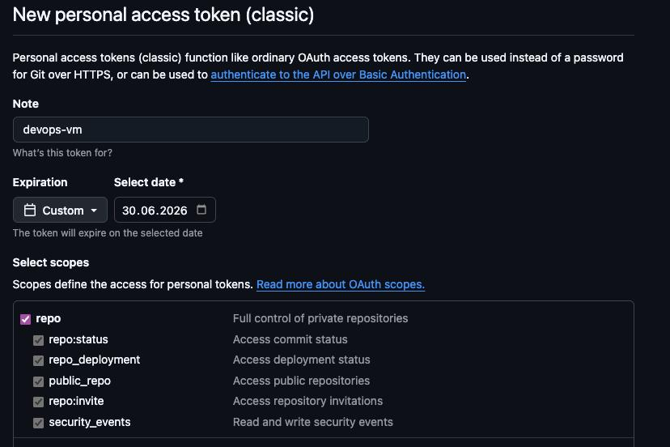
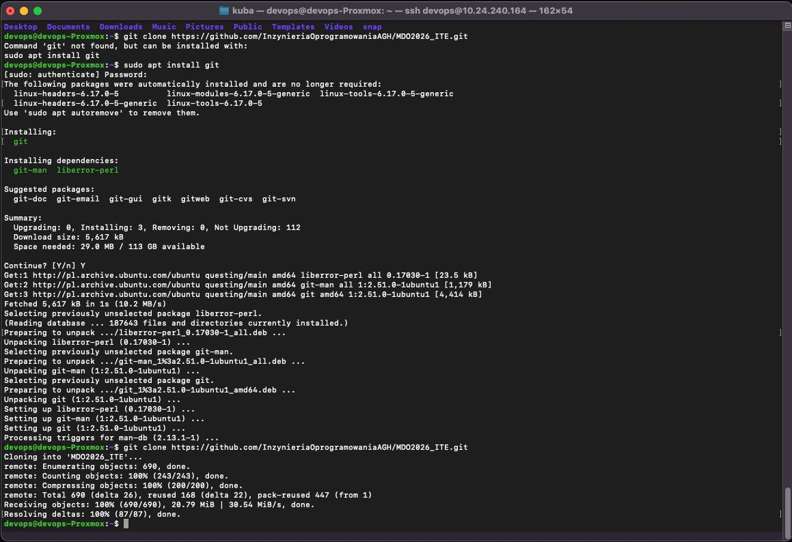
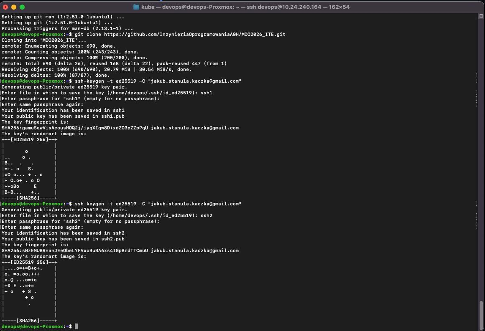
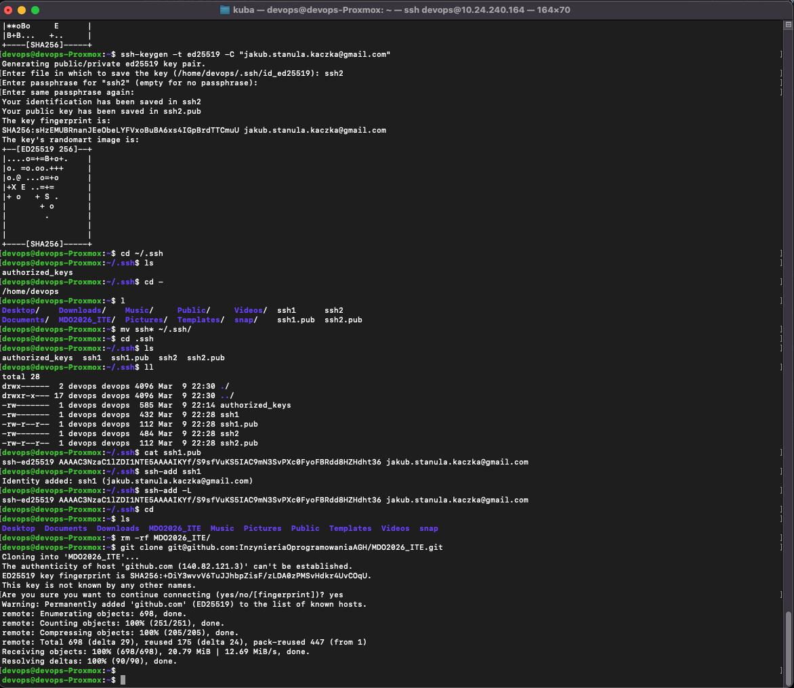

Dla dodatkowej warstwy bezpieczeństwa skonfigurowano uwierzytelnianie dwuskładnikowe (2FA) na koncie GitHub.

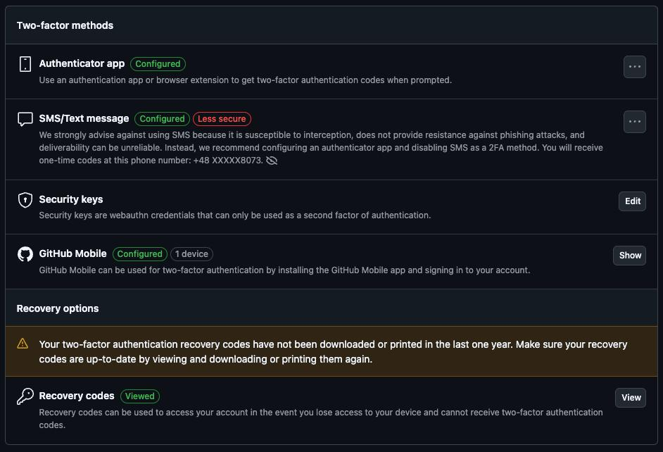

## Organizacja środowiska deweloperskiego

Środowisko pracy podzielono na maszynę hosta (z interfejsem graficznym) oraz maszynę wirtualną z systemem Linux, w której wykonywane są procesy deweloperskie. Do komunikacji i wymiany plików między systemami wykorzystano:
- **Visual Studio Code z rozszerzeniem Remote-SSH** – edycja kodu na hoście z natychmiastowym wykonaniem w środowisku zdalnym.
- **FileZilla (SFTP)** – alternatywna metoda wymiany plików.

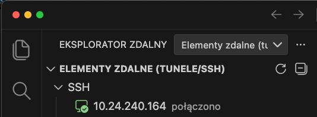
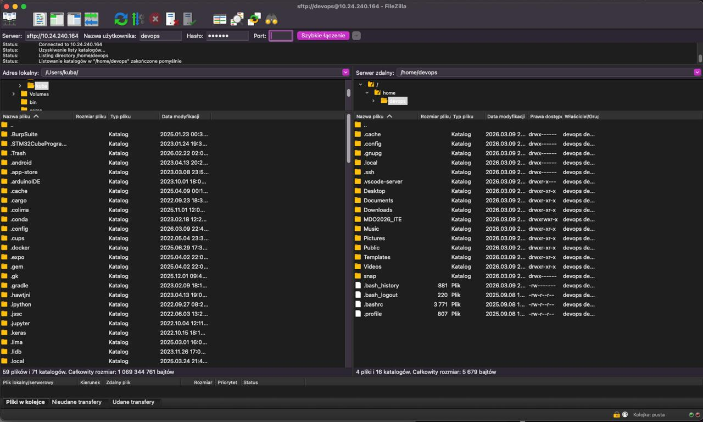
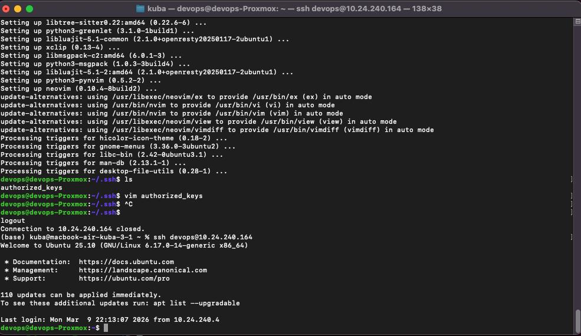

## Praca na gałęziach (Branching)

Zgodnie z workflow projektu:
1. Przełączono się na gałąź `main`, a następnie na gałąź grupy (`grupa5`).
2. Utworzono własną gałąź o nazwie `JSK421999`.
3. W katalogu grupy utworzono katalog `JSK421999`.
4. Zmiany wypychano poleceniem `git push`, a następnie utworzono Pull Request w celu wciągnięcia gałęzi do gałęzi grupowej.

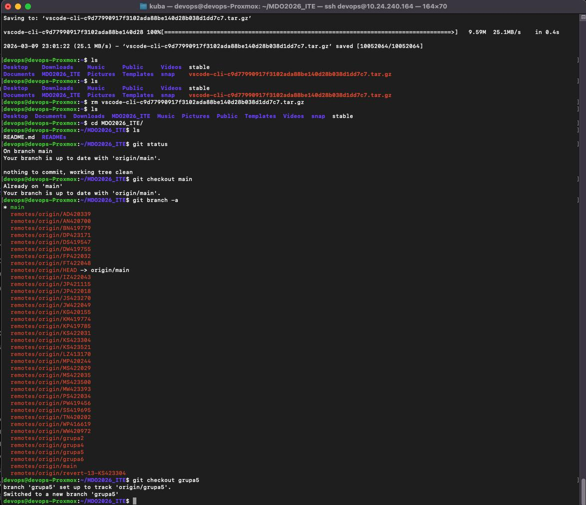


## Git Hook — `commit-msg`

W celu wymuszenia spójności logów historii zaimplementowano lokalny mechanizm Git Hooka. Skrypt `commit-msg` weryfikuje, że każdy komunikat commita zaczyna się od prefiksu `JSK421999`.

Treść hooka (`commit-msg`):

```bash
#!/bin/bash

COMMIT_MSG=$1

FIRST_LINE=$(head -n 1 "$COMMIT_MSG")

MOJ_PREFIKS="JSK421999"

if [[ "$FIRST_LINE" != "$MOJ_PREFIKS"* ]]; then
    echo "==========================================================="
    echo "BŁĄD: Brak inicjału"
    echo "Oczekiwano na początku: '$MOJ_PREFIKS'"
    echo "Twoja wiadomość:        '$FIRST_LINE'"
    echo "==========================================================="
    
    exit 1
fi

exit 0
```

Skrypt skopiowano do `.git/hooks/commit-msg` i nadano mu uprawnienia wykonywania. Po przetestowaniu i poprawkach hook działa poprawnie — odrzuca commity bez wymaganego prefiksu, a akceptuje te zgodne z konwencją.

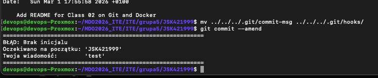
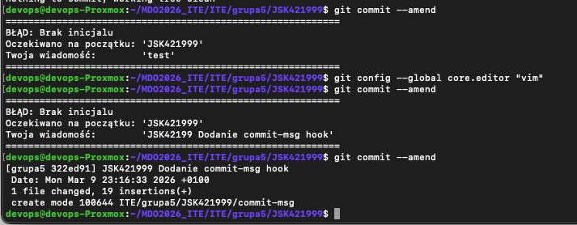

---

# 2. Podstawy konteneryzacji (Docker)

Konteneryzacja zapewnia powtarzalność i izolację procesów deweloperskich. Docker, jako rynkowy standard, stanowi fundament nowoczesnych potoków CI/CD.

## Instalacja i konfiguracja

Docker zainstalowano z repozytorium dystrybucji Linux, unikając formatów Snap/FlatPak, które mogą wprowadzać problemy z uprawnieniami i izolacją sieciową. Użytkownika dodano do grupy `docker`, aby umożliwić pracę bez `sudo`.

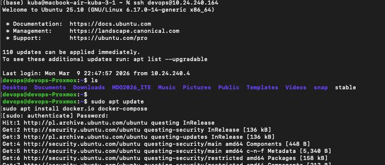
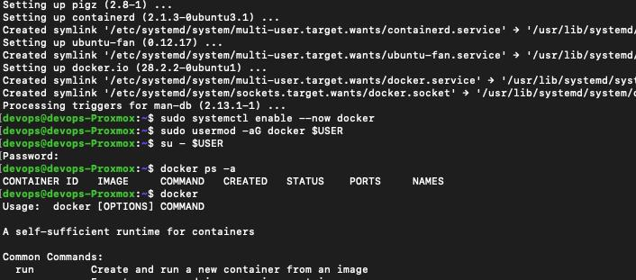

Zalogowano się do Docker Hub za pomocą `docker login`:

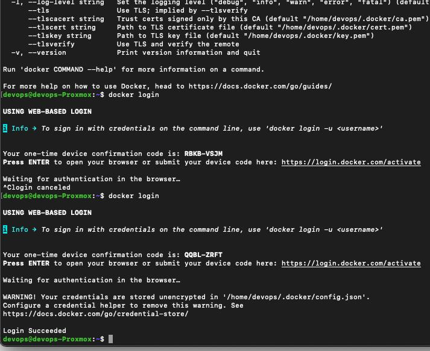

## Bazowe obrazy — przegląd

Zapoznano się z podstawowymi obrazami dostępnymi na Docker Hub. Pobrano i uruchomiono obrazy: `hello-world`, `busybox`, `ubuntu`, `mariadb`, `aspnet`, `sdk`. Sprawdzono ich rozmiary — obrazy różnią się znacząco: od kilku KB (`hello-world`, `busybox`) po setki MB (pełne systemy i SDK).

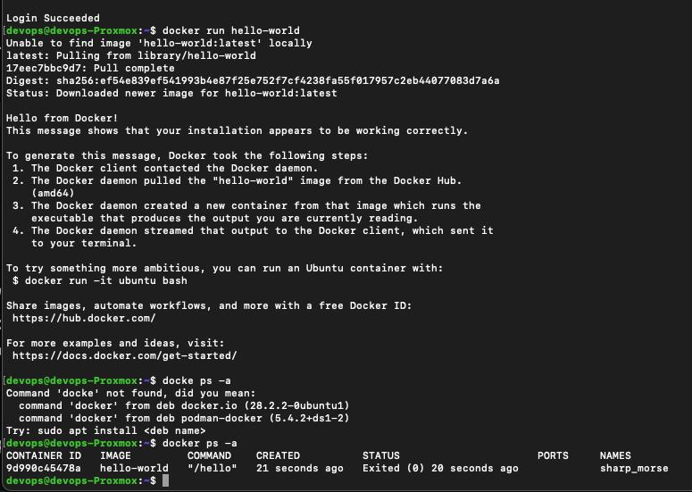
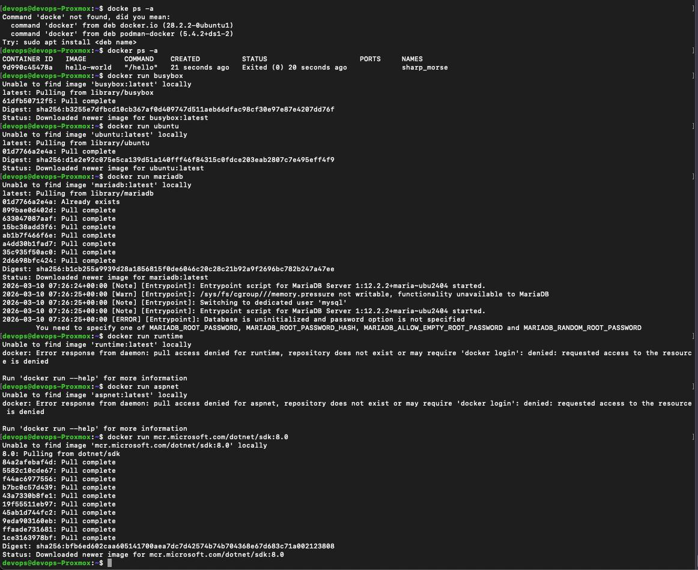
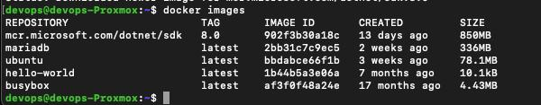

## Praca interaktywna z kontenerem

Uruchomiono kontener `busybox` w trybie interaktywnym (`-it`) i zweryfikowano numer jego wersji:

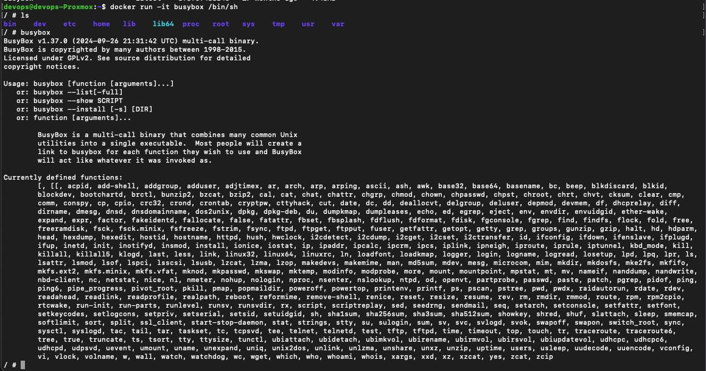

## System w kontenerze — PID1

Uruchomiono kontener `ubuntu` w trybie interaktywnym. Zaprezentowano proces PID1 wewnątrz kontenera oraz odpowiadające mu procesy Dockera na hoście — pokazuje to, że kontener to po prostu izolowana grupa procesów w systemie gospodarza.

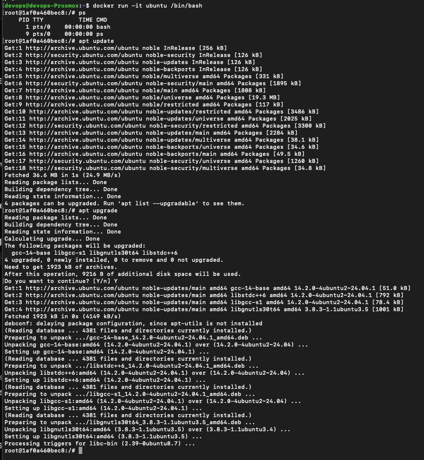

## Tworzenie własnego Dockerfile

Zgodnie z dobrymi praktykami, utworzono plik `Dockerfile` bazujący na `ubuntu:24.04`, instalujący Gita i klonujący repozytorium przedmiotowe:

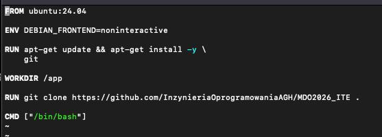

```dockerfile
FROM ubuntu:24.04

ENV DEBIAN_FRONTEND=noninteractive

RUN apt-get update && apt-get install -y \
    git

WORKDIR /app

RUN git clone https://github.com/InzynieriaOprogramowaniaAGH/MDO2026_ITE .

CMD ["/bin/bash"]
```

Obraz zbudowano i uruchomiono w trybie interaktywnym — potwierdzono obecność sklonowanego repozytorium wewnątrz kontenera.

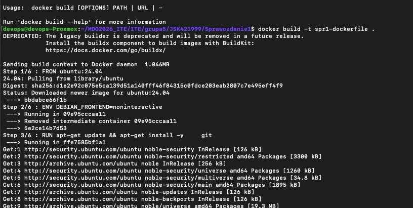
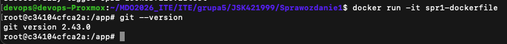

## Zarządzanie kontenerami

Wyświetlono wszystkie kontenery (zarówno aktywne, jak i zakończone). Następnie usunięto zakończone kontenery za pomocą `docker container prune`.

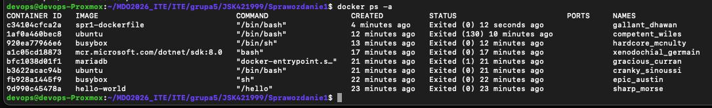
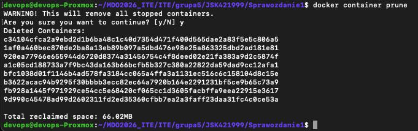

---

# 3. Powtarzalne środowiska budowania (Dockerfile, build, test)

Celem było zbudowanie oprogramowania w powtarzalnym, odizolowanym środowisku — tak, aby proces był w pełni przenośny między maszynami.

## Wybór oprogramowania

Wybrano repozytorium aplikacji Node.js — oficjalny projekt startowy frameworka **NestJS** (TypeScript). Projekt jest udostępniany na otwartej licencji MIT, zawiera testy jednostkowe (Jest) i umożliwia budowanie przez `npm run build` oraz testowanie przez `npm test`.

## Uruchomienie lokalne

Sklonowano repozytorium, zainstalowano zależności i zweryfikowano poprawność budowania oraz testów poza kontenerem.

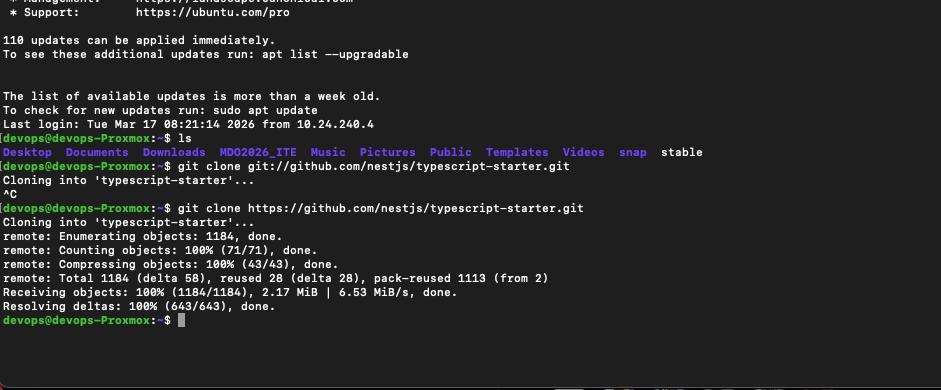
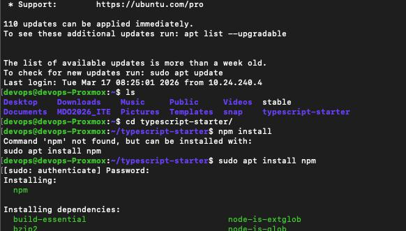
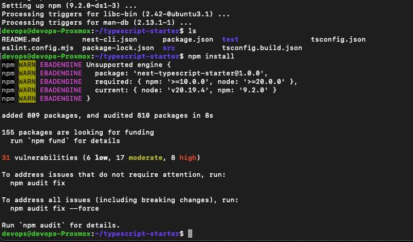
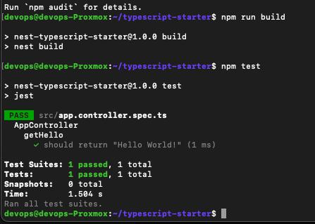

## Build i testy w kontenerze (interaktywnie)

Ten sam proces odtworzono wewnątrz kontenera bazowego `node`:
1. Sklonowano repozytorium.
2. Zainstalowano zależności.
3. Wykonano budowanie aplikacji (`npm run build`).
4. Uruchomiono testy jednostkowe (`npm test`).

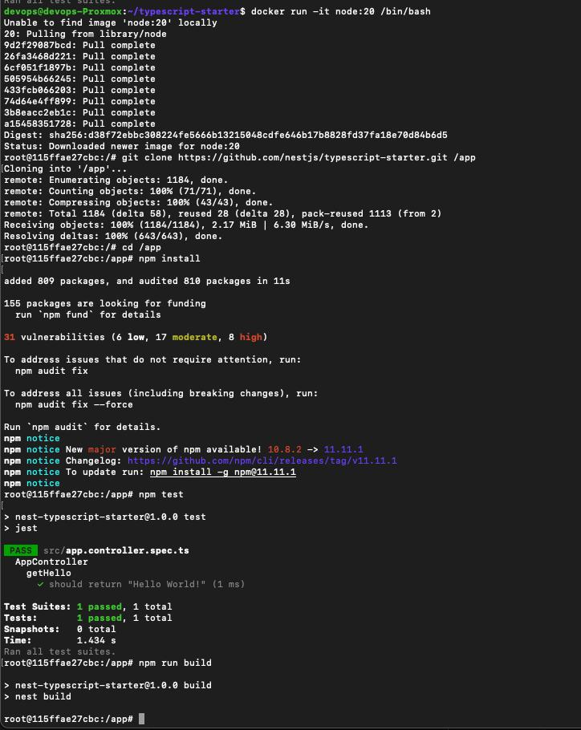

## Automatyzacja przez Dockerfile (2 etapy)

Zgodnie z dobrymi praktykami izolacji etapów, przygotowano dwa pliki `Dockerfile`:

### Dockerfile etapu Build

Pierwszy obraz realizuje wszystkie kroki do momentu zbudowania aplikacji (`npm run build`), bez uruchamiania testów:

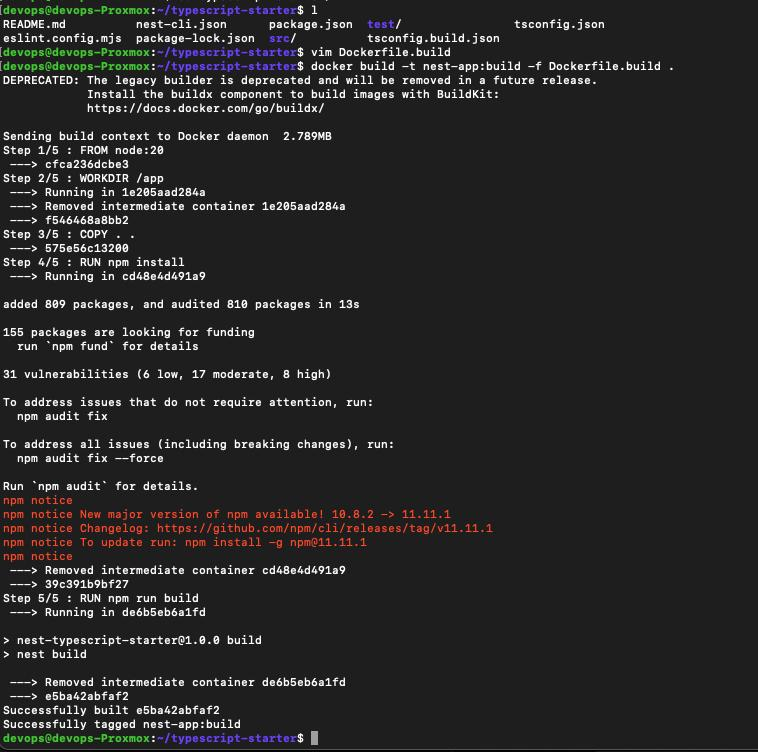

### Dockerfile etapu Test

Drugi obraz bazuje na obrazie build (`FROM` poprzedniego etapu) i uruchamia wyłącznie testy — bez ponownego budowania:

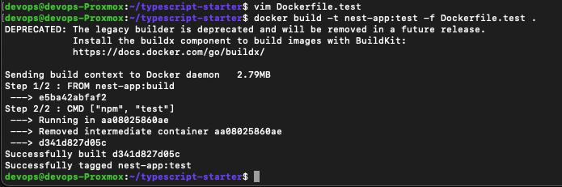

### Weryfikacja

Uruchomiono kontener z obrazu testowego — testy przeszły pomyślnie. Należy podkreślić różnicę: obraz jest jedynie szablonem (definicją), natomiast **kontener** to uruchomiona instancja obrazu, która wykonuje proces (`npm test`) jako PID1.

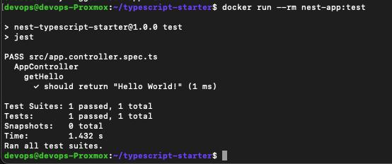

---

# 4. Zarządzanie stanem, sieci i wdrożenie Jenkinsa

## Woluminy — zachowywanie stanu między kontenerami

Kontenery z założenia są ulotne — dane znikają po ich usunięciu. Woluminy Docker rozwiązują ten problem, umożliwiając trwałe przechowywanie danych niezależnie od cyklu życia kontenera.

### Build z użyciem woluminów i kontenera pomocniczego

Utworzono wolumin wejściowy (`input`) i wyjściowy (`output`). Kod źródłowy sklonowano na wolumin wejściowy za pomocą tymczasowego kontenera pomocniczego z Gitem — dzięki temu **kontener docelowy nie potrzebuje Gita**, co jest zgodne z filozofią minimalnych obrazów.


Następnie uruchomiono kontener docelowy `node:20` (bez Gita), podpięto do niego oba woluminy i wykonano budowanie. Pliki wynikowe zapisano na woluminie wyjściowym, skąd są dostępne nawet po usunięciu kontenera.


### Build w jednym kontenerze (z Gitem)

Alternatywnie, proces powtórzono używając jednego kontenera z zainstalowanym Gitem — sklonowano kod i zbudowano aplikację wewnątrz niego.


### Dyskusja: `RUN --mount`

Opcja `RUN --mount=type=bind` w `Dockerfile` pozwala zamontować kod z hosta tylko na czas budowania warstwy. Dzięki temu unikamy trwałego przechowywania historii repozytorium i narzędzi typu Git w finalnym obrazie — co przekłada się na mniejszy rozmiar i lepsze bezpieczeństwo.

---

## Sieci Docker — eksponowanie portów i komunikacja

### Domyślna sieć bridge

Uruchomiono serwer `iperf3` w domyślnej sieci bridge, sprawdzono jego adres IP i przeprowadzono test przepustowości z drugiego kontenera, używając adresu IP.


### Własna sieć nazwana i rozwiązywanie nazw

Utworzono dedykowaną sieć (`docker network create`). Dzięki wbudowanemu w Dockera serwerowi DNS, kontenery mogą komunikować się między sobą za pomocą **nazw**, a nie adresów IP — co znacząco upraszcza konfigurację.


### Łączność spoza hosta

Wystawiono port (`-p 5201:5201`) i przeprowadzono test `iperf3` z zewnętrznego komputera spoza klastra Dockera — potwierdzając możliwość komunikacji ze światem zewnętrznym.


---

## SSH jako usługa w kontenerze

Uruchomiono kontener Ubuntu z serwerem SSH (`sshd`) i połączono się z nim z zewnętrznego komputera.


**Zalety i wady SSH w Dockerze:**
- **Zalety:** Pozwala używać tradycyjnych narzędzi do skryptowania i transferu plików (np. SCP), które opierają się na protokole SSH.
- **Wady:** Jest sprzeczne z filozofią Dockera (jeden proces na kontener), zwiększa rozmiar obrazu o pakiety serwera SSH i poszerza potencjalną powierzchnię ataku.

---

## Instalacja Jenkins (DIND)

Zgodnie z dokumentacją, skonfigurowano środowisko **DinD** (Docker in Docker) i uruchomiono instancję serwera CI Jenkins. Wykazano działające kontenery oraz panel logowania po pomyślnej inicjalizacji.


.jpg)

Jenkins w kontenerze, mający dostęp do demona Dockera (poprzez DinD), stanowi fundament pod dalszą automatyzację procesów CI/CD.
