# Sprawozdanie z laboratorium 1

- **Imię:** Jakub
- **Nazwisko:** Stanula-Kaczka
- **Numer indeksu:** 421999
- **Grupa:** 5

---

## 1. Git

### Instalacja klienta Git i klonowanie repozytorium przez HTTPS

Wygenerowanie personal access token na GitHubie:

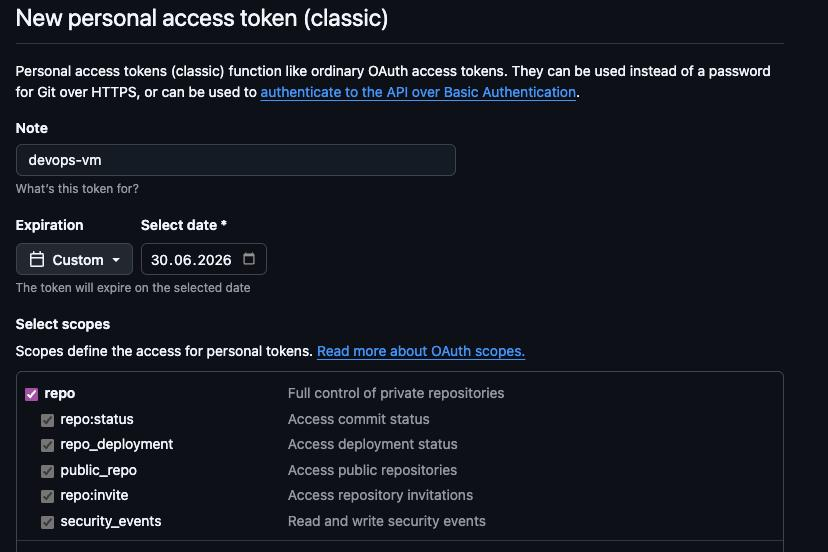

Klonowanie repozytorium przedmiotowego przez HTTPS z użyciem tokena:

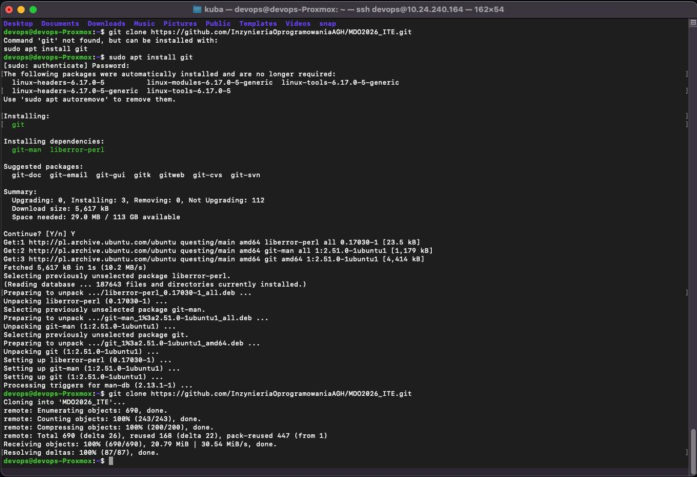

---

## 2. SSH

### Test połączenia z serwerem devops

Połączenie SSH z serwerem devops:

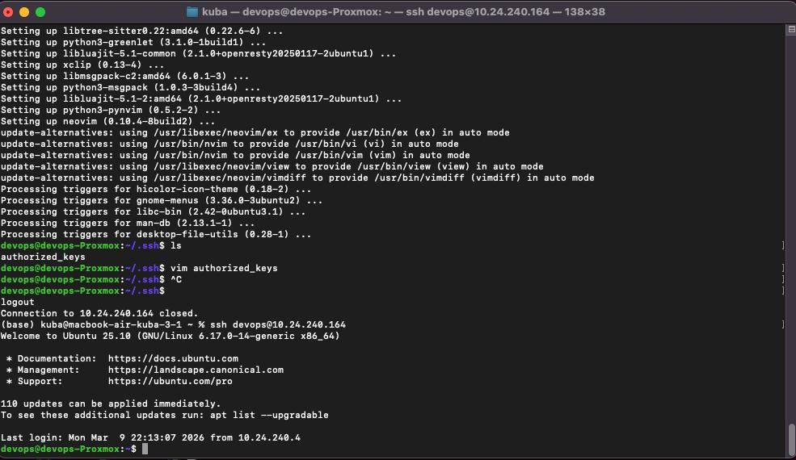

### Generowanie kluczy SSH

Wygenerowanie dwóch kluczy SSH (innych niż RSA), jeden zabezpieczony hasłem:

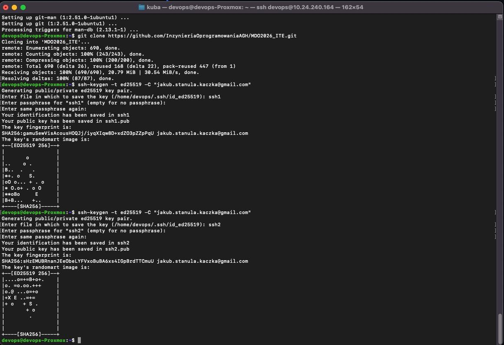

### Konfiguracja klucza SSH na GitHubie

Dodanie klucza publicznego i test git clone'a:

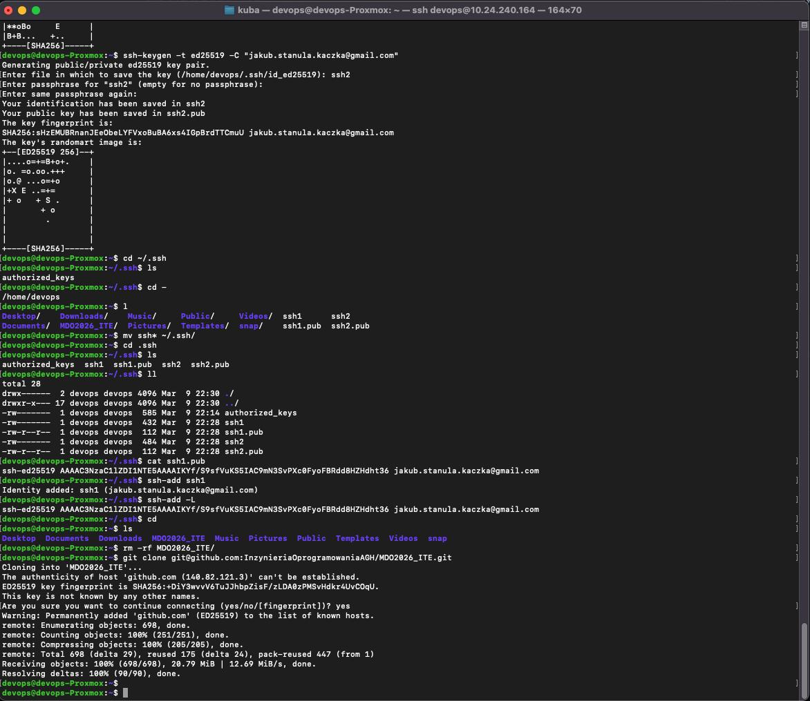

### Uwierzytelnianie dwuskładnikowe (2FA)

Włączenie 2FA na koncie GitHub:

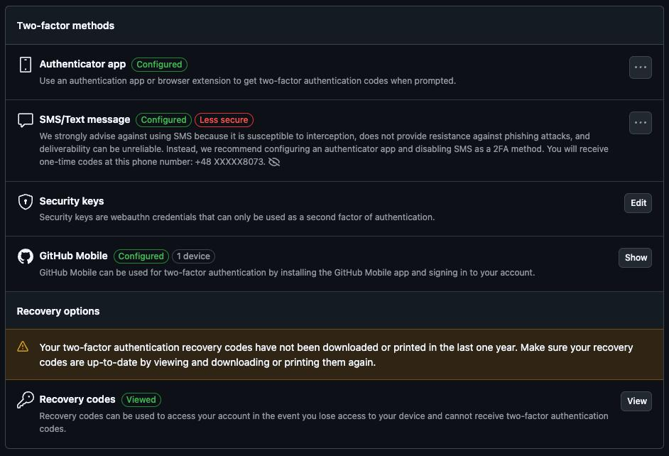

---

## 3. Narzędzia

### IDE — Visual Studio Code z SSH

Konfiguracja VS Code do pracy zdalnej przez SSH:

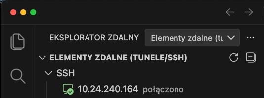

### Wymiana plików — FileZilla

Konfiguracja FileZilla do wymiany plików ze środowiskiem:

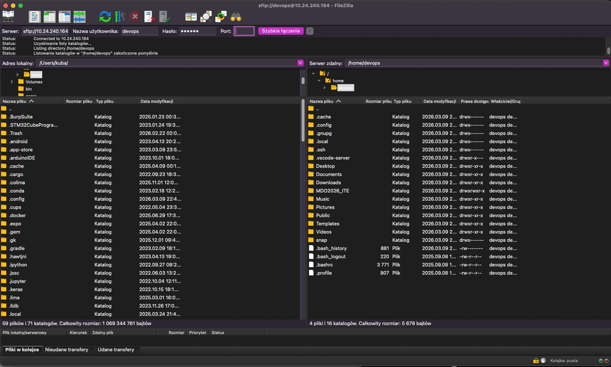

---

## 4. Gałąź

### Przełączenie na main i gałąź grupy, utworzenie własnej gałęzi

Checkout na `main`, potem na branch grupy i utworzenie gałęzi `JSK421999`:

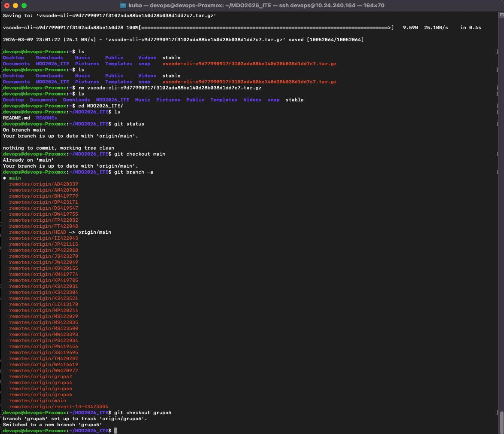

### Git Hook — commit-msg

Napisanie hooka weryfikującego prefiks `JSK421999` w commit message.

Treść hooka (`commit-msg`):

```bash
#!/bin/bash

COMMIT_MSG=$1

FIRST_LINE=$(head -n 1 "$COMMIT_MSG")

MOJ_PREFIKS="JSK421999"

if [[ "$FIRST_LINE" != "$MOJ_PREFIKS"* ]]; then
    echo "==========================================================="
    echo "BŁĄD: Brak inicjalu"
    echo "Oczekiwano na początku: '$MOJ_PREFIKS'"
    echo "Twoja wiadomość:        '$FIRST_LINE'"
    echo "==========================================================="
    
    exit 1
fi

exit 0
```

### Konfiguracja hooka

Skopiowanie skryptu do `.git/hooks/commit-msg` i nadanie uprawnień:

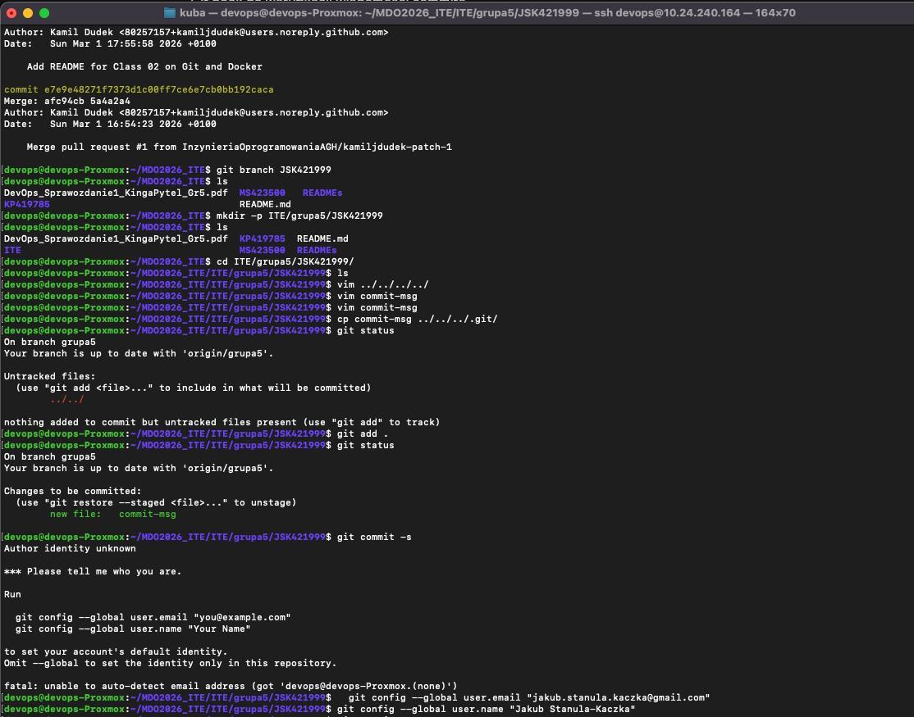

### Poprawka i działanie hooka

Poprawka hooka po testach:

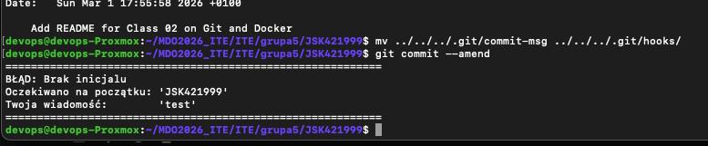

Hook działa poprawnie — commit z prefiksu jest poprawnie akceptowany:

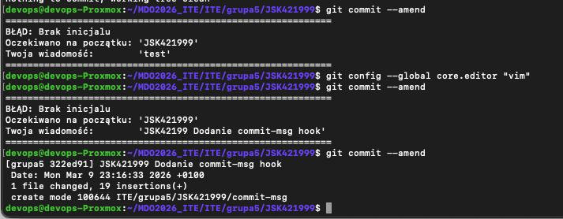

---
