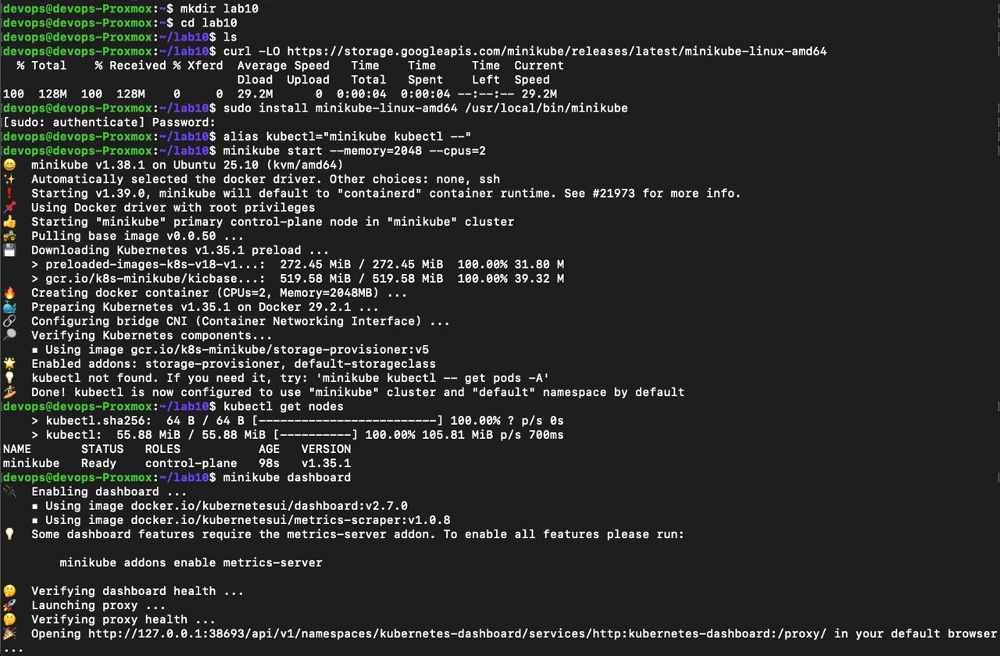
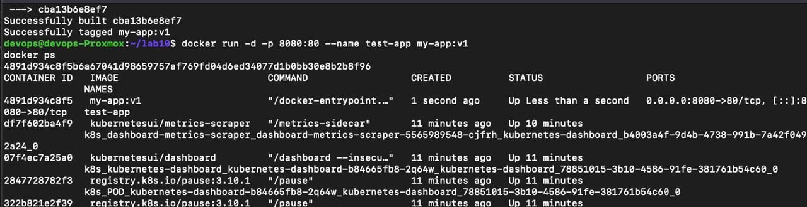
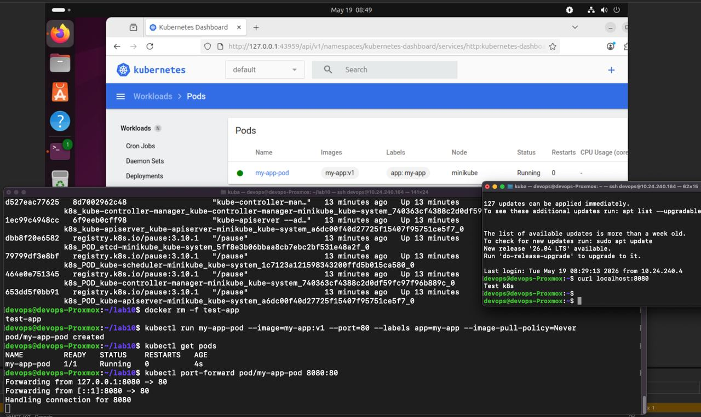
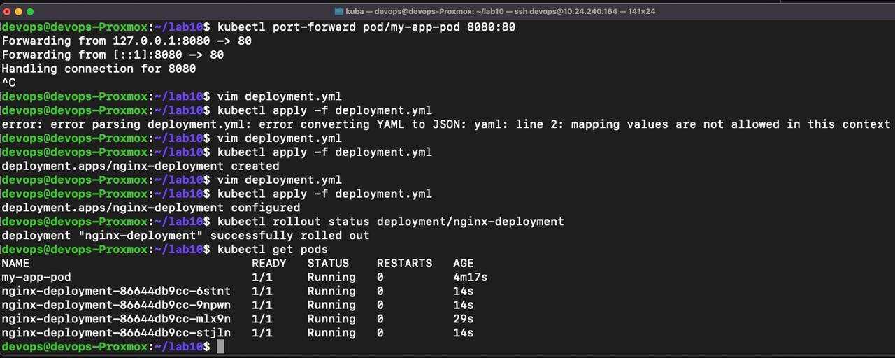
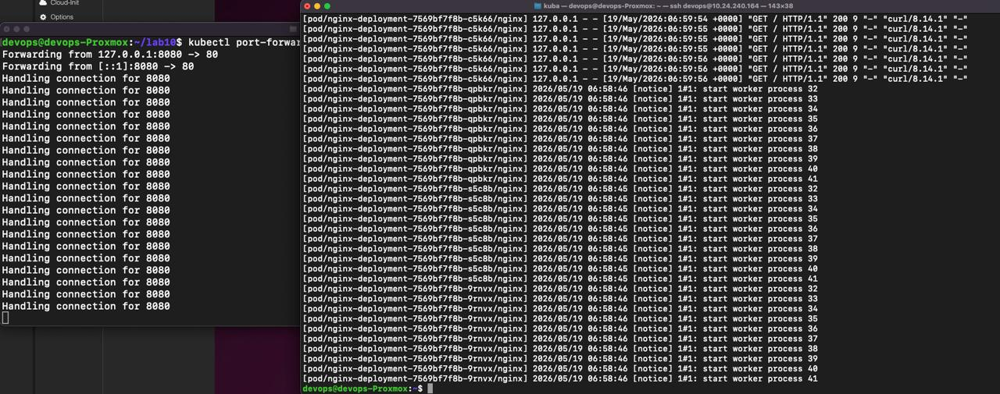

# Sprawozdanie z laboratorium 10 - Wdrażanie na zarządzalne kontenery: Kubernetes (1)

- **Imię:** Jakub
- **Nazwisko:** Stanula-Kaczka
- **Numer indeksu:** 421999
- **Grupa:** 5

---

## 1. Instalacja i konfiguracja klastra Kubernetes (Minikube)
- Zastosowano środowisko `minikube` jako lokalną instalację stosu Kubernetes.
- Zdefiniowano alias ułatwiający zarządzanie klastrem: `alias kubectl="minikube kubectl --"`.
- Ze względu na specyfikację testowej maszyny wirtualnej, zmodyfikowano domyślne parametry minikube, narzucając limity startowe: `minikube start --memory=2048 --cpus=2` zapobiegając błędom wyczerpania zasobów.
- Po udanym starcie poprawność weryfikowano przy użyciu `kubectl get nodes`, upewniając się, że klaster pracuje stabilnie (węzeł zgłosił status `Ready`).
- Wywołano komendę `minikube dashboard`, w celu sprawdzenia poprawności instalacji.

## 2. Analiza i przygotowanie kontenera z aplikacją
- Celem testowego wdrożenia przygotowano obraz prostej aplikacji. Zadbano o użycie działającego procesu na podstawie `nginx:alpine`.
- Zastosowano polecenie podłączjące demon środowiska Docker do zarządcy wirtualnego Minikube: `eval $(minikube docker-env)`, dzięki czemu obraz trafił wyłączenie do jego własnego, wewnętrznego rejestru.
- Wygenerowano plik `Dockerfile` z własną stroną przekazując komendę `RUN echo 'Test k8s!' > /usr/share/nginx/html/index.html`. 
- Zbudowano docelowy obraz `my-app:v1`. Powodzenie w budowie zweryfikowano wywołując wyizolowany kontener testowy: `docker run -d -p 8080:80 my-app:v1` i analizując aktywne wdrożenia poleceniem `docker ps`.

## 3. Uruchamianie oprogramowania na stosie k8s
- Aplikację uruchomiono po stronie klastra jako najmniejszą jednostkę wdrożeniową (tzw. Pod), stosując polecenie: 
`kubectl run my-app-pod --image=my-app:v1 --port=80 --labels app=my-app --image-pull-policy=Never`
- Skontrolowano proces adaptacji kontenera (oczekiwany stan `Running` na podstawie wyników CLI i GUI).
- W celu wystawienia serwisu poza wyodrębnioną pulę sieciową dla maszyny bazowej (hosta), uruchomiono w konsoli funkcję mapowania portowego (port-forwarding): `kubectl port-forward pod/my-app-pod 8080:80`. Weryfikację zakończono z powodzeniem poleceniem `curl localhost:8080`.

## 4. Wdrożenie manualne (Deployment)
- Przejściowo zastąpiono polecenia wywołania ręcznych poleceń mechanizmem IaC. Skonstruowano plik wdrożeniowy YML pod nazwą `deployment.yml`. Wykorzystano w nim (`matchLabels: app: nginx`), przypisując kontener pod w/w zrzut `my-app:v1`.
- Poprawnie wczytane pliki zainicjowały procedurę tworząc instancję na podstawie `kubectl apply -f deployment.yml`. 
- Skorygowano manifest edytując atrybut skalowania `replicas: 1` na wartość `4`. Wywołanie polecania instalującego zrekonfigurowało klaster (`deployment configured`) powiadamiając go o potrzebie wytworzenia brakujących Podów.

### 4.1. Weryfikacja działania skalowanego wdrożenia i usługi Service
- Po poprawnym wygenerowaniu ruchu poddano testowi węzeł przy użyciu instrukcji `kubectl rollout status deployment/nginx-deployment`.
- Wdrożenie 4 instancji ułatwiono wystawiając jeden punkt (`ClusterIP`), łącząc ruch:
`kubectl expose deployment nginx-deployment --type=ClusterIP --port=80`
- Użycie przekierowania sieciowego w klastrze: `kubectl port-forward svc/nginx-deployment 8080:80`.
- Sprawdzenie podziału obciązenia na węzły

